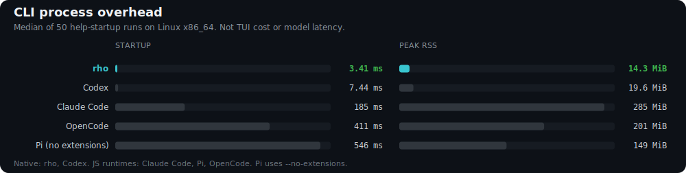

# Rho

[](https://deepwiki.com/matthewyjiang/rho)

Rho is a lightweight agent harness inspired by Pi, built in Rust.

[](https://matthewyjiang.github.io/rho/interactive-tui)

## Why Rho



- **Bring your own provider**: OpenAI, Kimi, xAI, Anthropic, Gemini, Copilot, Ollama, OpenRouter, and more. Use API keys or subscription plans.
- **Embeddable SDK**: Build headless Rust agents with explicit providers, tools, sessions, and cancellation.

Help-startup process overhead on Linux x86_64. Pi is measured with `--no-extensions`. Not interactive TUI cost or model latency.

```bash
cargo build -p rho-coding-agent --release
python3 scripts/bench_cli_startup.py
```

## Install

Install on macOS and Linux:

```bash
curl --proto '=https' --tlsv1.2 -fsSL https://matthewyjiang.github.io/rho/install.sh | sh
```

On Windows PowerShell:

```powershell
irm https://matthewyjiang.github.io/rho/install.ps1 | iex
```

Or with Scoop:

```powershell
scoop bucket add rho https://github.com/matthewyjiang/rho
scoop install rho
```

Or install from crates.io with Cargo:

```bash
cargo install rho-coding-agent
```

## Usage

```bash
rho
```

For one-off prompts:

```bash
rho run "summarize this repository"
```

## Docs

Read the documentation at <https://matthewyjiang.github.io/rho/>.

## Development

```bash
cargo build
cargo test
```
