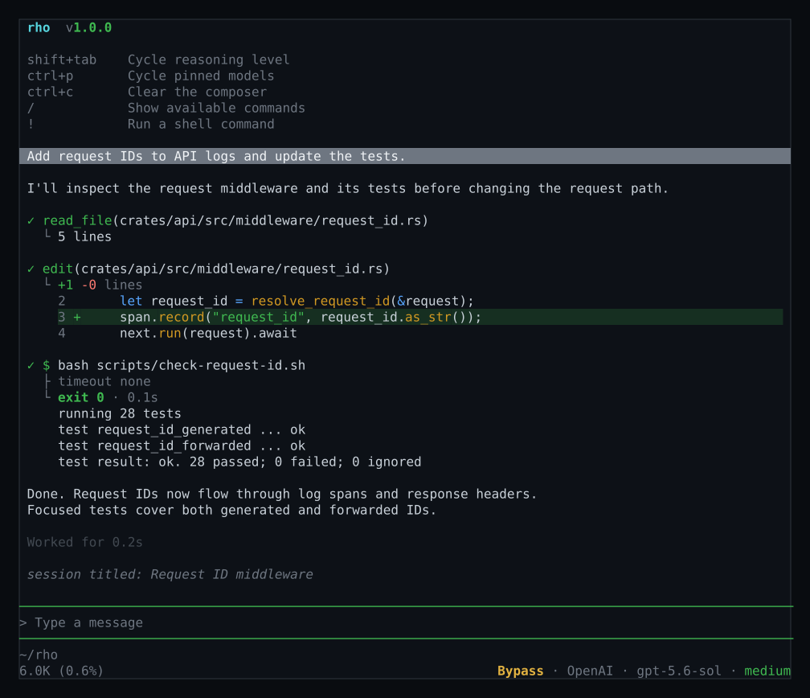
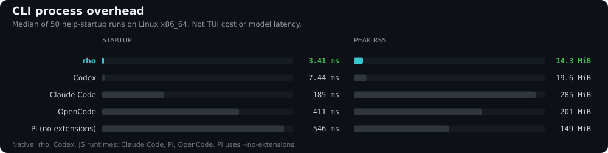

# Rho

[](https://deepwiki.com/matthewyjiang/rho)

Rho is a lightweight agent harness inspired by Pi, built in Rust.

[](https://matthewyjiang.github.io/rho/interactive-tui)

## Why Rho

- **Lightweight**: Compare the CLI process overhead and memory usage with other coding harnesses:


- **Bring your own provider**: OpenAI, Kimi, xAI, Anthropic, Gemini, Copilot, Ollama, Ollama Cloud, OpenRouter, and more. Use API keys or subscription plans.
- **Embeddable SDK**: Build headless Rust agents with explicit providers, tools, sessions, and cancellation.

## Works without a plugin store

Rho is small on purpose. The pieces power users usually wire up later are already in the binary.

- **Built-in RTK**: when the `rtk` binary is on your PATH, Rho rewrites shell commands for you. No `rtk init`, no host hooks.
- **Built-in Herdr**: under Herdr, Rho reports agent state, supports pane attach, and handles host image paste. No extra integration.
- **Coding tools included**: read, edit, search, shell, web, skills, and workflows ship with Rho. Install, sign in, work.

## Install

Install on macOS and Linux:

```bash
curl -fsSL https://matthewyjiang.github.io/rho/install.sh | sh
```

On Windows PowerShell:

```powershell
irm https://matthewyjiang.github.io/rho/install.ps1 | iex
```

Or with Scoop:

```powershell
scoop bucket add rho https://github.com/matthewyjiang/rho
scoop install rho
```

Or install from crates.io with Cargo:

```bash
cargo install rho-coding-agent
```

## Usage

```bash
rho
```

For one-off prompts:

```bash
rho run "summarize this repository"
```

For a deterministic multi-step graph, see the
[workflow guide](https://matthewyjiang.github.io/rho/workflows).

## Docs

Read the documentation at <https://matthewyjiang.github.io/rho/>.

## Development

```bash
cargo build
cargo test
```
