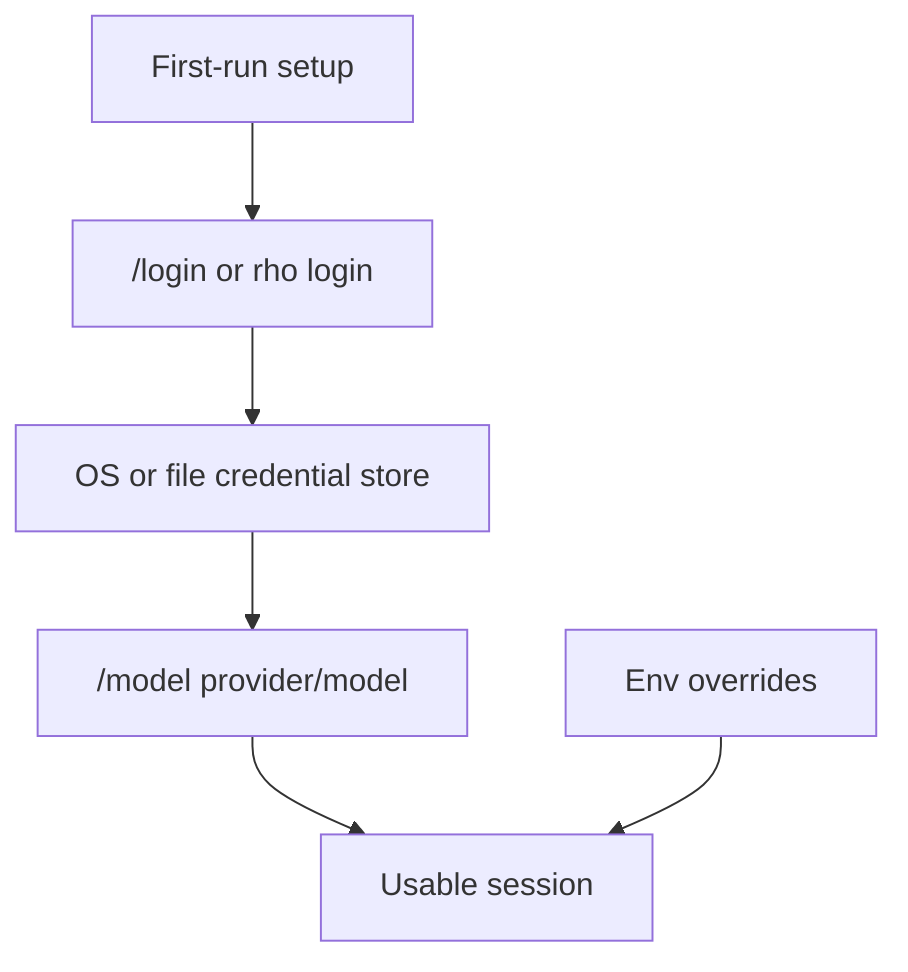
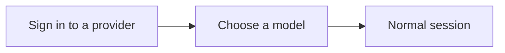
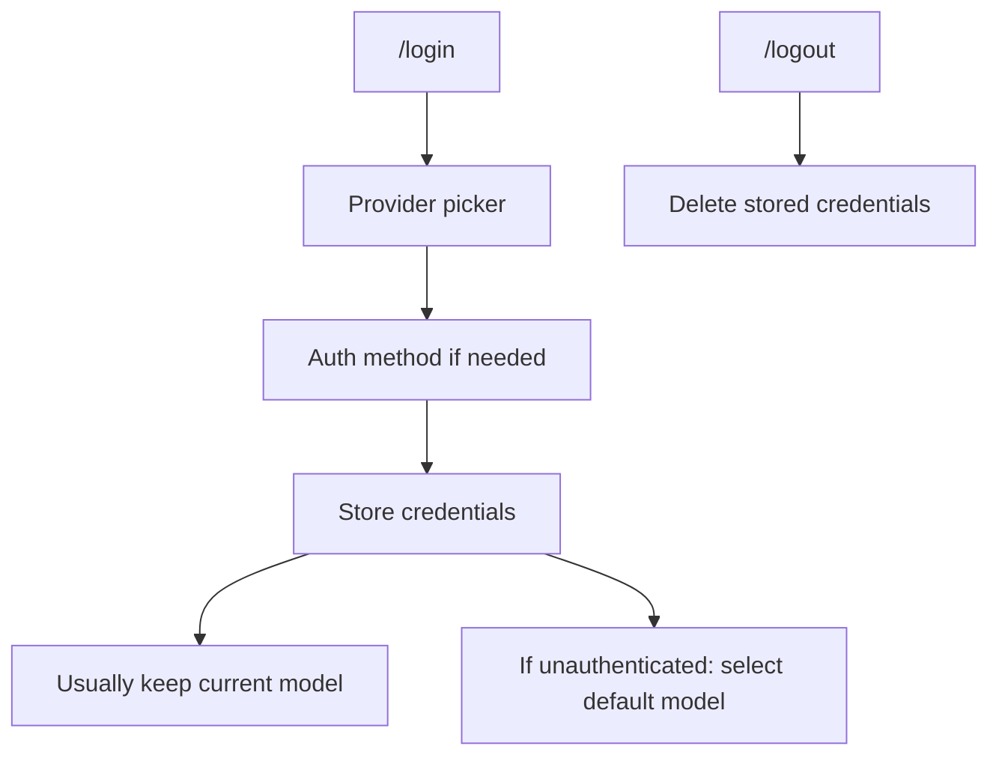
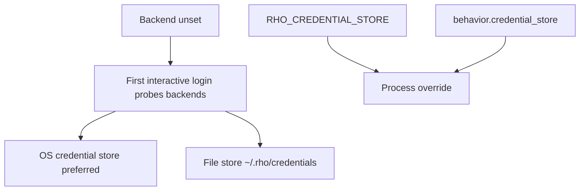

# Authentication and models

Rho supports several providers with different auth modes. This page covers the concepts shared across all of them. For provider-specific login, logout, environment overrides, and model selection, see the [provider index](/providers/) or the individual [provider pages](#providers).

Provider, model, and auth mode are stored in [configuration](/configuration). Secrets are never stored in config.



## Providers

Rho's implemented providers are:

| Provider | Auth mode | Details |
| --- | --- | --- |
| `openai` | `api-key` | [OpenAI](/providers/openai) |
| `openai-codex` | `codex` | [OpenAI (Codex OAuth)](/providers/openai-codex) |
| `anthropic` | `anthropic-api-key` | [Anthropic](/providers/anthropic) |
| `google` | `google-api-key` | [Google Gemini](/providers/google-gemini) |
| `github-copilot` | `github-copilot` | [GitHub Copilot](/providers/github-copilot) |
| `xai` | `xai-api-key`, `xai-oauth` | [xAI](/providers/xai) |
| `poolside` | `poolside-api-key` | [Poolside](/providers/poolside) |
| `openrouter` | `openrouter-api-key`, `openrouter-oauth` | [OpenRouter](/providers/openrouter) |
| `ollama` | `none`, optional `ollama-api-key` | [Ollama](/providers/ollama) |
| `ollama-cloud` | `ollama-cloud-api-key`, `ollama-cloud-device` | [Ollama Cloud](/providers/ollama-cloud) |
| `moonshot` | `moonshot-api-key` | [Moonshot and Kimi Code](/providers/moonshot-kimi) |
| `kimi-code` | `kimi-oauth` | [Moonshot and Kimi Code](/providers/moonshot-kimi) |
| `qwen-token-plan` | `qwen-token-plan-api-key` | [Qwen Token Plan](/providers/qwen-token-plan) |
| `meta` | `meta-api-key` | [Meta Model API](/providers/meta) |
| `opencode-go` | `opencode-go-api-key` | [OpenCode Go](/providers/opencode-go) |

User-defined OpenAI-compatible hosts use `[providers.custom.<name>]` with `auth = "none"` or `{name}-api-key`. They speak Chat Completions by default, or Responses when `api = "responses"`. Create one from `/login` by choosing **Custom**, then **Chat Completions** or **Responses**, or add the table in config. See [Custom OpenAI-compatible hosts](/providers/openai-compatible).

OpenAI, Anthropic, Google Gemini, GitHub Copilot, Ollama, Ollama Cloud, Poolside, OpenRouter, Moonshot, Kimi Code, Qwen Token Plan, Meta Model API, OpenCode Go, and user-defined OpenAI-compatible hosts expose refreshable API model lists. Local Ollama is configured through `/login ollama`, which stores the API base and an optional key. Custom hosts can run without a key or store one through `/login`. The other providers refresh after authentication. OpenAI Codex OAuth and xAI OAuth use static allowlists, so their available models are maintained by Rho rather than fetched through **Refresh model lists** in `/config`.

Each provider page documents whether authentication is required, how to select models, and any provider-specific setup.

## First run

The first launch on a fresh machine opens a full-screen setup instead of a session. There is no history to read and no model you chose yet, so the composer, hints, and statusline stay out of the way until you have both:



```text
rho  v1.26.0

Welcome. Two steps and you are ready to work.

▸ Sign in to a provider
  Choose a model

>

→ Anthropic
  GitHub Copilot
  ...

Esc to skip setup
```

Each step drives the same picker the matching command opens, so sign-in behaves exactly as `/login` does, including method pickers, the credential-store question, and OAuth. Choosing a model ends setup and hands off to a normal session.

Setup opens at whichever step can do something. A launch whose available credentials, stored or from the environment, already list models starts at the model step rather than asking for a login that is done; a launch with no models to offer starts at sign-in. Esc leaves setup at any point.

## Signed-out sessions

Outside setup, the session shows whether the active provider resolved to usable credentials.

- **No usable credentials.** The header hints lead with `/login`, in accent rather than dim. The statusline replaces the provider and model with `not signed in · /login`, so the state stays on screen no matter how far the transcript scrolls.
- **A prompt sent while signed out** opens the login picker instead of failing a turn. Your text stays in the composer; press enter once a provider is live to send it.

## Login and provider switching



`/login` opens a readable provider picker. Providers with multiple authentication methods open a second picker with prompts such as **API Key** and **OAuth**; providers with one method continue directly to that login flow. **Custom** opens a nested picker for **Chat Completions** or **Responses**, then collects a name, a base URL, and an optional API key. Direct args (`/login openai`, `/login anthropic`, and so on) target a single method. See each [provider page](#providers) for the exact flow.

Successful login normally stores credentials only. It does not switch the active provider/model, because provider switching is model-driven through `/model`. If Rho started without usable auth and is running on an unauthenticated placeholder, a successful login selects that provider's default model so the session becomes usable.

`/logout` opens a provider picker containing only providers with stored credentials that can be deleted. If an environment override is still present, the provider remains available after deleting the stored credential. When Claude Code is signed in, `/logout` also offers `claude-code` as a separate runtime target.

### Claude Code runtime sign-in

Claude Code is a **runtime**, not a Rho provider. It is separate from the [Anthropic API-key provider](/providers/anthropic). Anthropic does not allow third-party clients to use Claude.ai subscription credentials on their own API stacks, so Rho cannot put a Pro/Max plan on the normal Anthropic provider path. `runtime: claude-cli` is the indirect workaround: delegate a child to the official `claude` binary, which owns sign-in and plan usage (see [subscription workaround and how to use it](/subagents/claude-cli)). Install the `claude` binary first ([installation](/installation#claude-code-binary-optional)).

- `/login claude-code` (or **Anthropic** → **Claude Code (delegation only)** in the picker) asks you to confirm, then hands the terminal to `claude auth login --claudeai`. Rho suspends its TUI for that process and resumes when it exits. Cancel the confirmation to stay in Rho. After the handoff, the Claude prompt has no cancel key; stop the `claude` process from another terminal or close that prompt if you need to get out.
- Claude Code runs the sign-in UI, stores the subscription credential, and remains the owner of that state. Rho never sees or stores the token and never writes a Rho credential-store entry for it.
- Rho reads signed-in state with bounded `claude auth status` probes for `/info` and `/doctor`. Ownership wording stays explicit (`managed by the claude binary`).
- Sign out with `/logout claude-code` (after an explicit confirmation that this signs out of Claude Code everywhere) or with `claude auth logout` yourself. That is a global Claude Code logout, not a Rho token delete. Rho cannot remove a Claude token from the Rho credential store because it never stored one.
- Bare `/login` lists Claude Code under the Anthropic group next to the Anthropic API key method. Choosing it skips the Rho credential-store chooser entirely.

## Selecting models

Use `/model provider/model` to switch explicitly, including to another provider:

```text
/model openai/gpt-5.6-sol
/model openai-codex/gpt-5.6-sol
/model anthropic/claude-sonnet-4-5
/model google/gemini-3.1-flash-lite
/model github-copilot/gpt-4.1
/model openrouter/anthropic/claude-sonnet-4
/model ollama/<installed-model>
/model ollama-cloud/<hosted-model>
/model xai/grok-4.6
```

A bare model id works when it uniquely matches the catalog for the active selection rules. Uncataloged bare model ids stay on the current provider as an escape hatch for newly released models.

OpenAI, Anthropic, Google Gemini, GitHub Copilot, Ollama, Ollama Cloud, Poolside, OpenRouter, Moonshot, Kimi Code, Qwen Token Plan, Meta Model API, OpenCode Go, and user-defined OpenAI-compatible hosts can refresh their provider model lists through **Refresh model lists** in `/config`. Local Ollama and custom hosts can refresh after `/login` stores their API base; a key is optional. Codex OAuth and xAI OAuth use static allowlists instead. API-backed model lists can change as providers add or remove models; refresh them before selecting a newly released or newly installed model.

## Where credentials live



Rho recommends the native OS credential store. When the credential backend is still unset, the first interactive login for a **normal Rho provider** probes available backends and opens a picker before any secret is saved. Bare `/login` opens the provider group picker first; the store chooser appears only after you pick a normal provider (or run `/login <provider>`). CLI `rho login` asks the same store question on a TTY. If the OS probe fails, you can choose local file storage instead.

Local file storage keeps secrets in `~/.rho/credentials/secrets.json` (or under `RHO_HOME`). Rho applies owner-only directory and file permissions on Unix and a protected user-only ACL on Windows. It is not encrypted at rest. Rho never selects it without an explicit login picker answer, CLI command, config value, or environment setting.

```bash
rho credential-store status
rho credential-store probe os
rho credential-store probe file
rho credential-store set os
rho credential-store set file
```

Backends are `os` and `file` only. When no choice has been saved, Rho uses the OS store and does not fall back to a file. `rho credential-store status` prints the saved config policy only: `unset`, `os`, or `file`. `RHO_CREDENTIAL_STORE=os|file` overrides the saved policy for the current process. The policy contains no secrets and is saved in `~/.rho/config.toml` as `behavior.credential_store`.

On macOS, see Apple's [Keychain access prompt](https://support.apple.com/guide/keychain-access/if-youre-asked-for-access-to-your-keychain-kyca1243/mac) documentation when the OS asks whether to allow a credential-store operation.

For normal interactive setup, prefer `/login`. Environment variables are CI/development escape hatches and override stored credentials; each provider page lists the variables it reads. Command-line flags override values loaded from configuration for the current invocation. Pass `--save` with `--provider`, `--model`, `--auth`, or `--reasoning` to make those choices the saved default.

## Seeing these states without deleting your config

`RHO_FIRST_RUN` opens the setup screen, and its value picks the step:

```bash
RHO_FIRST_RUN=signin rho   # the provider menu
RHO_FIRST_RUN=model rho    # the model list
RHO_FIRST_RUN=1 rho        # whichever step a real first launch would open
```

Name the step you want to see. A configured machine already lists models, so `RHO_FIRST_RUN=1` there behaves as it would for a user who has signed in and goes straight to the model step, leaving the provider menu unreachable.

Forcing it this way opens setup on a machine that already has history and a chosen model, so setup is the only thing the flag changes; it neither clears state nor creates a fresh config.

To see the signed-out session state, run `/logout <provider>` for the active provider. A successful login clears the signed-out header and statusline; setup ends when you choose a model, or when you leave it with Esc.

## Model metadata

Rho uses cached model metadata to choose context windows for status display and [auto compaction](/configuration#auto-compaction). The same metadata supplies each model's available [reasoning effort levels](/configuration#reasoning-options), so the TUI can skip unsupported choices without model-name allowlists. Override a window or reasoning list in `~/.rho/models.toml`. A custom OpenAI-compatible host that is not itself in models.dev can set `catalog` to another provider slug and borrow that catalog. See [local model metadata](/configuration#local-model-metadata) and [Custom OpenAI-compatible hosts](/providers/openai-compatible).

For subscription auth modes such as Codex OAuth and xAI OAuth, the statusline still estimates an equivalent API cost from [models.dev](https://models.dev/) pricing (including long-context rate tiers when available) and labels it `(sub)`. When a model is seen for the first time, Rho refreshes models.dev so newly added providers are not stuck on a stale local snapshot.

For persistent defaults, see [configuration](/configuration). For one-shot prompts, see [automation and CLI](/automation-cli).
