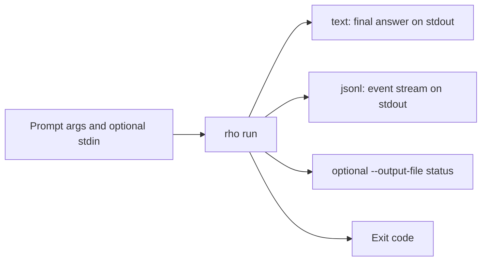
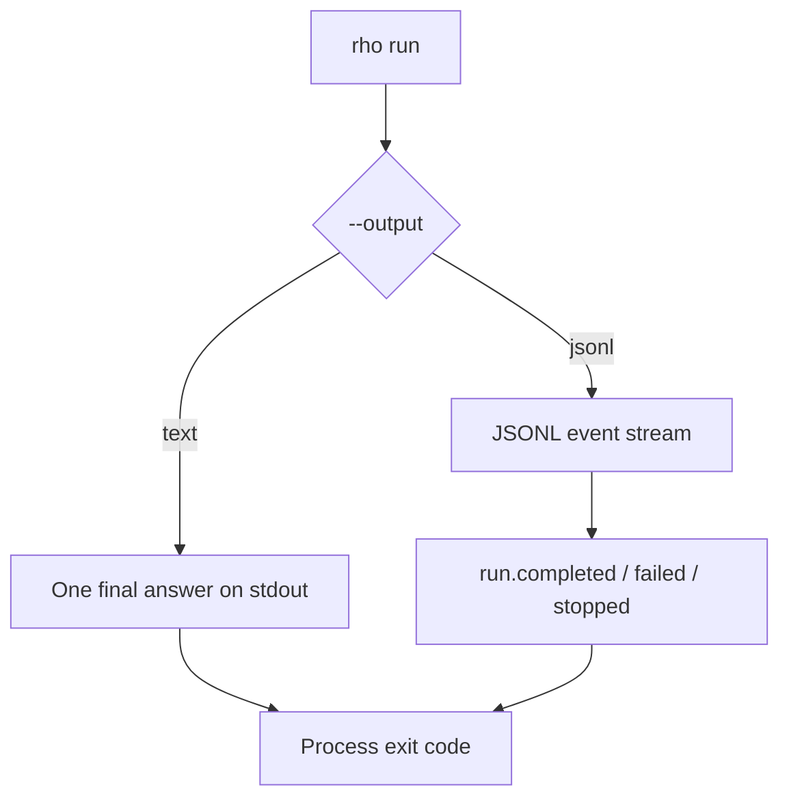

# Automation and CLI

Use `rho run` for non-interactive automation. It sends one prompt and exits. By default, it prints the final answer to stdout. Add `--output jsonl` for a versioned event stream.

```bash
rho run "summarize this repository"
printf 'summarize this repository' | rho run --stdin
rho run "review this diff" --stdin < diff.txt
```

Use the [interactive TUI](/interactive-tui) when you want an ongoing session. Use `rho run` when you want a single answer for a script, hook, alias, pipeline, or CI job. Use [`rho acp`](/integrations/acp) when an editor host speaks Agent Client Protocol. That command does not change `rho run --output jsonl`.



This page starts with `rho run` output and exit behavior, then covers login and updates. The full flag and subcommand tables are in [CLI reference](#cli-reference).

`rho run` accepts prompt text as arguments and can append stdin with `--stdin`:

```text
Usage: rho run [OPTIONS] [PROMPT]...

Arguments:
  [PROMPT]...  Prompt text to send to the agent

Options:
      --stdin               Read additional prompt text from stdin. Required when
                            stdin is a pipe or redirected file; without it, those
                            redirects are rejected so prompt text is not dropped.
      --output-file <PATH>  Write a structured status/result file (JSON). With
                            text output, stream progress and assistant text to
                            stdout and end with a completion marker; the result
                            file is the durable final answer. With JSONL output,
                            stdout stays the event stream.
      --output <OUTPUT>     Select plain final-answer output or a JSON Lines event stream [default: text] [possible values: text, jsonl]
      --max-steps <N>       Override the model-step budget for this run
      --timeout <DURATION>  Cancel the run after this wall-clock duration
      --no-subagents        Do not expose the delegated-agent tools (agent/agents) to the model
      --agent <ID>          Select the agent definition used for this session or automation run
  -h, --help                Print help (see more with '--help')
```

Prompt text can come from arguments, `--stdin`, or both. A redirected pipe or
file on stdin without `--stdin` is an error (`rho run "review" < diff.txt` needs
`--stdin`). A terminal or null stdin does not require the flag.
`rho run` uses the same [tools and workspace](/tools-workspace) behavior as the TUI when tools are enabled. That includes [advisor mode](/configuration/advisor-mode): when `advisor_mode` is on and an advisor model is set, the run gets the `advisor` tool. It starts in the current working directory. Relative file paths resolve from that directory, but they can use parent components such as `../`; absolute paths can also read or modify files outside it when the model chooses those tools.

Use `rho --no-tools run "..."` to remove tool access. That flag does not suppress Rho's system prompt; add `--no-system-prompt` as well when you want only the raw prompt and model response (`rho --no-tools --no-system-prompt run "..."`). `rho run --no-tools` fails because `--no-tools` is not a `run` flag.

### Automation output

Choose text when a script only needs the final answer. Choose JSONL when it needs progress or terminal state.



The default `--output text` contract has not changed: `rho run` writes one final
assistant answer and a trailing newline to stdout. Reasoning, provider activity,
tool lifecycle events, diagnostics, and errors stay off stdout. Actionable errors
go to stderr and keep their detail (for example a spanned TOML parse error).
Authentication failures stay generic so credentials never appear on stderr or in
JSONL. This keeps command substitution, pipes, and redirected output stable.
Use `--output jsonl` when a script needs progress or terminal state:

```bash
rho run --output jsonl --max-steps 12 --timeout 20m \
  "implement the issue"

# Read the authoritative final answer.
rho run --output jsonl "summarize this repository" \
  | jq -r 'select(.type == "run.completed") | .text'
```

JSONL mode writes one JSON object per physical line and flushes each object.
Every object has `schema_version` (currently `1`), a run-local monotonic `seq`,
and a stable `type`. The stream can contain these event types:

- `run.started`, with run and session IDs and the workspace path
- `assistant.text_delta` and `assistant.text_reset`
- `tool.started`, `tool.updated`, and `tool.finished`
- one final `run.completed`, `run.failed`, or `run.stopped`

Assistant deltas include an `attempt` number. A provider retry emits
`assistant.text_reset` before a new attempt starts. Delta boundaries can change
between releases, and retried text can be discarded. Use `run.completed.text`
as the final answer. `run.failed` and `run.stopped` may omit `text`.

Tool events omit arguments and raw output. Progress includes only safe, bounded
fields. Provider and fatal errors use Rho's existing sanitization. Assistant text
is free-form model output and can contain data from the workspace, so do not
send the JSONL stream to a system that should not receive that data.

`--output-file` has a separate contract. It updates the existing mutable status
artifact used for delegated runs, while `--output jsonl` writes an immutable
event stream to stdout. You can use both at once.

With the default `--output text`, `--output-file` streams progress and assistant
text to stdout and ends with a completion marker such as
`[subagent run complete]`. That stdout mix is for live watching; scripts that
need only the final answer should omit `--output-file`, use `--output jsonl`, or
read the result file. With `--output jsonl`, stdout remains the JSONL event
stream and the result file is still updated.
A broken stdout pipe cancels the run and starts normal tool, subagent, and
managed-process cleanup. A timeout starts after CLI and configuration validation.
Cleanup can finish shortly after the deadline.

### Exit status

Exit codes are part of the automation contract:

| Code | Meaning |
| ---: | --- |
| `0` | Normal model completion |
| `1` | Authentication, provider, tool-host, output, or another run failure |
| `2` | Invalid invocation or configuration |
| `124` | Timeout or model-step limit reached (default budget or `--max-steps`) |
| `130` | SIGINT, after cleanup |
| `143` | SIGTERM, after cleanup |

The terminal JSONL event gives a more exact reason, such as `completed`,
`max_steps`, `timeout`, `interrupted`, `authentication`, `provider_error`,
`tool_host_error`, `configuration_error`, `output_error`, or `other_error`.
A failed tool call can still lead to a successful run if the model recovers.

For CI, save the stream as an artifact and use the process status for the main
result:

```yaml
- name: Run Rho
  shell: bash
  run: |
    set -o pipefail
    rho run --output jsonl --timeout 20m "review this change" \
      | tee rho-events.jsonl
- name: Upload Rho events
  if: always()
  uses: actions/upload-artifact@v4
  with:
    name: rho-events
    path: rho-events.jsonl
```

## `rho login`

Log in to a provider from the command line. Browser-based providers open a local browser flow; use `--device-auth` on remote or headless systems:

```bash
rho login openai-codex
rho login openai-codex --device-auth
rho login xai-oauth --device-auth
```

API-key providers are usually easier to configure interactively with `/login` in the TUI or with their documented environment-variable override. See [authentication and models](/authentication-and-models) for provider-specific details.

## `rho update`

`rho update` checks the latest GitHub release and dispatches to the detected installation method:

- Cargo installs run `cargo install rho-coding-agent --locked`, adding `--root <cargo-root>` when the current executable is from a non-default Cargo install root.
- pacman installs run `sudo pacman -Sy mjiang-extras/rho-coding-agent` so pacman can refresh package databases and sync only `rho-coding-agent` from `mjiang-extras`, without performing a full system upgrade. Pacman may prompt for your password.
- Scoop installs show `scoop update; scoop update rho`, or `scoop update; scoop update -g rho` for global installs, so Scoop refreshes buckets before updating the package.
- install-script installs download the official install script to a temporary file and run it with `RHO_INSTALL_DIR` set to the current executable directory.

On Windows, `rho update` prints the detected update command instead of running it automatically.

Set `RHO_INSTALL_METHOD` to `cargo`, `pacman`, `scoop`, `scoop-global`, or `script` to override detection.

## CLI reference

Rho accepts global options before an optional subcommand. Provider, model, auth, and reasoning selections apply to the current invocation; add `--save` to write them as the saved defaults. Security and session-control switches apply only to the current invocation.

### Global options

| Option | Description |
| --- | --- |
| `--provider <PROVIDER>` | Select the provider for the current session or run. |
| `--model <MODEL>` | Select a model. A provider/model name can be used when switching providers. |
| `--config <CONFIG>` | Read and save configuration at a specific path instead of `~/.rho/config.toml`. |
| `--auth <AUTH>` | Select an auth profile and its matching provider profile: `api-key`, `codex`, `anthropic-api-key`, `google-api-key`, `github-copilot`, `xai-api-key`, `xai-oauth`, `moonshot-api-key`, `ollama-api-key`, `ollama-cloud-api-key`, `ollama-cloud-device`, `poolside-api-key`, `openrouter-api-key`, `openrouter-oauth`, `kimi-oauth`, `qwen-token-plan-api-key`, `meta-api-key`, or `opencode-go-api-key`. |
| `--reasoning <LEVEL>` | Select a reasoning level: `off`, `minimal`, `low`, `medium`, `high`, `xhigh`, or `max`. |
| `--save` | Persist `--provider`/`--model`/`--auth`/`--reasoning` overrides to the config file. |
| `--agent <ID>` | Select the agent definition for this session or automation run. See [subagents](/subagents). |
| `--no-system-prompt` | Do not send Rho's system prompt, including `AGENTS.md` and skill context. Current invocation only. Place before a subcommand. |
| `--no-tools` | Do not expose tools to the model. Current invocation only. Place before a subcommand: `rho --no-tools run "..."`. |
| `--no-subagents` | Do not expose the delegated-agent tools (`agent` / `agents`). Current invocation only. |
| `-R`, `--resume [<ID>]` | Resume a session by UUID or UUID prefix. Without an ID, open a picker. Interactive sessions only. |
| `-h`, `--help` | Show help for Rho or a subcommand. |

### Commands

| Command | Description |
| --- | --- |
| `rho` | Start an interactive TUI session in the current working directory. |
| `rho run [OPTIONS] [PROMPT]...` | Send one prompt, optionally append stdin, print the final answer, and exit. |
| `rho acp` | Serve Agent Client Protocol over stdio for an editor host. See [ACP](/integrations/acp). |
| `rho attach [ID]` | Watch a delegated agent run in a read-only TUI. Omit the id to pick from subagents in the current directory. The picker starts on running runs; Ctrl-R shows finished transcripts. See [subagents](/subagents/attachment-and-artifacts). |
| `rho workflow <COMMAND>` | Use `list`, `validate`, `plan`, `run`, `status`, `cancel`, or `resume <RUN_ID>` for a [durable workflow](/workflows). |
| `rho sessions list [--all-projects] [--search TEXT] [--limit N] [--json]` | List saved sessions for the current workspace, or every workspace with cwd context. |
| `rho sessions export <ID> [--output PATH] [--format html\|markdown\|json] [--force]` | Export a saved session transcript. Default path is under `$RHO_HOME/exports/` when `RHO_HOME` is set, otherwise `~/.rho/exports/`. |
| `rho sessions rename <ID> <TITLE>...` | Rename a session by UUID or prefix. See [sessions](/sessions#listing-renaming-exporting-and-deleting-sessions). |
| `rho sessions rm <ID>...` | Delete sessions by UUID or prefix. Cascades parent-linked subagent runs. See [sessions](/sessions#listing-renaming-exporting-and-deleting-sessions). |
| `rho sessions cleanup [--yes] [--force]` | Delete sessions whose recorded workspace directories no longer exist. Shows a confirmation unless `--yes` is set. |
| `rho login <PROVIDER>` | Authenticate a provider from a browser or device-code flow. Add `--device-auth` for remote or headless sessions. |
| `rho credential-store probe [os|file]` | Test a credential backend with a temporary secret. Defaults to `os`. |
| `rho credential-store set <BACKEND>` | Save `os` or `file` as the credential backend in config (`behavior.credential_store`). |
| `rho credential-store status` | Print the saved credential backend policy: `unset`, `os`, or `file`. |
| `rho plugins list [--json]` | List discovered Agent Plugin packages (no package code execution). |
| `rho plugins inspect <NAME> [--json]` | Show one plugin package, components, and diagnostics. |
| `rho plugins install <PATH> [--scope user\|project] [--force]` | Copy a local plugin package into a managed root after validation. |
| `rho plugins link <PATH> [--scope user\|project] [--force]` | Symlink a local plugin package into a managed root after validation. |
| `rho plugins enable <NAME>` | Enable a plugin for new sessions. |
| `rho plugins disable <NAME>` | Disable a plugin without deleting package files. |
| `rho plugins remove <NAME> [--yes]` | Remove a package from a managed root; keeps plugin data. |
| `rho update` | Update Rho using the detected installation method. |
| `rho help [COMMAND]` | Show help for Rho or a subcommand. |

Provider, model, auth, and reasoning options are described further in [authentication and models](/authentication-and-models) and [configuration](/configuration). For provider-specific automation caveats, see the [provider pages](/authentication-and-models#providers). For example, [GitHub Copilot](/providers/github-copilot#automation) needs a prior `/login` or a `GITHUB_COPILOT_TOKEN` override.

`--no-system-prompt`, `--no-tools`, `--no-subagents`, and `--agent` only affect the current invocation and are not written to config. `--no-system-prompt` and `--no-tools` are root options, so they must come before a subcommand (`rho --no-tools run "..."`). `--no-subagents` and `--agent` are global and may appear before or after the subcommand. `--resume` cannot be combined with a subcommand such as `run` or `update`. Workflow resume is a separate command: `rho workflow resume <RUN_ID>`.

