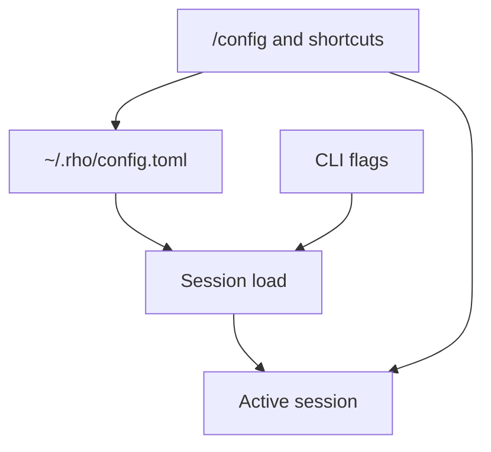
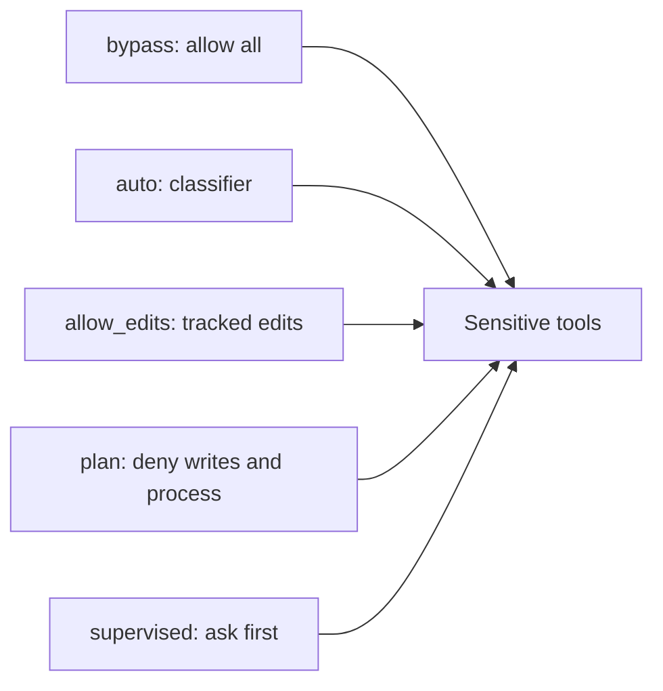

# Configuration

Rho stores persistent config at `~/.rho/config.toml` by default.

Most people change settings from the interactive TUI with `/config`, or with `/model`, `/login`, and related commands. Prefer that path for day-to-day changes. Use this page when you want the file layout, CLI overrides, or the meaning of a specific key.



## Common settings

| Goal | Where |
| --- | --- |
| Provider, model, reasoning | `[model]` or `/model`, `/config` → **Models & reasoning** |
| Permission mode | `[behavior].permission_mode` or `/config` → **Agent behavior** |
| Prompt templates | `~/.rho/prompts/` files or `[prompt_templates]` |
| Web search | `[web_search]` or `/config` → **Tools** |
| Edit tool | `[behavior].edit_tool` or `/config` → **Tools** |
| MCP servers | `[mcp.servers]`; inspect with `/mcp` or `rho mcp list` — see [Model Context Protocol](/integrations/mcp) |
| Auto compaction | `[compaction]` or `/config` → **Context & limits** |
| Keybindings | `[keybindings]` (restart required) |

Secrets are never stored in config. See [authentication and models](/authentication-and-models).

Unknown keys in `config.toml` are a load error so typos fail loudly. Values that Rho clamps or normalizes warn at load time. Both `--save` and `/config` rewrite only the known schema and discard unknown keys, comments, and formatting. A complete sample file is in [Configuration file example](/configuration/full-example).

## TUI updates

In the [interactive TUI](/interactive-tui), [`/config`](/interactive-tui#commands) opens a category browser. **Models & reasoning** contains the conversation model, reasoning level, reasoning-output toggle, zen mode, and theme. **Agent behavior** contains permission mode, delegation, and advisor mode. **Context & limits** contains auto compaction and output limits. **Tools** contains the inline shell, edit tool, and Web search settings. **Providers** contains login, logout, and model-list refresh actions. **Updates** contains the startup update check. Type in the category browser to find a category by any setting it contains, then press `enter` to open it. Press `esc` to return to the category browser.

Settings save as soon as they change. The `permission_mode` row applies the selected policy before the next turn. The `reasoning` row cycles through `off`, `minimal`, `low`, `medium`, `high`, `xhigh`, and `max` and applies to the current session. The `show_reasoning_output`, `zen_mode`, and `theme` rows apply immediately, including during the current model turn. The `check_for_updates` row controls startup checks against GitHub releases. The `enable_subagents` row applies to the next session. The `edit_tool` row applies before the next turn; Auto also follows provider changes mid-session. The `advisor_mode` row applies before the next turn; turning it on without an advisor model opens the model picker first. The auto-compaction rows edit its threshold and target percentages. The `max_output_bytes` row saves for the next session.

[`/login`](/interactive-tui#commands), [`/logout`](/interactive-tui#commands), and [`/model`](/interactive-tui#commands) remain direct shortcuts for provider credentials and conversation-model selection. The corresponding `/config` rows provide the same picker flows. Use `/agents` to inspect reserved internal agents and configure their optional model overrides. Model pickers show entries from Rho's [model catalog](/authentication-and-models#selecting-models) and cached dynamic provider model lists for providers with available auth, and `/model provider/model` can switch explicitly. See the [provider pages](/authentication-and-models#providers) for per-provider auth and model details.

## CLI overrides

Passing `--provider`, `--model`, `--auth`, or `--reasoning` overrides the loaded config for the current invocation only. Add `--save` to write those choices into the config file as the future default.

```bash
rho --provider openai --auth api-key --model gpt-5.6-sol
rho --reasoning high
rho --provider openai --auth api-key --model gpt-5.6-sol --save
```

These values select [authentication and models](/authentication-and-models). For the exact `--provider`/`--auth`/`--model` combination each provider expects, see its [provider page](/authentication-and-models#providers).

Unknown keys in `config.toml` are a load error so typos fail loudly. Values that Rho clamps or normalizes (for example `display.max_tool_output_lines` below 1, or an unsupported `web_search.provider`) warn at load time. Prefer `/config` or a careful hand edit when you want durable settings. Both `--save` and `/config` rewrite only the known schema and discard unknown keys, comments, and formatting.

You can load and save a specific config file with:

```bash
rho --config ~/.rho/config.toml
```

`--no-system-prompt`, `--no-tools`, `--no-subagents`, and `--agent` are only available on the command line and apply only to the current run. `--no-system-prompt` and `--no-tools` must come before a subcommand (`rho --no-tools run "..."`). `--no-subagents` and `--agent` may appear before or after the subcommand. `--no-subagents` has the same tool and prompt behavior as setting `enable_subagents = false`.

## Permission modes

`permission_mode` must be `bypass`, `auto`, `allow_edits`, `plan`, or `supervised`. Missing values default to `bypass`; an unrecognized value is a configuration error. The setting controls whether Rho allows, denies, classifies, or asks before security-sensitive tool capabilities. [`rho acp`](/integrations/acp) can ask the editor host for approval. Headless `rho run` cannot prompt.



| Mode | Config string | Default? | Behavior |
| --- | --- | --- | --- |
| Bypass | `bypass` | yes (new installs / unset) | No policy checks. Every capability allowed. |
| Auto | `auto` | no | Same gate as Allow edits. A configured classifier model decides allow or deny for the rest. |
| Allow edits | `allow_edits` | no | In-workspace writes to git-tracked files are allowed. Later writes to a path already allowed this session are also allowed. Human approval for other new files, processes, and unknown capabilities. |
| Plan | `plan` | no | Investigation only. File writes and process execution are denied. |
| Supervised | `supervised` | no | Human approval for writes, processes, and unknown capabilities. |

- `bypass` is the default and preserves unrestricted tool behavior. The status line shows **Bypass** in warning style so the open posture stays visible.
- `auto` uses the same capability gate as `allow_edits`. A permission-classifier model reviews gated requests instead of opening the approval UI. It runs in two stages: a fast low-reasoning screen answers `allow` or `escalate` in one token, and only an escalation pays for a second review at the configured classifier reasoning level. The stages share a transcript cache breakpoint; raising that reasoning keeps the screen cheap and forgoes a message-cache hit on the review. Denied calls return a tool error and the run continues. After three consecutive or twenty total classifier denials, Rho escalates to the human approval prompt in the TUI or fails closed in headless runs; a human decision clears both counts. Auto requires a configured classifier model; choosing it from `/config` opens the model picker when none is set, starting interactive Auto without one opens the same picker, and headless `rho run` fails at startup without one. Escaping the startup picker falls back to Supervised so gated tools still ask a human.
- `allow_edits` lets the agent edit git-tracked files in the workspace without a prompt. After a new in-workspace file is allowed once this session, later edits to that path also skip the prompt. Gitignored paths, writes outside the workspace, and process execution still ask first. Reads, network access, skills, and instruction discovery do not prompt. `allow-edits` is accepted as an alias.
- `plan` allows investigation but denies file writes and process execution.
- `supervised` asks for confirmation before file writes and process execution. Reads, network access, skills, and instruction discovery do not prompt.

Configure the classifier under **Agent behavior** in `/config`, or in config as `[internal_agents.permission-classifier]`. Rho does not pick a default classifier model. Override the mode for one invocation with `--permission-mode bypass|auto|allow_edits|plan|supervised` (not persisted).

Change the mode from **Agent behavior** > **Permission mode** in `/config`. An interactive mode change applies before the next turn and preserves the current session ID and history, but clears every remembered **Allow for session** approval. Remembered path grants stay bound to the approver that allowed them. A classifier grant in Auto does not skip the human gate after switching to Allow edits; a human grant may. Resetting or resuming a different session starts without inherited path grants. In a supervised approval prompt, the default focus is **Deny**. Choose **Allow once**, **Allow for session**, or **Deny**. A session approval remembers only the exact structured capability request for the current session. Pressing Escape denies the request and cancels the current run; choosing **Deny** with Enter rejects only that operation so the run can continue.

Non-interactive `rho run` sessions cannot display approval prompts. Supervised and Allow edits operations that require approval therefore fail closed instead of being approved automatically.

Permission modes are application policy checks, not an operating-system sandbox. Rho and its tools still run with the current user's permissions, and tools must correctly declare and authorize their capabilities for the policy to cover them. In restricted modes, capability classes that this Rho version does not recognize fail closed: Plan denies them, Supervised and Allow edits require approval, and Auto sends them to the classifier.

## Reasoning options

`reasoning` is the user-facing thinking level. Supported values are `off`, `minimal`, `low`, `medium`, `high`, `xhigh`, and `max`. For supported OpenAI Responses providers, `off` omits the reasoning object and other levels send `reasoning.summary = "auto"` with the matching effort value.

Rho reads each model's available effort values from cached [models.dev](https://models.dev/) metadata. The interactive reasoning control skips levels the current model does not advertise, so models without `minimal`, `xhigh`, or `max` do not expose those choices. `off` remains available for every model: Rho omits reasoning by default, or sends `effort: "none"` when the model explicitly advertises that value. Local Ollama and [config-defined OpenAI-compatible hosts](/providers/openai-compatible) send `reasoning_effort`, including `"none"`, when capability metadata is unavailable or the model supports reasoning. Rho omits the field for models whose metadata reports reasoning as not configurable, because those APIs treat a missing field as thinking on. Switching models also normalizes an unavailable selection to the closest lower supported level. When capability metadata is unavailable or uses an unsupported reasoning scheme, Rho preserves the full level list rather than guessing. You can override metadata locally with `supported_reasoning_levels = ["off", "low", "medium", "high"]` in a model entry in `~/.rho/models.toml` (or the file selected by `RHO_MODELS_PATH`).

`show_reasoning_output` controls whether streamed reasoning text is displayed and stored in the TUI transcript. When reasoning text is hidden, the TUI shows `Thinking...` in its place until the reasoning phase finishes, then replaces it with a `Thought for …` summary. When reasoning text is shown, the same summary is appended after the reasoning block. Durations use a compact progressive format such as `3.2s`, `2m 5s`, or `1h 2m`. It defaults to `true`. Changing it from `/config` applies immediately: later reasoning deltas in the current turn follow the new setting, and an in-flight live reasoning preview is cleared when hiding.

`zen_mode` hides tool cards, reasoning blocks, and the `Thinking...` placeholder so the transcript shows only message text. The live activity rail and subagent rows stay visible so you can still see progress. It defaults to `false`. Changing it from `/config` applies immediately to the current transcript and live turn UI. Tools and reasoning still run; only their transcript display is suppressed.

`theme` selects the interactive TUI color theme. The default is `terminal` (match the host palette). Built-in ids include `one-half-dark`, `one-half-light`, `monochrome-dark`, and `monochrome-light`. Custom schemes load from `~/.rho/themes/<id>.json` (or `$RHO_HOME/themes/`) in Windows Terminal color-scheme JSON form. Change it with `/theme` or `/config` → **Models & reasoning** → **Theme**. The picker previews live; Enter saves. Details: [Theme](/interactive-tui/theme).

## Advisor mode

Advisor mode gives the agent an `advisor` tool backed by a second model that reviews the session transcript without tools of its own.

Details: [Advisor mode](/configuration/advisor-mode).

## Prompt templates

The easiest way to add a reusable prompt is to create a Markdown or text file. The filename becomes the slash command and the file contents become its prompt:

- `~/.rho/prompts/review.md` makes `/prompt:review` available everywhere.
- `.rho/prompts/review.md` makes `/prompt:review` available in that project and its subdirectories.
- A project file overrides a global file with the same name.

For example, `~/.rho/prompts/review.md` could contain:

```text
Review this code for correctness, security, and maintainability.
```

Templates can also be defined inline in `config.toml` when a separate file would be unnecessary:

```toml
[prompt_templates]
review = "Review this code for correctness, security, and maintainability."
```

Inline config templates override files with the same name. Typing `/prompt:review src/config.rs` expands to `Review this code for correctness, security, and maintainability. src/config.rs`. Press `tab` in the command palette to expand without sending, or press `enter` to expand and send. Template names may contain letters, numbers, `-`, and `_`, and cannot duplicate built-in command names. Restart Rho after adding or editing templates.

## Model aliases

`[model.aliases]` defines short names for concrete models so a pinned model id lives in one place instead of being repeated across config and agent definitions. An alias value is either `provider/model` or a bare model id, which keeps whichever provider is otherwise selected. Model ids may contain `/`, as OpenRouter ids commonly do:

```toml
[model.aliases]
deep = "anthropic/claude-opus-4-8"
fast = "gpt-5.6-luna"
openrouter-deep = "openrouter/anthropic/claude-sonnet-4"
```

Reference an alias with an `@` prefix. The explicit prefix distinguishes aliases from concrete model ids and makes a missing or misspelled alias an immediate configuration error:

```toml
[model]
model = "@deep"

[internal_agents.session-title]
model = "@fast"
```

The same syntax works with `rho --model @deep`, `/model @deep` in the interactive TUI, and `model: @deep` in [agent definition frontmatter](/subagents). Updating a model is then a one-line change to the alias table rather than an edit per file.

Rho resolves aliases to concrete ids before any model-specific behavior, holds no opinion about which model a name should map to, and never rewrites your mapping. A concrete model id is always interpreted literally, even when an alias has the same name. The `/config` category browser shows the active mapping under **Models & reasoning**, and saving config preserves the `@deep` reference rather than its expansion while the selected concrete model still matches. Alias values must be concrete models and therefore cannot begin with `@`. Every provider-qualified alias is validated when configuration loads, including aliases that are not currently selected.

## Internal agent models

Rho uses reserved internal agents to generate session titles, evaluate `/goal` completion, answer the [`advisor`](/configuration/advisor-mode) tool, and classify permission requests in Auto mode. Most roles follow the active conversation provider, model, and auth by default. Run `/agents`, select the role, and press Enter to choose a separate model. The picker includes **Use conversation model**, which removes that role's override. Changes apply to the next invocation and save at once.

The `advisor` and `permission-classifier` roles have no default and no conversation-model fallback. The advisor picker omits the **Use conversation model** row, and advisor mode stays inactive until a model is chosen. Auto mode opens the permission-classifier picker when no model is set. Canceling from `/config` keeps the previous mode; canceling the startup picker falls back to Supervised. The permission-classifier role defaults to low reasoning when a model is first selected. The advisor picker also lists `claude-code/…` rows when the `claude` binary is installed; choosing one runs the advisor on [Claude Code](/configuration/advisor-mode#claude-code-as-the-advisor) instead of a Rho provider. When the advisor model supports configurable reasoning, Rho carries the previous level (or the advisor default) onto the new model. `/config` under **Agent behavior** exposes **Advisor model**, **Advisor reasoning**, **Permission classifier model**, and **Permission classifier reasoning** next to **Permission mode** and **Advisor mode**.

Overrides are stored by stable internal agent ID:

```toml
[internal_agents.session-title]
provider = "openai"
model = "gpt-5.6-luna"
auth = "api-key"
```

Model aliases work in these entries. Rho keeps reading the old `[title]` section and flat title settings for compatibility, but rewrites them as `[internal_agents.session-title]` on the next save.

## Edit tool

`edit_tool` under `[behavior]` selects the file edit preference exposed to the model. It defaults to `auto`. Supported values are:

| Value | Exposed tool | Format |
| --- | --- | --- |
| `auto` | preferred for the active provider | Built-in catalog; switches when the provider changes |
| `hashline` | `edit` | Snapshot-tagged, line-anchored `PUT` and `CUT` operations |
| `apply_patch` | `apply_patch` | Codex-style, multi-file patch documents |
| `str_replace` | `str_replace` | Exact `old_string` to `new_string` replacement in one file |

Only one edit tool is registered at a time. Each concrete format keeps its own model-facing name. Change it from **Tools** > **Edit tool** in `/config`, or set it directly:

```toml
[behavior]
edit_tool = "auto"
```

`auto` is a preference, not a tool name. Rho keeps `auto` in config and advertises the preferred concrete format for the active chat provider.

Many models learn to edit files inside a first-party harness that only offers one edit tool. Codex trains with `apply_patch`. Claude Code and several other agent stacks train with exact string replacement. Auto picks that familiar surface so the model uses the format it was trained on. Providers without a clear first-party match fall back to Rho's `hashline` `edit` tool.

| Provider | Preferred format | Why |
| --- | --- | --- |
| `openai-codex` | `apply_patch` | Codex harness trains on Codex-style patches |
| `anthropic` | `str_replace` | Claude Code harness trains on exact string replace |
| `xai` | `str_replace` | First-party agent tooling favors string replace |
| all others | `hashline` | Rho default when no first-party match is known |

Pinned values (`hashline`, `apply_patch`, `str_replace`) stay fixed across provider changes. From `/config`, the change applies before the next turn: the tool list rebuilds and the session gets a short notice with the new tool schema. Auto mode also applies that live switch when you change providers mid-session. Direct `config.toml` edits still need a restart. Pin a format when you want one surface for every provider.

## Web search

Hosted search is on by default when both are true:

1. `hosted = true` under `[web_search]`
2. the active chat path supports a native `web_search` tool (OpenAI Responses, Codex standard Responses, and xAI)

When either condition fails, Rho uses the client backup backend if one is configured.

`hosted` under `[web_search]` turns provider-hosted search on or off. It defaults to `true`. Set `hosted = false` to force the client backup tool even on providers that support hosted search.

`provider` under `[web_search]` chooses only the **backup** client backend used when hosted search is off or the active chat path cannot host search. Supported values are `auto`, `openai`, `exa`, `brave`, and `disabled`. Unknown values are normalized back to `auto` when config is loaded. Set `provider = "disabled"` to turn the client backup off while keeping hosted search available on supported chat paths.

To disable search entirely, set both `hosted = false` and `provider = "disabled"`. On a chat path that cannot host search, `provider = "disabled"` alone is enough to remove the tool.

Legacy flat `web_search_openai_api_key`, `web_search_exa_api_key`, and `web_search_brave_api_key` values are migrated to the configured credential store when loaded. Empty strings are ignored.

`advisor_mode` controls whether the [`advisor`](/configuration/advisor-mode) tool is available. It defaults to `false`.

`enable_subagents` controls whether the `agent` and `agents` tools are available. It defaults to `true`. Set it to `false` to remove both tools and instruct the model not to attempt to use subagents. The change applies to the next session.

`inline_shell` selects the shell used for `!` and `!!` commands in the [interactive TUI](/interactive-tui). It defaults to `bash` on macOS and Linux and `powershell` on Windows. Change it from **Tools** > **Inline shell** in `/config`, or set a detected shell name or custom executable path in config. Rho keeps a configured custom path in the picker even when it is not on `PATH`. See [inline shell](/inline-shell).

`experimental_workspace_rewind` enables native file-tool checkpoints and `/rewind`. It defaults to `false`. Restart Rho after changing it. Checkpoints cover `write` and the selected edit tool (`hashline`, `apply_patch`, or `str_replace`). Rho warns when a turn ran a shell command because shell, Git, process, network, database, and service effects cannot be restored. `/tree` branches conversation state only, `/rewind` branches conversation state and restores captured files, and Git commands remain separate operations.

## Auto compaction

`auto_compact` enables summarizing older conversation history when the estimated current context approaches the effective model window. It is disabled by default. `compact_threshold_percent` controls the trigger point. `compact_target_percent` controls the post-compaction target as a percent of the effective model window; it must stay below the threshold, so values at or above `compact_threshold_percent` are clamped to one below it when the config is loaded or saved. Rho keeps the recent verbatim tail by token budget and safe tool-call boundaries, not by message count. Context estimates are anchored to the most recent provider-reported token usage when available.

For `openai-codex` and API-key `openai`, Rho prefers OpenAI server-side compaction via `POST /responses/compact`. Both use the Responses API so the encrypted compaction artifact stays replayable. The threshold still decides when auto compaction runs, but `compact_target_percent` applies only if that path falls back to text-summary compaction.

Auto compaction affects only future model context. Session files remain append-only and keep the original transcript entries, then append a replacement-history entry used for resume. It is not a privacy or deletion feature.

Model metadata supplies the effective context window when available. Pricing-sensitive models such as `openai/gpt-5.6-sol` and `openai-codex/gpt-5.6-sol` use safer effective windows below the advertised maximum to avoid long-context pricing thresholds.

## Tool output limit

`max_output_bytes` controls how much output Rho keeps from [tool](/tools-workspace) calls such as command output, file reads, and loaded skills. It defaults to `64000`.

`max_tool_output_lines` controls how many lines of a tool result are shown inline before the TUI collapses the rest. It defaults to `10` and is clamped to at least one line when config is loaded.

## Update checks

`check_for_updates` controls whether Rho checks the latest GitHub release at TUI startup. It defaults to `true`. When a newer version is available, the session header shows an update notice and points to `rho update`.

## RTK

`rtk` enables built-in [RTK](/integrations/rtk) command rewriting when the `rtk` binary is available. It defaults to `true`; set `rtk = false` to leave shell commands unchanged.

Full behavior, version requirements, analytics paths, and doctor checks are on the [RTK](/integrations/rtk) page.
