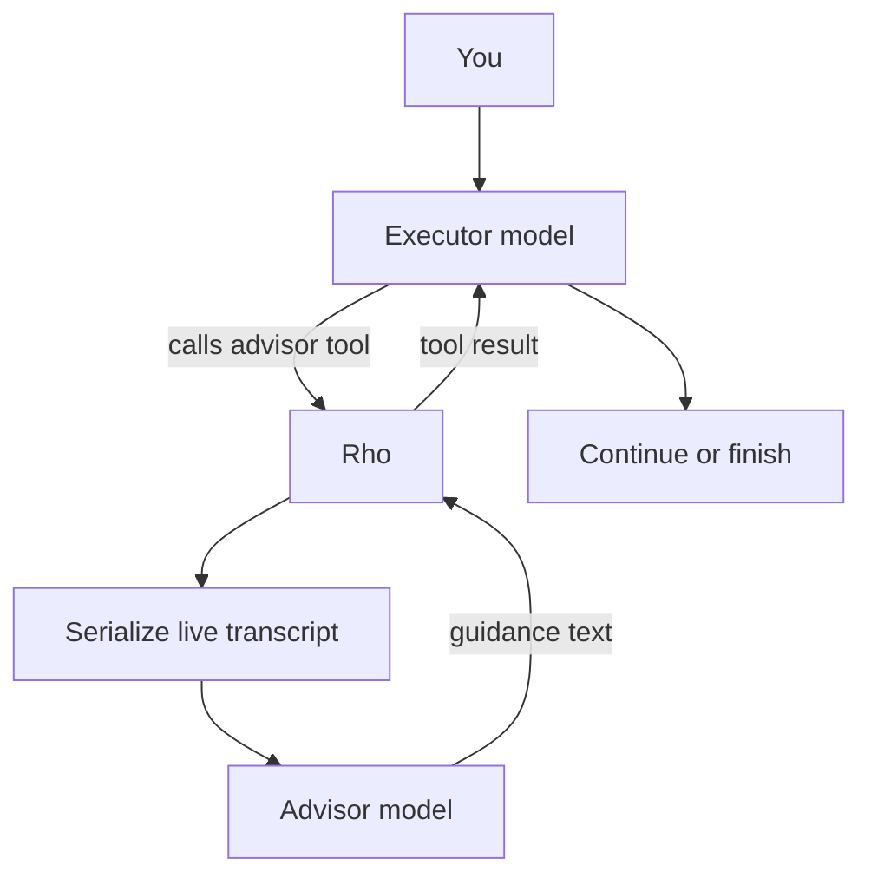

# Advisor mode

Parent: [Configuration](/configuration).

Advisor mode gives the root agent an `advisor` tool backed by a second model.
The executor keeps doing the work. The advisor only reviews the live session
and returns guidance. Use a stronger or different model than the executor so
the review adds a second judgment after the agent has explored, when the
agent is stuck, and before it declares the work done.



## How a call works

1. The executor calls `advisor`. The tool takes no parameters.
2. Rho builds a text transcript from the executor system prompt and the live
   session history, including the turn in flight. The agent cannot edit that
   payload.
3. Rho starts a one-shot advisor run on the configured advisor model. That run
   has no tools. It cannot read files, run commands, or change the workspace.
   This holds on both runtimes: a Claude Code advisor is spawned with
   `--tools ""`.
4. While the request is in flight, the advisor tool card shows live status on
   the first line (`waiting for provider`, `thinking`, `responding`, or
   `retrying provider`) and streams guidance text into the card body as it
   arrives. Reasoning content stays hidden; only the phase changes to
   `thinking`.
5. The advisor finishes. Rho hands the final guidance back as an ordinary tool
   result. The executor keeps its turn and decides what to do next.

Rho runs the advisor itself. There is no server-side advisor and no provider
beta flag, so any model in Rho's [catalog](/authentication-and-models#selecting-models)
can be the advisor on any provider. The advisor can also run on the installed
`claude` binary instead, using your Claude Code subscription. See
[Claude Code as the advisor](#claude-code-as-the-advisor).

## Turn it on

Advisor mode needs both switches:

1. `advisor_mode = true`
2. an explicit advisor model under `[internal_agents.advisor]`

With the mode on and no model, Rho shows `advisor: no model` in the status line
and does not offer the tool. The advisor never falls back to the conversation
model, because a reviewer that mirrors the executor adds nothing.

Ways to enable it:

- `/advisor` or `/advisor on` in the [interactive TUI](/interactive-tui#commands).
  Without a model, the command opens a model picker first. The mode turns on after you
  select one. `esc` leaves the mode off. `/advisor off` turns it off.
- `/config` → **Agent behavior** → **Advisor mode**, **Advisor model**, and
  **Advisor reasoning**
- `/agents`, then choose the `advisor` internal agent and pick a model
- a hand edit of `~/.rho/config.toml`

```toml
[behavior]
advisor_mode = true

[internal_agents.advisor]
provider = "anthropic"
model = "claude-fable-5"
auth = "anthropic-api-key"
reasoning = "high"
```

`reasoning` is optional. When omitted, the advisor uses its built-in default
(`medium`). Model [aliases](/configuration#model-aliases) work in the advisor
entry (`model = "@deep"`).

Changes save at once and apply before the next turn. The session ID and history
stay. You cannot toggle advisor mode while a run is active.

## Claude Code as the advisor

The advisor model picker lists Claude Code alongside Rho's provider models:

```text
claude-code/default
claude-code/fable
claude-code/opus
claude-code/sonnet
claude-code/haiku
```

Choosing one of those rows also chooses the runtime. Rho runs the review on the
installed `claude` binary, and nothing else changes: the advisor still sees only
the rendered transcript, still gets no tools, and still returns guidance text
into the same card.

The rows appear only when the `claude` binary is on `PATH`. Sign in first with
`/login claude-code`; Rho never stores a Claude token. A signed-out binary makes
the advisor call fail with that same instruction, and the executor's turn
survives it.

The equivalent config is:

```toml
[behavior]
advisor_mode = true

[internal_agents.advisor]
runtime = "claude-cli"
model = "opus"
reasoning = "high"
```

- `runtime` defaults to `rho`, so existing config keeps working unchanged.
- `model` is a Claude alias or full Claude model name, passed through as
  `--model`. Omit it to let Claude Code choose. Rho `@alias` references are not
  resolved here.
- `provider` and `auth` do not apply. Claude Code owns both, and Rho drops them
  with a warning if they appear.
- `reasoning` maps to Claude `--effort`, so only `low`, `medium`, `high`,
  `xhigh`, and `max` are offered.

Differences worth knowing before you choose it:

- Calls bill to your Claude subscription, not to a Rho provider, and they draw
  on the same 5-hour and 7-day windows as your own Claude Code use. Reported
  cost folds into the session total in the TUI. The
  [usage ledger](/usage-ledger) does not record them, matching delegated Claude
  runs.
- Each call spawns a process, so it starts slower than a provider request.
- The run is one turn with no tools and no session persistence, so it leaves
  nothing in your Claude session list.

## What the advisor sees

The advisor receives a rendered transcript, not a free-form prompt from the
executor:

- the executor system prompt
- your requests
- assistant messages, tool calls, and tool results
- the live turn that issued the call

Large single items are clipped. When the whole body is still too large, Rho
keeps the start of the session and the most recent work and elides the middle.
Images become short placeholders such as `[image: image/png]`.

## When the executor should call it

While the mode is active and a model is set, the `advisor` tool is registered
and its description steers the executor. Call `advisor` after orientation, not
as the first action:

- after exploring, before a plan or interpretation hardens
- when stuck (recurring errors, a plan that is not converging)
- when it considers a change of approach
- when it believes the task is complete, after it has made the deliverable
  durable

On short reactive tasks, a call is optional. Do not call advisor just because
the tool is available.

## In the TUI

While advisor mode is on, the status line names the reviewing model, for
example `advisor: anthropic/claude-fable-5`, or `advisor: claude-code/opus`
when the advisor runs on Claude Code. It stays out of the status line
while the mode is off. An in-flight `advisor` call uses an agent-style card:
`advisor  responding` on the header with streamed guidance below. Finished
advice stays on the same card as `advisor  completed`, collapsed past the
[tool output limit](/configuration#tool-output-limit) and expandable with
`ctrl+o`. `/info` also reports whether advisor mode is on.

## Cost and scope

- Advisor calls bill to the advisor model's provider, or to your Claude
  subscription when the advisor runs on Claude Code.
- The [usage ledger](/usage-ledger) records provider calls under the `advisor`
  purpose. Claude Code calls are not ledger rows, the same as delegated Claude
  runs.
- Provider-reported advisor cost folds into the parent session total in the TUI.
- [Automation runs](/automation-cli) honor `advisor_mode`, so `rho run` gets the
  same tool when a model is set.
- Subagents and workflow runs do not. The advisor reviews the root session. A
  child run has its own history and does not receive the tool.

## Related settings

| Setting | Role |
| --- | --- |
| `[behavior].advisor_mode` | Offers the `advisor` tool when a model is also set. Default: `false`. |
| `[internal_agents.advisor]` | The reviewer. On the default `rho` runtime: required provider, model, and auth. With `runtime = "claude-cli"`: optional pass-through `model` only. Optional `reasoning` either way. No conversation-model fallback. |
| [`display.max_tool_output_lines`](/configuration#tool-output-limit) | How many lines of advice show inline before the TUI collapses the card. |

See also: [`/advisor`](/interactive-tui#commands),
[internal agent models](/configuration#internal-agent-models), and the
[`advisor` tool](/tools-workspace).
