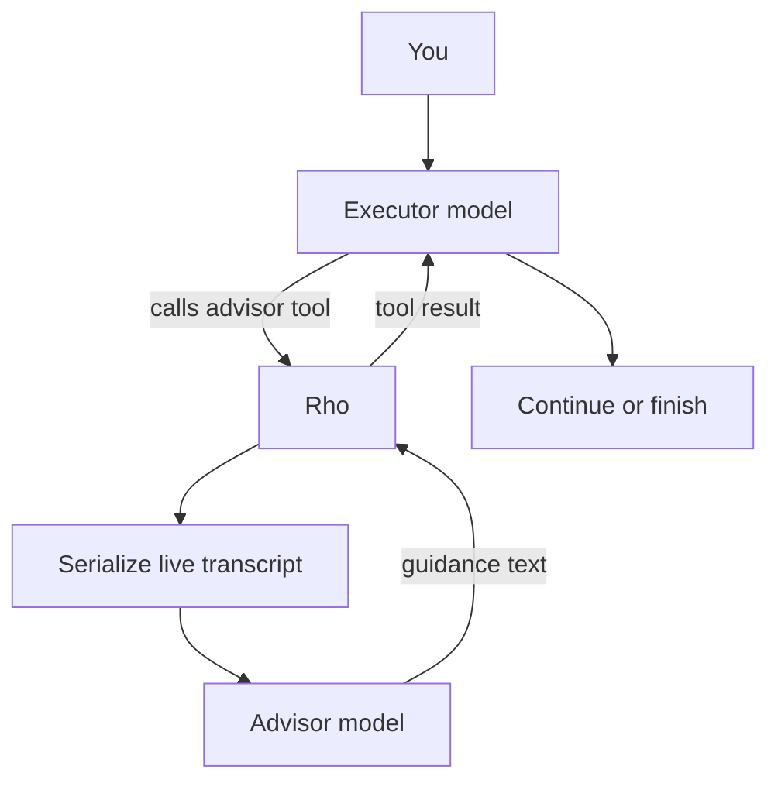

# Advisor mode

Parent: [Configuration](/configuration).

Advisor mode gives the root agent an `advisor` tool backed by a second model.
The executor keeps doing the work. The advisor only reviews the live session
and returns guidance. Use a stronger or different model than the executor so
the review adds a second judgment before the plan hardens, when the agent is
stuck, and before it declares the work done.



## How a call works

1. The executor calls `advisor`. The tool takes no parameters.
2. Rho builds a text transcript from the executor system prompt and the live
   session history, including the turn in flight. The agent cannot edit that
   payload.
3. Rho starts a one-shot advisor run on the configured advisor model. That run
   has no tools. It cannot read files, run commands, or change the workspace.
4. The advisor returns guidance text. Rho hands it back as an ordinary tool
   result. The executor keeps its turn and decides what to do next.

Rho runs the advisor itself. There is no server-side advisor and no provider
beta flag, so any model in Rho's [catalog](/authentication-and-models#selecting-models)
can be the advisor on any provider. The advisor itself must use the `rho` runtime.

## Turn it on

Advisor mode needs both switches:

1. `advisor_mode = true`
2. an explicit advisor model under `[internal_agents.advisor]`

With the mode on and no model, Rho shows `advisor: no model` in the status line
and does not offer the tool. The advisor never falls back to the conversation
model, because a reviewer that mirrors the executor adds nothing.

Ways to enable it:

- `/advisor` or `/advisor on` in the [interactive TUI](/interactive-tui#commands).
  Without a model, the command opens a picker first. The mode turns on after you
  select one. `esc` leaves the mode off. `/advisor off` turns it off.
- `/config` → **Agent behavior** → **Advisor mode**
- `/agents`, then choose the `advisor` internal agent and pick a model
- a hand edit of `~/.rho/config.toml`

```toml
[behavior]
advisor_mode = true

[internal_agents.advisor]
provider = "anthropic"
model = "claude-fable-5"
auth = "anthropic-api-key"
```

Model [aliases](/configuration#model-aliases) work in the advisor entry
(`model = "@deep"`). The advisor must resolve to the `rho` runtime. A
`claude-cli` advisor is rejected with a clear error.

Changes save at once and apply before the next turn. The session ID and history
stay. You cannot toggle advisor mode while a run is active.

## What the advisor sees

The advisor receives a rendered transcript, not a free-form prompt from the
executor:

- the executor system prompt, including the advisor steering text while the mode
  is on
- your requests
- assistant messages, tool calls, and tool results
- the live turn that issued the call

Large single items are clipped. When the whole body is still too large, Rho
keeps the start of the session and the most recent work and elides the middle.
Images become short placeholders such as `[image: image/png]`.

## When the executor should call it

While the mode is active and a model is set, Rho adds steering text to the
executor system prompt. The tool description and that text both steer the
executor to call `advisor`:

- before substantive work (writes, commits to an interpretation, or answers)
- when stuck (recurring errors, a plan that is not converging)
- when it considers a change of approach
- when it believes the task is complete, after it has made the deliverable
  durable

On short reactive tasks, a call is optional. On longer tasks, the prompt asks
for at least one call before the approach hardens and one before the agent
declares done.

## In the TUI

While advisor mode is on, the status line names the reviewing model, for
example `advisor: anthropic/claude-fable-5`. It stays out of the status line
while the mode is off. Advice appears as a normal `advisor` tool card, collapsed
past the [tool output limit](/configuration#tool-output-limit) and expandable
with `ctrl+o`. `/info` also reports whether advisor mode is on.

## Cost and scope

- Advisor calls bill to the advisor model's provider.
- The [usage ledger](/usage-ledger) records them under the `advisor` purpose.
- Provider-reported advisor cost folds into the parent session total in the TUI.
- [Automation runs](/automation-cli) honor `advisor_mode`, so `rho run` gets the
  same tool and steering text when a model is set.
- Subagents and workflow runs do not. The advisor reviews the root session. A
  child run has its own history and does not receive the tool.

## Related settings

| Setting | Role |
| --- | --- |
| `[behavior].advisor_mode` | Offers the `advisor` tool when a model is also set. Default: `false`. |
| `[internal_agents.advisor]` | Required provider, model, and auth for the reviewer. No conversation-model fallback. |
| [`display.max_tool_output_lines`](/configuration#tool-output-limit) | How many lines of advice show inline before the TUI collapses the card. |

See also: [`/advisor`](/interactive-tui#commands),
[internal agent models](/configuration#internal-agent-models), and the
[`advisor` tool](/tools-workspace).
