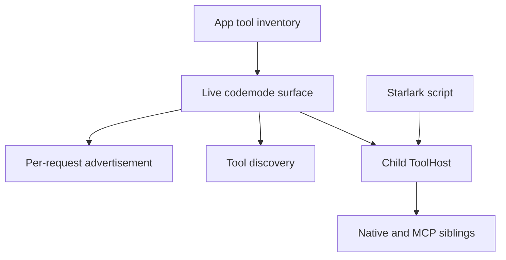

# Starlark codemode v0

Rho composes native and MCP tools through the same SDK ToolHost. Starlark is
one-off glue, not a second tool implementation or permission system.

## Model surface

`codemode` and `tool_search` are always registered in tool-enabled sessions.
`[codemode] mode = "on" | "only"` controls advertisement:

| Tools | `on` (default) | `only` |
|---|---|---|
| `codemode`, `tool_search` | advertised | advertised |
| Native siblings | advertised | script-only |
| MCP siblings | script-only | script-only |

`/codemode on|only` changes the next provider request without rebuilding the
runtime; bare `/codemode` reports the mode. Direct model calls to unadvertised
tools resolve unavailable. Neither mode grants authority: `/permissions` remains
the permission ladder.

There are no exposure overrides, deferred promotions, or hidden-tool policy in
v0. Those had no production configuration feeder and were removed rather than
shipping a test-only policy API. `tool_search` remains useful in `only` mode:
it returns names, descriptions, and output schemas without advertising those
tools directly. MCP schemas stay out of provider tool declarations in both modes.

## One inventory, one authorization path

Every inventory mutation publishes one snapshot for discovery and child-host
construction. Orchestration tools are not siblings: they never appear in script
discovery or the child host, which rejects recursive calls as unknown tools.
This also prevents reference cycles. MCP identity is parsed with the exported
name codec, not guessed from a prefix.

The child host inherits the parent call's workspace, policy, hooks, approvals,
session and run identity through `ToolHost::child_builder`. A gated nested call
pauses the script until the session approval handler allows or denies it. Exact
request approval memory and audit are shared; there is no second approval prompt
for codemode. Policy denials and execution errors raise script errors.

## Guest API and outputs

- `call_tool(name, args=None)` invokes one sibling and returns a
  fixed `{is_error, content, data}` envelope. `content` is model-facing text;
  `data` is the unchanged structured value, or `None` for text-only or oversized
  results. Host status cannot clobber a server field. Completed failures remain
  values so scripts can branch on them; their data need not match success schemas.
- `call_tools([(name, args), ...])` runs independent calls concurrently (up to
  the model's parallel tool width of 4) and returns envelopes in input order. The
  whole batch is charged to the nested-call budget before any call starts. A call
  that cannot complete becomes an `is_error` envelope so its siblings survive.
- `search_tools(query, limit=10)` and `list_tools(limit=50)` return compact
  `{name, description}` rows. `describe_tool(name)` returns the full catalog entry
  that model-side `tool_search` returns, including `returns` (the envelope schema
  wrapping the tool's nullable data schema). Execution and guest discovery use one
  per-script snapshot, even if MCP attaches during evaluation.
- `print(...)` captures text; assign `result = ...` for the distilled JSON return.
  Non-JSON results fail instead of silently becoming null. JSON numbers remain
  numeric, including floats.

The outer codemode output carries a typed `return_value`, `prints`, `calls`
(name, compact args, status, duration, detail), and an optional `error` alongside
its human-readable distillate. A failing script is a completed failure that keeps
its prints and call log. Discovery and codemode
both expose output schemas using the shared `Rendered<T>` contract. In `on`
mode native descriptions include a script-call hint naming their result shape.

The dialect is standard Starlark with top-level `for`/`if` and f-strings; there is no `while`.
Existing runaway-script tripwires are 100,000 ticks, an 8 MiB heap, 64 callstack
frames, and 64 nested calls. There is **no separate script wall-time cap**.
ToolHost cancellation and tool-specific timeout policies still apply. Printed
and returned model text share the native-tool output byte budget.

## Event delivery

Scripts run under `spawn_blocking`; the async parent task stays available to
poll progress and host-input channels. The bridge **awaits** progress capacity,
including the final log restatement. While the script runs, each nested call
has a status row (running, ok, error, cancelled) with its main argument,
duration, and latest progress or failure line inside the parent codemode card.
The card body is the script as highlighted source; once the script finishes the
rows give way to a call count, so live and replayed cards match. Host questions relay through the parent call, and parent
cancellation cancels an in-flight child call.

The system prompt has one replaced MCP context slot, rebuilt from connected
servers and their instructions. Transient connecting/failure statuses stay in
`/mcp`, never the cached prompt. When startup hydration cannot rewrite that prompt,
the same connected context is appended as a session notice.
Deferred connection cannot append a stale second catalog.

## Deliberately deferred

- Planner-aware nested scheduling (`call_tools` fans out without resource-aware
  serialization; scripts order dependent writes themselves).
- Configured per-server/per-tool exposure policy and promotion semantics.
- Distinct TUI child cards and a supervised nested-approval PTY scenario.
- Embeddings-based discovery.

## References

- [Pi codemode extension](https://github.com/boozedog/pi-codemode)
- [Earendil: You Said No MCP!](https://earendil.com/posts/you-said-no-mcp/)
- `crates/rho-sdk/src/tool_host.rs`
- `crates/rho/src/tools/code_mode/`
