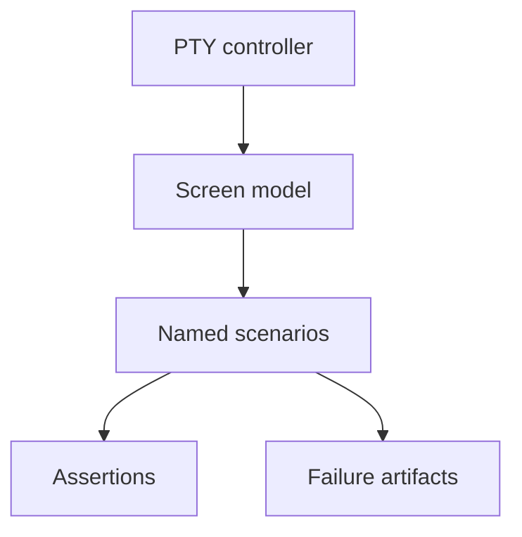

# Development

Build and check the project with Cargo:

```bash
cargo build
cargo test
```

Run the local binary without installing:

```bash
cargo run --
cargo run -- run "summarize this repository"
```

Use the local binary to test the [interactive TUI](/interactive-tui), [automation mode](/automation-cli), [configuration](/configuration), and [tools](/tools-workspace) behavior while developing.


## Local validation

Use the fast workflow while editing. It always checks formatting and architecture, then checks one package without compiling every target:

```bash
python3 scripts/validate.py fast --package rho-sdk
```

You can add a library test, an integration test, or a test-name filter:

```bash
python3 scripts/validate.py fast --package rho-sdk --lib
python3 scripts/validate.py fast --package rho-coding-agent --test automation_cli
python3 scripts/validate.py fast --package rho-coding-agent --test automation_cli --filter streams_json_events
```

Run the full workflow before opening or updating a pull request:

```bash
python3 scripts/validate.py full
```

The full mode runs policy and script checks, Clippy for all targets and features, normal workspace tests, documentation tests, and the SDK feature and downstream checks. It stops at the first failure. Both modes cap Cargo at 12 jobs. A lower `CARGO_BUILD_JOBS` value remains in effect.

Development and test profiles use reduced debug information to keep artifacts and link times smaller while retaining line-number backtraces. Set `CARGO_PROFILE_DEV_DEBUG=2` or `CARGO_PROFILE_TEST_DEBUG=2` when a debugging session needs full symbols.

## Thermo-nuclear review workflow

The repository includes `.rho/workflows/thermo-nuclear-review/` for a deep
review of the current branch. It collects one bounded Git context pack, runs
three read-only review lanes in parallel, then sends their structured findings
to one worker that applies safe fixes. If the selected scope has no changes,
the workflow takes a no-op path instead of starting review agents.

```bash
rho workflow validate .rho/workflows/thermo-nuclear-review/workflow.star
rho workflow plan .rho/workflows/thermo-nuclear-review/workflow.star \
  --input 'base="main"' \
  --input 'scope="all"'
```

`base` must resolve exactly; an invalid explicit ref does not fall back to a
different branch. `scope` accepts `all`, `committed`, or `uncommitted`. See
`.rho/workflows/thermo-nuclear-review/README.md` for its graph, inputs, run
commands, and context collector test.

## Test selection

Before adding, expanding, reviewing, or deleting tests, follow the project skill
`rho-test-selection` at `.agents/skills/rho-test-selection/SKILL.md`. It defines the
failure-mode / owner-layer gate, Tier A/B/C rules, determinism requirements, and
PTY-as-product-gate defaults.

Pull requests that add tests should fill the test-gate section in the pull request template.

## Test prerequisites

Some integration tests spawn local fixtures and need host tools on `PATH`:

- `stdio_lifecycle_and_failure_isolation` in `crates/rho/src/tools/mcp_tests.rs` is Unix-gated and requires `python3` to run its stdio MCP server fixture.

## Interactive TUI PTY harness

Rho includes a deterministic PTY harness in `crates/rho-tui-pty` for automated interactive TUI tests. Prefer it over manual Herdr smoke tests for regressions that can be expressed as scripted scenarios. PTY is the product gate for interactive behavior; unit tests under `crates/rho/src/tui` stay limited to pure logic.



### Layers

- **PTY controller** - spawn a selected `rho` binary in a pseudo-terminal, inject keys/paste/mouse, resize, drain output, and kill-on-drop
- **Screen model** - reconstruct the visible terminal with a VT parser and assert user-visible text
- **Scenarios** - named action/assertion sequences over `RHO_TUI_TEST_MODE=matrix`
- **Artifacts** - on failure, keep raw PTY bytes, reconstructed screen, action log, and redacted env

Unix PTYs are supported. Windows is skipped with an explicit error rather than a silent pass.

### Run harness self-tests

```bash
cargo test -p rho-tui-pty
```

### Run the CI smoke scenarios

```bash
cargo test -p rho-coding-agent --test tui_pty
```

Smoke scenarios cover startup/stream/exit, cancel-and-resubmit, resize-during-stream, scroll-during-stream, and terminal restoration.

### Run one scenario locally

```bash
cargo build -p rho-coding-agent
cargo run -p rho-tui-pty --bin rho-pty-scenario -- --list
cargo run -p rho-tui-pty --bin rho-pty-scenario -- --bin target/debug/rho startup_stream_exit
cargo run -p rho-tui-pty --bin rho-pty-scenario -- --bin target/debug/rho --smoke
cargo run -p rho-tui-pty --bin rho-pty-scenario -- --bin target/debug/rho --timing startup_stream_exit
```

Failure artifacts default to a temp directory (or `--artifacts <dir>`). Successful runs do not retain artifacts.

### Environment isolation

Scenarios launch Rho with:

- temporary `HOME` and `--config`
- `RHO_TUI_TEST_MODE=matrix` (debug builds only)
- host terminal markers stripped (`TMUX`, `TERM_PROGRAM`, Herdr vars, editor markers, and related identity env)
- `check_for_updates = false` and `web_search_provider = "disabled"` in the isolated config

### When to use Herdr instead

Use the Herdr sibling-pane workflow for exploratory checks, novel bugs that are not yet encoded as scenarios, or parity checks against a real terminal renderer. See the [Herdr](/integrations/herdr) page and the `rho-tui-pty-testing` and `rho-tui-herdr-testing` skills.

## Provider identity and auth modes

A provider identifies one API or product surface. If two login methods use the same API base, wire protocol, and model catalog, add both to that provider's `auth_modes` list rather than adding a second provider. The first mode is the default. Keep separate providers when endpoints, protocols, catalogs, or product surfaces differ. For example, OpenRouter API-key and OAuth access share `openrouter`, while the OpenAI API and Codex remain `openai` and `openai-codex`.

When retiring a same-API provider name, add a load-time alias that selects both the canonical provider and the matching auth mode. New config, model references, favorites, runtime identities, and cache entries must use the canonical provider name.

## Model integration layers

Model integrations are split into three layers:

- `crates/rho-providers/src/model/` defines provider registry, catalog, and application model support without wire types.
- `crates/rho-providers/src/protocol/` converts the canonical SDK model to and from API wire formats. OpenAI Chat Completions, OpenAI Responses, Anthropic Messages, and Google Gemini Generate Content are implemented here.
- `crates/rho-providers/src/providers/` owns credentials, endpoint selection, headers, retries, continuation state, and transport policy for each provider. Multiple providers may consume one protocol codec.

Keep provider-specific fields in protocol or provider modules unless the agent needs the underlying concept. Adding a protocol stub does not make a provider available: provider identity, authentication, model discovery, runtime construction, and documentation must be implemented separately.

## Architecture guardrails

Run the lightweight architecture checks before submitting structural changes:

```bash
python3 scripts/check_architecture.py
python3 scripts/check_architecture.py --self-test
```

The script uses only the Python standard library and reads policy from `scripts/architecture.json`. It enforces these repository policies:

- Hand-written production Rust files under workspace crate `src/` directories, plus crate `build.rs` files, have a 1,000-line default budget (`default_production_line_budget`).
- Dedicated test files, including files under a `tests/` directory and `*_test.rs`, `*_tests.rs`, or `tests.rs`, are excluded. Inline tests still count toward their production file's budget.
- Generated Rust files are excluded only when their exact path and reason are recorded in `generated_files` in `scripts/architecture.json`. There are currently no generated-file exclusions.
- Existing oversized production files are listed explicitly in `legacy_file_budgets`. Their ceilings prevent further growth and should be lowered or removed as the files are split.
- `crates/rho-providers/src/credentials` must remain independent of `model`, keeping credential storage separate from model runtime metadata (`forbidden_dependencies`).
- `crates/rho/src/main.rs` has a 50-line thin-binary budget so application orchestration remains in the library (`thin_binary_budgets`).
- Package dependency boundaries are also declared in `forbidden_package_dependencies` so lower-level crates cannot depend on the application or reverse the intended layering.

Current legacy file budgets are: none.

Do not raise a budget just to make a check pass. Prefer extracting a cohesive module and reducing the recorded ceiling. If a generated file must be added, list its exact repository-relative path with a non-empty reason so the exclusion remains reviewable. When changing the scanner or policy, update its self-tests and this documentation together.

## Rust toolchain and MSRV

The `rho-sdk` minimum supported Rust version (MSRV) is **1.86**. The
`rho-coding-agent` application MSRV is **1.92** because its terminal,
credential, and terminal-native Mermaid rendering dependencies require a newer
compiler. Both values are declared as `package.rust-version` in Cargo metadata
and tested in CI.

When either MSRV changes, update the matching Cargo manifest, this section, and
CI together. An MSRV increase must not ship as a patch release. On a stable
major line, an SDK MSRV increase requires at least a minor version increase and
must be called out in release notes. Emergency compiler requirements caused by
a security or soundness fix may skip normal notice, but still require
coordinated metadata and CI updates.

Embedders only need the SDK crate's declared `package.rust-version`. See
[SDK installation](/sdk/installation#minimum-supported-rust-version).
