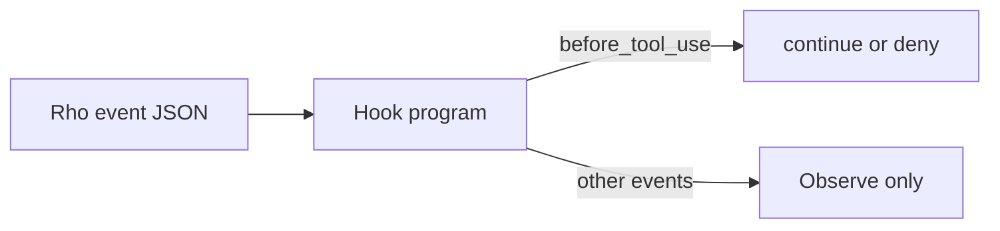
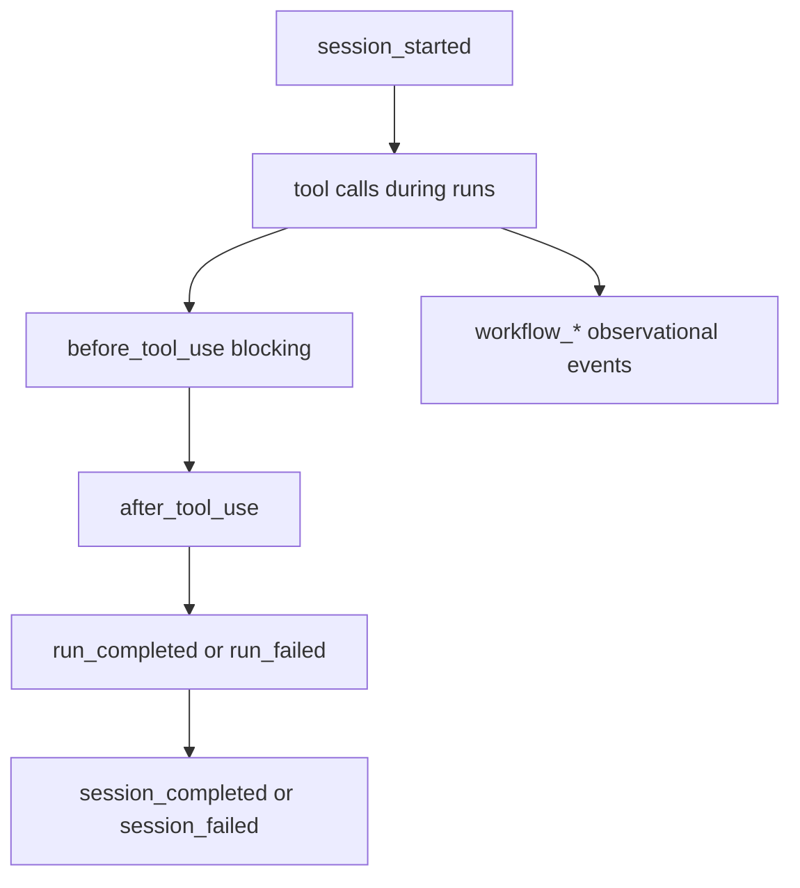

# Hooks

Hooks let you run your own programs when Rho does something, and let one of
those programs stop a tool call. They are the rails for local automation: policy
and observation, not a workflow engine. If you want multi-step orchestration,
use a Rho workflow.

A hook is an ordinary executable. Rho sends it one JSON event on stdin. For the
one blocking event, the program answers with a JSON decision on stdout.



## Files

```text
~/.rho/hooks.toml           user hooks, always eligible
<project>/.rho/hooks.toml   project hooks, only when the workspace is trusted
```

Preferences stay in `config.toml`. Hook policy lives only in `hooks.toml`,
because "which model do I prefer" and "which programs may Rho run" are different
trust questions.

## A first hook

```toml

# ~/.rho/hooks.toml
version = 1

[[hook]]
id = "deny-force-push"
on = "before_tool_use"
tools = ["bash", "powershell"]
command = ["/home/you/bin/deny-force-push"]
timeout = "2s"
env = ["MY_HOOK_TOKEN"]

[[hook]]
id = "fmt-rust"
on = "after_tool_use"
tools = ["edit", "write"]
command = [".rho/hooks/fmt-rust"]
timeout = "5s"
```

`deny-force-push` might be:

```sh
#!/bin/sh
event=$(cat)
if printf '%s' "$event" | grep -q 'push --force'; then
  printf '{"version":1,"decision":"deny","reason":"force push is not allowed here"}'
else
  printf '{"version":1,"decision":"continue"}'
fi
```

Run `/hooks` in the interactive TUI to reload hooks and print exactly what each
one will execute.

## Fields

| Field | Rule |
| --- | --- |
| `version` | Required. Only `1` is understood. |
| `id` | Required. ASCII letters, digits, `-`, `_`, `.`. Unique within its file. Across files, hooks are named `user:<id>` and `project:<id>`, so a project cannot break your configuration by shipping a colliding ID. |
| `on` | Required. One of the delivered event names below. |
| `tools` | Optional, and only for the two tool events. Exact canonical tool names, or one trailing `*`. Omit it to match every tool. |
| `command` | Required. Argv only; there are no shell strings. If you want a shell, say so: `["/bin/sh", "./.rho/hooks/x.sh"]`. |
| `timeout` | Required, for example `2s`. Must be positive and at most 10 minutes. |
| `env` | Optional list of environment variable **names** to pass through. |

Unknown keys are an error, so a typo cannot quietly disable a hook. Every
configuration error names the file, the hook ID, and the field.

## Events

Delivered at schema version 2. Most events are observational. Only
`before_tool_use` can stop work.



| Event | Kind | Fires |
| --- | --- | --- |
| `session_started` | observational | when a session is created |
| `before_tool_use` | **blocking** | before a capability-bearing tool call is authorized |
| `after_tool_use` | observational | when a tool call resolves, successfully or not |
| `run_completed` | observational | per run, when the run ends normally |
| `run_failed` | observational | per run, when the run ends in an error |
| `session_completed` | observational | when the session ends normally |
| `session_failed` | observational | when the session ends after a failure |
| `workflow_started` | observational | when a frozen workflow run starts |
| `workflow_node_started` | observational | when a workflow node attempt starts |
| `workflow_node_finished` | observational | when a node attempt reaches a typed terminal outcome |
| `workflow_completed` | observational | when a workflow succeeds |
| `workflow_failed` | observational | when a workflow ends in denial, failure, or a blocked state |
| `workflow_cancelled` | observational | when cancellation intent ends a workflow |

`run_completed` and `run_failed` are what you want for "tell me when the agent
finishes". In an interactive session, `session_completed` fires at exit, which
can be hours after the last run.

`before_tool_use` fires per capability request, so it sees tool calls that ask
for filesystem, process, network, skill, or instruction authority. A tool that
requests no capability has nothing to gate.

### Canonical tool names

The `tools` matcher accepts only these names. They are part of the hook
contract and do not change with which tools a given run enables:

`agent`, `agents`, `bash`, `edit`, `fetch_content`,
`get_search_content`, `glob`, `grep`, `list_dir`, `powershell`, `process`,
`questionnaire`, `read_file`, `rho`, `skill`, `web_search`, `write`.

## Protocol reference

Event JSON, blocking decisions, pipeline order, environment variables, bounds, diagnostics, and release limits:

[Hook protocol](/hooks/protocol)
