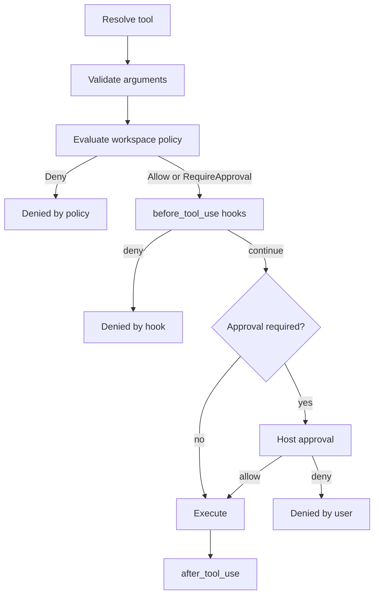

# Hook protocol

Parent: [Hooks](/hooks).

This page covers event payloads, decisions, pipeline placement, environment, bounds, and diagnostics.

## The event a hook receives

One bounded JSON document on stdin:

```json
{
  "schema_version": 2,
  "event": "before_tool_use",
  "event_id": "0d1f…",
  "timestamp_unix_ms": 1730000000000,
  "identity": {
    "session_id": "…",
    "parent_session_id": null,
    "run_id": "…"
  },
  "host_labels": {},
  "workspace": { "root": "/home/you/project" },
  "bounds": { "truncated": false, "fields": [] },
  "payload": {
    "tool": { "name": "bash", "call_id": "call_01" },
    "capability": {
      "operation": "execute_process",
      "working_directory": "/home/you/project",
      "executable": "bash",
      "arguments": ["-lc"],
      "shell_command": "git push --force",
      "environment": "inherit_except"
    },
    "policy": "require_approval"
  }
}
```

`after_tool_use` uses the same capability summary for the first request on
that call. Multi-capability calls still emit one `before_tool_use` per
request; the after payload reports only the first. The field is `null` when
the call requested no capability or failed before producing one:

```json
{
  "tool": { "name": "bash", "call_id": "call_01" },
  "capability": {
    "operation": "execute_process",
    "working_directory": "/home/you/project",
    "executable": "bash",
    "arguments": ["-lc"],
    "shell_command": "git push --force",
    "environment": "inherit_except"
  },
  "status": "failed",
  "failure": { "kind": "execution", "message": "…" },
  "duration_ms": 42
}
```

`parent_session_id` is filled in for delegated Rho subagents. A
`runtime: claude-cli` child does not run Rho's tool loop, so it produces
session-boundary events only.

`host_labels` contains bounded, non-secret labels from the embedding host. It
is empty for standard session events. Tool events from workflow command and
agent nodes include `workflow_run_id`, `plan_digest`, `node_id`, and `attempt`.
SDK hosts can supply other labels, so handlers must allow unknown keys. A label
that exceeds a bound is shortened and named in `bounds.fields`.

Workflow lifecycle events come from the app, not `rho-sdk`. They use the same
trusted command runner, queue, bounds, diagnostics, and project trust rules as
the other observational events. Their payloads contain only a workflow run ID,
plan digest, and, when applicable, a node ID, attempt number, typed outcome,
duration in milliseconds, and artifact references. They do not contain prompts,
credentials, ambient environment values, or full node output.

Node outcomes are `success`, `failure`, `denial`, `cancellation`, `skipped`, or
`blocked`. A terminal workflow event reports `success`, `denial`, `failure`,
`blocked`, or `cancellation`, as applicable.

Workflow hooks cannot schedule a node, change a plan, grant authority, or supply
a workflow value. Rho does not parse their stdout. A hook crash, timeout, or any
output from it cannot change scheduler state, a condition, or a template.

Read `bounds` before trusting payload text. A shortened field is named there,
for example `payload.capability.shell_command`.

### What is never in a payload

Provider credentials, authorization headers, raw process environments, secret
configuration, and URL query strings. A network payload carries the scheme,
host, and path with userinfo and query removed, plus a `query_present` flag.

Paths and shell command text **are** included, because inspecting them is the
whole point of a deny hook.

## Answering a blocking event

A `before_tool_use` handler must write exactly one JSON decision:

```json
{"version": 1, "decision": "continue"}
```

```json
{"version": 1, "decision": "deny", "reason": "force push is not allowed here"}
```

Unknown keys are ignored, so a newer handler keeps working with an older Rho. An
unknown `version` is not ignored.

**Blocking hooks fail closed.** Anything short of a valid `continue` denies:

| Result | Outcome |
| --- | --- |
| valid `continue` | the call proceeds |
| valid `deny` | the call is denied |
| timeout, crash, no output, malformed JSON, wrong schema version, output over the bound | **denied** |

A denial names the hook, so a broken program is survivable rather than
mysterious: `denied: hook \`project:deny-force-push\` timed out after 2s`.

Matching hooks run in configured order, user file first, then project file. The
first denial wins and the rest do not run. The whole dispatch also has a 30
second budget.

Observational handlers do not answer. Their stdout is not parsed, their failures
are recorded and visible, and they never fail a run.

## Where a hook sits in the pipeline

For one tool call, the path is fixed. Hooks sit after workspace policy and
before host approval.



A hook can only keep the current decision or make it stricter:

| Workspace policy | Hook result | Outcome |
| --- | --- | --- |
| `Deny` | not consulted | denied by policy |
| `RequireApproval` | `continue` | approval is still required |
| `RequireApproval` | `deny` | denied before the prompt |
| `Allow` | `continue` | the call executes |
| `Allow` | `deny` | denied |

In supervised mode a hook denial happens before you are prompted. In auto mode
it becomes an ordinary tool failure the model reads and can respond to. Hooks
cannot widen workspace policy, sandbox policy, permission mode, or an existing
denial, and they cannot rewrite tool arguments.

## Trust

User hooks are your own files and always load. Project hooks stay inert until
you say the workspace is trusted:

```sh
RHO_TRUST_PROJECT_HOOKS=1 rho
```

This is the same family as `RHO_TRUST_PROJECT_AGENTS` and
`RHO_TRUST_PROJECT_PLUGINS`. Until then Rho ignores
`<project>/.rho/hooks.toml` and says so once.

Before you grant trust, read the spawn contract with `/hooks` or
`rho(action="hooks")`. Rho parses valid project definitions for inspection but
keeps them inactive. Diagnostics show the resolved argv, working directory,
timeout, and exact environment for every hook, with `active: false` on project
hooks that have not been trusted.

Project hooks must name their program by path (`./relative` or absolute), never
a bare `PATH` name, so trusting a workspace cannot silently bind whatever `PATH`
happens to resolve to. Relative project paths resolve against the project root
once at load, and diagnostics show the resolved path.

A hooks file that fails validation in a trusted workspace disables hooks for
that session and logs why. It never half-loads.

## What a hook program gets

Hook programs run with your authority, outside any agent sandbox, as trusted
user automation. They are not sandboxed with the agent, because a deny hook has
to be able to see and judge what the agent is about to do.

The child environment is not inherited. It contains:

- a fixed base set: `PATH`, `HOME`, `LANG`, `LC_ALL`, `LC_CTYPE`, `TZ` on Unix;
  `PATH`, `SystemRoot`, `SystemDrive`, `ComSpec`, `PATHEXT`, `TEMP`, `TMP`,
  `USERPROFILE` on Windows;
- `RHO_IN_HOOK=1`;
- whatever names you listed in `env`, when they are set in the parent.

A variable that is unset in the parent is simply absent from the child.

`RHO_IN_HOOK` is how recursion is prevented. A hook may legitimately run `rho`;
that nested Rho sees the marker and runs with hooks disabled, so a hook cannot
trigger itself.

The working directory is the project root for project hooks and the hooks file's
directory for user hooks.

On timeout or cancellation Rho kills the whole process tree: a process group on
Unix, a job object on Windows. A background process your hook started does not
outlive the hook.

## Bounds

- Event payloads are capped at 64 KiB, with individual fields capped at 8 KiB
  and every shortened field named in `bounds`.
- Decision output is capped at 8 KiB; more than that denies.
- Captured stderr is capped at 4 KiB and used only for diagnostics.
- Observational events go through a 256-slot queue. When it is full the newest
  event is dropped and the drop is recorded, because waiting would make an
  observational hook block the turn it was only supposed to watch.
- Up to 32 observational handlers run concurrently, so one slow handler does
  not stall unrelated handlers or later events. The cap keeps child-process
  creation bounded.

Full hook stdout and stderr stay out of normal session scrollback.

Workflow identifiers and each artifact reference use the same 8 KiB field
bound. The full workflow event uses the same 64 KiB envelope bound. The
`bounds.fields` list names each shortened identifier or artifact reference. If
the artifact list must be shortened to fit the envelope, it also names
`payload.artifact_references`.

## Diagnostics

`rho(action="hooks")` returns the loaded files, any untrusted file that was
skipped, the resolved spawn contract for each hook, and recent activity:

```json
{
  "enabled": true,
  "files": ["/home/you/.rho/hooks.toml"],
  "hooks": [
    {
      "active": true,
      "id": "user:deny-force-push",
      "event": "before_tool_use",
      "tools": "bash, powershell",
      "command": ["/home/you/bin/deny-force-push"],
      "working_directory": "/home/you/.rho",
      "timeout": "2s",
      "environment": ["PATH", "HOME", "…", "RHO_IN_HOOK", "MY_HOOK_TOKEN"]
    }
  ],
  "recent_activity": [
    {
      "hook": "user:deny-force-push",
      "event": "before_tool_use",
      "outcome": "denied",
      "duration_ms": 41,
      "truncated": false,
      "detail": "denied by hook `user:deny-force-push`: force push is not allowed here"
    }
  ]
}
```

`/hooks` prints the same information and reloads the hooks files first. Reload
is atomic: a blocking decision already in flight keeps the hook set it started
with. A session that started with no hooks, or without a whole class of hooks
(blocking vs observational), needs a restart to pick new ones up, because
installing a gate or worker rebuilds the runtime.

## Not in this release

Shell command strings, inline script bodies, HTTP handlers, regular-expression
matchers, per-hook model or runtime settings, marketplace IDs, failure-policy
knobs, tool-argument mutation, message injection, and hooks that grant
permissions. Each of those needs its own design.
