## Rho in action

## Concept docs

- [Getting started](/getting-started)
- [Installation](/installation)
- [Authentication and models](/authentication-and-models)
  - [OpenAI](/providers/openai)
  - [OpenAI (Codex OAuth)](/providers/openai-codex)
  - [Anthropic](/providers/anthropic)
  - [Google Gemini](/providers/google-gemini)
  - [GitHub Copilot](/providers/github-copilot)
  - [Ollama](/providers/ollama)
  - [OpenRouter](/providers/openrouter)
  - [Moonshot and Kimi Code](/providers/moonshot-kimi)
  - [xAI](/providers/xai)
- [Interactive TUI](/interactive-tui)
- [Inline shell](/inline-shell)
- [Automation and CLI](/automation-cli)
- [Configuration](/configuration)
- [Tools and workspace](/tools-workspace)
- [Sessions](/sessions)
- [Usage ledger](/usage-ledger)
- [Rust SDK](/sdk/)
  - [Installation and support](/sdk/installation)
  - [Concepts and ownership](/sdk/concepts)
  - [Providers](/sdk/providers)
  - [Tools and capabilities](/sdk/tools)
  - [Sessions and persistence](/sdk/sessions-and-persistence)
  - [Events and cancellation](/sdk/events-and-cancellation)
  - [Compatibility contracts](/sdk/compatibility)
  - [Security model](/sdk/security)
  - [Threat model](/sdk/threat-model)
  - [Redaction audit procedure](/sdk/redaction-audit)
  - [Upgrade to 1.0](/sdk/upgrade-to-1.0)
  - [Release candidates](/sdk/release-candidates)
- [Development](/development)
- [Changelog](/changelog)
