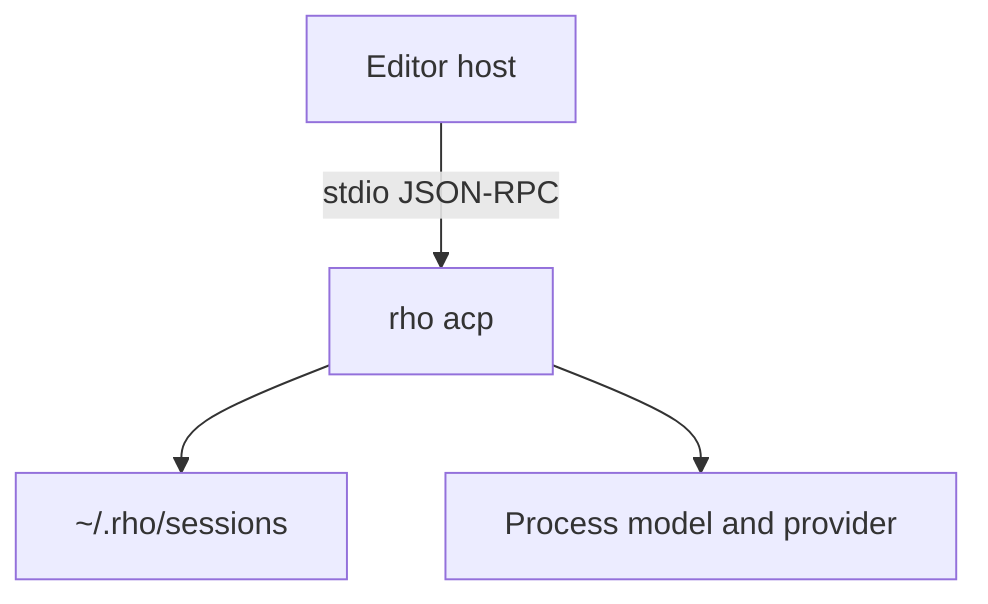

# Agent Client Protocol

Parent: [Integrations](/integrations).

`rho acp` is a stdio JSON-RPC [Agent Client Protocol](https://agentclientprotocol.com/) agent. An editor host such as Zed starts the process and drives sessions over ACP.



## Launch

```bash
rho acp
```

The process uses the model, provider, and other flags from the command line and config. There is no extra host plugin inside Rho.

stdout is protocol only. Logs go to stderr. Do not write other text to stdout, and do not point a logger at stdout while a host is connected.

## Sessions

ACP sessions persist under `~/.rho/sessions`. They appear in `rho sessions list` and you can resume them with `rho -R`. See [Sessions](/sessions).

## Permissions

New sessions advertise Rho permission modes: `bypass`, `auto`, `allow_edits`, `plan`, and `supervised`. `session/set_mode` is not supported yet.

When a tool needs approval, Rho asks the host. The host choices map to allow once, allow for this session, and reject.

`rho acp` can prompt the host for approvals. Headless `rho run` cannot.

## Model

The model is chosen at process start. `session/set_model` is not supported yet. Change the model with `--model` / `--provider` or config, then restart `rho acp`.

## Reasoning

New and loaded sessions advertise a `thought_level` config option. Hosts that support `session/set_config_option` can change it while the session is idle. Values are Rho reasoning ids: `off`, `minimal`, `low`, `medium`, `high`, `xhigh`, and `max`, filtered to what the current model advertises.

The change applies to later turns in that ACP session. It does not rewrite `config.toml`. Launch still honors `--reasoning` and config as the starting value. A prompt already in flight rejects the change as a busy session.

## MCP

Rho still starts MCP servers from its own config. Host-supplied `mcpServers` are ignored. `rho acp` is not an MCP server. See [Model Context Protocol](/integrations/mcp).

## Automation

`rho acp` does not change `rho run --output jsonl`. Use [Automation and CLI](/automation-cli) for one-shot scripts.
