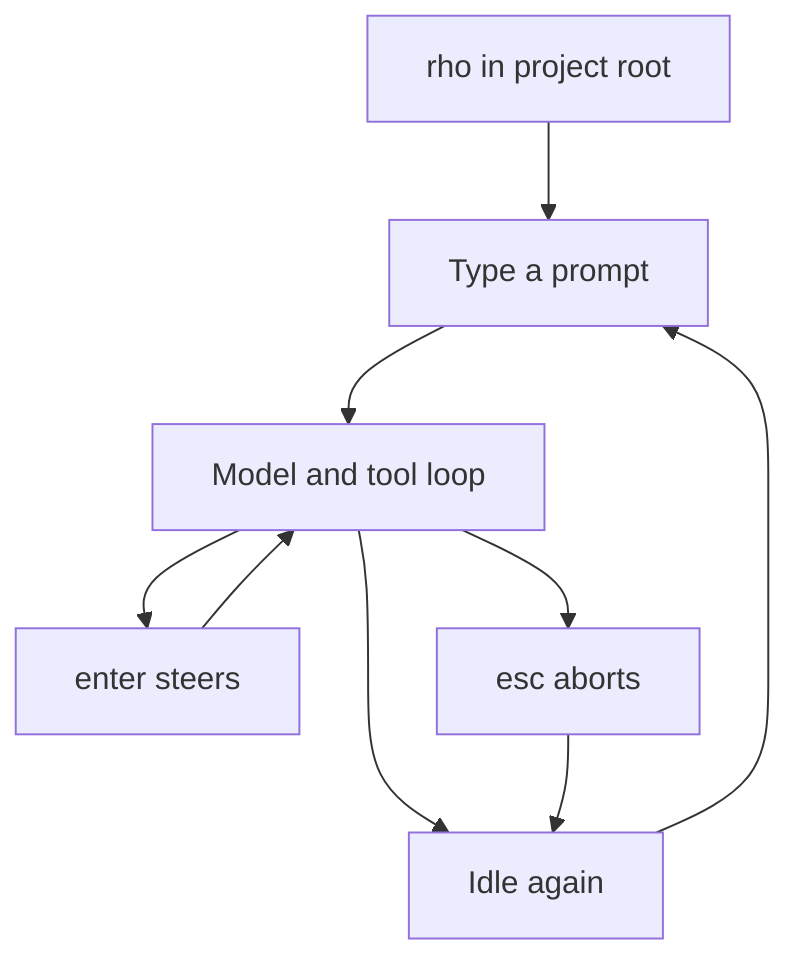

# Interactive TUI

Run `rho` in a terminal to start an interactive coding session in the current directory.

```bash
rho
```

The TUI is the main way to use Rho. Ask it to inspect files, explain code, make changes, run commands, or iterate on a task with you. Rho uses the current directory as its [workspace](/tools-workspace). Tool access and command execution follow the workspace and security behavior described in [tools and workspace](/tools-workspace#security-and-workspace-boundaries).



## Start a session

Open a project and run Rho from the repository root:

```bash
cd path/to/project
rho
```

To open the same session with the first prompt already sent:

```bash
rho --prompt "summarize this repository"
```

This is still the interactive TUI. Use [`rho run`](/automation-cli) when you want one answer and then exit. If you are not signed in yet, the text stays in the composer until you finish login and press enter.

Rho streams the assistant response as it works. Tool use appears inline so you can see commands, file reads, and edits as they happen. For persisted history and resume behavior, see [sessions](/sessions).

If you need auth or a model first, use `/login` and `/model`, or follow [getting started](/getting-started).

## Everyday controls

### Send a prompt

Type a request and press `enter` to send it. Slash commands, pickers, and the inline shell stay available while MCP servers connect. A model prompt waits until those servers finish connecting or time out; Rho holds the turn and starts it for you once they settle, so you do not press `enter` twice. Press `esc` to take a held prompt back into the composer before it starts.

```text
summarize this repository
```

```text
add tests for the config parser
```

```text
find where the TUI handles paste events
```

Use a multiline prompt when you need to paste or write a longer request. Type `@` to open a workspace file picker, fuzzy-search paths, then press `tab` or `enter` to insert an `@path` reference. The picker follows `.gitignore`, `.ignore`, and global Git ignore rules while still showing hidden workspace files that are not ignored.

### Interrupt, steer, reset, or quit

- Press `esc` to abort the current response without closing Rho. The provider request and active tool receive the same cancellation signal, partial assistant output remains in the session, and queued prompts are restored to the composer instead of running automatically.
- Press `enter` while Rho is working to steer the run. Rho finishes every tool call from the current assistant turn, adds their results to context, then inserts the steering message before the next model request. Once applied, that text appears in the transcript as a user message.
- Press `alt-enter` while Rho is working to queue a follow-up that starts after the current turn ends, instead of steering the live run. `ctrl-enter` does the same thing for terminals that bind `alt-enter` to fullscreen.
- Press `ctrl-r` to reset the conversation history. The next message starts a new [session](/sessions).
- Press `ctrl-c` to clear the current input line.
- Press `ctrl-c` twice to quit.

### Keyboard shortcuts

Most editing keys work the way they do in a normal terminal input. Run `/help` for a searchable overlay of the same shortcuts.

| Key | Action |
| --- | --- |
| `esc` | Abort the current response and restore queued work, or hide the command palette when it is open |
| `/` at start | Open the command palette |
| `/help` | Open the keyboard shortcuts overlay |
| `@` | Open workspace file path autocomplete |
| `up` / `down` | Re-enter previous prompts from this and earlier sessions, or select a command or file while a picker is open |
| `tab` | Complete the selected command or file path |
| `ctrl-p` | Cycle to the next pinned model. `ctrl-shift-p` cycles backward on terminals that report it. Does nothing when no models are pinned |
| `enter` | Send a prompt, run a selected slash command, or steer after the current assistant turn while a response is running |
| `alt-enter` | Queue the composer contents as a follow-up that runs after the current turn ends; while idle, insert a newline. `ctrl-enter` always works as a fallback for terminals that bind `alt-enter` to fullscreen (Windows Terminal, Windows Alacritty, WezTerm). Configurable as `queue_prompt` |
| `alt-up` | Pull the most recent queued prompt back into the composer for editing |
| `ctrl-r` | Reset conversation history |
| `pageup` / `pagedown` | Scroll the transcript viewport |
| `ctrl-g` | Open the current composer text in a non-empty `$VISUAL`, else `$EDITOR` |
| `ctrl-end` | Jump the transcript viewport back to the bottom |
| mouse wheel | Scroll the transcript viewport |
| left-click and drag | Select transcript text and copy it on release |
| code block `COPY` | Copy the full code block contents |
| `ctrl-c` | Clear input, then quit if pressed again |

`ctrl-g` opens the current composer text in a non-empty `$VISUAL`, falling back to `$EDITOR` only when `VISUAL` is unset or empty, both while idle and while a response is running. Rho temporarily restores the normal terminal before starting the editor and resumes the TUI after the process exits. The editor receives expanded pasted text rather than any collapsed display marker. Rho removes one conventional final line ending from the edited file when it restores the composer. Set `VISUAL` or `EDITOR` to an executable path or a platform-native command line with arguments. Rho does not pick a default editor; if neither variable is set or non-empty, it warns with `EDITOR is not set`.

## Commands

Type `/` at the start of the message box to open the command palette. Keep typing to filter commands, use `up` and `down` to select, press `tab` to complete the selected command, and press `enter` to run it. Most built-in slash commands run locally. Commands that start agent work say so below.

A single `/` as the first character opens the command palette. Any later `/` characters are treated as normal message text and do not reopen the palette.

| Command | Action |
| --- | --- |
| `/advisor [on\|off]` | Toggle or set [advisor mode](/configuration/advisor-mode), which gives the agent an `advisor` tool backed by a second model. `/advisor on` without an advisor model opens a picker first; the mode turns on once a model is selected, and `esc` leaves it off. Reasoning for the advisor model is set under `/config` → **Agent behavior** → **Advisor reasoning** when the model supports it. The choice saves to configuration and applies before the next turn. |
| `/login [provider]` | Log in with a provider or the Claude Code runtime. No args opens a picker (Claude Code is under **Anthropic** as **Claude Code (delegation only)**); direct args target a single [provider](/authentication-and-models#providers) or `/login claude-code`. |
| `/logout [provider]` | Delete stored provider credentials, or sign out of Claude Code everywhere with `/logout claude-code` (after confirmation). No args opens a picker; direct args target a single [provider](/authentication-and-models#providers). |
| `/model [provider/model]` | Open a picker for models with available auth, or choose a provider/model and save it to [configuration](/configuration). When switching would drop provider-native context, or when the current model has completed a live turn and older context can be compacted, Rho asks how to continue. Compaction can summarize portable context first; it does not make native blocks sendable to the new model. The picker opens on pinned models when any pin has auth. Press `ctrl-o` to switch between pinned and all models, and `ctrl-p` to pin or unpin the highlighted model. |
| `/fast [on\|off]` | Toggle or set the faster priority tier for supported Codex models. Fast mode saves to configuration, appears as `(fast)` after the model name, and uses credits at a higher rate. |
| `/resume [id]` | Resume a saved session by UUID or prefix. No args opens a picker for other sessions in the current workspace. In the picker, press `d` or `Delete` to remove a session after confirmation. If the current model cannot use the session's provider-native context, Rho asks whether to resume with the session model, compact with that model first, or continue on the current model. |
| `/sessions` | Open the session manager for every directory. Sessions group under their directory, current directory first. Press Enter on a session in the current directory to resume it, or on a directory row to narrow the list to that directory. Sessions from other directories remain available to inspect and delete, but must be resumed by starting Rho in their directory. Press `d` on a session to delete it, or on a directory row to delete the reviewed saved sessions in that directory, both after confirmation. The current session is never deleted. |
| `/side [prompt]` | Open a side chat overlay that can see a frozen snapshot of this session (captured when the overlay first opens) and use read-only workspace tools (`list_dir`, `read_file`, `grep`, `glob`). User and plugin MCP are not attached. It does not write back to the session. Empty `/side` opens the overlay, or closes it when already open (a running aside keeps going). `/side <prompt>` opens and sends. Esc cancels a running aside, or closes the overlay when idle. `/new` and resume discard it. |
| `/btw [prompt]` | Alias for `/side`. |
| `/tree` | Navigate completed turns and compaction states in the current session. Continuing from an older state creates a branch. |
| `/workflow` | Open the workflow list. Start a local workflow or saved plan in the background, watch a run as a dependency graph, or press `d` to delete a plan/run. The run id is appended to chat context and completion is delivered automatically. Reopen `/workflow` and press Enter on a run to watch; use arrows or `hjkl` to move between graph nodes. |
| `/rewind [turn]` | Preview and restore native file-tool changes from a completed turn, then continue from that conversation state on a new branch. This experimental command requires `behavior.experimental_workspace_rewind = true`. It does not reverse shell, Git, process, network, database, or service effects. Conflicting paths stay unchanged. |
| `/config` | Open the [config](/configuration) category browser for models, appearance, agent behavior, context limits, tools, and providers. |
| `/info` | Show the running Rho version, provider, model, reasoning level, permission mode, advisor mode, session usage (including session and latest-request cache hit rates, and re-billed cache misses), and external runtime status (including Claude Code ownership). |
| `/changelog [latest]` | Show release notes for this installed version from the bundled changelog. `/changelog latest` fetches notes for the newest published release. |
| `/compact` | Immediately summarize older conversation history to reduce future model context. This works even when auto-compaction is disabled. Auto-compaction runs the same job before a turn when the context is over the threshold. Both show a compact card; the composer stays usable. Press `esc` to cancel. |
| `/goal [condition]` | Set a completion condition and start working immediately. Rho explicitly tells the agent that this is a goal-setting action, then evaluates the transcript after each turn and continues until the condition is met. Connection errors and other incomplete runs are retried automatically while the goal remains active. If only steps requiring user authority remain, the goal pauses as blocked and reports those steps. Run `/goal` for status, `/goal resume` after completing blocked steps, or `/goal clear` to cancel. |
| `/skills` | Show available workspace skills and insert a `/skill:<name>` command for one. Running the inserted command loads the skill through the skill tool before the model responds. Add text after the command to include extra instructions in the same turn. |
| `/theme` | Preview and apply a color theme. Lists the host terminal theme, built-in light/dark schemes, and custom files from `~/.rho/themes/`. Moving the selection previews colors; Enter saves. See [Theme](/interactive-tui/theme). |
| `/hooks` | Reload [lifecycle hooks](/hooks) and show what each one will run: the resolved argv, working directory, timeout, and environment. Also names any project hooks file ignored because the workspace is not trusted. |
| `/agents [create]` | With no argument, reload agent definitions and browse their descriptions, sources, runtime (`rho` or `claude-cli`), model policies, reasoning levels, tools, Claude config inheritance, prompt policies, and prompt previews. `/agents create [request]` starts the guided agent creator when the active agent has `skill`, `questionnaire`, and `save_agent`. Select a reserved internal agent to configure its model. |
| `/create-agent [request]` | Alias for `/agents create`. |
| `/attach` | Open a full-screen picker of subagents from this directory. Starts on running runs; Ctrl-R also shows finished transcripts. Rows show the agent role, generated title, and current tool or final state. Enter opens the in-place attach view, the same as clicking the activity rail. |
| `/diff` | Show local Git status plus staged and unstaged worktree patches without invoking the model. |
| `/doctor` | Check provider authentication, the selected model, config and session writability, model caches, clipboard image helpers, rtk, Herdr integration, and Claude Code binary/auth health without displaying secrets. The same checks run headlessly with `rho doctor [--json]`; see [automation CLI](/automation-cli). |
| `/mcp` | List configured MCP servers for this session, including in-flight connects. Connecting servers are not treated as failures. `/doctor` includes the same MCP health row. See [Model Context Protocol](/integrations/mcp). |
| `/limits` | Open a single-pane overlay with the usage windows reported by connected providers. Codex OAuth, Kimi Code OAuth, xAI OAuth, and OpenCode Go are supported when logged in; absent windows are omitted. The overlay opens immediately with cached or last-observed values, then fills in live windows as each provider responds. When Claude Code is signed in, Rho drives the `claude` TUI `/usage` panel over a PTY (token stays in Claude) and shows those windows live. Last-observed windows remain as fallback if the probe fails. Press `esc` or `enter` to close. |
| `/usage` | Alias for `/limits`. |
| `/export [path]` | Export the current session transcript. Formats: HTML (default), Markdown (`.md`), JSON (`.json`). Omit the path to write a timestamped file under `~/.rho/exports/` (or `$RHO_HOME/exports/`). A directory argument receives that default file name. The path extension selects the format. Existing files are not overwritten; choose a new path. HTML exports render assistant Markdown math (inline `$...$` or `\(...\)`, display `$$...$$` or `\[...\]`) with KaTeX. Live TUI math uses a narrower TXM path; see [Math rendering](/interactive-tui/math). |
| `/copy` | Copy the last assistant message to the clipboard. Works while a response is running. If there is no assistant text, Rho leaves the clipboard unchanged. |
| `/new` | Start a new session. Clears the transcript, composer, attachments, and active goal. The next message creates a new session folder. Unavailable while a model turn is running. |
| `/clear` | Alias for `/new`. |
| `/title <name>` | Rename the current session. Replaces any auto-generated title. |
| `/help` | Show keyboard shortcuts and composer controls in a searchable overlay. |
| `/exit` | Quit the TUI. |

Custom prompt templates loaded from prompt files or [`[prompt_templates]`](/configuration#prompt-templates) also appear in the command palette. Completing one inserts its prompt into the composer so you can add or edit text before sending.

### Pickers

Some commands replace the message box with a picker. Use `up` and `down` to select, type to filter by case-insensitive regex, press `tab` to autocomplete the filter from the highlighted item, press `enter` to confirm, and press `esc` to cancel. In conversation and internal-agent model pickers, press `ctrl-p` to pin or unpin the highlighted model; pinned models are saved in config and shown first in both picker types. Press `ctrl-o` to switch the list between all authenticated models and pinned models only. `/config` starts with a short category browser. Its search matches the settings listed inside each category. Press `enter` to open a category and `esc` to return. Press `space` on an on/off setting to toggle it in place. Changes save at once and return to the same category so you can keep adjusting its settings; login workflows close the picker while credentials are entered or authorized.

`/limits` uses the same overlay chrome as those pickers, but as a single scrolling pane of usage bars rather than a two-column list. It is not a picker: `up` and `down` scroll, and `enter` or `esc` close it.

`/side` (and `/btw`) uses that same overlay chrome with its own transcript and prompt. It is not a picker: `enter` sends to the aside. `esc` cancels a running aside, or closes the overlay when idle. Up and down scroll when the prompt is empty; letter keys always insert.

## Login and logout

`/login` opens a readable provider picker first. Providers with multiple methods open a second picker such as **API Key** or **OAuth**; providers with one method continue directly to their login flow. **Custom · Chat Completions** and **Custom · Responses** each ask for a provider name, a base URL, and an optional API key. Passing an internal provider name (for example `/login openai`) targets that method directly. Each flow is documented on the [provider page](/authentication-and-models#providers). Credentials for normal providers are stored in the configured credential backend, not in config or transcripts. When the backend is still unset, Rho asks where to store secrets only after you select a normal provider or enter a custom-host API key. Browser and device-code logins always show the authorize URL in the composer (and on first-run setup). Press `c` to copy it, or click **COPY**. Esc cancels. Claude Code login still hands off to `claude auth login` and does not show a URL.

Under **Anthropic**, the method picker includes **Claude Code (delegation only)** next to the Anthropic API key method. `/login claude-code` asks you to confirm, then suspends the TUI and hands the terminal to the `claude` binary for `claude auth login --claudeai`. Cancel that confirmation to stay in Rho. After the handoff there is no cancel key inside the Claude prompt; stop the `claude` process from another terminal or close that prompt if you need to get out. Claude Code owns that sign-in and stores the subscription credential. Rho never sees the token, never writes it to the Rho credential store, and never asks for a Rho store choice on this path. Install the binary first if needed ([installation](/installation#claude-code-binary-optional)).

`/logout` opens a provider picker containing only providers with stored credentials that can be deleted, or targets one directly (for example `/logout openai`). Environment overrides are CI/development hatches and can keep a provider available after logout. `/logout claude-code` asks for explicit confirmation first because it signs out of Claude Code everywhere the `claude` binary is used, not only inside Rho. It does not delete a Rho-stored token.

Logging in does not normally switch provider/model. Use `/model` to switch models and providers. If Rho started without usable auth, a successful login selects that provider's default model so the session can run.

## Choose a model

The model picker is populated from Rho's static catalog entries and cached dynamic provider model lists for providers that currently have auth available through `/login` or env overrides. Which models each provider exposes, and whether its list is refreshable, is covered on the [provider pages](/authentication-and-models#providers). Open `/config`, choose **Providers**, then choose **Refresh model lists** to fetch models for one or all refreshable providers when credentials are available. **Refresh models.dev catalog** redownloads the models.dev snapshot used for context windows, prices, and reasoning, including custom hosts with `catalog_mode = "model-id"`. Press `ctrl-p` on a highlighted picker row to pin or unpin that model. Pinned models are stored in `favorite_models` in config and appear at the top of conversation and internal-agent model pickers in the order they were pinned. From the composer, `ctrl-p` cycles that same list forward without opening the picker, and `ctrl-shift-p` cycles backward on terminals that report `ctrl+shift` combinations. Both are configurable as `cycle_pinned_model` and `cycle_pinned_model_back` under [`[keybindings]`](/configuration/full-example); the picker's pin toggle follows `cycle_pinned_model`, and its all/pinned toggle follows `toggle_tool_output`. The picker opens on the pinned list when any pin has auth; press `ctrl-o` to show every authenticated model, or to return to pinned. The last view lasts for the session. Unpinning the last visible pin while the pinned list is open returns the picker to all models. Direct `/model provider/model` and `/model @alias` still resolve against the full catalogue.

Use `/model provider/model` to switch explicitly, including to a provider outside the current picker filter:

```text
/model openai/gpt-5.6-sol
/model openai-codex/gpt-5.6-sol
/model anthropic/claude-sonnet-4-5
/model github-copilot/gpt-4.1
```

A bare model id works when it uniquely matches the catalog. Uncataloged bare model ids stay on the current provider as an escape hatch for newly released models.

`/model` remains available while an agent run is active. You can browse the picker or select a model directly, but the current run continues using its existing model through all remaining model steps and tool calls. Rho handles the queued model change only after the full agent loop ends, before the next queued message starts. Selecting another model before then replaces the pending choice. If the finished conversation has reusable live context and older history that can be compacted, or if the target model cannot use provider-native context from the current conversation, Rho asks how to continue before switching.

Rho does not treat a newly resumed session as proof that a provider cache is warm. Compaction can still miss a provider cache, so the choice does not claim a fixed cost saving. Compaction is salvage into portable text; it does not make provider-native blocks sendable to an incompatible model. If handoff compaction fails or produces no reduction, Rho keeps the source model active.

Run `/agents` to inspect reserved internal agents. The detail pane shows the effective provider/model and whether it follows the conversation or uses an override. Press Enter on `session-title`, `goal-judge`, or `advisor` to choose a model. Select **Use conversation model** to remove that role's override. Each role resolves its own setting when invoked, so changing one does not affect the others.

The `advisor` role has no conversation-model fallback, so its picker omits **Use conversation model** and its detail pane reads `not selected` until you choose a model. See [advisor mode](/configuration/advisor-mode).

For provider and auth details, see [authentication and models](/authentication-and-models).

## Approvals and status line

In supervised mode, a tool that wants to write a file or execute a process opens a dedicated approval prompt in the composer. The prompt opens on the start of the request, leads with the path or command you are approving, and focuses **Deny** by default. Compact context (working directory, environment mode, limits) follows the primary action. Use the arrow keys to choose **Allow once**, **Allow for session**, or **Deny**, then press Enter. **Allow for session** remembers only that exact structured capability request for the current session. Long operation details grow with the terminal height; use Page Up and Page Down to inspect every detail page without hiding the choices. Choosing **Deny** rejects that operation without ending the session. Press Escape to deny and cancel the current run. The active `plan`, `auto`, or `supervised` mode appears in the status line in dim style; `bypass` appears in warning style so the open posture stays visible. When the workspace is a Git repository with a GitHub remote and `gh` is on `PATH`, the status line also shows the current branch's pull request number next to the path. Ready-to-merge PRs are green; merge conflicts, failing checks, or requested changes are red.

While [advisor mode](/configuration/advisor-mode) is on, the top composer divider names the reviewing model on the right, for example `──────── advisor: anthropic/claude-fable-5 ─`. It reads `advisor: no model` when the mode is on but no advisor model is set, which can happen after a hand edit of config; nothing reviews the session in that state. Advisor mode stays off that divider while it is off. Advice arrives as a normal `advisor` tool card, collapsed past the tool output limit and expandable with `ctrl+o`.

While a goal is active, the status line shows an `◎ /goal active` indicator with the evaluated turn count and elapsed time. A goal paused for user action shows `◎ /goal blocked`; sending a new message or running `/goal resume` asks the agent to verify the blocked steps before continuing implementation work.

## Activity rail

While a model turn, background `agent` run, or `process` job is live, Rho
keeps a spinner at the bottom of the transcript and hangs rail rows off it
as one connected tree (`├` / `└`). The rail stays visible in zen mode.

The spinner aggregates parent work and background counts, for example
`⠙ running tool · 2 agents · 1 job · 1m 12s`. When the parent turn is idle
but background work remains, the spinner stays up as `⠙ 1 job running`,
`⠙ 2 agents working`, or `⠙ 2 agents · 1 job`. On narrow widths the label
drops elapsed first, then compresses.

The rail shows at most two subagent rows and two process rows.

| Row | Shows | Action |
| --- | --- | --- |
| Subagent (`◉`) | Role, generated title, current tool or action, elapsed | Click to attach. Hover shows `⏎ attach · elapsed`; the timer stays visible |
| Process (`⚙`) | Command, freshness, and elapsed. No process id | Click to peek captured output (read-only, no stop). Hover shows `⏎ peek · elapsed`; the timer stays visible |
| Overflow | `2 more agents · /attach` or `1 more job` | Replaces the last row when more runs are live than fit. The agent summary points at `/attach` |

A process peek replaces the session with that job's captured stdout and
stderr. The parent session keeps running underneath. Use Up/Down, Page Up/
Page Down, and Home/End to scroll. Press `q` or Escape to return. There is
no stop or kill from this view.

Process freshness is `running` while output is recent, then `quiet 4m 12s` after
60s of silence. Past five minutes of silence the elapsed column tints as a
warning.

Finished rows linger briefly with a verdict, then the rail shrinks in one
repaint. Success verdicts hold a few seconds; failures hold longer so a
failing background process announces itself instead of vanishing.

| Kind | Verdicts |
| --- | --- |
| Agent | `✓ done`, `✗ error`, `✗ stopped` |
| Process | `✓ exit 0`, `✗ exit 101`, `✗ timed out`, `✗ terminated`, `✗ failed to start` |

## Watch a subagent

Run `rho attach` to pick a subagent from the current directory. The picker
starts on running runs; press Ctrl-R to include finished transcripts. Or run
`rho attach <id>` to watch one reported by the `agent` tool:

```bash
rho attach
rho attach abc123
```

`/attach` and a rail click swap the current session into a read-only attach view in the same terminal. The parent session keeps running underneath. The view renders the delegated prompt, reasoning, assistant output, tool activity, usage, and final state. It has no message box and cannot submit prompts or change the subagent environment. Use Up/Down, Page Up/Page Down, and Home/End to scroll. Tab, Shift-Tab, Left, and Right cycle other running subagents. Click a truncated tool card, or press Ctrl+O, to expand or collapse it. Press `q` or Escape to return to the composer. Ctrl-C quits Rho. If the parent hits an approval, questionnaire, or turn completion while you are attached, the footer notes it; the view does not yank you back.

`rho attach` and `rho attach <id>` still open the same read-only TUI in a separate process, for another terminal. For Claude-cli runs, attach also surfaces `claude_session_id` when present so you can open the full Claude transcript with `claude --resume <session-id>`. See [subagents](/subagents/attachment-and-artifacts) for lifecycle details.

## Attachments

Paste images with `ctrl+v` when a host clipboard helper is available, or drop a filesystem path. Rho accepts PNG, JPEG, GIF, and WebP images and extracts text from common document types into a bounded attachment.

Details: [Attachments](/interactive-tui/attachments).

## Transcript display

The TUI owns the transcript viewport (use its scroll controls, not terminal scrollback). Headings, copy actions, jump-to-bottom, and stale-stream handling are documented separately.

- [Transcript display](/interactive-tui/transcript)
- [Theme](/interactive-tui/theme)
- [Mermaid diagrams](/interactive-tui/mermaid)
- [Math rendering](/interactive-tui/math)

## Related

Use [automation and CLI](/automation-cli) when you want a single answer outside the TUI.
Use [workflows](/workflows) when you need a frozen multi-step graph with durable status, cancellation, and resume. In the interactive TUI, run `/workflow` to browse sources, plans, and runs without leaving the session.
Under [Herdr](/integrations/herdr), Rho reports agent state. With [RTK](/integrations/rtk) on `PATH`, agent shell commands are rewritten automatically. See [integrations](/integrations).
