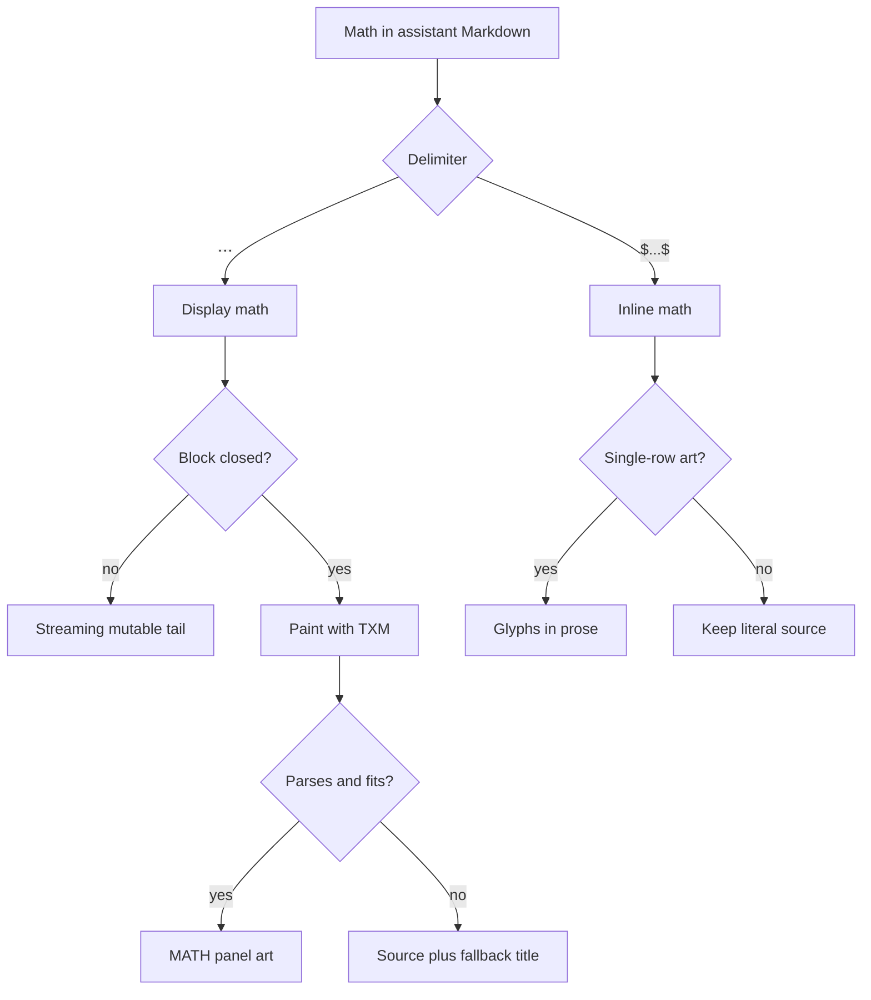

# Math rendering

Parent: [Interactive TUI](/interactive-tui).
Related: [Transcript display](/interactive-tui/transcript).

The interactive transcript paints a limited TeX subset (TXM) as terminal-native
Unicode art. Display math uses closed `$$ ... $$` blocks. Inline math uses
closed `$...$` spans when the art fits one text row.

This is not full LaTeX. HTML session exports still use KaTeX for a broader math
path; see [`/export`](/interactive-tui#commands).



## Display math

| Rule | Detail |
| --- | --- |
| Delimiters | Closed `$$ ... $$` outside code fences |
| Forms | Single-line `$$x^2$$` or a multi-line block with `$$` on its own open and close lines |
| Streaming | An open `$$` block stays a mutable tail until the closer arrives |
| Incomplete openers | A line like `$$partial` with no closer stays ordinary prose so dollars do not swallow the rest of the message |
| Code fences | `$$` inside fenced code stays literal source |
| Resize | Art is laid out again when the terminal or pane width changes |
| Copy | Panel `COPY` always copies the original TeX source, for art and fallbacks |

Examples:

```markdown
$$
\frac{a}{b} = c
$$
```

```markdown
$$\sqrt{x^2 + y^2}$$
```

## Inline math

Closed `$...$` spans in prose render through TXM only when the output fits one
terminal row. Taller formulas keep their literal source so no math is lost in
wrapped prose.

| Renders inline | Stays as source |
| --- | --- |
| Simple scripts (`x^2`, `a_i`) | Fractions (`\frac`) |
| Greek letters | Summation and integral limits |
| Common symbols | Mixed scripts such as `x_i^2` |

Dollar rules follow a Pandoc-style scan so currency stays literal:

- An opener needs a non-space, non-digit character after it (`$5` is not math)
- A closer needs a non-space character before it
- `$$` never opens an inline span
- Dollars inside code spans stay literal
- An open `$` holds the streaming preview like an open `**` until the span closes

Put tall formulas in `$$` display blocks instead of forcing them inline.

## What TXM supports

The TUI renderer targets a compact core, not full LaTeX:

| Works well | Prefer to avoid |
| --- | --- |
| `\frac`, `\sqrt` | `aligned`, `align`, `gather` |
| Sums and integrals | `\dfrac` |
| Greek letters | `\varepsilon` (use `\epsilon`) |
| `\mathbf`, `\mathrm` | `\leq`, `\geq`, `\neq` (use `\le`, `\ge`, `\ne`) |
| `matrix`, `bmatrix`, `pmatrix` | Very wide or multi-equation layouts |

Keep formulas compact. Prefer separate `$$` equations over large aligned blocks.

## Fallback titles

Display math Rho cannot paint stays readable as source. The panel border says
why:

| Border title | Meaning |
| --- | --- |
| `MATH · PANE TOO NARROW` | Needs a wider pane or terminal; resize may produce art |
| `MATH · TOO WIDE` | Rendered width exceeds the hard maximum even in a wide pane |
| `MATH · NOT RENDERED` | Blank input, parse failure, size limits, empty output, or other decline |

Very narrow panels drop the title text so the `COPY` action keeps its place.
Resizing can move a formula between art and source in both directions.

Inline math has no panel. When single-row art is not available, the original
`$...$` source stays in the prose.

## Limits

Hard caps protect the feed (approximate ceilings):

| Cap | Display | Inline |
| --- | --- | --- |
| Source bytes | 16 KiB | 256 bytes |
| Source lines | 256 | Single line only |
| Rendered lines | 128 | Exactly 1 accepted |
| Rendered width | 240 cells | 240 cells |

Over a display cap, the panel keeps the source and shows a fallback title. Over
an inline cap, or when art needs more than one row, the span stays literal
source text.

Rendering needs no external executable or network access.

## Writing math for the TUI

- Use closed `$$ ... $$` for anything taller than one row
- Keep display equations compact and separate
- Use inline `$...$` for short scripts, Greek, and symbols
- Leave currency and code dollars alone; the scanner already treats them as text

The agent system prompt uses the same guidance so model replies match what the
transcript can paint.

## Related

- [Transcript display](/interactive-tui/transcript) - scroll, copy, and Markdown
- [Mermaid diagrams](/interactive-tui/mermaid) - terminal diagram art
- [Interactive TUI](/interactive-tui)
- HTML export math via [`/export`](/interactive-tui#commands) (KaTeX)
