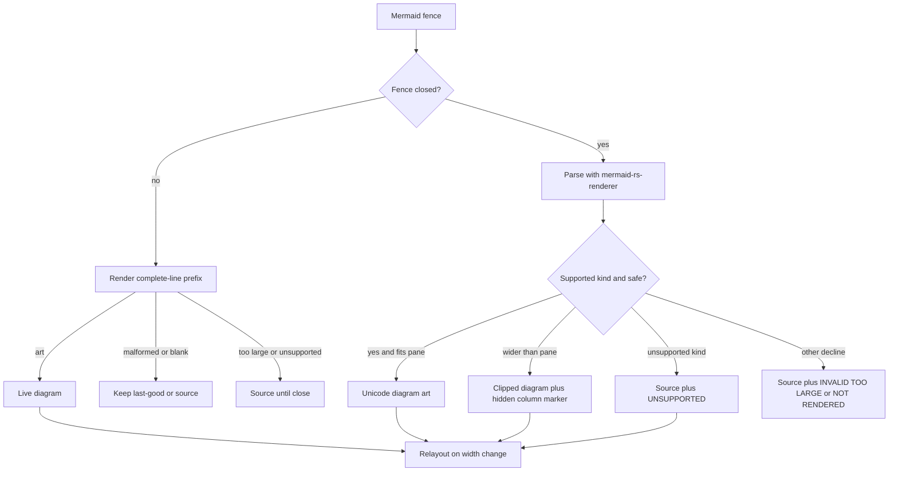
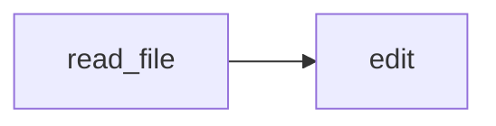

# Mermaid diagrams

Parent: [Interactive TUI](/interactive-tui).
Related: [Transcript display](/interactive-tui/transcript).

Closed fenced code blocks whose first info token is `mermaid` render as
terminal-native Unicode diagrams in the transcript. While the fence is still
open, each completed line repaints that prefix so nodes and edges appear as
they arrive. The same source also renders on the published docs site with
Mermaid.js, so one diagram works in both places.



## When a fence becomes a diagram

| Rule | Detail |
| --- | --- |
| Fence info | First token is `mermaid` (case-insensitive). Extra tokens after it are allowed |
| Streaming | Each completed line repaints the prefix. Valid prefixes show art immediately; a later bad line keeps the last good diagram. Closing the fence still decides the final panel |
| Resize | Art is laid out again when the terminal or pane width changes |
| Copy | Panel `COPY` always copies the original Mermaid source, for art and fallbacks |

Example:

````markdown

````

## What the terminal painter supports

Rho parses with `mermaid-rs-renderer` **0.3.1**. The terminal painter aims for
readable art on a core subset:

| Family | Terminal art |
| --- | --- |
| Flowcharts / graphs | Yes (core subset) |
| State diagrams | Yes (core subset) |
| Sequence diagrams | Yes (core subset) |
| Class diagrams | Yes (core subset) |
| Entity-relationship diagrams | Yes (core subset) |
| Pie, gantt, gitGraph, C4, mindmap, journey, timeline, and other kinds | Source fallback |

This is not full Mermaid.js syntax or visual parity. The painter prefers a
readable approximation over a source dump: styles are ignored, common shapes
map onto rectangle / round / diamond, parallel edges share a route with joined
labels, and a too-wide `LR`/`RL` flowchart retries as `TD`. Exotic families and
malformed input stay as source.

### Flow and state layout

Flowcharts and state diagrams keep the direction you asked for (`TD`, `LR`, and
so on) when it fits. When the normal layout is wider than the pane, Rho wraps
node labels and edge labels more tightly and lays the diagram out again, down
to a readable limit. Compaction never shortens or truncates node label text.
Edge labels wrap to a few stacked rows; group titles, and sequence participant
labels compact with an ellipsis when they cannot fit the reserved slot.
If a horizontal flowchart still cannot fit, Rho retries top-down. If even that
cannot fit, the diagram renders clipped at the pane's right edge with a
`MERMAID · CLIPPED` title and a marker row naming the hidden columns; `COPY`
still yields the full source. Only extremely narrow panes (under roughly 24
columns) fall back to source with a narrow-pane title.

## Fallback titles

Diagrams Rho cannot draw stay readable as source. The panel border says why:

| Border title | Meaning |
| --- | --- |
| `MERMAID · CLIPPED` | Art wider than the pane, cut at the right edge; marker row counts hidden columns |
| `MERMAID · PANE TOO NARROW` | Pane too narrow even for clipped art; resize may produce art |
| `MERMAID · UNSUPPORTED` | Kind or construct the terminal painter will not draw |
| `MERMAID · INVALID` | Source did not parse |
| `MERMAID · TOO LARGE` | Source, model, or painted output exceeded a hard cap |
| `MERMAID · NOT RENDERED` | Blank, unsafe, or other decline |

Very narrow panels drop the title text so the `COPY` action keeps its place.
Resizing can move a diagram between art and source in both directions.

## Safety and limits

Rendering:

- does not execute links or scripts
- needs no external executable or network access
- does not trust Mermaid-provided terminal styles
- strips or rejects unsafe content (for example script-like labels, `javascript:`
  URLs, and ANSI escapes in labels)

Hard caps protect the feed (approximate ceilings):

| Cap | Value |
| --- | --- |
| Source bytes | 64 KiB |
| Source lines | 2,048 |
| Primary entities | 128 |
| Relationships | 512 |
| Rendered lines | 4,096 |
| Rendered cells | 2,000,000 |

Over a cap, the panel keeps the source and shows `MERMAID · TOO LARGE`.

## Writing diagrams for the TUI

Prefer small graphs. Stick to flowchart, state, sequence, class, or ER shapes
when the diagram should paint in the terminal. Common extras such as `[(db)]`
nodes, `classDef`, sequence `alt`/`activate`, and long edge labels now paint
as approximations. Larger or exotic Mermaid families still ship as readable
source for copy-out and for the docs site.

The agent system prompt uses the same guidance for structure-heavy answers:
closed `mermaid` fences, small diagrams, wrap-friendly labels.

## Related

- [Transcript display](/interactive-tui/transcript) - scroll, copy, and Markdown
- [Math rendering](/interactive-tui/math) - terminal math art
- [Interactive TUI](/interactive-tui)
- Docs authoring in this repo also uses fenced `mermaid` blocks (VitePress +
  Mermaid.js on the site)
