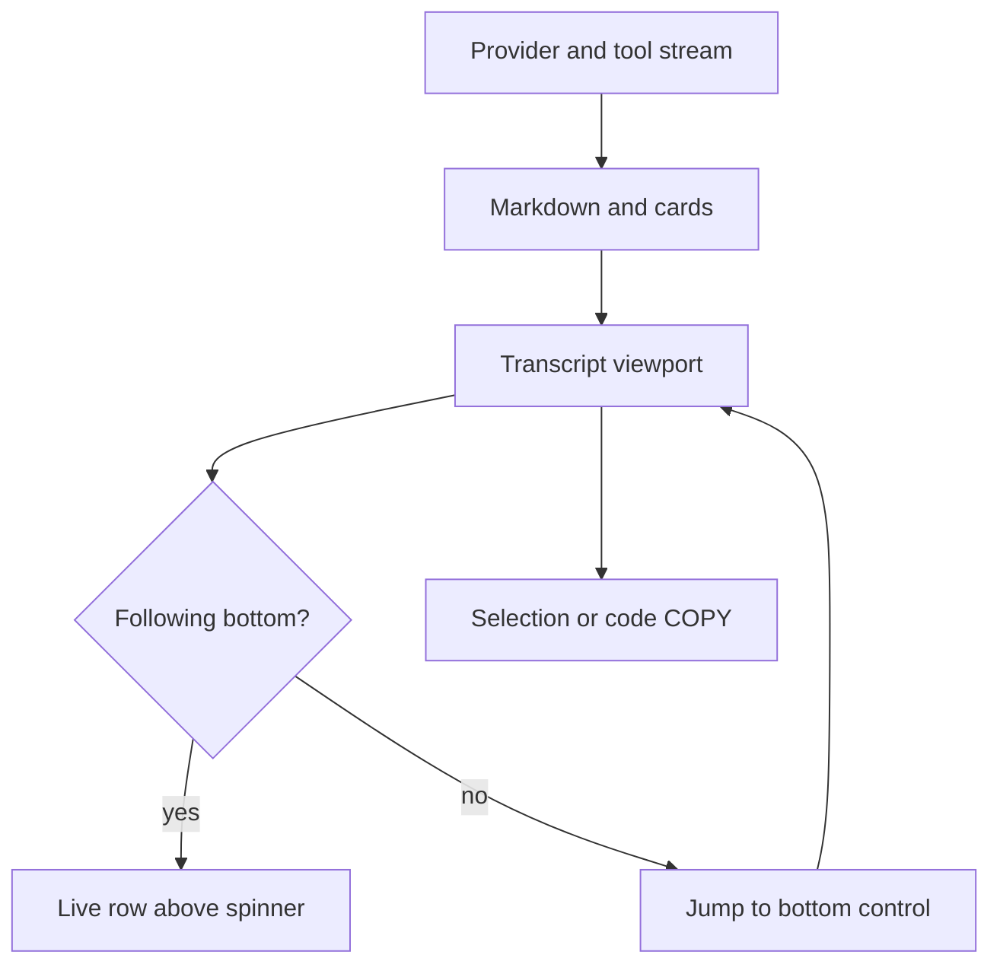

# Transcript display

Parent: [Interactive TUI](/interactive-tui).

The interactive TUI owns the transcript viewport while it is open. Scroll with
the built-in controls, not the terminal's scrollback. When you exit, your
previous shell view returns. If a session exists, Rho prints only a short
saved-session summary.

## Scroll and follow

| Control | Action |
| --- | --- |
| `pageup` / `pagedown` | Scroll the transcript viewport |
| Mouse wheel | Scroll the transcript viewport |
| `ctrl-end` (default) | Jump back to the live bottom |
| Left-click and drag | Select text; copy on release |

The jump binding is `keybindings.jump_to_bottom` in config (default `ctrl+end`).
It must differ from `open_editor`. Restart Rho after keybinding changes.

### Live bottom vs manual scroll

- **Following the bottom:** transcript content stops one row above the spinner
  so the activity rail stays clear.
- **Scrolled up:** the full last visible row stays drawn wherever the spinner
  and jump control are not painted.
- **Away from the bottom:** Rho overlays a right-aligned control such as
  `↓ jump to bottom  ctrl+end` on the last transcript row. Only that control's
  cells are covered.
- **While the spinner is up:** it is similarly overlaid on the left, including
  when the parent turn is idle but background agents or jobs remain.

Press the jump binding or click the button to resume following live output.

## Markdown and structure

Assistant Markdown renders in the feed as it streams.

| Feature | Behavior |
| --- | --- |
| ATX headings `#` … `######` | Syntax markers are dropped. Each level has its own color. H1–H3 use stronger emphasis |
| Code fences | Bordered blocks with a top-right `COPY` control that highlights on hover |
| Mermaid fences | Terminal diagram art when supported; see [Mermaid diagrams](/interactive-tui/mermaid) |
| Display and inline math | TXM Unicode art for closed `$$...$$` and single-row `$...$`; see [Math rendering](/interactive-tui/math) |
| Tables and ordinary Markdown | Wrapped to the pane width |

Heading-like text inside code fences, or invalid heading lines, stays literal.

## Copy

- `/copy` opens a tree-style picker of assistant outputs in the current
  conversation, grouped by user prompt. The latest output is selected initially.
  Use ↑/↓ or type to filter, preview the full text, then press Enter to copy.
  Esc closes without changing the clipboard or the conversation. The picker
  also works with `--no-save` and during a response, using the text available
  when it opened. Rho briefly shows how many characters were copied.
- Drag-select transcript text to copy it to the terminal clipboard. Rho briefly
  shows how many characters were copied.
- Code block, Mermaid, and math panel `COPY` actions sit in the top-right border
  and highlight on hover. For Mermaid and math, `COPY` always copies the
  **source**, not the rendered art.
- Click without drag does not copy. The code-block copy control is excluded
  from drag selection so a click on `COPY` does not grab neighboring text.

## Stream idle timeout

Provider streams that deliver no meaningful payload for **two minutes** are
treated as stale. Keep-alives such as SSE pings do not reset that timer. Rho can
then surface a stream-idle error and leave the stuck `working` state instead of
waiting forever.

Connection setup uses its own connect timeout. Non-streaming HTTP requests are
not bound by the two-minute stream idle rule.

## Display modes

`show_reasoning_output` controls whether reasoning text appears. It defaults to on. Rho keeps received reasoning text when it is hidden. Changing the setting from `/config` shows or hides reasoning through the current transcript, including earlier turns and the live response.

When reasoning is hidden, the TUI shows `Thinking...` until that phase finishes, then a `Thought for …` summary. When reasoning is shown, the same summary follows the reasoning block. Durations use a compact format such as `3.2s`, `2m 5s`, or `1h 2m`.

If a response interleaves answer text and reasoning, Rho keeps those segments in arrival order. Hidden reasoning leaves its `Thought for …` receipt between answer segments. Zen mode hides that receipt too. Toggling either setting does not merge or reorder stored segments.

`zen_mode`, under `/config` → **Appearance**, hides tool cards, reasoning blocks, and the `Thinking...` placeholder so the transcript shows message text. The [activity rail](/interactive-tui/activity) stays visible. Tools and reasoning still run. The status row displays `zen`. The setting applies immediately, including during the current turn.

Image thumbnails from `read_file` paint in supporting terminals. Details:
[Documents and images](/tools-workspace/documents-and-images).

## Exit

Leaving the TUI restores the prior shell view. Session data stays on disk under
the [sessions](/sessions) layout. Export a transcript with `/export` or
`rho sessions export`.

## Related

- [Mermaid diagrams](/interactive-tui/mermaid)
- [Math rendering](/interactive-tui/math)
- [Attachments](/interactive-tui/attachments)
- [Interactive TUI](/interactive-tui) - shortcuts and commands
- [Keybindings example](/configuration/full-example)
