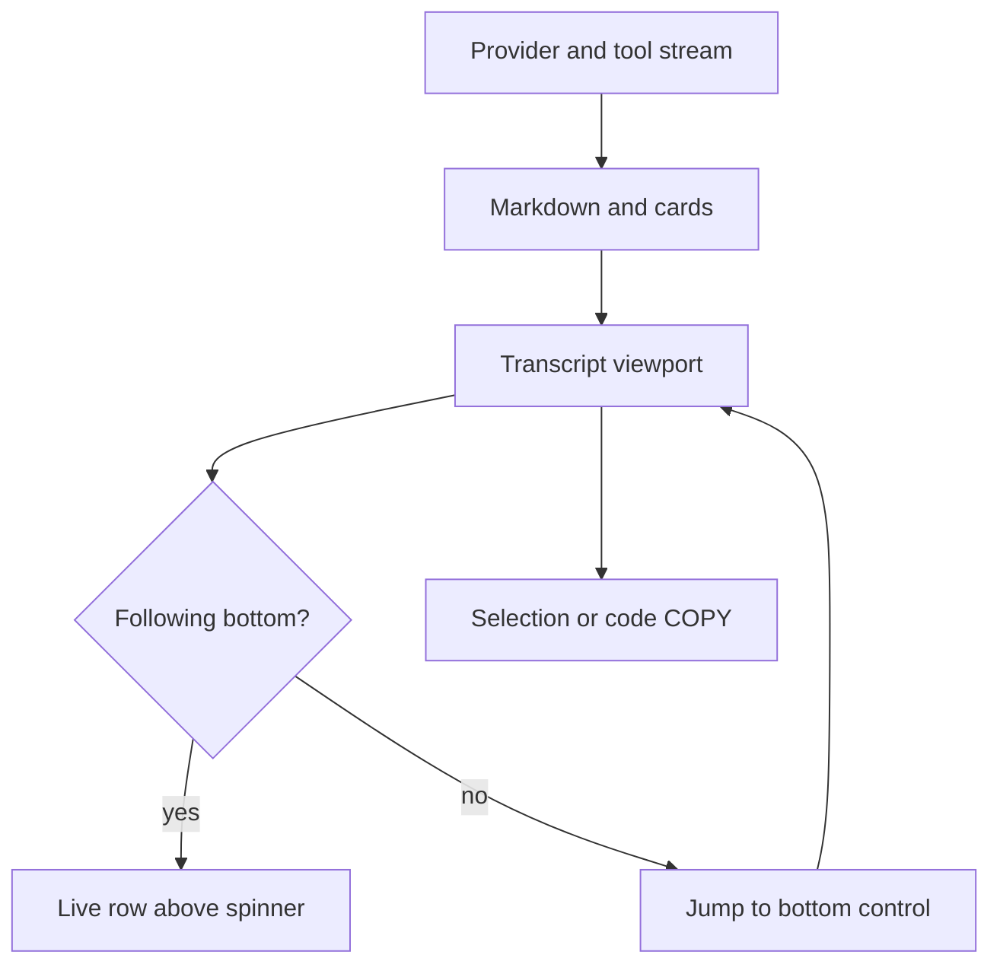

# Transcript display

Parent: [Interactive TUI](/interactive-tui).

The interactive TUI owns the transcript viewport while it is open. Scroll with
the built-in controls, not the terminal's scrollback. When you exit, your
previous shell view returns. If a session exists, Rho prints only a short
saved-session summary.

## Scroll and follow

| Control | Action |
| --- | --- |
| `pageup` / `pagedown` | Scroll the transcript viewport |
| Mouse wheel | Scroll the transcript viewport |
| `ctrl-end` (default) | Jump back to the live bottom |
| Left-click and drag | Select text; copy on release |

The jump binding is `keybindings.jump_to_bottom` in config (default `ctrl+end`).
It must differ from `open_editor`. Restart Rho after keybinding changes.

### Live bottom vs manual scroll

- **Following the bottom:** transcript content stops one row above the spinner
  so the activity rail stays clear.
- **Scrolled up:** the full last visible row stays drawn wherever the spinner
  and jump control are not painted.
- **Away from the bottom:** Rho overlays a right-aligned control such as
  `↓ jump to bottom  ctrl+end` on the last transcript row. Only that control's
  cells are covered.
- **During generation:** the spinner is similarly overlaid on the left.

Press the jump binding or click the button to resume following live output.

## Markdown and structure

Assistant Markdown renders in the feed as it streams.

| Feature | Behavior |
| --- | --- |
| ATX headings `#` … `######` | Syntax markers are dropped. Each level has its own color. H1–H3 use stronger emphasis |
| Code fences | Bordered blocks with a top-right `COPY` control that highlights on hover |
| Mermaid fences | Terminal diagram art when supported; see [Mermaid diagrams](/interactive-tui/mermaid) |
| Tables and ordinary Markdown | Wrapped to the pane width |

Heading-like text inside code fences, or invalid heading lines, stays literal.

## Copy

- Drag-select transcript text to copy it to the terminal clipboard. Rho briefly
  shows how many characters were copied.
- Code block and Mermaid panel `COPY` actions sit in the top-right border and
  highlight on hover. For Mermaid, `COPY` always copies the **source**, not the
  box art.
- Click without drag does not copy. The code-block copy control is excluded
  from drag selection so a click on `COPY` does not grab neighboring text.

## Stream idle timeout

Provider streams that deliver no meaningful payload for **two minutes** are
treated as stale. Keep-alives such as SSE pings do not reset that timer. Rho can
then surface a stream-idle error and leave the stuck `working` state instead of
waiting forever.

Connection setup uses its own connect timeout. Non-streaming HTTP requests are
not bound by the two-minute stream idle rule.

## Display modes

`zen_mode` (under `/config` → **Models & reasoning**) hides tool cards,
reasoning blocks, and the `Thinking...` placeholder so the transcript shows
message text. The live activity rail and subagent rows stay visible. Tools and
reasoning still run; only their transcript display is suppressed. The setting
applies immediately, including during the current turn.

Image thumbnails from `read_file` paint in supporting terminals. Details:
[Documents and images](/tools-workspace/documents-and-images).

## Exit

Leaving the TUI restores the prior shell view. Session data stays on disk under
the [sessions](/sessions) layout. Export a transcript with `/export` or
`rho sessions export`.

## Related

- [Mermaid diagrams](/interactive-tui/mermaid)
- [Attachments](/interactive-tui/attachments)
- [Interactive TUI](/interactive-tui) - shortcuts and commands
- [Keybindings example](/configuration/full-example)
