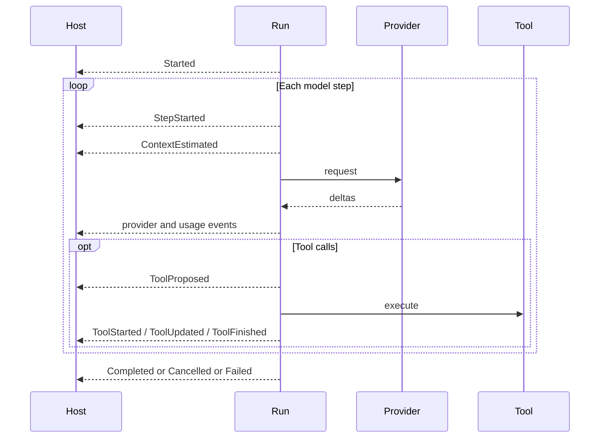

# SDK events, retries, cancellation, drop, and shutdown

This page defines the implemented behavioral contract hosts should rely on. It also documents a [known limitation](#known-limitations) around terminal-event delivery on non-cooperative exits. Always treat `Run::outcome` as authoritative.

## Event ordering and buffering

Each run owns one bounded multi-producer/single-consumer event channel. Capacity defaults to 64 and can be configured to another nonzero value with `RhoBuilder::event_capacity`.

Events for a run are observed in the order the runtime sends them. A normal stream begins with `Started`, then emits step, provider, tool, host-input, usage, and compaction facts as they occur. Rendering is a host concern; events are not terminal-formatted lines.

When the channel is full, runtime event production waits. This bounded backpressure prevents an unbounded queue but means a host that stops consuming can pause provider/tool orchestration. A host can call `Run::outcome` without manually draining all events because `outcome` drains unread events while waiting for the worker.

Hosts must match `RunEvent` with a wildcard because it is non-exhaustive. Delta chunk boundaries are not stable. Concatenate text only for display; use the terminal `RunOutcome` as authoritative final content.

## Lifecycle sequence

A cooperative run emits ordered facts, then one terminal event when delivery
succeeds. Always treat `Run::outcome` as authoritative.

### Ordering rules

1. `Started` is first and includes the starting revision.
2. Each provider loop emits `StepStarted` before that step's provider activity.
3. Immediately after `StepStarted`, the runtime emits `ContextEstimated` with a provider-neutral token estimate of the request history and tool schemas. Hosts should treat this as a display estimate and replace it when `UsageUpdated` reports provider input.
4. Provider deltas, tool-call assembly, usage, activity, and context updates retain source arrival order.
5. A complete tool call emits `ToolProposed` before execution.
6. An available tool emits `ToolStarted`, zero or more `ToolUpdated`, then exactly one `ToolFinished`.
7. An unavailable tool emits `ToolFinished` with `Unavailable` and no `ToolStarted`.
8. Calls in one model response may overlap. All `ToolProposed` events keep model order, while start, update, host-input, and finish events from different calls may interleave.
9. Every per-call event and host-input request carries its `ToolCallId`. Within one available call, `ToolStarted` precedes all `ToolUpdated` events and one `ToolFinished` ends the call.
10. The runtime holds completed results in model-order slots. Provider history and persisted history do not use finish order.
11. Automatic compaction emits `CompactionStarted` before calling the compactor and `CompactionCompleted` only after committing replacement history.
12. A run that reaches a normal cooperative terminal path emits one of `Completed`, `Cancelled`, or `Failed`.

### Terminal authority

A terminal event describes the worker result, but `Run::outcome` remains the authoritative typed result channel. `Completed` contains the same successful outcome. Cancellation returns `Error::Cancelled`. Failure returns the typed `Error`; the event contains sanitized text and retryability for observation.

One coordinator consumes run commands for the whole tool batch. It queues concurrent host-input requests by ID, rejects any ID reused within the batch, and keeps the session in `WaitingForHostInput` while any request remains. Steering accepted during a batch crosses into history only after every result slot closes.

The implementation does not guarantee a terminal event for every worker exit; see [known limitations](#known-limitations). Run drop/abort, task panic, failed terminal delivery, and some cancellation or persistence-error races around nonterminal event emission can close the channel without `Completed`, `Cancelled`, or `Failed`. Hosts must treat end-of-stream as "inspect `Run::outcome`," not infer success.

## Model-call performance metrics

`ModelCallCompleted.metrics.output_tokens` keeps the provider's aggregate output
total for 1.x compatibility. When the provider reports a reasoning-token
breakdown, the runtime emits a `ProviderActivity` immediately before
`ModelCallCompleted`. Its kind is
`PROVIDER_ACTIVITY_GENERATION_OUTPUT_TOKENS`, and its decimal `detail` is the
aggregate output total minus reasoning tokens. The built-in TUI uses that value
as the numerator for generation and response speed. If the provider does not report a breakdown, it uses the aggregate total
unless reasoning is known to have occurred: the request enabled hidden
reasoning (for example Poolside thinking on by omission), or reasoning
tokens streamed without a usage split. In those cases the runtime emits the
same activity with a null token count so the TUI treats generation
throughput as unavailable rather than deriving it from aggregate output.

This does not change usage or billing. `UsageUpdated.usage.output_tokens`,
`ModelCallCompleted.metrics.output_tokens`, and
`RunOutcome::usage().output_tokens` all keep the provider's full output total,
including billable reasoning tokens. The activity carrier is a minor-compatible
bridge. A future major release will replace it with an explicit performance
metric.

## Host input and steering

`Run::steer` sends an additional user input to the active run and waits until the worker accepts it. Accepted steering is incorporated at a model-step boundary. It does not mutate completed history independently.

`Run::steer_retractable` is the same acceptance path but returns a `SteeringId`. While the input is still staged (provider streaming or tools running), the host may call `Run::retract_steering`. The runtime decides the race atomically and returns `SteeringRetraction::Retracted`, `AlreadyApplied`, or `NotFound`. Prefer retractable steering when the UI lets users pull back queued steer text.

`ToolHostInputRequested` moves the session into `WaitingForHostInput` and includes the owning tool call ID. The legacy `HostInputRequested` variant remains available for source compatibility. `Run::respond` validates a response and delivers it to a matching pending request exactly once. When no requests remain, the session returns to running. A response can fail because the ID is unknown, the shape is invalid, the requester was dropped, or the run no longer accepts commands.

## Retry contract

The core runtime retries a model turn when either of these conditions occurs:

- The normalized assistant response is malformed. At most two malformed responses are accepted within the turn budget.
- The provider returns a `ProviderError` classified as retryable. Retryable failures use exponential delays of 1, 2, and 4 seconds. When the provider supplies `Retry-After`, the runtime waits the greater of that hint (capped at 60 seconds) and the exponential delay so short provider waits are honored without stalling interactive sessions on multi-hour quota resets.

A model turn makes at most four logical provider requests in total. Malformed responses and retryable provider failures share that bound. Permanent provider failures are returned immediately. Cancellation interrupts both an active request and a retry delay.

Before retrying, the runtime emits `ProviderStreamReset` with a structured reason. When the provider supplies a wait hint, that reason is `RetryableFailureWithRetryAfter` (otherwise `RetryableFailure`). Prefer the `provider_error_kind` / `retry_after` helpers when matching so both arms stay covered. `NEXT_MAJOR(rho-sdk): collapse RetryableFailure and RetryableFailureWithRetryAfter into one shape with optional retry_after` (or move `retry_after` onto the event). For a malformed response, it also emits the legacy `ProviderActivity` kind `invalid_response_retry` immediately before that reset. Any text, reasoning, or tool-call deltas emitted since the preceding model-step boundary belong to the abandoned attempt. Hosts rendering live output must discard that attempt before rendering subsequent deltas. Usage reported by the abandoned attempt remains billable and is recorded as a separate physical request; hosts should retain it when presenting cumulative usage. The terminal `RunOutcome` contains usage from the successful response. The Rho TUI and headless reporter handle the reset. Rate-limit failures include a `/limits` pointer in the sanitized error message so hosts can direct users to usage windows.

Retryable physical provider request failures emit typed `ProviderRequestRetry` and, for minor-compatible hosts, still dual-emit the legacy `ProviderActivity` kind `provider_request_retry`. Provider-native web search emits typed `WebSearch { detail }` and dual-emits legacy `ProviderActivity` kind `web_search`. Other provider-native hosted tools (for example xAI `x_search` and `image_generation`) are carried on the provider stream via `ModelEvent::hosted_tool_activity` and lowered to typed `RunEvent::HostedToolActivity { name, detail }` only — new activity kinds do not mint legacy `ProviderActivity` dual-emits. New hosts should match the typed run-event variants; the legacy activity kinds and `ProviderActivity` itself are deprecated and will be removed in the next major release.

Automatic retries repeat the model request with the same immutable history. They do not rerun tools completed by earlier model turns, but they can repeat provider-side work and incur usage for every attempt. Hosts should use recorded physical-request usage for billing and auditing rather than assuming one provider request per model turn.

Tool-reported failures are returned to the model as tool results, so they can lead to another model step without being an SDK transport retry. The model loop ends with a permanent invalid-response error when it exceeds the configured step count.

## Cancellation contract

`Run::cancel` and `Run::cancellation_handle` request cooperative cancellation. Token clones shared with providers, tools, host input, approvals, and automatic compaction observe the same idempotent state. Cancelling one token clone cancels the run; merely dropping a token clone does not.

The runtime races cancellation against provider work, tool work, authorization, compaction, host-input waits, and event sends. Extension implementations must still stop and clean up any child resources they create when their future is dropped or token is cancelled.

When cancellation reaches the cooperative cancellation completion path:

- the runtime stops new model/tool work
- recoverable candidate history is committed
- partial provider output may become `AbortedAssistant`
- raw reasoning is discarded
- the revision increments
- `Cancelled { revision }` is emitted when delivery succeeds
- `Run::outcome` returns `Error::Cancelled`

Cooperative terminal failures (for example a permanent provider/SSE error after retries are exhausted) use the same history commit path:

- recoverable candidate history is committed
- partial provider output may become `AbortedAssistant`
- the revision increments
- `Failed { message, retryability }` is emitted when delivery succeeds
- hosts that need the post-commit revision should read `Session::revision` after the run ends. `NEXT_MAJOR(rho-sdk): add revision to RunEvent::Failed so cooperative failure commits match Cancelled { revision }`
- `Run::outcome` returns the typed error

Event-consumer interrupts still leave uncommitted candidate history uninstalled; see [Persistence and event-consumer failures](#persistence-and-event-consumer-failures).

Cancellation can race with event delivery or other failing work; see [known limitations](#known-limitations). In those cases, `Run::outcome` can still report cancellation or interruption without a cancellation commit or terminal event.

Cancellation is not rollback. A tool or remote provider may have completed an external side effect before observing cancellation. During a tool batch, cancellation preserves already completed result slots and writes a deterministic interrupted result for every unresolved call, including calls cancelled during preparation. Design tools for idempotency and record enough operation identity for reconciliation.

## Drop contract

Dropping an unfinished `Run` requests cancellation and aborts its worker task. The worker guard unregisters the run and returns the session to idle when task destruction completes. Because abortion can prevent the cooperative cancellation commit, run drop does not promise an `AbortedAssistant`, a revision increment, a terminal event, or persistence of partial output. No consumer remains to observe events after the run handle is dropped.

Dropping `Session` or one `Rho` clone does not shut down work still owned by other clones. Dropping the runtime handle is a safe memory/resource fallback, not coordinated application shutdown. Host-owned tasks launched outside the SDK are the host's responsibility.

## Persistence and event-consumer failures

A failure to send a nonterminal event because the consumer is gone interrupts the run. Uncommitted candidate history is not installed. A compaction that already committed remains installed. Events are observational and are not a durable audit log. If events must survive process failure, the host must persist them with its own sequence, transaction, retention, and redaction policy.

The SDK does not automatically persist after each event or commit. See [persistence atomicity](/sdk/sessions-and-persistence#store-and-atomicity-responsibilities).

## Shutdown contract

`Rho::shutdown` is synchronous and idempotent:

- the first call marks the shared runtime lifecycle shut down
- it requests cancellation on all currently registered runs and compactions
- it reports how many runs were registered at that moment
- later calls return a zero/default outcome
- new sessions and runs are rejected with `RuntimeShutdown`
- clones share the same shutdown state

Shutdown requests cancellation but does not asynchronously join every extension-owned child resource. Continue draining owned runs or wait on their outcomes as appropriate, and separately close provider clients, durable stores, process supervisors, and telemetry exporters owned by the host.

## Session state visibility

`SessionState` exposes `Idle`, `Running`, `WaitingForHostInput`, `Cancelling`, `Completed`, and `Failed`. `Completed` and `Failed` remain observable after the worker exits; a later run may transition either terminal state back to `Running`. Cancelled runs return to `Idle` after cleanup. These values are lifecycle observations, not a lock token. Use run outcomes and revisions for durable decisions rather than polling state for event reconstruction.

## Known limitations

The runtime does not guarantee delivery of exactly one terminal event (`Completed`, `Cancelled`, or `Failed`) for every run. This remains part of the public contract until a future release documents a deliberate change.

- Dropping an unfinished `Run` aborts its worker task without sending a terminal event onto the channel.
- The worker task is not panic-guarded; a panic inside run execution surfaces to `Run::outcome` as `Error::Interrupted` from a `JoinError`, with no corresponding event.
- Terminal event delivery at the normal completion/failure/cancellation sites is best-effort: if the consumer or channel is gone, the send is silently dropped.

No shipped test asserts "exactly one terminal event" across drop, abort, or panic paths; existing tests only cover the ordinary success and cancellation streams.

Hosts must not rely on stream end-of-file to infer a run's result. Always call `Run::outcome` (or check `Session::history`/`SessionState` after a run ends) for the authoritative outcome, and do not treat a missing terminal event as evidence of success or failure. Any future guarantee will be called out in the [changelog](/sdk/changelog) as a behavioral change, not a silent patch.
