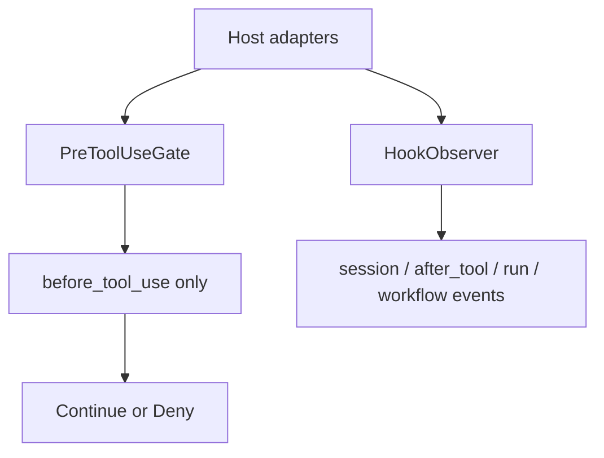
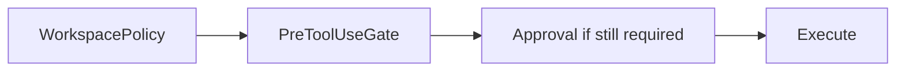

# SDK hooks

Typed lifecycle hooks let a trusted host observe what a run does and, for one pre-action event, deny a tool capability. They are an enforcement and observation layer, not a workflow engine and not a permission grant.

The SDK owns the generic machinery in `rho_sdk::hooks`: event kinds, bounded `HookEnvelope` values, `HookDecision`, payload bounds, and the two host extension points. It owns no hook configuration file, process spawning, or trust policy. Those stay with the host (the Rho app uses `hooks.toml` and external programs; an embedder can implement gates and observers in-process).

## Extension points

Wire hooks on `RhoBuilder` or `ToolHostBuilder`:

| Builder method | Role |
| --- | --- |
| `hook_observer_shared` | Receives every delivered observational event. Must enqueue and return rather than do long work inline. |
| `pre_tool_gate_shared` | Consulted on the authorization path after `WorkspacePolicy::evaluate` and before any approval await. May only keep the current decision or make it stricter. |
| `hook_payload_bounds` | Field and envelope size limits (defaults are 8 KiB per field and 64 KiB per envelope). |
| `hook_delegation` | Marks whether the run is a root or delegated child for envelope identity. |
| `hook_host_labels` | Generic non-secret string labels for host correlation IDs. |

- `PreToolUseGate` answers `before_tool_use` once. That event is not also sent to the observer.
- `HookObserver` receives the other delivered kinds (`session_started`, `after_tool_use`, run and session completion/failure, and workflow-related kinds when the host emits them through the same machinery).

## Composition with host policy

Hooks sit after host policy and can only keep or tighten the decision.

| Host policy | Hook result | Outcome |
| --- | --- | --- |
| `Deny` | not called | deny (policy) |
| `RequireApproval` | `Continue` | approval still required |
| `RequireApproval` | `Deny` | deny before the prompt |
| `Allow` | `Continue` | execute |
| `Allow` | `Deny` | deny |

Hooks never loosen policy. They cannot turn a denial into an allow.

## Payload safety

Envelopes carry structured capability facts built from the request the host policy already saw, not scraped free-form argument prose alone. Paths and shell command text are included so a deny gate can inspect them. `after_tool_use` carries that summary for the first request the call passed to authorize, including policy denials, and `null` when the call never authorized. Credentials, authorization headers, environment values, and URL query strings are not included.

Every envelope reports shortened fields in `HookTruncation`. Host labels use the same field and envelope bounds. Do not put prompts, credentials, environment values, or tool output in labels. The `host_labels` wire field is part of hook schema version 2 (`HOOK_SCHEMA_VERSION`).

## Testing helpers

`rho_sdk::hooks::testing` builds sample envelopes and pre-tool requests for unit tests without standing up a full run.

## Related

- App-facing hook programs and `hooks.toml`: [Hooks](/hooks)
- Authorization path and approvals: [Tools](/sdk/tools)
- Security defaults: [Security model](/sdk/security)
