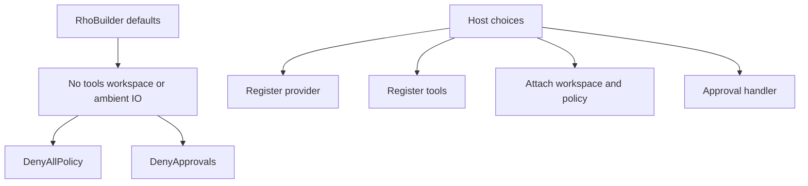
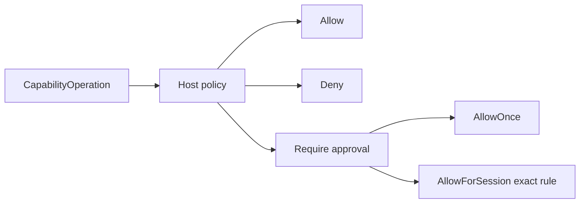
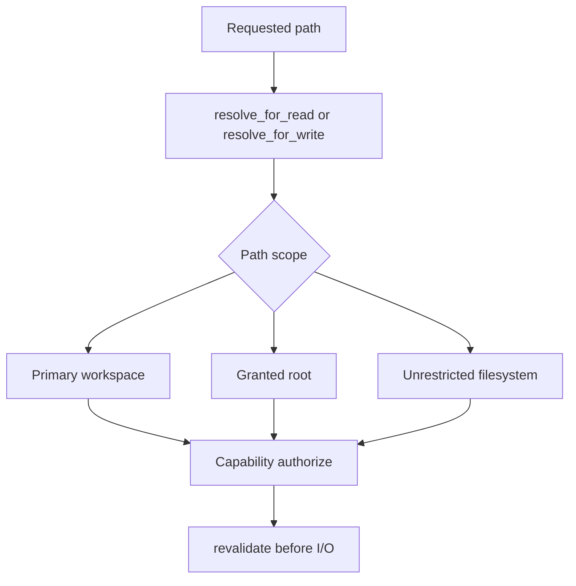

# SDK security model

## Default-deny authority

The security model is explicit authority with no sensitive capability granted by default. The current builder already defaults to:

- no filesystem, process, network, web, skill, or coding tools
- no workspace
- `DenyAllPolicy` for capability requests
- `DenyApprovals` when no approval handler is supplied
- no environment-variable reads
- no Rho config or session discovery
- no OS credential-store or keychain access
- no writes to `~/.rho`
- no terminal access, update checks, or global logging setup
- no built-in production provider or implicit network client

A provider is required because a runtime without a provider cannot execute, but constructing and registering it is a host decision. A custom provider or tool is trusted in-process code and can exercise whatever authority the host process and operating system grant it. SDK policy is not a sandbox for malicious Rust code.

### Rho application defaults differ

The default-deny posture above applies to external SDK embedders. The shipped Rho CLI, automation mode, and interactive TUI enable unrestricted path resolution, while the selected [permission mode](/configuration#permission-modes) controls capability authority. `auto` allows requests, `plan` denies writes and process execution, and `supervised` asks before those actions. Supervised non-interactive runs fail closed. Built-in tools still run with the current process's operating-system rights, so do not treat these controls as a sandbox. Hosts that need tighter controls must embed the SDK with an explicit workspace and policy.

## Capability model

Sensitive operations are represented as separate `CapabilityKind` values for path reads, path writes, process execution, network access, skill loading, and instruction discovery. A request also records whether it came from host-provided code, a built-in adapter, or prompt construction. A host policy returns allow, deny, or require approval. Defaults deny.

Security decisions are made from `CapabilityOperation`, not model prose, shell display strings, tool names, or presentation metadata. Process requests include cwd, shell versus direct execution, executable lookup, arguments, environment inheritance, timeout, and output bounds. Built-ins declare their origin and capability classes in diagnostics. Host-provided tools remain trusted in-process code.

An approval can be one-shot or remembered for the exact structured request in the current session. Remembered rules never override the current policy and are not persisted. Sanitized approval audit records contain only sequence, capability class, and decision. Reasons and operation details are excluded.

## Workspace scope

A `Workspace` stores a canonical primary root and optional canonical roots deliberately attached by the host. A host can instead opt into unrestricted file paths. Path scopes control resolution; they do not grant capability authority.

Read resolution requires an existing canonical target. Write resolution canonicalizes either the target or its nearest existing parent. Both return a `ResolvedWorkspacePath` with primary-workspace, granted-root, or unrestricted-filesystem scope. Built-ins authorize that object, revalidate it immediately before I/O, and use its canonical path.

By default, parent traversal is rejected even when it would normalize back inside, absolute paths must be under the primary or an attached root, and symlinks outside configured roots fail. `Workspace::with_unrestricted_file_access` permits parent traversal and absolute paths, but paths outside the primary workspace retain unrestricted-filesystem scope and still require policy authorization. Missing reads fail; missing writes have an explicit state.

These controls narrow normalization and check/use disagreement but cannot eliminate every mutable-filesystem race. Use descriptor-relative safe-open techniques or OS sandboxing where stronger guarantees are required. Process working directories and instruction/skill discovery must use the same resolved workspace rules.

Detailed path, process, and network limitations are in [tools and workspaces](/sdk/tools).

## Credentials

The SDK does not define credentials as session fields and never includes them intentionally in snapshots. Hosts and adapters must:

- inject credentials rather than rely on ambient global lookup
- keep lookup opt-in and provider-specific
- use secret wrappers with redacted `Debug`
- avoid copying secrets into model identity, endpoint URLs, tool arguments, metadata, events, diagnostics, or error messages
- strip authorization headers, cookies, signed query strings, raw upstream payloads, and environment values from errors and traces
- rotate and revoke credentials outside session persistence
- avoid forwarding provider credentials to tools

Environment variables and OS credential stores are application adapters, not an SDK default. The Rho CLI's behavior is documented separately in [authentication and models](/authentication-and-models).

## Content and persistence sensitivity

Treat all of these as potentially sensitive:

- system prompts and discovered instructions
- user, assistant, and reasoning-summary content
- image bytes
- tool schemas, arguments, output, paths, commands, diffs, and URLs
- host questions and answers
- provider identity and opaque provider-native context
- usage and cost records
- snapshot metadata

Raw reasoning is ephemeral and excluded from completed assistant persistence. Snapshot import and construction clear the raw reasoning field of aborted assistant records. This narrow rule does not make snapshots safe to log or share.

Snapshots require the host's access control, encryption, retention, backup, deletion, and export policy. Events and diagnostics require separate logging policy. Neither is an audit log by default.

## Prompt and model trust

Prompts, repository instructions, tool output, web content, and provider output are untrusted data. Prompt instructions can attempt to obtain credentials, broaden authority, misrepresent paths, or persuade the host to approve dangerous work. The model is not a policy engine.

Enforce security outside the prompt:

- capability checks in tool code
- canonical path and process/network policy
- schema validation and resource limits
- explicit host approvals
- separate secret storage
- operating-system sandboxing where needed
- deterministic audit records generated by the host, not the model

A system prompt can explain constraints but cannot replace enforcement.

## Events and display

Semantic events may carry sensitive model and tool content. Hosts should:

- handle non-exhaustive future variants safely
- avoid routing default final-answer output and diagnostics to the same stream unintentionally
- redact before logging or telemetry, not after ingestion
- cap rendered and stored output independently
- avoid rendering opaque provider context
- label provider activity and tool metadata as untrusted text
- avoid terminal/control-sequence injection in UI adapters

`Debug` is not a redaction API. Many public content values intentionally derive `Debug` for development and will print their content. Follow the [redaction audit procedure](/sdk/redaction-audit) before enabling production logs.

## Cancellation and shutdown security

Cancellation limits continued work but cannot undo an external side effect. One cancellation boundary covers a parallel tool batch: queued calls do not start, authorizing and running calls receive cancellation, and the coordinator cleans up its workers before returning. Provider-required result slots that did not finish receive deterministic interrupted results in model order.

Tool implementations must bind subprocess groups, HTTP requests, approval waits, and child tasks to cancellation and cleanup. Scheduler access ends when a tool invocation returns. It does not cover a background process, subagent, task, callback, or remote action that keeps working afterward. Tools that start such work should remain exclusive unless their manager and full background lifetime have a separate safe model. A dropped run aborts its SDK worker and may skip partial-history recovery. Explicit shutdown requests cancellation for registered runs, but hosts must still close resources they own.

See the exact [cancellation, drop, and shutdown contract](/sdk/events-and-cancellation).

## Reporting security issues

Do not include credentials, private snapshots, provider payloads, or proprietary prompts in a public issue. Use the repository's private security-reporting channel if one is published. If no private channel is available, contact the maintainers without exploit details and request a secure path before sharing sensitive material.

This page documents the security model. It is not a claim that an independent security audit has been completed. The maintained analysis is the [threat model](/sdk/threat-model), and release evidence must follow the [redaction audit procedure](/sdk/redaction-audit).
