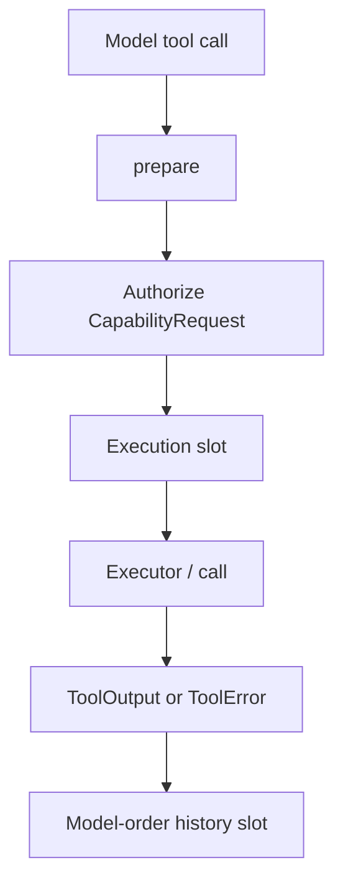
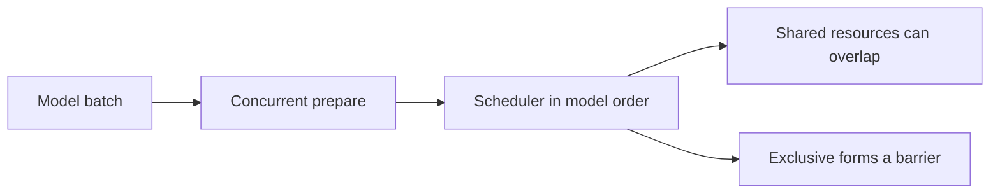
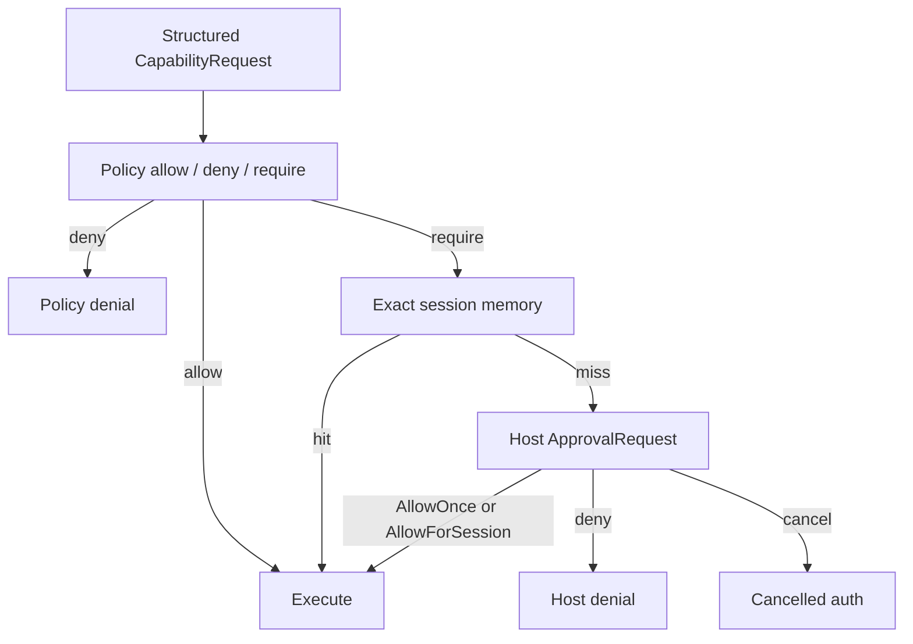

# SDK tools, workspaces, and approvals

Tools are host-supplied or built-in adapters that the runtime can call. Authority stays default-deny until the host registers tools and grants structured capabilities.



## Tool contract and trust origin
A tool receives a `ToolInvocation` and a `ToolContext` containing cancellation, bounded progress, optional workspace, policy, approval, and host-input access. It returns `ToolOutput` or `ToolError`. Failures normally become failed tool results sent back to the model, while hosts observe a typed `ToolFinished` result.

`Tool::security` distinguishes two trust models:

- `ToolOrigin::HostProvided` is the default. It is trusted in-process host code, and SDK policy cannot sandbox it if it ignores `ToolContext`.
- `ToolOrigin::BuiltIn` declares the read, write, process, network, skill, or instruction-discovery classes the adapter enforces.

`DiagnosticsSnapshot::tools` exposes the origin and declared classes. In particular, a host can distinguish a network-capable built-in from a host-provided tool. A declaration is inspectable policy metadata, not an operating-system sandbox.

The SDK does not validate JSON against a tool schema before invocation. Implementations must deserialize hostile model output, reject unknown or ambiguous inputs, and cap resource use.

## Preparation and parallel execution



`Tool::prepare` validates and resolves an invocation once, before scheduling. Preparations within one model batch run concurrently and their outputs return to the scheduler in model order. The default implementation wraps `Tool::call` with `ToolExecutionPolicy::Exclusive`, so existing and custom tools stay source-compatible and run alone. Tools must opt in before the runtime overlaps them.

A resource-aware tool returns `PreparedToolInvocation::resource_aware` with:

- every structured `CapabilityRequest` needed by the invocation;
- a `ToolResourceAccess` list;
- start metadata; and
- a one-use executor that owns the parsed arguments and resolved state.

The coordinator authorizes the declared requests before consuming an execution slot. The executor receives `AuthorizedToolContext`, which has cancellation, progress, host input, and workspace access, but no authorization method. A tool that cannot declare all authority before execution must remain exclusive and use `ToolContext`.

Each access is `Shared` or `Exclusive`. Shared access can overlap shared access to the same resource. Any exclusive access conflicts with shared or exclusive access to an overlapping resource. Resource kinds cover canonical workspace paths, directory trees and membership, managed process IDs, session or manager state, response-store IDs, and namespaced opaque keys. Opaque keys must use a stable owner namespace. Resource values are omitted from `Debug` output.

Filesystem tools must build resources from the same `ResolvedWorkspacePath` retained for execution. Resolve with `resolve_for_read` or `resolve_for_write`, declare access to its canonical path and any directory scope, then call `Workspace::revalidate` on that object just before I/O. Do not turn it back into an unchecked argument string or resolve it a second time.

`RhoBuilder::max_parallel_tools` sets a required nonzero limit and defaults to one. The limit bounds active execution, not approval waits. Independent eligible calls can run up to the limit. Conflicting calls run in model order, and an exclusive call forms a model-order barrier. Results still enter provider and persisted history in model order.

## Async execution

`Tool::execution_mode` defaults to `ToolExecutionMode::Sync`. Override it to `Async` when the tool can run while the model continues. The runtime detaches a call only when **both** keys are present:

1. the registered tool declares `Async`
2. the provider marks that call id as async via `ProviderContextBlock::async_tool_call` (kind `rho.sdk.async_tool_call.v1`)

Either key missing keeps today's synchronous path. An async plan must be `PreparedToolInvocation::resource_aware` with shared access only. Exclusive plans, or any exclusive resource, fail that call with a `ToolError`; the run continues. Detached jobs cannot request host input.

Finished results are appended in completion order before the next model request. They may sit several messages after the original assistant call, including after later assistant text or a steered user message. Committed history never holds a dangling tool call: cancel, provider failure, and `MaxSteps` interrupt pending jobs and write the same interrupted result used for in-batch cancellation.

Implementors that opt in must:

1. parse hostile arguments during preparation;
2. retain all resolved security facts and tool-owned state in the prepared executor;
3. declare every capability and scheduler resource the executor will use;
4. revalidate retained filesystem facts immediately before I/O;
5. cooperate with cancellation and bounded progress or host-input queues; and
6. avoid work that outlives the invocation unless the tool remains exclusive and documents that lifetime.

## Model-visible image output

Return `ToolOutput::text("captured screen").with_images(images)` to attach a
`Vec<ImageContent>` of base64 image data and media types. `ToolOutput::images()`
returns the images in output order. This works for synchronous and detached async
tools. `ToolFinished` still emits one `ToolCompletion::Success` containing the full
output; there is no second completion event. Hooks continue to report status and
bounded failure information, not tool output or image bytes.

Each completion commit first appends its ordinary text `ToolResult` entries,
then appends supplemental `Message::User`
content with the images and an explicit untrusted-tool-output attribution naming
the tool and call id. Pending detached calls do not delay images from completed
calls. These messages are tool data, not new human instructions. Hosts must not
interpret every user-role history entry as a human submission.

Use `Message::tool_image_supplement(tool_name, tool_call_id, images)` to construct
this representation. Prefer exhaustive matching on `Message::semantic()` to
distinguish `SemanticMessage::ToolImageSupplement` from human `User` submissions.
`Message::as_tool_image_supplement()` is also available for targeted recognition.
The constructor returns `None` for empty images. The recognized
`ToolImageSupplement` exposes `tool_name()`, `tool_call_id()`, and an `images()`
iterator. Prefer these helpers over parsing text. Recognition is attribution,
not authentication: users can forge this representation. Never use recognition
to grant permissions or mark content trusted. Resume views, exports, and human-input
classifiers should distinguish supplements from actual human submissions.

Delivered images persist in normal session history and survive snapshot
serialization and resume. Failed tool calls have no images. Any interrupted run,
including cancellation, terminal provider failure, and other run errors, deliberately
discards images from completion units that have not yet been committed. Images
from earlier commits remain in history. Cleanup still settles paired text
results and reports full successful outputs, including images, in `ToolFinished`;
already-delivered history is retained. Hosts that
persist or inspect history must apply the same privacy policy to these images as
to user-uploaded images. Image format validation and size limits belong to the
tool or provider adapter.

NEXT_MAJOR(rho-sdk): put tool images directly on ToolResult and remove supplemental user-role image messages.
The supplemental user message preserves minor compatibility with the existing
public `ToolResult` struct and exhaustive `Message` enum. The next major should
carry text and images together on the original tool result so provider adapters
can preserve native tool-result image attribution.

## Structured output

A tool may declare `Tool::output_schema()` (default `None`) and attach a matching value with `ToolOutput::with_structured_content`. The model still reads the text content. The schema is never sent to providers. Structured content is for programmatic callers: `ToolHost::invoke` returns it unchanged, and Rho's `codemode` scripts receive it in the `data` field of `call_tool(...)`.

A tool that ran to completion but reports failure, such as a shell command that exits nonzero or an MCP `isError` response, returns `Ok(ToolOutput::text(...).failed())`. Attach structured content normally; use `ToolOutput::is_failure()` to inspect the result status. The runtime sends the model an error tool result (`ToolResult::ok == false`), preserves the text, and reports failure to lifecycle hooks. Denials, cancellation, bad arguments, and execution errors that did not produce a completed result remain `Err(ToolError)`. In codemode, `call_tool` raises on these invocation errors, while `call_tools` converts per-item invocation errors to `{ is_error: true, content, data: null }` envelopes and continues sibling calls. Parent cancellation and rejection of a batch for exceeding the nested-call budget fail the whole script.

`ToolFinished` reports a completed call as `ToolCompletion::Success(output)` or `ToolCompletion::CompletedFailure(output)`. Both retain the full completed output, including structured content and metadata. `ToolCompletion::Failure` instead reports an execution error without a completed output. Use `ToolCompletion::from_output`, `output()`, and `is_failure()` instead of matching variant names: the output's failure flag decides the status of a completed call. Failed outputs do not deliver image supplements to the model.

NEXT_MAJOR(rho-sdk): collapse `Success` and `CompletedFailure` into `Completed(ToolOutput)`.

Rho's `call_tool(...)` and each item of `call_tools([...])` return `{ is_error, content, data }`: host-owned status, model-facing text, and unchanged structured data (or `None` when absent or oversized). `is_error` includes completed tool failures and invocation errors represented as batch results. Discovery advertises this envelope schema with the tool's nullable schema for successful `data`; failed server data is unconstrained. Script authors must check every returned envelope's `is_error` before using its data, including every item of a batch, and handle `data: None` even for non-error results.

`rho-agent-tools` 1.7 exposes `Rendered<T>` with private fields and constructors/builders, plus `output_schema<T: schemars::JsonSchema>()` (schemars 1). No struct literals are required. SDK adapters use `limit_data(max_output_bytes)` to bound serialized JSON independently of text and assets.

Built-in shell tools return `{ stdout, stderr, exit_code, truncated, wall_time_ms }`, with `exit_code` set to `null` when a signal ended the command. `grep` returns `{ files: [{ path, count, lines: [{ line, text }] }], total_matches, stopped }`. Each grep `path` is workspace-relative (or absolute for an authorized search outside the workspace), including subdirectory and single-file searches, so it can be passed directly to `read_file`. In `files_with_matches` mode, `count` and `total_matches` are `null`: the search stops at the first match in each file and does not count matching lines. In `content` and `count` modes they count matching lines across the returned files, including lines omitted from content previews; check `stopped` for search limits. `glob` returns `{ paths, stopped }`, and `list_dir` returns `{ entries: [{ name, kind }], truncated }`. Rho's `process`, `web_search`, `agent`, and `agents` tools also return structured content. File read and edit tools return text only, because the text is already the result. MCP tools pass through the server's `outputSchema` and bounded `structuredContent`. Retained successful content is validated against the schema; completed error results retain bounded content without schema validation. Structured values whose serialized size exceeds the configured tool output-byte limit are omitted, with a notice naming the limit and received size in the text. This applies to successful and failed results, so scripts cannot bypass the MCP text cap. The outer `codemode` result shares the native-tool 64,000-byte output budget across captured prints and the pretty-printed return value, including its truncation notice and marker.

## Presentation and progress

`ToolMetadata` carries operation kind, paths, command summary, URLs, and unified diffs. `ToolProgress` adds a message and optional units. These are presentation values, not authorization decisions or safe audit values. Do not infer authority from display strings or log tool arguments and output without host redaction.

Progress uses a bounded channel and applies backpressure. Tools should stop cosmetic progress when the receiver is dropped and always give cancellation priority.

## Independent capability defaults

Registering a tool exposes its schema but grants no sensitive authority. The independently evaluated classes are:

| Capability | Default |
| --- | --- |
| Read a path | Denied |
| Write a path | Denied |
| Execute a process | Denied |
| Network access | Denied |
| Load a skill | Denied |
| Discover workspace instructions | Denied |
| Host approval | Denied when no handler is configured |
| Workspace root | Absent |

`ScopedWorkspacePolicy` opts into each class separately. Network URL hosts and tool-managed network built-ins are separate grants. Paths outside the primary workspace additionally require `allow_outside_workspace_paths`, whether they come from an attached root or unrestricted path resolution.

Each `CapabilityRequest` contains a `CapabilityOperation` and `CapabilitySource`. The source distinguishes a host-provided tool, built-in tool, and prompt construction. Policy and approval code receives owned structured facts and must never parse a display command, shell preview, or model explanation.

## Workspace path rules

`Workspace::new` requires an absolute native path to an existing directory, rejects parent traversal, verifies it is a directory, and stores its canonical form. Native NUL units are rejected. Windows prefixes are interpreted only on Windows; Unix backslashes and colon characters remain ordinary filename characters.

Relative paths resolve under the primary root. By default, absolute paths are accepted only when they are component-wise under the primary root or a root deliberately attached with `Workspace::with_granted_root`. Hosts that need process-wide path resolution can opt in with `Workspace::with_unrestricted_file_access`; this also permits parent components in requested paths. A path under an attached root is labeled `PathScope::GrantedRoot`; a path accepted by the broad mode is labeled `PathScope::UnrestrictedFilesystem`. Both scopes remain distinct from the primary workspace for policy checks. The unrestricted path-resolution mode does not grant read or write authority by itself.

Use the operation-specific APIs:

- `resolve_for_read` requires an existing target, follows symlinks, returns the canonical target, and rejects any target outside the workspace's configured path scope.
- `resolve_for_write` canonicalizes an existing target or the nearest existing parent of a missing target. Missing reads fail, while missing writes have the explicit `MissingWriteTarget` state.
- `revalidate` checks that the canonical target, parent chain, scope, and missing/existing state did not change while authorization was pending.

Coding-tool adapters authorize the returned `ResolvedWorkspacePath`, revalidate that same object immediately before I/O, and execute against its canonical path. Edit operations additionally open file handles and detect content changes before writes. This reduces check/use disagreement and common symlink swaps, but portable path checks cannot remove every filesystem race. Hosts needing stronger guarantees should use descriptor-relative safe-open APIs or an operating-system sandbox.

Parent traversal is rejected even if lexical normalization would return inside the root unless the host enables unrestricted file access. Symlinks into an attached outside root still require both the root attachment and the policy's outside-workspace grant. Unrestricted file access and attached roots are explicit host choices; there is no implicit home-directory, sibling-directory, or absolute-path grant.

## Explicit process context

`CapabilityOperation::ExecuteProcess` carries a `ProcessExecution` with:

- canonical working directory
- `ProcessInvocation`, distinguishing direct execution from intentional shell execution
- executable selection as an exact path or `PATH` search
- an argument vector separate from shell command text
- environment policy as empty, fully inherited, inherited-except-named, or an explicit inherited-name list
- output byte limit and optional wall-time limit

An approval UI can therefore identify the shell boundary, executable lookup, cwd, environment inheritance, timeout, and output budget without parsing shell text. Shell text remains available through a dedicated accessor for display or policy, but its `Debug` representation is redacted. Arguments are also omitted from `Debug`.

Rho's built-in shell and background-process adapters authorize these facts before spawning. They use a canonical workspace cwd, closed stdin, explicit shell arguments, bounded output, `kill_on_drop`, Unix process groups or Windows job objects, and descendant cleanup on timeout, stop, drop, or shutdown. Rho composes one explicit child-process environment at tool construction time: `ProcessEnvironment::inherit_except(rho_providers::credential_env_vars())`, so provider credential overrides are stripped from agent child processes. Generic SDK shell defaults remain `ProcessEnvironment::InheritAll`; security-sensitive hosts should require approval or inject a stricter process environment when constructing adapters.

## Network and skill policy

`ScopedWorkspacePolicy::allow_network_host` accepts only parsed HTTP or HTTPS URLs without URL user information and compares a normalized exact host. It does not match suffixes. `allow_network_tool` is a separate grant for a built-in whose destination is internally managed, such as a configured search backend. Redirect, DNS, proxy, destination-IP, credential-forwarding, and response-size controls remain the network adapter's responsibility.

SDK-facing file skills are loaded only from `.agents/skills/<validated-name>/SKILL.md` beneath the canonical workspace, except for embedded built-ins. The path is canonicalized, authorized as `Skill`, revalidated, and then read. Skill authority does not imply ordinary read authority or instruction-discovery authority.

Instruction adapters use `CapabilityRequest::instruction_discovery` with a resolved path and scope. A custom `SystemPrompt` is already constructed host data, so the SDK does not retrospectively inspect or authorize files the host used to build it. Hosts implementing discovery must authorize before reading and list included `PromptSource` values in diagnostics.

## Approvals, remembered rules, and audit diagnostics

Authorization follows this sequence:



1. the tool submits a structured request
2. policy allows, denies, or requires approval
3. remembered approval is considered only after the current policy still requires approval
4. the async host receives `ApprovalRequest`, including the correlated `ToolCallId` for run-owned requests
5. cancellation drops the pending future and returns a typed cancelled authorization error
6. `AllowOnce`, `AllowForSession`, or denial completes exactly once

`AllowForSession` stores only an exact structured-request rule in that session. Changing a path, scope, command, executable, argument, cwd, environment mode, limit, URL, skill, source, or capability requires another approval. Rules are not persisted, copied to another session, or allowed to override a later policy denial.

`ToolContext::authorize` returns `AuthorizationOutcome` or `AuthorizationError`, including typed policy, host, and cancellation denial sources. Built-ins convert denials to `ToolErrorKind::PolicyDenied` with a useful capability-specific message. The model receives that failed tool result and can continue, while the host receives typed `ToolCompletion::Failure`.

`DiagnosticsSnapshot::approval_audit` records bounded, ordered, secret-free decision facts: sequence, capability class, and sanitized result. It intentionally excludes reasons, paths, commands, arguments, environment values, URLs, skill names, and request bodies. Full approval requests remain available only to the approval handler and exact remembered rules remain in session memory.

## Per-request tool advertisement

Registering a tool and advertising it to the model are separate. By default every registered tool is advertised on every request. Install a `ToolVisibility` with `RhoBuilder::tool_visibility_shared` to choose the advertised subset:

- The runtime asks before **every** model request, so a change made by a tool call (for example a search tool promoting a deferred tool) reaches the next request of the same run.
- Context estimates and compaction count only the advertised schemas.
- Calls resolve against the producing request's advertised snapshot. Visibility changes during or after the request affect the next request, not already-advertised calls. A call absent from that snapshot resolves as unavailable.
- Host-sourced calls and nested `ToolHost::child_builder` hosts may still run any registered tool.

Keep `is_advertised` cheap and non-blocking. It runs once per registered tool per request.

`ToolVisibility::describe(&ToolSpec) -> Option<String>` optionally replaces the description. Tool names and input schemas remain immutable. Keep descriptions stable across requests for provider prompt caches.

## Provider-free tool host

`ToolHost` executes registered tools without a model loop. It shares the SDK authorization path, approval session, progress channels, host-input path, and hook wiring.

- `ToolHost::invoke` runs one call to completion and returns `ToolOutput` or `ToolError`.
- `ToolHost::start` returns a `ToolHostRun` with events (`ToolHostEvent`), `respond` for questionnaires, cancellation, and a final typed output.
- Builders accept the same workspace, policy, approval, and hook options as `RhoBuilder` where applicable.
- Dropping an unfinished `ToolHostRun` cancels its work.

Use a tool host for host-driven automation (for example a workflow command step) that must still pass policy and hooks. `ToolHost::child_builder(&context)` returns a `ChildToolHostBuilder` with only tool registration, event capacity, and build methods. It inherits the parent's authorization, session identity, live history, and hook run id; nested calls cannot override security settings.

## Questionnaire fallback provenance

Available in `rho-sdk` **5.3.0** and later.

`HostInputRequest::with_timeout_fallback(response, reason)` attaches explicit,
validated fallback answers to a questionnaire. It does not start a timer. The
host decides whether to enable a timeout, snapshots its duration when opening
the form, and stops automatic submission once the user starts interacting.
Hosts that do not implement this policy continue waiting for user input.

The builder requires a nonempty reason and valid answers for every required
question. Retrieve the tagged response through `request.timeout_fallback()` and
explain the consequence through `request.timeout_reason()`. A response tagged
`HostInputSource::TimeoutFallback` must exactly match the request's fallback;
`HostInputRequest::validate` rejects invented or modified timeout answers.
Normal `HostInputResponse::new()` answers have `HostInputSource::User`.
Adapters should preserve `response.source()` with `with_source`.

This policy is only for safe, reversible decisions, never permissions or other
authorization. Question defaults still only preselect or focus choices.

The application's `questionnaire` tool accepts this optional top-level object:

```json
{
  "questions": [
    {"id": "color", "question": "Preview color?", "type": "choice", "choices": ["red", "blue"], "default": "red"}
  ],
  "on_timeout": {
    "answers": {"color": "blue"},
    "reason": "Use blue for the reversible local preview"
  }
}
```

Timed forms require explicit unique question IDs. Use exact labels for choices,
string arrays for multi-select questions, and booleans for confirm questions.
Optional questions may be omitted from the fallback map. Unknown IDs, invalid
types or choices, duplicate selections, and missing required answers fail before
the form opens. There is no model-controlled duration. The TUI uses the optional
`[questionnaire].timeout_seconds` setting; omission disables timeouts.

Tool output keeps the existing `answers` array and adds `source`, either `user`
or `timeout_fallback`. Existing answer values retain their representation.
The tool emits no interim result when timeout handling is disabled. It keeps
waiting; the eventual result reports the answer source, not whether a timer was
enabled.

See [hooks](/sdk/hooks), [security](/sdk/security), and the [threat model](/sdk/threat-model) before enabling tools.
