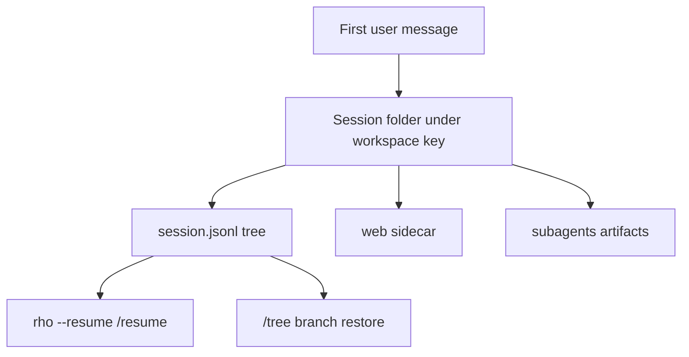
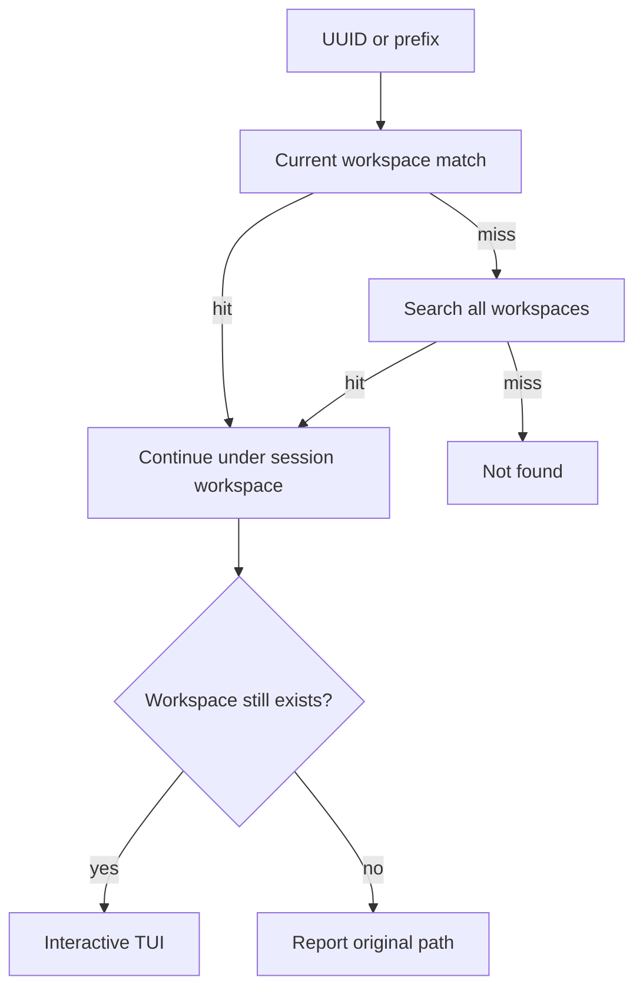
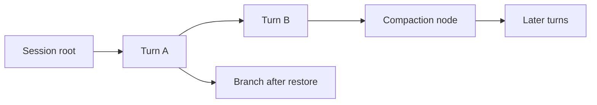

# Sessions

Rho persists interactive conversation history so you can resume work later.



## Storage location

Sessions persist automatically under:

```text
~/.rho/sessions/<workspace-key>/
```

`<workspace-key>` contains a readable encoding of the absolute working directory plus a stable hash to avoid path collisions. Rho uses the current directory as its [workspace](/tools-workspace).

### Layout

New sessions use one folder per session:

```text
~/.rho/sessions/<workspace-key>/<created-at>_<session-id>/
  session.jsonl    # append-only transcript
  web/             # web-access sidecar blobs for this session
  subagents/       # delegated run artifacts owned by this session
```

Rho still opens legacy flat transcripts directly:

```text
~/.rho/sessions/<workspace-key>/<created-at>_<session-id>.jsonl
```

For those legacy files, web-access blobs use a sibling companion directory named `<created-at>_<session-id>.web/` when needed. Session discovery accepts either the folder transcript path or the legacy `.jsonl` file path.

## Creating a session

Starting `rho` opens the [interactive TUI](/interactive-tui). Rho creates a new session folder only after you send the first message.

## Resuming a session



To resume an existing session for the current workspace, pass its UUID or UUID prefix with `--resume` or `-R`:

```bash
rho --resume <session-uuid>
rho -R <session-uuid-prefix>
```

Resuming by id first looks in the current workspace. If no session matches there, Rho resolves the id across every workspace, so you can resume a session by id from a different directory. A session resumed this way continues under **its own** workspace, not the current directory, because its history refers to that project's files and tools. If that workspace directory no longer exists — for example after it was renamed, moved, or deleted — Rho reports where the session belongs instead of continuing against an unrelated tree; its transcript remains preserved under `~/.rho/sessions`.

You can also omit the ID to open an interactive picker for saved sessions in the current workspace:

```bash
rho --resume
rho -R
```

The picker and session list stay scoped to the current workspace. Inside the TUI, use `/resume` to open the saved-session picker or `/resume <id>` to switch directly. Both reject sessions owned by another workspace. In the picker, press `d` or `Delete` to remove the selected session after a confirmation prompt; `escape` cancels.

To work across every directory, use `/sessions` inside the TUI. It opens a session manager that groups saved sessions by directory, with the current directory first. Press Enter on a session in the current directory to resume it, or on a directory row to narrow the list to that directory. You can inspect and delete sessions from other directories, but Rho asks you to start it in that directory before resuming so tools and project context cannot stay bound to the wrong workspace. Press `d` on a session to delete it, or on a directory row to delete the reviewed saved sessions in that directory; both ask for confirmation. When saved sessions refer to workspace directories that no longer exist, the picker adds a cleanup row that deletes the reviewed sessions after confirmation. The current session is never deleted.

## Listing, renaming, exporting, and deleting sessions

Use the `sessions` CLI to inspect, export, rename, remove, and clean up saved history:

```bash
rho sessions list
rho sessions list --all-projects
rho sessions list --search login --limit 20
rho sessions list --json
rho sessions export <session-uuid-or-prefix>
rho sessions export <id> --output notes.md
rho sessions export <id> --format json --output transcript.json
rho sessions export <id> --force   # overwrite an existing target
rho sessions rename <session-uuid-or-prefix> <title>
rho sessions rm <session-uuid-or-prefix>...
rho sessions rm <id> --force   # only for stale non-terminal related runs
rho sessions rm <id> --yes     # skip cross-project confirmation
rho sessions cleanup           # delete sessions for missing workspace directories
rho sessions cleanup --yes     # confirm without an interactive prompt
rho sessions cleanup --force   # allow stale non-terminal related runs
```

`list` shows sessions for the current workspace with a short id, relative age, and title. `--all-projects` includes every workspace and prints each session's working directory. `--search` filters id, title, first/last user message, and cwd (case-insensitive). `--limit` caps how many rows print. `--json` prints one JSON document.

`export` writes the active transcript path for a saved session. Formats are HTML (default), Markdown (`.md`), and JSON (`.json`). The path extension selects the format unless you pass `--format`. When you omit `--output`, Rho writes under `~/.rho/exports/` (or `$RHO_HOME/exports/`) with a timestamped name that includes the short id and optional title slug. Existing files are refused unless you pass `--force`.

`rename` sets the stored session title by UUID or unique prefix. Multi-word titles work without quotes (`rho sessions rename abc123 my new title`). Inside the TUI, `/title <name>` renames the current session.

`rm` accepts one or more session ids or unique prefixes. It deletes each session transcript unit (folder layout or legacy flat `.jsonl`), its web sidecar, and its session index row. Folder deletion also removes delegated runs nested under `subagents/`. Rho still removes older or legacy-session runs under `~/.rho/subagents/` when their `result.json` records the session as `parent_session_id`. Usage ledger rows are **not** deleted, so cost history remains.

Delete refuses:

- the current interactive session (switch or start a new session first)
- a session open in another Rho process (close it there first)
- a session with a still-running or starting related run, unless you pass `--force` (intended only for stale artifacts left after a crash)
- an ambiguous UUID prefix (the error lists matching ids and workspaces)

Cross-project deletes ask for confirmation and show the session workspace. Pass `--yes` in non-interactive scripts.

`cleanup` finds sessions whose recorded workspace path is gone or no longer a directory. It shows every missing workspace and asks before deletion. Pass `--yes` in a script. Cleanup uses the same cascade and live-run checks as `rm`; it does not delete usage history. Metadata errors such as permission failures stop cleanup instead of treating an inaccessible directory as missing.

After you send at least one message, Rho restores your shell view on exit and prints a short saved-session summary plus a resume command that you can paste later.

## Conversation trees

Each saved session is an append-only tree of completed conversation states.



Use `/tree` to select any valid turn or compaction state in the current session. Press `up` or `down` to move, type to filter, press `enter` to restore, or press `escape` to cancel. Continuing after you restore an earlier state creates a branch without deleting the path you left. `/info` shows the active leaf ID, node count, and branch count.

Navigation restores conversation and model state only. It does not undo file edits, shell commands, network requests, or any other tool side effects. `/export` renders the active path. The resume picker still shows one row for the whole session, and deleting a session deletes all its branches.

## Compaction and transcript history

Manual and automatic compactions are durable tree states. A compaction node stores the exact model context after summary generation succeeds, while its parent keeps the exact pre-compaction state. The visible transcript keeps the original user, assistant, and tool messages. Selecting the parent lets you continue without that compaction; descendants of the compaction always include it.

Session files use format version 4 for new trees. Rho reads version 1, 2, and 3 files as a single legacy path without rewriting them. The first tree change appends an upgrade record and leaves old bytes unchanged. Older Rho versions cannot resume a session after version 4 records have been appended.

Auto compaction is not a privacy or deletion feature.

## Resetting history

Press `ctrl-r` in the [interactive TUI](/interactive-tui) to reset the conversation. The next message starts a new session folder.

For one-shot prompts that do not need an ongoing interactive session, use [automation and CLI](/automation-cli).
