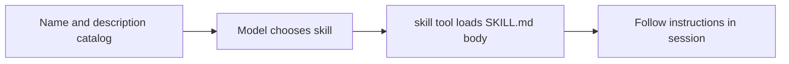
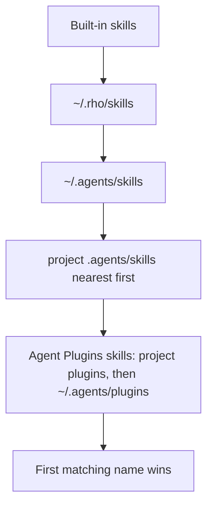

# Skills

Skills give Rho reusable instructions for a task. Each skill lives in a
`SKILL.md` file. Rho shows the model each skill's name and description through
the [`skill` tool](/tools-workspace). The model loads the full instructions only
when it uses that skill, which leaves more context for your work.



## `SKILL.md` format

Create a directory for the skill and add a `SKILL.md` file. Start the file with
YAML front matter between `---` lines, then write the instructions in Markdown:

```text
---
name: inspect-logs
description: Find and summarize errors in application logs. Use when asked to inspect or triage log files.
---

Read the relevant log files with the file tools, group errors by message,
and report the most frequent failures first with file and line references.
```

The file has three parts:

- `name` (required): Use 1–64 lowercase letters, numbers, or single hyphens. The
  name must match the directory name. For example, `inspect-logs/SKILL.md` uses
  `name: inspect-logs`.
- `description` (required): Tell the model what the skill does and when to use
  it. A specific description helps the model choose the right skill.
- Body: Write the instructions after the front matter. Rho loads this text as
  written when the model uses the skill.

Front matter is real YAML, parsed by a maintained YAML library. Optional
[Agent Skills](https://agentskills.io/specification) fields are supported and
validated:

- `license`: a license name or a reference to a bundled license file.
- `compatibility`: up to 500 characters describing environment requirements.
- `metadata`: a map of string keys to string values for extra properties.
- `allowed-tools`: experimental, a space-separated list of pre-approved tools.

Rho also reads `disable-model-invocation` (a boolean). It is a client
extension outside the Agent Skills field set. When true, the skill stays out
of the prompt metadata and only loads through direct user invocation.

## Where Rho looks for skills

Rho checks these locations in order. First match wins. Built-ins cannot be
replaced by a user skill.



```text
built-in skills (shipped with Rho)
~/.rho/skills/<name>/SKILL.md
~/.agents/skills/<name>/SKILL.md
<project>/.agents/skills/<name>/SKILL.md   (nearest directory first, up to the repository root)
<project>/.agents/plugins/<plugin>/skills/<name>/SKILL.md   (nearest directory first)
~/.agents/plugins/<plugin>/skills/<name>/SKILL.md
```

If Rho finds the same skill name more than once, it uses the first copy and
logs the selected and ignored sources. You can't replace a built-in skill
with a user skill. Skills in your home directory take priority over project
skills. Loose skills take priority over plugin skills. Within a project, Rho
starts at the working directory and searches up to the repository root.
Plugin packages are described in [Agent Plugins](/integrations/plugins).

## Add a skill

Loose skills do not need an install command. Choose where the skill should live:

- `~/.rho/skills` makes it available only to Rho.
- `~/.agents/skills` shares it with Rho and other agents that use this layout.
- `<project>/.agents/skills` shares it with everyone who works in that
  repository.

Create a directory whose name matches the skill name, then add `SKILL.md`:

```sh
mkdir -p ~/.agents/skills/inspect-logs
touch ~/.agents/skills/inspect-logs/SKILL.md
```

Open the new file and follow the format above. To add a third-party skill, copy
its directory into one of these locations.
Read its instructions before you use it.

Plugin-owned skills arrive through [Agent Plugin packages](/integrations/plugins)
(`rho plugins install` / `link`). Those skills keep the package as their owner
and sit below every loose skill location in precedence. Loose skills and
plugin-owned skills stay distinct in inventory output.

## Built-in skills

Rho includes three built-in skills:

| Skill | Use |
| --- | --- |
| `rho-config` | Configure Rho, including models, providers, credentials, aliases, permission mode, and direct config-file edits |
| `rho-diagnostics` | Inspect harness diagnostics |
| `rho-agent-creator` | Define an agent through a guided questionnaire, including `runtime: claude-cli` Claude Code specialists |
| `rho-workflow-authoring` | Write and operate deterministic, resumable Starlark workflows |

See [Tools and workspace](/tools-workspace) for details about the `skill` tool.
See [Agents and delegation](/subagents) to learn how to define agents, including the [agent definition schema](/subagents/definition-schema).
