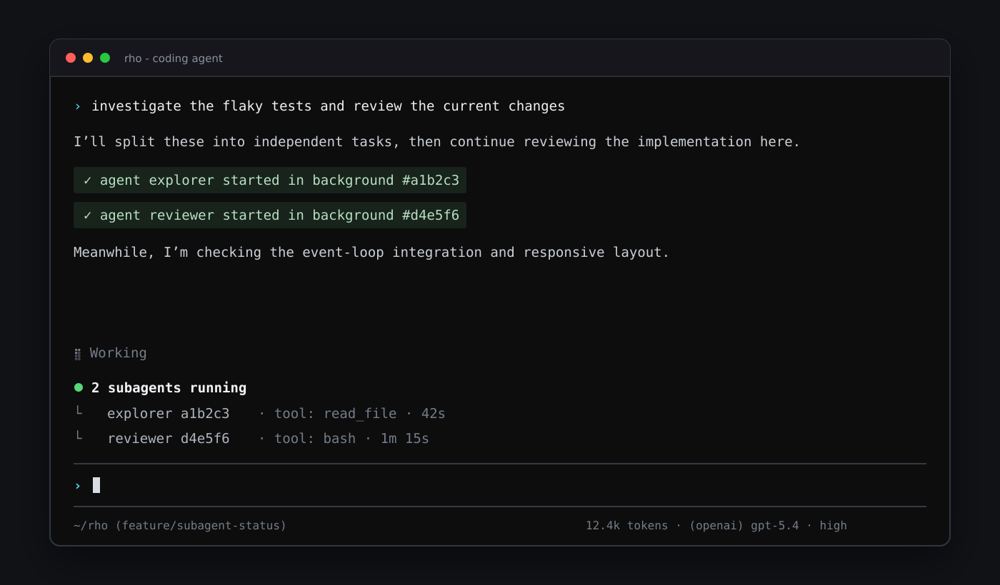

# Subagents

Rho can delegate work to subagents: separate `rho run` processes spawned by
the model through the `agent` tool. Subagents are always direct child processes
of Rho, including when the parent runs inside [Herdr](https://herdr.dev). Their
output is persisted so you can watch from any terminal with `rho attach <id>`.
Results flow back to the parent through a structured result file. The parent
never reads the display stream or diagnostic log, which keeps delegation cheap
in tokens.

## Presets

A preset defines a reusable subagent configuration: the model, reasoning
level, allowed tools, and extra system-prompt instructions. Presets are
markdown files with YAML frontmatter:

```markdown
---
description: Reviews diffs for correctness bugs
model: gpt-5.5
reasoning: high
tools: [read_file, list_dir, bash]
---
You are a code review subagent. Never modify files.
Report findings as file:line references with a one-line explanation.
```

The file name (without `.md`) is the preset name. Presets are discovered
from, in order of precedence:

1. `~/.rho/agents/*.md`
2. `~/.agents/agents/*.md`
3. `.agents/agents/*.md` in the project (nearest project wins)

Three presets ship built in: `explorer` (a fast read-only scout), `reviewer`
(a read-only code reviewer), and `worker` (full tool set). A user file with the
same name overrides it.

### Frontmatter fields

| Field | Required | Meaning |
| --- | --- | --- |
| `description` | yes | Shown to the model when choosing a preset |
| `model` | no | Model override; inherits the parent config when unset |
| `provider` | no | Provider override |
| `reasoning` | no | `off`, `minimal`, `low`, `medium`, `high`, `xhigh`, `max` |
| `tools` | no | Allowed tool names; unset grants the full tool set |

The markdown body is appended to the subagent's system prompt.

The `tools` list is the subagent's permission boundary: tools not listed are
never registered, so the subagent cannot call them.

## The agent and agents tools

The model is instructed to work directly by default because each subagent adds
latency, token use, and coordination overhead. It should delegate only
substantial, self-contained work whose benefit exceeds that cost, and avoid
simple questions, routine inspection, small changes, and overlapping edits.
Subagents share the parent's workspace but start with fresh conversation
context.

The model spawns subagents with the `agent` tool:

- **Blocking** (default): the tool call resolves when the subagent finishes,
  returning its final answer, turn count, and token usage.
- **Background** (`background: true`): the call returns immediately with a
  short ID and the exact `rho attach <id>` command. When the subagent finishes,
  the parent is notified at its next turn boundary. An idle interactive session
  is woken with the result.

The `agents` tool manages running subagents:

- `list` - all subagents spawned this session
- `status` - state, elapsed time, turns, token usage, last activity, and attach
  command for one subagent
- `stop` - graceful stop (the subagent writes a partial result), escalating
  to a kill after five seconds

While subagents are active, the interactive TUI shows a compact panel above
its composer with each agent's preset, ID, latest activity, and elapsed time.
The panel displays two agent details at once and summarizes any additional
agents with an overflow count. It disappears automatically when all subagents
finish.



Pass `--no-subagents` to hide both tools. Subagents themselves always run
with `--no-subagents`, so they cannot spawn further subagents.

## Watching a subagent

Every spawn reports its six-character ID. Attach from any interactive terminal:

```bash
rho attach abc123
```

The attached TUI shows the delegated prompt, reasoning, assistant output, tool
calls and progress, usage state, and completion state. It is read-only and has
no input composer. Use Up/Down, Page Up/Page Down, and Home/End to navigate.
Press `q`, Escape, or Ctrl-C to detach. Detaching does not stop the subagent.

Attaching from a Herdr pane reports the attached subagent's working, idle, or
blocked state to that pane. Herdr does not spawn or own the subagent process.
You can also attach after a run finishes to review its persisted output.

## Where things live

Each spawn gets a directory under `~/.rho/subagents/<id>/` containing:

- `result.json` - the live status and final result contract
- `events.jsonl` - the read-only TUI event stream
- `log.txt` - diagnostic stdout and stderr
- `cancel.requested` - created when a stop has been requested

The cancellation marker is cross-platform. After requesting it, the parent
allows five seconds for a partial result before force-killing the process.
Exiting the parent Rho session also stops its still-running subagents. Detaching
an observer does not.

Run directories are owner-only on supported platforms and remain available for
post-run attachment until you remove them. Rho does not currently delete old
subagent directories automatically. Remove runs you no longer need from
`~/.rho/subagents/`; those artifacts can contain prompts and workspace content.

## Running a subagent by hand

The same machinery is available directly from the CLI:

```bash
rho run --preset explorer --output-file /tmp/result.json "where is auth handled?"
```

With `--output-file`, progress streams to stdout and the JSON file is updated
during the run (state, turns, token usage, last activity) and finalized
on exit with `state` of `ok`, `error`, or `stopped` plus the final `result`
text.
