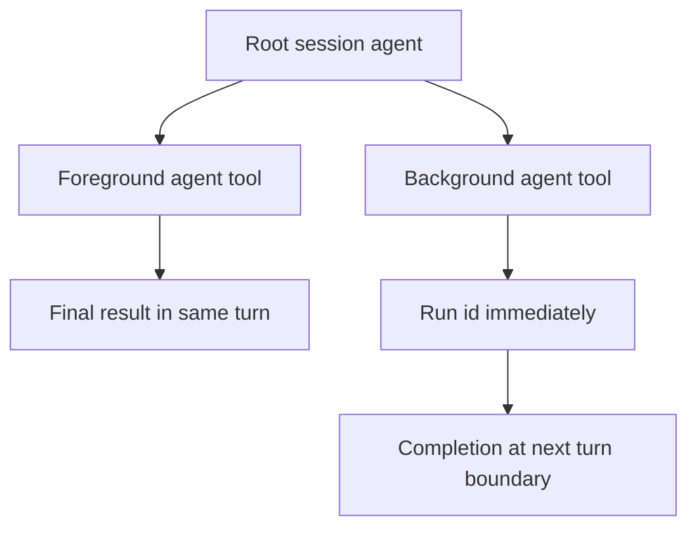
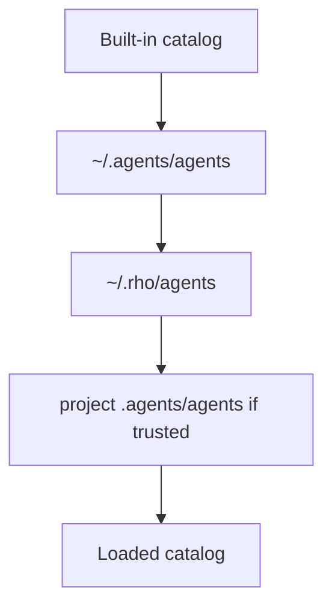

# Agents and delegation

Rho uses one agent definition model for interactive sessions, `rho run`, and delegated work. The built-in catalog contains:

- `default` - standard root coding-agent behavior
- `explorer` - fast read-only investigation
- `reviewer` - read-only code review
- `worker` - independent implementation

Select an agent at startup:

```bash
rho --agent reviewer
rho run --agent worker "address the issue"
```

Agent switching within an active session is intentionally unsupported.

This page covers how to define and run agents. Expansive reference lives on linked subpages: [definition schema](/subagents/definition-schema), [Claude Code runtime](/subagents/claude-cli), and [attachment and artifacts](/subagents/attachment-and-artifacts).

Use `/agents` to inspect the loaded catalog. Press Enter on an internal agent to set its model override. Press Enter on an agent loaded from `~/.rho/agents` or a trusted project `.agents/agents` directory to edit its definition. Frontmatter fields use structured TUI controls, while the prompt body opens in `$VISUAL` or `$EDITOR`. Review the draft and choose **Save** to validate and write the source file. Agents loaded from `~/.agents/agents` and built-in agents remain read-only.


```mermaid
flowchart TD
    root[Root session agent] --> fg[Foreground agent tool]
    root --> bg[Background agent tool]
    fg --> result[Final result in same turn]
    bg --> id[Run id immediately]
    id --> done[Completion at next turn boundary]
```

## Definition files

Agent definitions are Markdown with strict frontmatter. The Markdown body extends the base coding prompt by default:

```markdown
---
id: security-review
description: Reviews changes for security defects
runtime: rho
model-policy: inherit
reasoning: high
tools: [read_file, list_dir, bash]
---
Review the requested changes. Do not modify files.
```

### Discovery order

Definitions are discovered deterministically. Later sources win on the same ID.
Project definitions stay inactive until trusted.


```mermaid
flowchart TD
    builtins[Built-in catalog] --> userAgents["~/.agents/agents"]
    userAgents --> rhoAgents["~/.rho/agents"]
    rhoAgents --> project["project .agents/agents if trusted"]
    project --> catalog[Loaded catalog]
```

Definitions are discovered deterministically from built-ins, `~/.agents/agents`, `~/.rho/agents`, and trusted project `.agents/agents` directories, with later sources taking precedence. Project definitions are ignored unless `RHO_TRUST_PROJECT_AGENTS=1`, so an untrusted checkout cannot affect prompts, models, or tools. Duplicate IDs within one precedence level are errors. The file name supplies `id` when the field is omitted.

For the full value set, constraints, and defaults, see [Agent definition schema](/subagents/definition-schema).

### Quick field summary

| Field | Required | Meaning |
| --- | --- | --- |
| `id` | no | Stable lowercase identifier; defaults to the file name |
| `description` | yes | Description shown by the `agent` tool |
| `runtime` | no | Execution harness: `rho` (default) or `claude-cli` |
| `prompt` | no | `extend` (default) or `replace` |
| `model-policy` | no | For `runtime: rho`: `inherit`, `prefer`, `require`, or `select`. For `runtime: claude-cli`: omit, `inherit`, or `select` |
| `model` | policy-dependent | Model selected by non-inherit policies. On `runtime: rho`, use `@name` to reference a [model alias](/configuration#model-aliases). On `runtime: claude-cli`, the value is passed through as Claude's `--model` and must be a Claude model name or Claude alias such as `claude-opus-5` (Rho `@alias` references are rejected) |
| `provider` | no | Provider selected with the model. Valid only for `runtime: rho`; rejected on `runtime: claude-cli` |
| `reasoning` | no | For `runtime: rho`: `off`, `minimal`, `low`, `medium`, `high`, `xhigh`, or `max`. For `runtime: claude-cli`: maps to Claude `--effort` as `low`, `medium`, `high`, `xhigh`, or `max`. Omit to inherit Claude's default. `off` and `minimal` are rejected on `claude-cli` |
| `tools` | no | Tool allowlist. Vocabulary depends on `runtime` (see [definition schema](/subagents/definition-schema)) |
| `inherit_claude_config` | no | `true` or `false` (default). Opt in only with `runtime: claude-cli` to load the user's full Claude settings (`user,project,local`). Default stays closed |

## Delegating work

Delegation has two modes:

- Foreground waits for the run and returns its final result. Mixing a foreground agent with other tools does not background it and can delay the rest of that batch until the run finishes. Independent agent calls in the same step run together - issue them in one turn for parallel work.
- Background returns a six-character run ID immediately and sends a completion notification later. Only `background=true` backgrounds a run; parallel batching does not. Use background when you want to keep working or end the turn without waiting.

Both modes use the same `AgentExecutor`. Rho-runtime agents stay in-process. `runtime: claude-cli` agents spawn the external `claude` binary and still report through the same status and attachment files. The `agents` tool lists, inspects, or cancels handles tracked by `SubagentManager`. Parent shutdown cancels active handles and waits for bounded cleanup. Delegated agents run without their own TUI. Questionnaires raised by background Rho agents surface in the parent session; approvals still cannot. In Supervised mode, Rho-runtime delegated Write and Process operations fail closed. Claude-cli agents refuse to spawn under Supervised mode entirely because `claude -p` cannot prompt for approval; use Plan or Auto instead. Interactive permission-mode changes apply to delegated agents launched after the change. An already-running delegated agent keeps the launch-time mode because it cannot be retroactively sandboxed; future launches receive the changed mode.

Pass `--no-subagents` to remove delegation capabilities from a root invocation.

## Binding and security

Every invocation goes through the same binder. Rho-runtime agents resolve aliases and tool capabilities against the host. Claude-cli agents are delegated-only and keep Claude's model/tool vocabulary. Delegated Rho agents cannot recurse through `agent`/`agents`.

Details: [Binding and security](/subagents/binding-and-security).

## Claude Code as a delegated runtime

Rho can hand a **delegated** agent to the installed `claude` binary so a child run can use a Claude subscription while the parent stays in Rho. This is not Anthropic API-key access and is not available as the root session runtime.

Quick path: install `claude`, run `/login claude-code`, define an agent with `runtime: claude-cli`, then launch it through the `agent` tool under Plan or Auto permission mode.

Full guide: [Claude Code as a delegated runtime](/subagents/claude-cli).

## Attachment and artifacts

Watch a delegated run with `rho attach <id>`. Detaching does not cancel the run. Artifacts live under the parent session folder when available, otherwise under `~/.rho/subagents/<id>/`.

Details: [Attachment and artifacts](/subagents/attachment-and-artifacts).

## Agent definition schema

Unknown frontmatter keys fail. Invalid values fail before execution. The full field contract, runtime-specific model and tool rules, JSON Schema, and examples live on a dedicated page.

Reference: [Agent definition schema](/subagents/definition-schema).
