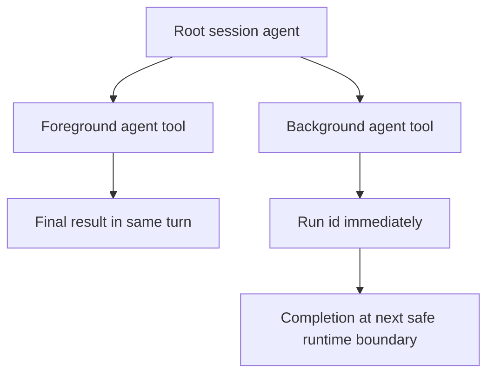
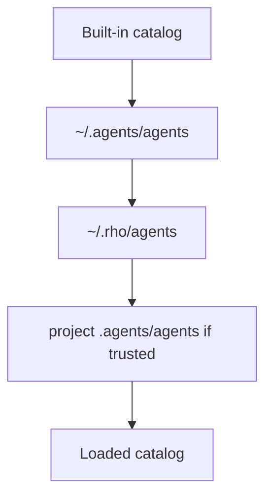

# Agents and delegation

Orchestrate agents across providers from one Rho parent session. Each agent can bind its own provider and model on the Rho runtime, or hand a delegated child to the [Claude Code runtime](/subagents/claude-cli) so it can use your Claude subscription while Rho keeps fan-out, attach, cancel, and the session tree.

Rho uses one agent definition model for interactive sessions, `rho run`, and delegated work. The built-in catalog contains:

- `default` - standard root coding-agent behavior
- `explorer` - fast read-only investigation
- `reviewer` - read-only code review
- `worker` - independent implementation

Select an agent at startup:

```bash
rho --agent reviewer
rho run --agent worker "address the issue"
```

Agent switching within an active session is intentionally unsupported.

This page covers how to define and run agents. Expansive reference lives on linked subpages: [definition schema](/subagents/definition-schema), [Claude Code runtime](/subagents/claude-cli), [Cursor Agent runtime](/subagents/cursor), and [attachment and artifacts](/subagents/attachment-and-artifacts).

Use `/agents create` or `/create-agent` to define an agent through a guided questionnaire. Use bare `/agents` to inspect the loaded catalog. Press Enter on an internal agent to set its model override. Press Enter on an agent loaded from `~/.rho/agents` or a trusted project `.agents/agents` directory to edit its definition. Frontmatter fields use structured TUI controls, while the prompt body opens in `$VISUAL` or `$EDITOR`. Review the draft and choose **Save** to validate and write the source file. Agents loaded from `~/.agents/agents` and built-in agents remain read-only.


```mermaid
flowchart TD
    root[Root session agent] --> fg[Foreground agent tool]
    root --> bg[Background agent tool]
    fg --> result[Final result in same turn]
    bg --> id[Run id immediately]
    id --> done[Completion at next safe runtime boundary]
```

## Definition files

Agent definitions are Markdown with strict frontmatter. The Markdown body extends the base coding prompt by default:

```markdown
---
id: security-review
description: Reviews changes for security defects
runtime: rho
model-policy: inherit
reasoning: high
tools: [read_file, list_dir, bash]
---
Review the requested changes. Do not modify files.
```

### Discovery order

Definitions are discovered deterministically. Later sources win on the same ID.
Project definitions stay inactive until trusted.


```mermaid
flowchart TD
    builtins[Built-in catalog] --> userAgents["~/.agents/agents"]
    userAgents --> rhoAgents["~/.rho/agents"]
    rhoAgents --> project["project .agents/agents if trusted"]
    project --> catalog[Loaded catalog]
```

Definitions are discovered deterministically from built-ins, `~/.agents/agents`, `~/.rho/agents`, and trusted project `.agents/agents` directories, with later sources taking precedence. Project definitions are ignored unless `RHO_TRUST_PROJECT_AGENTS=1`, so an untrusted checkout cannot affect prompts, models, or tools. Duplicate IDs within one precedence level are errors. The file name supplies `id` when the field is omitted.

For the full value set, constraints, and defaults, see [Agent definition schema](/subagents/definition-schema).

### Quick field summary

| Field | Required | Meaning |
| --- | --- | --- |
| `id` | no | Stable lowercase identifier; defaults to the file name |
| `description` | yes | Description shown by the `agent` tool |
| `runtime` | no | Execution harness: `rho` (default), `claude-cli`, or `cursor` |
| `prompt` | no | `extend` (default) or `replace` |
| `model-policy` | no | For `runtime: rho`: `inherit`, `prefer`, `require`, or `select`. For `runtime: claude-cli`: omit, `inherit`, or `select` |
| `model` | policy-dependent | Model selected by non-inherit policies. On `runtime: rho`, use `@name` to reference a [model alias](/configuration#model-aliases). On `runtime: claude-cli`, the value is passed through as Claude's `--model` and must be a Claude model name or Claude alias such as `claude-opus-5` (Rho `@alias` references are rejected) |
| `provider` | no | Provider selected with the model. Valid only for `runtime: rho`; rejected on `runtime: claude-cli` |
| `reasoning` | no | For `runtime: rho`: `off`, `minimal`, `low`, `medium`, `high`, `xhigh`, or `max`. For `runtime: claude-cli`: maps to Claude `--effort` as `low`, `medium`, `high`, `xhigh`, or `max`. Omit to inherit Claude's default. `off` and `minimal` are rejected on `claude-cli` |
| `tools` | no | Tool allowlist. Vocabulary depends on `runtime` (see [definition schema](/subagents/definition-schema)) |
| `inherit_claude_config` | no | `true` or `false` (default). Opt in only with `runtime: claude-cli` to load the user's full Claude settings (`user,project,local`). Default stays closed |

## Delegating work

Delegation has two modes:

- Foreground waits for the run and returns its final result. Mixing a foreground agent with other tools does not background it and can delay the rest of that batch until the run finishes. Independent agent calls in the same step run together - issue them in one turn for parallel work.
- Background returns a six-character run ID immediately and sends a completion notification later. Only `background=true` backgrounds a run; parallel batching does not. Use background when you want to keep working or end the turn without waiting.

Both modes use the same `AgentExecutor`. Rho-runtime agents stay in-process. `runtime: claude-cli` agents spawn the external `claude` binary and still report through the same status and attachment files. The `agents` tool lists, inspects, cancels, or messages handles tracked by `SubagentManager`. Parent shutdown cancels active handles and waits for bounded cleanup. Delegated agents run without their own TUI. Questionnaires raised by delegated Rho agents surface in the parent session (foreground waits and background runs); approvals still cannot. Background Rho agents can also send non-blocking plain-text notices through `message_parent`; those deliver at the parent's next turn boundary with completion notifications. Both `message_parent` and `agents` action `message` reject bodies over 8 KiB (after trim) as invalid arguments before send. Parents can steer a running Rho-runtime child with `agents` action `message` (plain text, applied at the child's next provider turn). The same `agents message` action works for Claude-cli children: Rho keeps the child's stdin open with `--input-format stream-json` and writes each parent body as a queued user turn (applied when the current Claude turn ends). Claude children still have no `message_parent` tool in this release. In Supervised mode, Rho-runtime-delegated Write and Process operations fail closed. Claude-cli agents refuse to spawn under Supervised mode because `claude -p` cannot prompt for approval. Auto and Allow edits spawn with Claude `dontAsk` only when `tools:` are bare names and `inherit_claude_config` is false. Claude `dontAsk` also auto-approves read-only Bash and PreToolUse hooks, so a specifier such as `Bash(git *)` (which exposes the Bash base tool) or inherited Claude settings would run actions outside the bound set and is refused. Those bound `dontAsk` runs pass an empty `--setting-sources` list so project hooks cannot widen the child. Interactive permission-mode changes apply to delegated agents launched after the change. An already-running delegated agent keeps the launch-time mode because it cannot be retroactively sandboxed; future launches receive the changed mode.

Pass `--no-subagents` to remove delegation capabilities from a root invocation.

### Background delivery during a turn

The interactive parent collects child notices, agent completions, workflow results,
and process exits at safe provider boundaries after tool work, not only between
human messages. It also checks pending notifications before committing its final
response. Streaming stays live, so text may already be visible when a notification
arrives. Notifications found at the final checkpoint cause another provider step.
Completions arriving after the finalization handoff remain queued and wake an idle
parent as before.

Child messages retain their send order and run identity. When a terminal result is
in the same batch, earlier planning and progress are marked as historical context.
Rho does not guess which free-text findings are safe to delete. Reading a terminal
result through `agents status` or `agents stop` includes pending child notices as
earlier context and acknowledges their exact receipts, so they do not later wake
the parent as a fresh task. Polling a terminal process or workflow similarly
acknowledges its completion. A failed delivery attempt cannot undo a later explicit
acknowledgement.

### Parent-to-child messages in the transcript

Messages sent through `agents` action `message` show the task title first, then muted
`parent → <agent role> · queued` routing and an excerpt of the message itself. If a
run has no generated title yet, its first nonempty prompt line identifies the task.
This keeps different tasks using the same agent role distinguishable.

The excerpt uses your `display.max_tool_output_lines` setting. Press `Ctrl+O` or click
the card to see the complete message, full task title, run ID, and attach command.
Surrounding whitespace is trimmed to match the text accepted for delivery. The
durable receipt remains plain text for ACP clients and exported transcripts.
Short messages can also expand to show those details. Queued means the message was
accepted for delivery, not that the child has acted on it or completed its task.
Child-to-parent `message_parent` notices keep their existing notification display.

## Binding and security

Every invocation goes through the same binder. Rho-runtime agents resolve aliases and tool capabilities against the host. Claude-cli agents are delegated-only and keep Claude's model/tool vocabulary. Delegated Rho agents cannot recurse through `agent`/`agents`.

Details: [Binding and security](/subagents/binding-and-security).

## Claude Code as a delegated runtime

Rho can hand a **delegated** agent to the installed `claude` binary so a child run can use a Claude subscription while the parent stays in Rho. This is not Anthropic API-key access and is not available as the root session runtime.

Quick path: install `claude`, run `/login claude-code`, define an agent with `runtime: claude-cli`, then launch it through the `agent` tool under Plan or Bypass. Auto and Allow edits work only for proven no-prompt `tools:` with `inherit_claude_config: false`; unknown Claude, plugin, and MCP names fail closed.

Full guide: [Claude Code as a delegated runtime](/subagents/claude-cli).

## Cursor Agent as a delegated runtime

Rho can hand a **delegated** agent to the installed `cursor-agent` binary so a child run can use a Cursor sign-in while the parent stays in Rho. This is not available as the root session runtime.

Quick path: install `cursor-agent`, run `/login cursor`, define an agent with `runtime: cursor` and a nonempty classified `tools:` list, then launch it through the `agent` tool under Plan or Bypass. Auto, Allow edits, and Supervised refuse at bind. Cursor children cannot be messaged (process-per-turn).

Full guide: [Cursor Agent as a delegated runtime](/subagents/cursor).

## Attachment and artifacts

Watch a delegated run with `rho attach` or `rho attach <id>`. The picker lists
runs from the current directory. Detaching does not cancel the run. Artifacts
live under the parent session folder when available, otherwise under
`~/.rho/subagents/<id>/`. The title model names each run so the activity rail
and attach picker can show role and title instead of a run id.

Details: [Attachment and artifacts](/subagents/attachment-and-artifacts).

## Agent definition schema

Unknown frontmatter keys fail. Invalid values fail before execution. The full field contract, runtime-specific model and tool rules, JSON Schema, and examples live on a dedicated page.

Reference: [Agent definition schema](/subagents/definition-schema).
