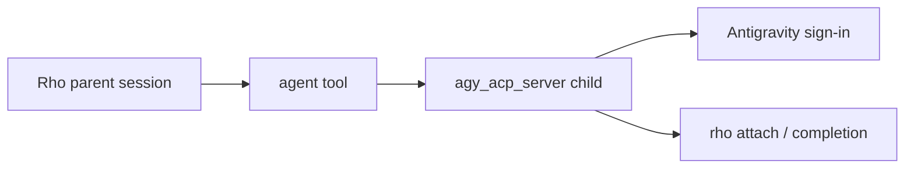
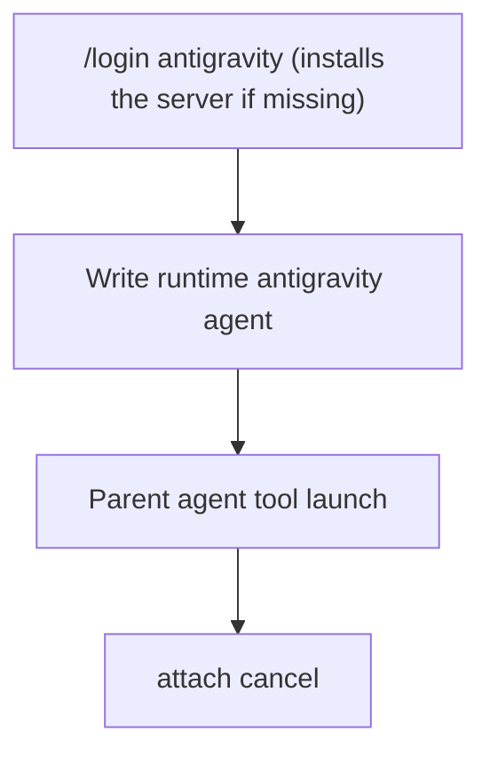

# Google Antigravity as a delegated runtime

Parent: [Agents and delegation](/subagents).

Rho can hand a delegated agent to Google Antigravity's ACP server instead of running Rho's own loop. The parent stays in Rho. The child uses Antigravity's harness, Gemini models, and the server's own Google sign-in. Model choice and runtime choice stay separate: `runtime: antigravity` is not a Rho provider.

Verified against `agy_acp_server 1.3.0`. Rho speaks the [Agent Client Protocol](https://agentclientprotocol.com) (ACP) to it over stdio.



## When this is useful

Use `runtime: antigravity` when you want a Gemini-backed Antigravity child while the main session stays on Rho:

- Keep Rho as the orchestrator (fan-out, attach, cancel, session tree) while Antigravity owns the child loop and sign-in
- Fence the child to an explicit `tools:` list of Antigravity built-ins
- Steer a running child with follow-up messages, delivered as its next turn

Antigravity agents are **delegated only**. The interactive root and `rho run` root cannot bind `runtime: antigravity`; a Rho parent launches them through the `agent` tool.

## How to use it



1. **Install and sign in** from the TUI or the shell:

   ```text
   /login antigravity
   ```

   ```bash
   rho login antigravity
   ```

   If the server is not installed, Rho offers to install it first: it shows the download size and destination and waits for `y`. The server is a separate download from the `agy` CLI (the `agy` CLI has no ACP mode). Rho downloads the `antigravity-acp` 1.3.0 archive for your platform from `dl.google.com` (111–334 MB; 0.2–1.1 GB unpacked), checks it against the size and SHA-256 pinned in Rho (Google publishes no checksums), and unpacks it into `$RHO_HOME/runtimes/antigravity-acp/1.3.0/` (default `~/.rho`). It never touches `PATH` or shell profiles. When a Rho release pins a newer server, the next `/login antigravity` installs it and removes the old one. Non-interactive `rho login antigravity` refuses to install; run it in a terminal.

   To use your own copy instead, get the archive from the [ACP registry](https://agentclientprotocol.com), unpack it, and put `agy_acp_server.par` (`agy_acp_server.exe` on Windows) on `PATH` next to its `localharness_external` (a symlink on `PATH` is fine, Rho resolves it). A server on `PATH` always wins over Rho's copy. Platforms without a pinned archive need this manual install.

   Rho then starts the server, which prints a Google sign-in link and waits up to 300 s for the browser to come back to `http://127.0.0.1:<port>/`. Over SSH the browser cannot reach that address and its last page fails to load: copy that page's address, paste it into the login prompt, and press Enter. Rho only accepts that exact loopback address and replays it locally.

   Confirm with `/doctor` (or `rho doctor`): the `agy_acp_server` row under Runtimes shows the sign-in method, and warns when `localharness_external` is missing next to the server, or when `ANTIGRAVITY_HARNESS_PATH` names a file that does not exist (the server does not fall back to searching beside itself). `/info` shows the same state under External runtimes. Neither starts the server, so neither reports its version or checks that the token is still valid.

   The server records the method in `$GEMINI_HOME/antigravity-acp/settings.json` (default `~/.gemini`) and keeps the token in `acp_token.json` beside it; on macOS it uses the Keychain (service `gemini`) instead unless `AGY_ACP_FORCE_FILE_STORAGE` is `1`, `true`, or `yes`. This sign-in is separate from the `agy` CLI's. Rho never stores or reads the token. To sign out, delete that `settings.json` (runs then report signed out) and the token file or Keychain item.

2. **Write a delegated agent definition**, for example `~/.rho/agents/agy-reviewer.md`:

   ```markdown
   ---
   id: agy-reviewer
   description: Review changes with Antigravity on Gemini
   runtime: antigravity
   model: gemini-3.8-flash-high
   tools: [view_file, run_command]
   ---
   Review the requested changes. Prefer reading before editing.
   ```

   Notes:

   - `tools:` is required and nonempty. There is no `tools: all`. Names are Antigravity's built-ins: `view_file`, `create_file`, `edit_file`, `run_command`, `search_web`, `read_url_content`. Unknown names fail parse and frozen resume.
   - `model:` is an Antigravity model id (for example `gemini-3.8-flash-high` or `gemini-pro-agent`). Rho sets it as the session's `model` option; a value the server does not offer fails the run before the prompt, listing the offered ids. Omit it to keep the server default.
   - There is no `reasoning:` field. Effort is part of the model id.
   - `prompt: replace` is rejected (ACP has no system-prompt override). Use `extend`: the body is prepended to the first prompt.

3. **Delegate from a Rho root session** through the `agent` tool. The call returns a run ID immediately, followed by an automatic completion notification.

4. **Watch and cancel** with `rho attach <run-id>`. `agents` action `message` queues plain text for a running child; Rho sends it as the next `session/prompt` once the current turn ends.

## Permission modes

For every run Rho:

1. Sends `tools:` (narrowed by the mode) as `_meta.agy.enabledTools` on `session/new`. Built-ins outside the list are not offered to the model.
2. Sets session mode `default`, whatever the user's Antigravity settings say, so the server asks before every non-read tool. Its `auto_edit` and `yolo` modes would approve tools without Rho.
3. Answers every `session/request_permission` itself, choosing only the one-shot allow or deny option.

| Rho mode | Antigravity session |
| --- | --- |
| Plan | allowlist keeps read-only built-ins (`view_file`); every permission request rejected |
| Bypass | declared built-ins allowed; permission requests allowed only for a declared category |
| Auto, Allow edits, Supervised | refused (`antigravity agents run only in Plan or Bypass`): Rho cannot ask a human to approve an Antigravity tool call |

Plan with no read-only tool declared is refused.

| Permission kind | Approved in Bypass when `tools:` declares |
| --- | --- |
| `read` | `view_file` (it normally does not ask) |
| `edit`, `delete`, `move` | `create_file` or `edit_file` |
| `execute` | `run_command` |
| `search` | `search_web` |
| `fetch` | `read_url_content` |
| anything else | never |

`run_command` in Bypass runs whatever the model asks, inside or outside the workspace, just like a shell tool on any other runtime.

Rho does not offer Antigravity's `ask_question`, `start_subagent`, `schedule`, `generate_image`, or `finish` built-ins, or its directory search built-ins.

## Quick checklist

| Step | Command or field |
| --- | --- |
| Install and sign in | `/login antigravity` or `rho login antigravity` (or your own server on `PATH`) |
| Check | `/doctor` or `rho doctor` (`agy_acp_server` row), `/info` |
| Define | `runtime: antigravity` + nonempty Antigravity `tools:` / optional `model:` |
| Permission mode | Plan or Bypass only |
| Launch | Rho parent `agent` tool, delegated only |
| Messaging | `agents` action `message`; delivered as the next turn |
| Inspect | `rho attach <id>` |

## Execution details

Rho runs `agy_acp_server.par --uid=` on Linux (without `--uid=` the 1.3.0 server aborts looking up group `nobody`) and `agy_acp_server.par` elsewhere, in the workspace, with `ANTIGRAVITY_HARNESS_PATH` pointing at the `localharness_external` next to the resolved server (the one on `PATH`, else Rho's copy) unless you already set it. Each ACP setup step (`initialize`, `session/new`, `session/set_mode`, `session/set_config_option`) has a 10 s budget; measured warm `initialize` took 1.4–2.1 s and `session/new` 2.7 s.

Before spawning, Rho checks that `$GEMINI_HOME/antigravity-acp/settings.json` (read as plain JSON) names a sign-in method and, for Google sign-in with file storage, that its token file exists. With a method but no token the server starts an interactive browser sign-in at `session/new`, so the run fails at once with a pointer to `/login antigravity` instead. Rho does not query the macOS Keychain; a missing Keychain item, or an expired or revoked token, surfaces at `session/new` as the server's error or the 10 s step budget. Rho never calls ACP `authenticate` during a run.

Cancel sends `session/cancel`; the server answers with stop reason `cancelled` and stops the running tool. Rho always terminates the server after the last turn. The ACP session id is recorded but there is no resume command.

Antigravity 1.3.0 sometimes reports a `run_command` call as failed immediately and retries it under a new call (and a new permission request). That is server behavior; both cards appear in the transcript.
