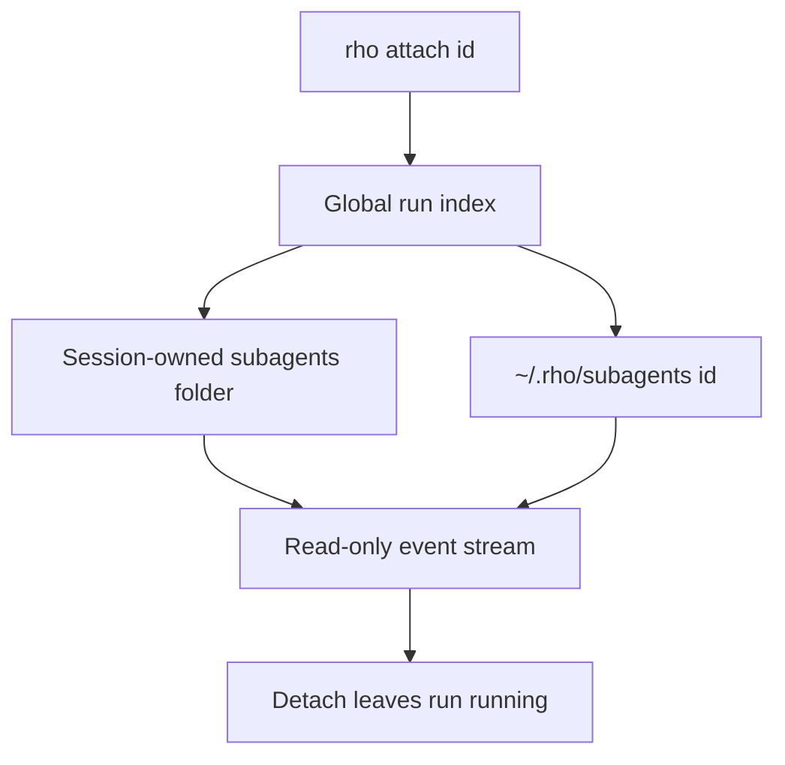

# Attachment and artifacts

Parent: [Agents and delegation](/subagents).

Observe any delegated run without owning its execution:

```bash
rho attach
rho attach abc123
```

`rho attach` without an id opens a full-screen picker of subagents from the
current directory, even when none are running. It starts on running runs.
Ctrl-R shows finished transcripts from this directory so you can reopen an
old run. Rows show the agent role, generated title, and current tool or
final state. Enter attaches to the selected run. Escape leaves without
attaching. `rho attach <id>` still finds a run from any directory.



Runs started by a saved interactive session store durable artifacts with that session:

```text
~/.rho/sessions/<workspace-key>/<created-at>_<session-id>/subagents/<id>/
```

Parentless runs, including delegated work started by `rho run`, remain under `~/.rho/subagents/<id>/`. Runs from resumed legacy flat sessions also remain there because those sessions have no folder to own them. Existing global runs are not moved.

Each run directory can contain:

- `result.json` - live status, agent ID, runtime (`rho` or `claude-cli`), provider, model, reasoning level, start/finish timestamps, semantic fingerprint, usage, final result, optional `parent_session_id`, and optional `claude_session_id`
- `events.jsonl` - display events used by attachment
- `log.txt` - Claude stderr for `runtime: claude-cli` runs

Run IDs stay globally unique. `rho attach` first checks the global run index, then scans folder-layout sessions, then checks the legacy global path. This lets another process attach from any working directory while keeping unindexed older runs available.

Detaching does not cancel execution. The interactive TUI opens this viewer in place. `rho attach <id>` still works as a separate process for another terminal. Neither path owns the delegated task. Artifacts remain available for post-run inspection and may contain prompts or workspace content.

Attach uses the same display settings as the interactive TUI from config: `show_reasoning_output`, `zen_mode`, `max_tool_output_lines`, and `theme`. Reasoning and tool events stay in the journal; the view filters them when painting so hide-reasoning and zen match the main session. Click a truncated tool card, or press Ctrl+O, to expand or collapse it.

A direct automation run can persist the same status contract:

```bash
rho run --agent explorer --output-file /tmp/result.json "where is auth handled?"
```

Root session metadata stores the selected agent ID and fingerprint. Resume fails explicitly when that identity is missing or when the selected definition changed. Unchanged default Rho definitions still resume when the session stores the pre-runtime-axis v1 fingerprint.
