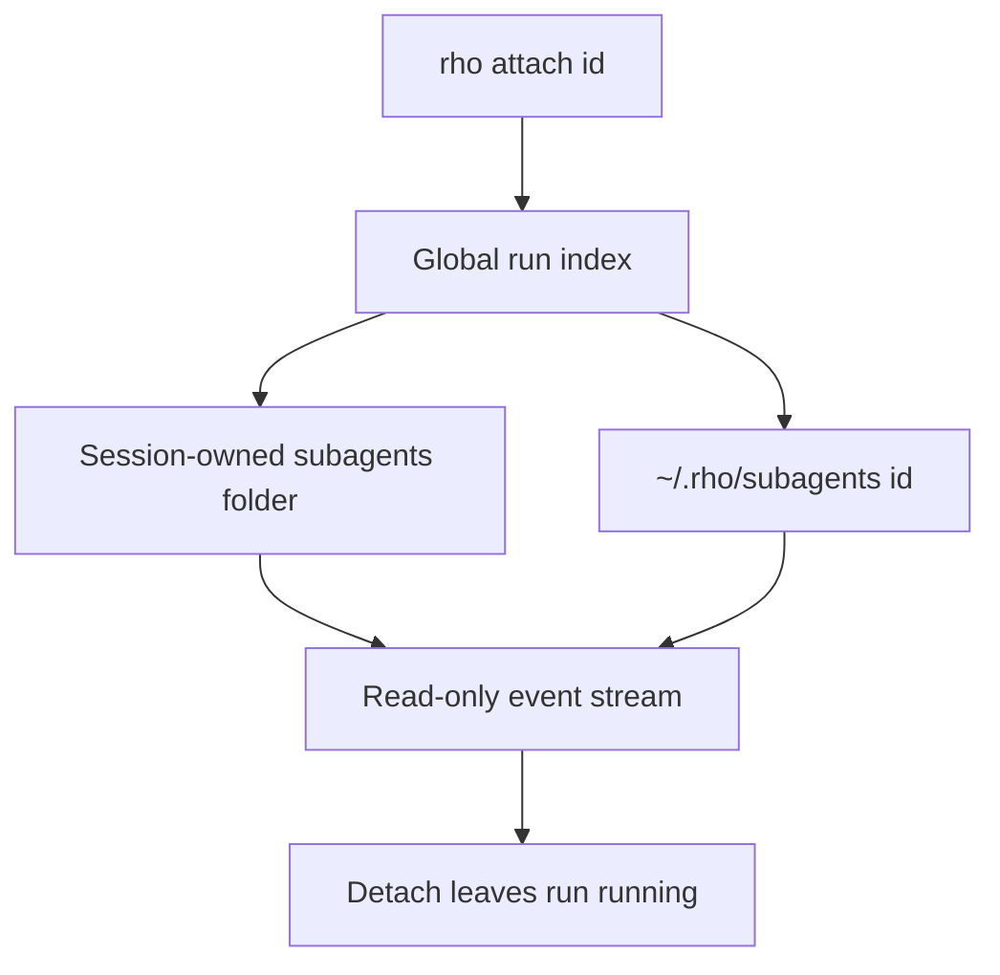

# Attachment and artifacts

Parent: [Agents and delegation](/subagents).

Observe any delegated run without owning its execution:

```bash
rho attach abc123
```



Runs started by a saved interactive session store durable artifacts with that session:

```text
~/.rho/sessions/<workspace-key>/<created-at>_<session-id>/subagents/<id>/
```

Parentless runs, including delegated work started by `rho run`, remain under `~/.rho/subagents/<id>/`. Runs from resumed legacy flat sessions also remain there because those sessions have no folder to own them. Existing global runs are not moved.

Each run directory can contain:

- `result.json` - live status, agent ID, semantic fingerprint, usage, final result, optional `parent_session_id`, and optional `claude_session_id`
- `events.jsonl` - display events used by attachment
- `log.txt` - Claude stderr for `runtime: claude-cli` runs

Run IDs stay globally unique. `rho attach` first checks the global run index, then scans folder-layout sessions, then checks the legacy global path. This lets another process attach from any working directory while keeping unindexed older runs available.

Detaching does not cancel execution. [Herdr](/integrations/herdr) panes also run `rho attach <id>` and never own the delegated task. Artifacts remain available for post-run inspection and may contain prompts or workspace content.

A direct automation run can persist the same status contract:

```bash
rho run --agent explorer --output-file /tmp/result.json "where is auth handled?"
```

Root session metadata stores the selected agent ID and fingerprint. Resume fails explicitly when that identity is missing or when the selected definition changed. Unchanged default Rho definitions still resume when the session stores the pre-runtime-axis v1 fingerprint.
