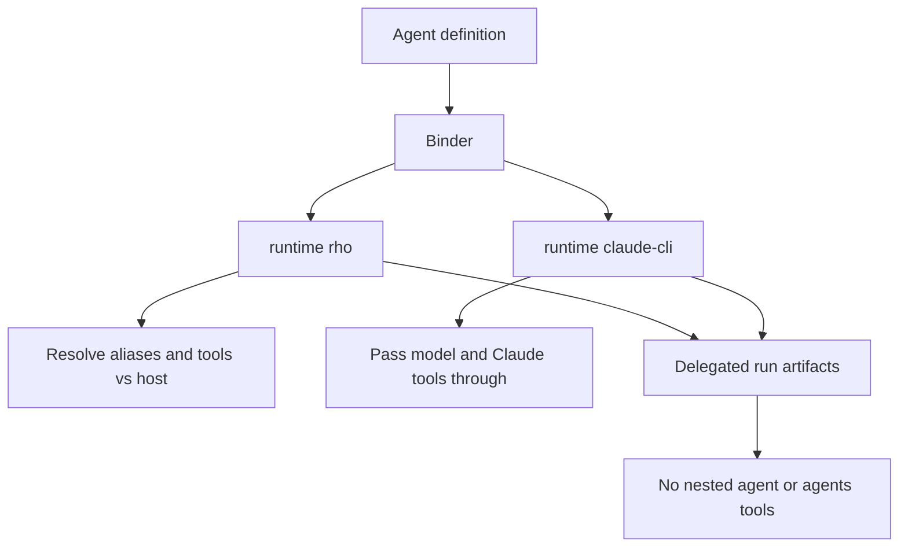

# Binding and security

Parent: [Agents and delegation](/subagents).

Every invocation goes through the same binder. Binding is runtime-specific:

- `runtime: rho`: resolve model aliases and reasoning against the host config, apply optional provider/auth pins (keeping compatible parent auth, otherwise selecting an available target-provider login when `auth` is unset), render prompt policy, and intersect requested Rho tools with host-supplied capabilities. Host policy remains the upper authority boundary.
- `runtime: claude-cli`: copy `model` byte-for-byte (or omit it when inherited), keep the Claude tool list, map optional `reasoning:` to Claude `--effort` (`low`/`medium`/`high`/`xhigh`/`max`), and record `inherit_claude_config`. No Rho model-alias resolution and no mutation of the parent provider/model config. Rho-style `@alias` model values and `reasoning: off` / `reasoning: minimal` are rejected. `runtime: claude-cli` is delegated-only: interactive and automation roots cannot bind it. Auto and Allow edits later fail closed at spawn unless every Claude tool is a proven no-prompt built-in for that Rho approval class; unknown plugin and MCP names are not proven.
