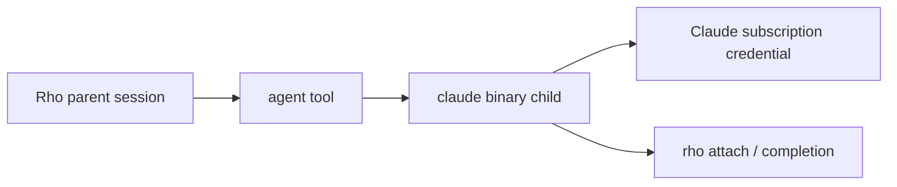
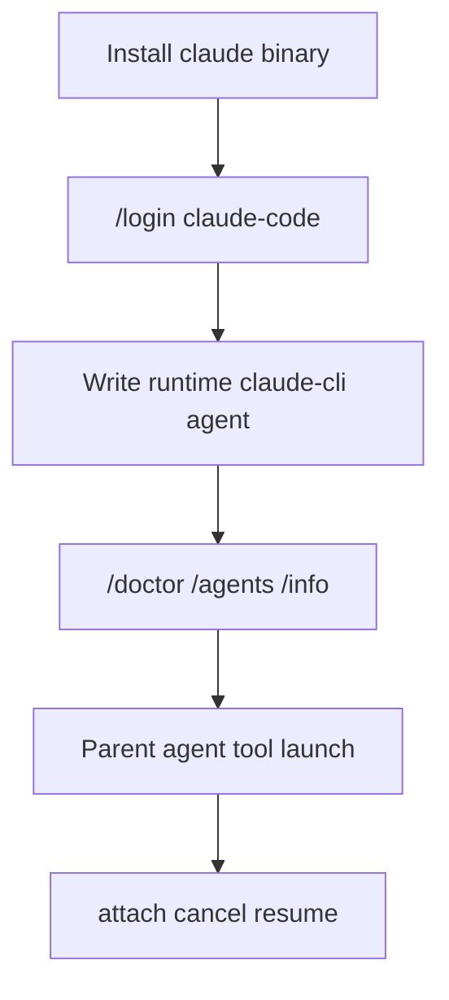

# Claude Code as a delegated runtime

Parent: [Agents and delegation](/subagents).

Rho can hand a delegated agent to the installed `claude` binary instead of running Rho's own loop. The parent stays in Rho. The child uses Claude Code's harness and the user's Claude subscription. Model choice and runtime choice stay separate: picking an Anthropic model on the Rho runtime is not the same as `runtime: claude-cli`.



## Subscription workaround

Anthropic does not allow third-party clients to sign in with Claude.ai Free/Pro/Max credentials or to route those plans through their own API stacks. Rho's Anthropic provider path is API-key billing only.

`runtime: claude-cli` is the supported **indirect** way to spend a Claude subscription from a Rho session: Rho stays the parent orchestrator, and the official `claude` binary owns sign-in, the child loop, and plan usage. Rho never sees or stores the subscription token. This is not a substitute for Anthropic API access inside Rho's own runtime, and it is not a root-session Claude Code mode.

## When this is useful

Use `runtime: claude-cli` when you want that subscription-backed child while the main session stays on Rho:

- Use a Claude Pro/Max plan on planning, review, or research without making Claude Code the root harness
- Keep Rho as the orchestrator (fan-out, attach, cancel, session tree) while Claude owns the child loop and credential
- Reuse Claude Code tool names and permission behaviour for a bounded child task
- Open the full Claude transcript later with `claude --resume <session-id>` after Rho finishes the run

Skip this feature when you only need "a subagent on Opus" through Rho's normal provider path (API key or another provider). Set `model:` / `provider:` on a `runtime: rho` agent instead. You do not need the `claude` binary for that.

Claude-cli agents are **delegated only**. The interactive root and `rho run` root cannot bind `runtime: claude-cli`. A Rho parent must launch them through the `agent` tool.

## How to use it



1. **Install the binary** (Rho does not ship it):

   ```bash
   curl -fsSL https://claude.ai/install.sh | bash
   claude --version
   ```

   See [Claude Code binary](/installation#claude-code-binary-optional).

2. **Sign in from Rho** so Claude Code stores the subscription credential:

   ```text
   /login claude-code
   ```

   Or open bare `/login`, pick **Anthropic**, then **Claude Code (delegation only)**. Rho hands the terminal to `claude auth login --claudeai` and never sees or stores the token. Details: [Claude Code runtime sign-in](/authentication-and-models#claude-code-runtime-sign-in).

3. **Write a delegated agent definition** (there is no built-in Claude agent). Use the `rho-agent-creator` skill for a guided questionnaire, or write a file such as `~/.rho/agents/claude-planner.md`:

   ```markdown
   ---
   id: claude-planner
   description: Use Claude Code to plan with an Anthropic model
   runtime: claude-cli
   model: claude-opus-5
   reasoning: high
   tools: [Read, Glob, Grep]
   inherit_claude_config: false
   ---
   Produce a short plan. Prefer reading before editing.
   ```

   Notes:

   - `tools:` uses Claude Code names (`Read`, `Edit`, `Bash(git *)`), not Rho capabilities
   - Omitting `tools` means no tools. There is no `tools: all`
   - `model:` is a Claude model alias such as `opus`, or a full Claude model name. It is not a Rho `@alias`. In `/agents`, the Model row offers the aliases Rho knows (`fable`, `opus`, `sonnet`, `haiku`) plus a Claude Code default row; a definition that pins a full model name keeps its own row
   - optional `reasoning:` maps to Claude `--effort` (`low`/`medium`/`high`/`xhigh`/`max`); omit to inherit Claude's default; `off` and `minimal` are rejected
   - Keep permission mode at Plan or Bypass before launch. Auto, Allow edits, and Supervised refuse Claude-cli spawn because `claude -p` cannot run Rho's classifier or prompt through Rho

4. **Confirm setup** in the TUI:

   ```text
   /doctor
   /agents
   /info
   ```

   `/doctor` checks binary and auth health. `/agents` shows runtime and Claude tool lists. `/info` shows Claude Code ownership wording when signed in.

5. **Delegate from a Rho root session** (interactive or automation parent on `runtime: rho`):

   Ask the parent to call the `agent` tool with `agent_id: claude-planner` and a clear prompt. Use foreground for a blocking result, or background for a run ID plus later completion notification.

6. **Watch, cancel, and resume**:

   ```bash
   rho attach <run-id>
   ```

   Cancel through the `agents` tool or parent shutdown. When the run finishes, attach and the completion entry may show `claude_session_id`. Reopen the Claude-side transcript with:

   ```bash
   claude --resume <session-id>
   ```

   After at least one Claude-cli run has reported limits, `/limits` shows the last observed Claude rate-limit windows (no live probe, no invented percentage).

## Quick checklist

| Step | Command or field |
| --- | --- |
| Install | `claude` on `PATH` |
| Sign in | `/login claude-code` |
| Define | `runtime: claude-cli` + Claude `tools:` / `model:` |
| Permission mode | Plan or Bypass (not Auto, Allow edits, or Supervised) |
| Launch | Rho parent `agent` tool, delegated only |
| Inspect | `rho attach <id>`, `/agents`, `/limits` |
| Full Claude transcript | `claude --resume <session-id>` |

## Claude CLI execution details

A `runtime: claude-cli` agent runs as `claude -p` with stream-json output. Rho owns the parent tree node; Claude owns the child loop and credential.

Before spawn, Rho checks `claude auth status`. If the binary is missing or the user is signed out, the run fails immediately with a message pointing at `/login claude-code`. Rho never stores Claude tokens.

Spawn flags are fixed and deliberate:

| Flag | Behaviour |
| --- | --- |
| `--output-format stream-json --verbose --include-partial-messages` | NDJSON event stream with partial text |
| `--input-format stream-json` | NDJSON user turns on stdin so the parent can course-correct a live child |
| `--permission-mode` | Always set from a Claude-native mode. Delegated runs map Rho Plan to Claude `plan` and Rho Bypass to Claude `bypassPermissions` (just run; not Claude classifier `auto`, not `dontAsk`). Advisor one-shots set Claude `dontAsk` directly so they stay non-prompting without plan scaffolding. Auto, Allow edits, and Supervised refuse before spawn. |
| `--disallowedTools Task` | Blocks Claude nested subagents so fan-out stays under Rho |
| `--tools` | Restricts built-in tool availability to the base Claude tool names from `tools:`. Empty allowlist still sets `--tools ""` so ambient tools are not inherited |
| `--allowedTools` | Every declared non-`Task` tool entry from `tools:` as separate argv values (bare names such as `Read` and patterns such as `Bash(git *)`). `Task` is never listed here |
| `--setting-sources` | `project` by default. `user,project,local` only when `inherit_claude_config: true` |
| `--strict-mcp-config` | MCP servers only from what the spawn passes |
| `--system-prompt-file` / `--append-system-prompt-file` | From the agent definition body. `prompt: replace` writes a private run-dir file and passes `--system-prompt-file`; nonempty `prompt: extend` uses `--append-system-prompt-file`. Empty extend omits both flags. Prompt body bytes never appear on argv |
| `--model` | From the agent `model:` field when set, passed through unchanged. Omitted when the definition inherits Claude's model. Parent provider/model updates do not overwrite Claude agents |
| `--effort` | From agent `reasoning:` when set (`low`, `medium`, `high`, `xhigh`, `max`). Omitted when unset so Claude keeps its default. `off` and `minimal` never reach spawn |
| `--max-turns` | Exact configured step/turn cap from the bound launch data. If the installed binary rejects the flag, the run fails with a clear error |
| `--no-session-persistence` | Delegated agent runs omit it, so `claude --resume <session-id>` works. Rho's own one-shot calls, such as a Claude Code advisor, set it and leave no session behind |
| cwd | Explicit project directory |
| prompt | First stream-json user turn on stdin, not argv |

Parents can message a running Claude-cli child with the `agents` action `message`. Rho keeps stdin open, writes each body as another stream-json user turn (Claude queues it until the current turn ends), and closes stdin after the terminal `result` when no parent messages remain. Each parent message counts against `--max-turns`. Claude children do not get `message_parent` yet.

Stderr goes to `log.txt` in the run directory. Cancel kills the child. Terminal success or failure comes from the stream `result` message (`subtype` / `is_error`), not exit code alone.

## Usage, limits, and resume

Per-run usage (turns, tokens, cost) comes from Claude's terminal result and is stored on `result.json`. Cache read/write token fields stay separate on attachment usage events; `input_tokens` on the status file is the total input including cache so attach metrics stay consistent.

`/limits` shows last-observed Claude rate-limit windows reported during a run (window name, status, reset time, age). It does not invent a remaining percentage and does not spawn a probe run. If nothing has been observed yet, Claude limits are absent until a claude-cli run reports them.

When a run finishes, `result.json` may include `claude_session_id`. Attach and the parent completion entry show it so you can reopen the full Claude transcript with:

```bash
claude --resume <session-id>
```

Default concurrency is one global pool of 4 delegated runs (`RHO_AGENT_CONCURRENCY` overrides that total). Claude-cli runs also take a nested Claude permit capped at 2 by default (`RHO_CLAUDE_AGENT_CONCURRENCY` overrides that nested cap). The Claude pool is always `min(total, claude_cap)`, so overrides never open a 2N fan-out window and Claude never exceeds the global total.

## Auth ownership

| Action | Owner |
| --- | --- |
| Sign in | Claude Code via `/login claude-code` (terminal handoff to `claude auth login --claudeai`) |
| Sign out | Claude Code via `/logout claude-code` or `claude auth logout` (global, not Rho-only) |
| Credential storage | Claude binary only. Rho never sees or stores the token |
