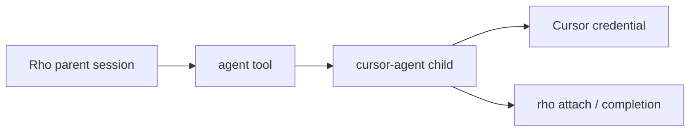
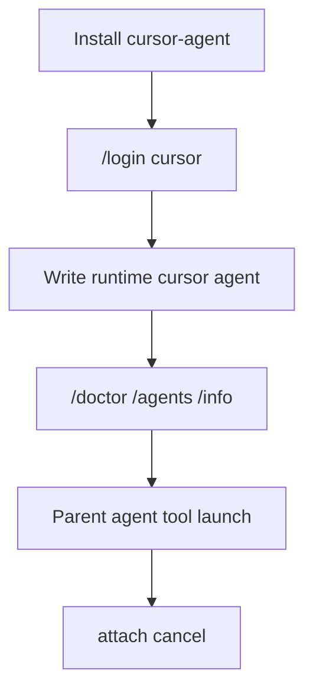

# Cursor Agent as a delegated runtime

Parent: [Agents and delegation](/subagents).

Rho can hand a delegated agent to the installed `cursor-agent` binary instead of running Rho's own loop. The parent stays in Rho. The child uses Cursor's harness and the user's Cursor sign-in. Model choice and runtime choice stay separate: picking a Cursor-compatible model on the Rho runtime is not the same as `runtime: cursor`.

Verified against `cursor-agent 2026.08.25`.



## When this is useful

Use `runtime: cursor` when you want a Cursor-backed child while the main session stays on Rho:

- Keep Rho as the orchestrator (fan-out, attach, cancel, session tree) while Cursor owns the child loop and credential
- Restrict the child with an explicit `--allowed-tools` list Rho already classified
- Reopen the Cursor transcript later with `cursor-agent --resume <session-id>` after Rho finishes the run

Skip this feature when you only need a Rho subagent on some other provider. Set `model:` / `provider:` on a `runtime: rho` agent instead. You do not need the `cursor-agent` binary for that.

Cursor agents are **delegated only**. The interactive root and `rho run` root cannot bind `runtime: cursor`. A Rho parent must launch them through the `agent` tool. `[internal_agents]` stays Rho or `claude-cli`; `runtime = "cursor"` there is rejected.

## How to use it



1. **Install the binary** (Rho does not ship it) and confirm it is on `PATH`:

   ```bash
   cursor-agent --version
   ```

2. **Sign in from Rho** so Cursor stores the credential:

   ```text
   /login cursor
   ```

   Rho never sees or stores the Cursor token.

3. **Write a delegated agent definition**. Run `/agents create` or `/create-agent`, or write a file such as `~/.rho/agents/cursor-reviewer.md`:

   ```markdown
   ---
   id: cursor-reviewer
   description: Use Cursor Agent to review with a pinned model
   runtime: cursor
   model: gpt-5.3-codex[effort=high,fast=false]
   tools: [read_tool_call, grep_tool_call, glob_tool_call]
   ---
   Review the requested changes. Prefer reading before editing.
   ```

   Notes:

   - `tools:` is required and nonempty. There is no `tools: all`. Names are the closed snake_case set Rho classified (`read_tool_call`, `edit_tool_call`, …). Unknown names fail parse and frozen resume.
   - `cursor-agent -p` enables every tool by default and `--exclude-tools` does not fence, so spawn always passes `--allowed-tools`.
   - `model:` is passed through as `--model`. Rho `@alias` references are rejected. Cursor allows brackets and commas for overrides such as `claude-opus-5[effort=high,fast=false]`. Omit `model` to let Cursor choose.
   - There is no `reasoning:` field. Put effort in the model id or a bracket override.
   - `prompt: replace` is rejected (`--system-prompt` is rejected server-side). Use `extend`.

4. **Confirm setup** in the TUI:

   ```text
   /doctor
   /agents
   /info
   ```

5. **Delegate from a Rho root session** through the `agent` tool. Use foreground for a blocking result, or background for a run ID plus later completion notification.

6. **Watch and cancel**:

   ```bash
   rho attach <run-id>
   ```

   Cursor children cannot be messaged. Each run is process-per-turn: stdin carries one prompt, then the process ends. Wait for completion instead of `agents` action `message`. When the run finishes, attach and the completion entry may show a Cursor session id. Reopen with:

   ```bash
   cursor-agent --resume <session-id>
   ```

## Permission modes

`cursor-agent -p` has no approval protocol. Rho maps only two classes and refuses the rest at bind:

| Rho mode | Cursor spawn |
| --- | --- |
| Plan | `--mode plan` plus the declared tools intersected with read-only names |
| Bypass | no `--mode`; declared tools run at full power inside the allow list |
| Auto, Allow edits, Supervised | refused (`cursor agents run only in Plan or Bypass`) |

An empty allow list after Plan's read-only filter is also refused: `-p` would otherwise enable every tool.

## Quick checklist

| Step | Command or field |
| --- | --- |
| Install | `cursor-agent` on `PATH` |
| Sign in | `/login cursor` |
| Define | `runtime: cursor` + nonempty Cursor `tools:` / optional `model:` |
| Permission mode | Plan or Bypass only |
| Launch | Rho parent `agent` tool, delegated only |
| Messaging | none; wait for completion |
| Inspect | `rho attach <id>` |
| Full Cursor transcript | `cursor-agent --resume <session-id>` |

## Execution details

A `runtime: cursor` agent runs as `cursor-agent -p` with stream-json output. Rho owns the parent tree node; Cursor owns the child loop and credential.

Before spawn, Rho checks `cursor-agent status --format json`. If the binary is missing or the user is signed out, the run fails immediately with a message pointing at `/login cursor`.

Default concurrency is the same global pool as other delegated runs (`behavior.agent_concurrency`). Cursor takes only that global permit. There is no nested Cursor cap yet: unlike Claude, there is no measured subscription fan-out limit to size one against.

See [Agent definition schema](/subagents/definition-schema) for the closed tool list and model rules.
