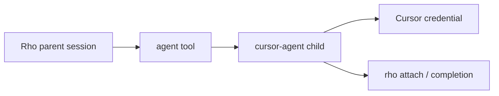
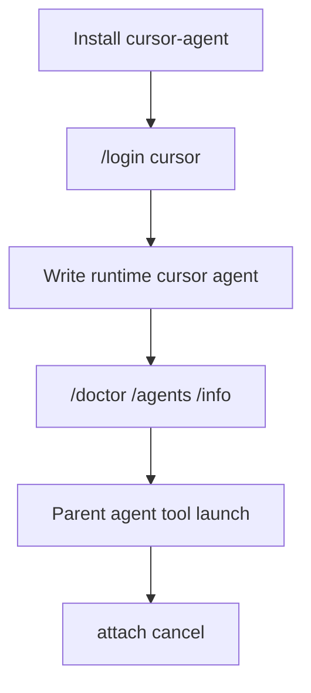

# Cursor Agent as a delegated runtime

Parent: [Agents and delegation](/subagents).

Rho can hand a delegated agent to the installed `cursor-agent` binary instead of running Rho's own loop. The parent stays in Rho. The child uses Cursor's harness and the user's Cursor sign-in. Model choice and runtime choice stay separate: picking a Cursor-compatible model on the Rho runtime is not the same as `runtime: cursor`.

Verified against `cursor-agent 2026.10.01`. Rho speaks the [Agent Client Protocol](https://agentclientprotocol.com) (ACP) to `cursor-agent acp`.


```mermaid
flowchart LR
    parent[Rho parent session] --> agentTool[agent tool]
    agentTool --> cursor[cursor-agent child]
    cursor --> sub[Cursor credential]
    cursor --> attach[rho attach / completion]
```

## When this is useful

Use `runtime: cursor` when you want a Cursor-backed child while the main session stays on Rho:

- Keep Rho as the orchestrator (fan-out, attach, cancel, session tree) while Cursor owns the child loop and credential
- Fence the child to an explicit `tools:` list Rho already classified
- Steer a running child with follow-up messages, delivered as its next turn

Skip this feature when you only need a Rho subagent on some other provider. Set `model:` / `provider:` on a `runtime: rho` agent instead. You do not need the `cursor-agent` binary for that.

Cursor agents are **delegated only**. The interactive root and `rho run` root cannot bind `runtime: cursor`. A Rho parent must launch them through the `agent` tool. `[internal_agents]` stays Rho or `claude-cli`; `runtime = "cursor"` there is rejected.

## How to use it


```mermaid
flowchart TD
    install[Install cursor-agent] --> login["/login cursor"]
    login --> def[Write runtime cursor agent]
    def --> doctor["/doctor /agents /info"]
    doctor --> launch[Parent agent tool launch]
    launch --> watch[attach cancel]
```

1. **Install the binary** (Rho does not ship it) and confirm it is on `PATH`:

   ```bash
   cursor-agent --version
   ```

2. **Sign in from Rho** so Cursor stores the credential:

   ```text
   /login cursor
   ```

   Rho never sees or stores the Cursor token.

3. **Write a delegated agent definition**. Run `/agents create` or `/create-agent`, or write a file such as `~/.rho/agents/cursor-reviewer.md`:

   ```markdown
   ---
   id: cursor-reviewer
   description: Use Cursor Agent to review with a pinned model
   runtime: cursor
   model: gpt-5.3-codex[effort=high,fast=false]
   tools: [read_tool_call, grep_tool_call, glob_tool_call]
   ---
   Review the requested changes. Prefer reading before editing.
   ```

   Notes:

   - `tools:` is required and nonempty. There is no `tools: all`. Names are the closed snake_case set Rho classified (`read_tool_call`, `edit_tool_call`, …). Unknown names fail parse and frozen resume.
   - Cursor enables every tool by default. Rho derives each run's fence from `tools:` (see [Permission modes](#permission-modes)).
   - `model:` is the exact Cursor id from `cursor-agent models` (1:1; effort/fast/thinking variants are not collapsed). Rho `@alias` references are rejected. Bracket overrides such as `claude-opus-5[effort=high,fast=false]` still work. Omit `model` to let Cursor choose.
   - The agent editor lists cached models grouped by display-name family, with badges for default / current / no ZDR. **Other…** types an id or a bracket override. If a pinned id is missing from a non-empty cache, bind warns and still runs.
   - There is no `reasoning:` field. Put effort in the model id or a bracket override. The reasoning selector stays hidden for `runtime: cursor`.
   - `prompt: replace` is rejected (ACP has no system-prompt override). Use `extend`: the body is prepended to the first prompt.

4. **Confirm setup** in the TUI:

   ```text
   /doctor
   /agents
   /info
   ```

5. **Delegate from a Rho root session** through the `agent` tool. The call returns a run ID immediately, followed by an automatic completion notification.

6. **Watch and cancel**:

   ```bash
   rho attach <run-id>
   ```

   `agents` action `message` queues plain text for a running Cursor child. Rho sends it as the next `session/prompt` once the current turn ends; the transcript shows it as a queued parent message. Messages sent after the run finishes fail.

## Permission modes

Under `acp`, Cursor ignores `--allowed-tools` and `--mode`, and whether it asks permission depends on its own config. For every run Rho therefore:

1. Copies the user's `cli-config.json` (from `CURSOR_CONFIG_DIR`, else `$XDG_CONFIG_HOME/cursor`, else `~/.cursor`) into `<run dir>/cursor-config/` (directory `0700`, file `0600`), forcing `approvalMode: "allowlist"` and `autoAcceptWebSearch: false`, and replacing `permissions` with a deny list derived from `tools:` and the mode. Other keys (model, privacy, unknown fields) are kept. Reading the user's file is capped at 1 MiB; a larger file fails the run with the limit and the size.
2. Spawns `cursor-agent --trust [--model M] acp` with `CURSOR_CONFIG_DIR` pointing at that copy. Credentials are not in the config dir (Linux: `$XDG_CONFIG_HOME/cursor/auth.json`), so sign-in is unaffected.
3. Answers every `session/request_permission` itself, choosing only the one-shot allow or reject option. Rho never persists an "always" approval.

Rho maps only two permission classes and refuses the rest at bind:

| Rho mode | Cursor session |
| --- | --- |
| Plan | `session/set_mode plan`; declared tools intersected with read-only names; writes and shell denied; every permission request rejected |
| Bypass | agent mode; declared tools allowed; permission requests allowed only for declared categories |
| Auto, Allow edits, Supervised | refused (`cursor agents run only in Plan or Bypass`): Rho cannot ask a human to approve a Cursor tool call |

An empty tool list after Plan's read-only filter is also refused.

Cursor can only fence whole categories, so Rho fences at that granularity and prints one notice listing declared exclusions it cannot enforce individually:

| Category | Tools | Enforcement |
| --- | --- | --- |
| Read | `read_tool_call` | config deny `Read(**)` when not declared |
| Write | `edit_tool_call`, `delete_tool_call`, `apply_agent_diff_tool_call` | config deny `Write(**)` when not declared or in Plan |
| Shell | `shell_tool_call`, `write_shell_stdin_tool_call` | config deny `Shell(*)` when not declared or in Plan; permission requests rejected likewise |
| Fetch | `web_fetch_tool_call`, `fetch_tool_call`, `web_search_tool_call` | permission answers only (Cursor ignores a `WebFetch(*)` deny); Rho forces `autoAcceptWebSearch: false` so web search always asks |
| MCP | `mcp_tool_call`, `list_mcp_resources_tool_call`, `read_mcp_resource_tool_call` | permission answers only for Cursor's MCP request shape (kind `other`, title `<server>: <tool>`); other kinds, including think, switch_mode, and undescribed operations, are rejected |
| Search | `grep_tool_call`, `glob_tool_call`, `ls_tool_call`, `sem_search_tool_call`, `read_lints_tool_call` | **not fenceable**: Cursor runs these without asking |
| Session artifacts | `update_todos_tool_call`, `read_todos_tool_call`, `create_plan_tool_call` | not fenced |

Cursor reports denied tools as `completed`. When Rho rejects a permission request whose id matches the tool call (shell), the card shows as rejected. Tools blocked by a config deny (read, write) and rejected fetch or web search (Cursor uses a separate permission id) still appear as completed cards; the model sees the denial.

Cursor-specific requests are answered headlessly: `cursor/ask_question` is skipped with an instruction to pick the best option and continue, and `cursor/create_plan` is accepted in Bypass and rejected in Plan (the plan becomes the final answer). Other Cursor extension requests get `method not found`.

Frozen workflow relaunches that narrow a Bypass agent under an Auto or Allow-edits host are refused at bind (Cursor cannot represent those modes). Rerun under Plan or Bypass.

## Quick checklist

| Step | Command or field |
| --- | --- |
| Install | `cursor-agent` on `PATH` |
| Sign in | `/login cursor` |
| Define | `runtime: cursor` + nonempty Cursor `tools:` / optional `model:` |
| Permission mode | Plan or Bypass only |
| Launch | Rho parent `agent` tool, delegated only |
| Messaging | `agents` action `message`; delivered as the next turn |
| Inspect | `rho attach <id>` |

## Execution details

A `runtime: cursor` agent runs as `cursor-agent acp` over stdio JSON-RPC. Rho owns the parent tree node; Cursor owns the child loop and credential. Each ACP handshake step (`initialize`, `session/new`, `session/set_mode`) has a 10 s budget; measured `session/new` took 2.4–3.4 s. Rho never calls ACP `authenticate` (it fails under API-key auth and would open a browser otherwise).

If the binary is missing, the run fails immediately with `cursor: binary not found on PATH`. If the user is signed out, `session/new` fails with Cursor's `Authentication required` error. Rho does not preflight `cursor-agent status`: it can disagree with what the agent accepts (for example, it reports signed out when only `CURSOR_API_KEY` is set).

If you sign in with `CURSOR_API_KEY`, keep it exported for every run. Cursor saves the key in its `auth.json`, and `cursor-agent acp` (Cursor 2026.10.01) started without `CURSOR_API_KEY` deletes that `auth.json` on startup when it holds a saved key; the run then fails with `Authentication required`, while `cursor-agent -p` and `status` keep working. To use a browser login instead, run `cursor-agent logout` and then `cursor-agent login`.

Cancel sends `session/cancel` and waits up to 200 ms for the turn to end before terminating the child. A cancelled run always ends Stopped, even if the agent hangs up instead of answering. Rho always terminates the child after the last turn, because `cursor-agent acp` does not exit on stdin EOF. If the child exits mid-turn, Rho kills the rest of its process group (so an inherited pipe cannot keep the run alive) and fails the run with the exit status.

Known gaps compared with Claude runs:

- ACP reports no token usage or cost, so Cursor runs show none.
- The ACP session id is not a `cursor-agent --resume` id, and chats for these runs are stored under the run's managed config dir rather than the user's Cursor config, so there is no Cursor-side resume path.
- `result.json` carries the last assistant text segment of the final turn as the result.

Model discovery is `cursor-agent models` (plain text, account-scoped). Rho caches the list for 24 hours in the provider-models SQLite cache under the `cursor` key, keyed to the signed-in account. `/login cursor` and `/doctor` refresh the cache when signed in. The agent editor opens immediately on cached rows and refreshes in the background; it never blocks the UI on the probe.

Default concurrency is the same global pool as other delegated runs (`behavior.agent_concurrency`). Cursor takes only that global permit. There is no nested Cursor cap yet: unlike Claude, there is no measured subscription fan-out limit to size one against.

See [Agent definition schema](/subagents/definition-schema) for the closed tool list and model rules.
