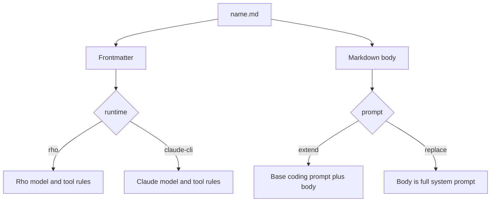

# Agent definition schema

Parent: [Agents and delegation](/subagents).

This is the parse contract for agent Markdown files. Unknown frontmatter keys fail. Invalid values fail before execution. Field order does not matter; `runtime` is resolved before `tools`.



## File shape

```text
---
<yaml-like frontmatter keys>
---
<markdown body>
```

| Part | Rule |
| --- | --- |
| Frontmatter | Starts and ends with a line that is exactly `---` |
| Body | Markdown after the closing `---`. Trimmed. Used by `prompt` |
| Encoding | Text file, one agent |

## Frontmatter fields

| Field | Type | Required | Default | Allowed values / constraints |
| --- | --- | --- | --- | --- |
| `id` | string | no | file stem (`name` in `name.md`) | 1-64 chars; lowercase ASCII letters, digits, single hyphens only; no leading/trailing/double hyphen |
| `description` | string | yes | - | 1-1024 Unicode characters after trim; empty rejected |
| `runtime` | enum | no | `rho` | `rho` \| `claude-cli` |
| `prompt` | enum | no | `extend` | `extend` \| `replace`. `replace` requires a non-empty Markdown body |
| `model-policy` | enum | no | see model rules | Depends on `runtime` (below) |
| `model` | string | policy-dependent | unset | Non-empty; no whitespace. Rho may use `@alias`. Claude rejects `@alias` and passes the value to `--model` |
| `provider` | string | no | unset | Non-empty; no whitespace. **Rho only**. Rejected on `claude-cli` |
| `auth` | string | no | unset | Auth profile id (for example `xai-oauth`, `xai-api-key`). **Rho only**. Rejected on `claude-cli` and with `model-policy: inherit`. Must be a known profile; when set with `provider`, must be valid for that provider |
| `reasoning` | enum | no | unset (inherit) | Rho: `off` \| `minimal` \| `low` \| `medium` \| `high` \| `xhigh` \| `max`. Claude: `low` \| `medium` \| `high` \| `xhigh` \| `max` only (maps to `--effort`). `off` / `minimal` rejected on Claude |
| `tools` | `all` or string list | no | runtime-specific | See tool vocabulary. Mixing Rho and Claude names is a parse error |
| `inherit_claude_config` | bool | no | `false` | `true` \| `false`. `true` only with `runtime: claude-cli` |

Scalars are plain or single/double quoted. Booleans are only `true` / `false`. Lists use `[a, b]` form (comma-separated). Nested YAML maps/objects are not accepted.

## Model rules by runtime

Model selection depends on `runtime`. Rho can inherit or pin host models. Claude-cli passes model names through and rejects Rho-only fields.

**`runtime: rho` (default)**

| `model-policy` | `model` | `provider` | `auth` | Result |
| --- | --- | --- | --- | --- |
| omitted, no `model` | omitted | omitted | omitted | `inherit` |
| omitted, with `model` | required | optional | optional | treated as `select` |
| `inherit` | must omit | must omit | must omit | keep parent provider/model/auth |
| `prefer` \| `require` \| `select` | required | optional | optional | pin that selection; `@alias` allowed. Unset `auth` keeps a host login that fits the provider; otherwise the provider default auth is used |

**`runtime: claude-cli`**

| `model-policy` | `model` | `provider` / `auth` | Result |
| --- | --- | --- | --- |
| omitted / `inherit`, no `model` | omitted | must omit | Claude default model (no `--model`) |
| omitted / `select`, with `model` | required | must omit | pass-through `--model` |
| `prefer` \| `require` | - | - | rejected |
| any | `@...` | - | rejected (no Rho alias resolution) |
| any | any | set | rejected |

## Tool vocabulary by runtime

Tool lists are not shared across runtimes. Mixing Rho capability names and Claude tool entries is a parse error.

**`runtime: rho`**

| Form | Meaning |
| --- | --- |
| omitted or `tools: all` | all host-supplied Rho capabilities (default) |
| `tools: [name, ...]` | allowlist of Rho capabilities |

Built-in Rho capability names:

```text
agent
agents
bash
edit
fetch_content
get_search_content
glob
grep
list_dir
powershell
process
questionnaire
read_file
rho
shell
skill
web_search
write
```

Notes:

- `shell` resolves at bind time to the platform shell (`bash` or `powershell`) when that capability is available
- unknown names become extension capabilities and still fail bind unless the host supplies them
- delegated agents never receive `agent` / `agents` / `advisor` even if listed
- `questionnaire` is offered on delegated Rho runs when a parent session can answer; if the host cannot offer it for that launch, bind omits it instead of failing

**`runtime: claude-cli`**

| Form | Meaning |
| --- | --- |
| omitted | empty allowlist (no Claude tools) |
| `tools: all` | rejected |
| `tools: [entry, ...]` | Claude Code tool entries |

Each entry must match:

```text
ToolName
ToolName(specifier)
```

| Rule | Detail |
| --- | --- |
| Base name | non-empty; letters, digits, `_`, `-` only |
| Specifier | optional `(...)` with balanced parentheses; may contain spaces and quotes |
| Commas | not allowed inside a specifier (Claude list grammar cannot round-trip them) |
| Membership | open-ended (plugins/MCP may add tools); Rho checks shape, not a fixed catalog |
| Examples | `Read`, `Edit`, `Glob`, `Grep`, `Bash(git *)`, `mcp__server__tool` |

Base names feed Claude `--tools`. A specifier such as `Bash(git *)` still lists `Bash` there, and bare Bash, Edit, and Write skip the Rho Auto / Allow edits gate under Claude `dontAsk`, so those shapes refuse spawn. Full entries (except nested `Task`) feed `--allowedTools`. Nested Claude `Task` stays disallowed at spawn.

## Body / prompt semantics

| `prompt` | Body empty | Body non-empty |
| --- | --- | --- |
| `extend` (default) | keep base coding prompt only | append body to base coding prompt |
| `replace` | parse error | body becomes the full system prompt |

## JSON Schema (frontmatter)

Machine-readable shape for the frontmatter object after parse. Runtime-specific exclusions (`provider` on Claude, `tools: all` on Claude, `reasoning: off|minimal` on Claude, and model-policy combinations) are enforced in prose and by the Rho parser beyond plain JSON Schema.

```json
{
  "$schema": "https://json-schema.org/draft/2020-12/schema",
  "$id": "https://rho.dev/schemas/agent-definition-frontmatter.json",
  "title": "Rho agent definition frontmatter",
  "type": "object",
  "additionalProperties": false,
  "required": ["description"],
  "properties": {
    "id": {
      "type": "string",
      "minLength": 1,
      "maxLength": 64,
      "pattern": "^[a-z0-9]+(?:-[a-z0-9]+)*$"
    },
    "description": {
      "type": "string",
      "minLength": 1,
      "maxLength": 1024
    },
    "runtime": {
      "type": "string",
      "enum": ["rho", "claude-cli"],
      "default": "rho"
    },
    "prompt": {
      "type": "string",
      "enum": ["extend", "replace"],
      "default": "extend"
    },
    "model-policy": {
      "type": "string",
      "enum": ["inherit", "prefer", "require", "select"]
    },
    "model": {
      "type": "string",
      "minLength": 1,
      "pattern": "^\\S+$"
    },
    "provider": {
      "type": "string",
      "minLength": 1,
      "pattern": "^\\S+$"
    },
    "auth": {
      "type": "string",
      "minLength": 1,
      "pattern": "^\\S+$"
    },
    "reasoning": {
      "type": "string",
      "enum": ["off", "minimal", "low", "medium", "high", "xhigh", "max"]
    },
    "tools": {
      "oneOf": [
        { "const": "all" },
        {
          "type": "array",
          "items": { "type": "string", "minLength": 1 },
          "uniqueItems": true
        }
      ]
    },
    "inherit_claude_config": {
      "type": "boolean",
      "default": false
    }
  },
  "allOf": [
    {
      "if": {
        "properties": { "runtime": { "const": "claude-cli" } },
        "required": ["runtime"]
      },
      "then": {
        "properties": {
          "provider": false,
          "auth": false,
          "model-policy": { "enum": ["inherit", "select"] },
          "reasoning": { "enum": ["low", "medium", "high", "xhigh", "max"] },
          "tools": {
            "type": "array",
            "items": { "type": "string", "minLength": 1 }
          },
          "inherit_claude_config": { "type": "boolean" }
        },
        "not": {
          "required": ["model-policy", "model"],
          "properties": {
            "model-policy": { "const": "inherit" },
            "model": true
          }
        }
      }
    },
    {
      "if": {
        "properties": { "model-policy": { "const": "inherit" } },
        "required": ["model-policy"]
      },
      "then": {
        "not": {
          "anyOf": [
            { "required": ["model"] },
            { "required": ["provider"] },
            { "required": ["auth"] }
          ]
        }
      }
    },
    {
      "if": {
        "properties": {
          "model-policy": { "enum": ["prefer", "require", "select"] }
        },
        "required": ["model-policy"]
      },
      "then": { "required": ["model"] }
    }
  ]
}
```

## Examples

Rho agent:

```markdown
---
id: security-review
description: Reviews changes for security defects
runtime: rho
model-policy: inherit
reasoning: high
tools: [read_file, list_dir, bash]
---
Review the requested changes. Do not modify files.
```

Rho agent with pinned provider and OAuth auth:

```markdown
---
id: worker
description: Implements delegated tasks
runtime: rho
model-policy: prefer
model: grok-4.5
provider: xai
auth: xai-oauth
reasoning: medium
tools: all
---
Complete the delegated task fully before finishing.
```

Claude Code delegated agent:

```markdown
---
id: claude-planner
description: Plans with Claude Code on the user subscription
runtime: claude-cli
model: claude-opus-5
reasoning: high
tools: [Read, Edit, "Bash(git *)"]
inherit_claude_config: false
---
Produce a short plan. Prefer reading before editing.
```

Unknown fields, values, and tool references fail before execution. Definitions contain no credentials or mutable runtime state. New sessions store a v2 semantic fingerprint over behaviorally relevant fields, including `runtime`, tools, and `inherit_claude_config`, not file paths or formatting. Resume also accepts the exact pre-runtime-axis v1 fingerprint for unchanged default Rho definitions (`runtime: rho`, `inherit_claude_config: false`, Rho tools encoding). Real definition changes still fail resume.
