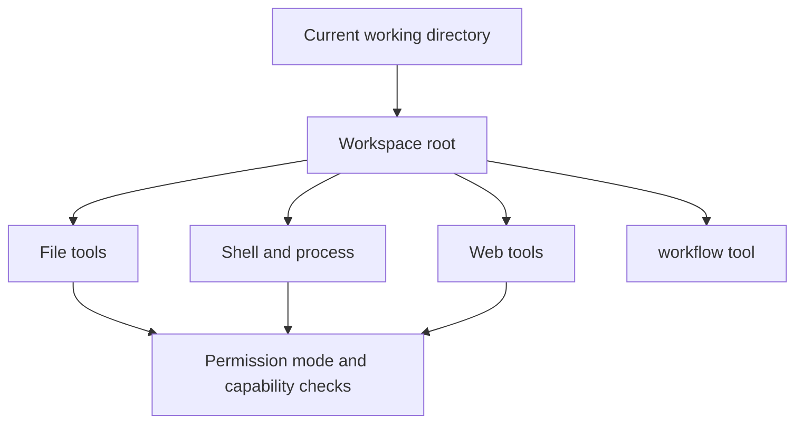
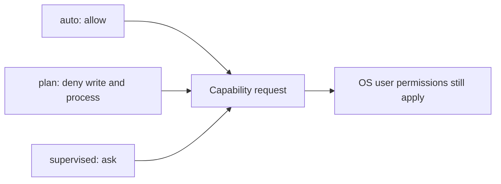

# Tools and workspace

Rho uses the current working directory as the workspace and as the base for relative file paths and shell commands. Start the [interactive TUI](/interactive-tui) or [automation command](/automation-cli) from the repository or directory you want Rho to use as its main work context.

File paths can point outside that directory with parent components such as `../` or with absolute paths. Read [Security and workspace boundaries](#security-and-workspace-boundaries) before you rely on permission modes as a sandbox.

## Built-in tools

Core workspace tools on every platform:

| Tool | Role |
| --- | --- |
| `list_dir` | List directory entries |
| `read_file` | Read text, documents, and images |
| `write` | Create or fully rewrite a file |
| `edit` | Apply line-anchored hunks to an existing UTF-8 file |
| `grep` | Search file contents with a regex (in-process) |
| `glob` | List paths that match a glob (in-process) |

Additional tools:

| Tool | Role |
| --- | --- |
| `bash` / `powershell` | Native shell for the current platform |
| `process` | Start, poll, or stop a managed background shell process |
| `web_search` | Hosted provider search when available, otherwise the configured backup |
| `fetch_content` | Fetch pages, GitHub URLs, local files, PDFs, and video targets |
| `get_search_content` | Retrieve stored content from a prior web tool call |
| `workflow` | Validate, freeze, run, inspect, cancel, or resume a durable workflow |
| `skill` | Load a skill into the session |
| `rho` | Read-only harness diagnostics |
| `advisor` | Second-model review when [advisor mode](/configuration/advisor-mode) is on |

Prefer `grep` and `glob` over shell search for workspace inspection. Both honor `.gitignore`, skip hidden files by default, never follow symlinks, and request read access only, so they work in every permission mode including `plan`.

Built-in skills that ship with the binary include `rho-diagnostics`, `rho-config`, `rho-agent-creator`, and `rho-workflow-authoring`. Custom skills live under `~/.rho/skills/<name>/SKILL.md`, `~/.agents/skills/<name>/SKILL.md`, or `<project-root>/.agents/skills/<name>/SKILL.md`. Set `disable-model-invocation: true` in a skill's frontmatter to keep it available only through `/skill:<name>`.

## Security and workspace boundaries

Tools run with the current user's permissions. File tools can read or modify any path that the user can access, including paths outside the workspace, and shell commands can do the same.

The default `auto` [permission mode](/configuration#permission-modes) allows this behavior. `plan` denies file writes and process execution, while `supervised` asks for interactive confirmation before those operations. Supervised non-interactive runs fail closed because no approval UI is available.

Permission modes are policy checks at Rho's tool-capability boundary, not an operating-system sandbox. They do not reduce the permissions of the Rho process itself, and they depend on tools correctly declaring and authorizing capabilities. The SDK still scopes file access by default; embedded hosts must opt into broader access when they build a `Workspace`. Run Rho only in workspaces where you are comfortable with the selected mode and these limits.

For session storage separate from the workspace, see [sessions](/sessions). For output-size settings, see [configuration](/configuration#tool-output-limit).

## File edits and writes

File edits use a hashline snapshot plus line-anchored `PUT`/`CUT` ops. Prefer `edit` for targeted changes and `write` for create-or-replace.

Successful `write` and `edit` results return model-facing hashline snapshots for chaining. Unified diffs are tool metadata for UI cards (not repeated in model content). In the interactive TUI, added lines are highlighted in green, removed lines in red, and diff headers in the accent color. This is useful in both the [interactive TUI](/interactive-tui) and [automation mode](/automation-cli).

Details: [Edit format](/tools-workspace/edit-format).

## Search tools

`grep` and `glob` run in-process, honor ignore rules, and stay read-only so they work in every permission mode including `plan`.

Details: [Search tools](/tools-workspace/search).

## Documents and images

`read_file` and `fetch_content` extract text-layer PDFs and Office docs under strict size limits, and can show bounded image thumbnails in supporting terminals.

Details: [Documents and images](/tools-workspace/documents-and-images).

## Web access and related tools

Web tools store large bodies by `responseId`, refuse private destinations by default, and add provider amenities such as xAI `x_search` when relevant.

Details: [Web access and related tools](/tools-workspace/web-access).

## Background processes

The `process` tool starts, polls, and stops managed background shell commands owned by the current Rho instance only.

Details: [Background processes](/tools-workspace/background-processes).
