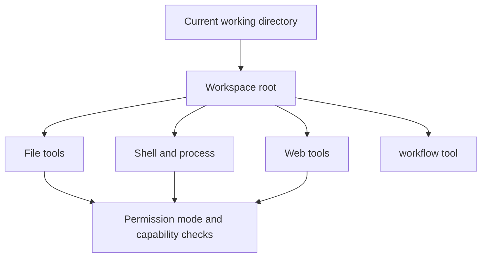
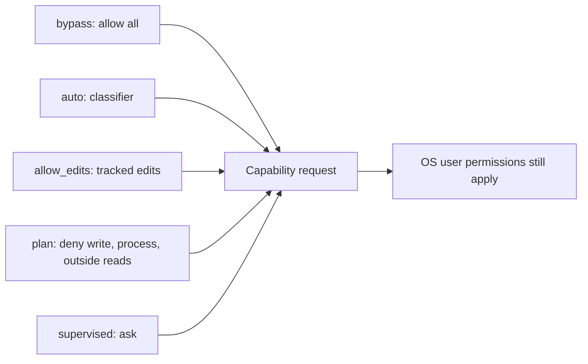

# Tools and workspace

Rho uses the current working directory as the workspace and as the base for relative file paths and shell commands. Start the [interactive TUI](/interactive-tui) or [automation command](/automation-cli) from the repository or directory you want Rho to use as its main work context.

File paths can point outside that directory with parent components such as `../` or with absolute paths. Read [Security and workspace boundaries](#security-and-workspace-boundaries) before you rely on permission modes as a sandbox.

## Built-in tools

Core workspace tools on every platform:

| Tool | Role |
| --- | --- |
| `list_dir` | List directory entries |
| `read_file` | Read text, documents, and images |
| `write` | Create or fully rewrite a file |
| `edit`, `apply_patch`, or `str_replace` | Edit files with the selected format |
| `grep` | Search file contents with a regex (in-process) |
| `glob` | List paths that match a glob (in-process) |

Rho exposes exactly one edit tool at a time. Select it with [`behavior.edit_tool`](/configuration#edit-tool) or `/config` > **Tools** > **Edit tool**. The default is `auto`, which picks the format the active provider's models were trained to use in their first-party harness (`apply_patch` for Codex, `str_replace` for Anthropic and xAI, `hashline` otherwise). See [Edit tool](/configuration#edit-tool) for the full catalog and pin options.

Additional tools:

| Tool | Role |
| --- | --- |
| `bash` / `powershell` | Native shell for the current platform ([RTK](/integrations/rtk) rewrite when available) |
| `process` | Start, poll, or stop a managed background shell process |
| `web_search` | Hosted provider search when available, otherwise the configured backup |
| `fetch_content` | Fetch pages, GitHub URLs, local files, PDFs, and video targets |
| `get_search_content` | Retrieve stored content from a prior web tool call |
| `workflow` | Validate, freeze, run, inspect, cancel, or resume a durable workflow |
| `skill` | Load a skill into the session |
| `rho` | Read-only harness diagnostics |
| `advisor` | Second-model review when [advisor mode](/configuration/advisor-mode) is on |

Prefer `grep` and `glob` over shell search for workspace inspection. Both honor `.gitignore`, skip hidden files by default, never follow symlinks, and request read access only, so workspace-scoped searches work in every permission mode including `plan`. Agent shell commands can use [RTK](/integrations/rtk) for token-efficient output when the binary is installed.

Built-in skills that ship with the binary include `rho-diagnostics`, `rho-config`, `rho-agent-creator`, and `rho-workflow-authoring`. Custom skills live under `~/.rho/skills/<name>/SKILL.md`, `~/.agents/skills/<name>/SKILL.md`, or `<project-root>/.agents/skills/<name>/SKILL.md`. Set `disable-model-invocation: true` in a skill's frontmatter to keep it available only through `/skill:<name>`.

## Security and workspace boundaries

Tools run with the current user's permissions. File tools can resolve any path the user can access, including paths outside the workspace, and shell commands can do the same. Checked permission modes still authorize those paths: workspace-scoped reads are free, while reads outside the workspace ask first (`auto`, `allow_edits`, `supervised`) or are denied (`plan`).

The default `bypass` [permission mode](/configuration#permission-modes) allows this behavior. `auto` uses the same write, process, and outside-read gate as `allow_edits`; a configured classifier model approves or denies only the requests that gate does not allow. `allow_edits` allows in-workspace writes to git-tracked, non-symlink files and later writes to a path already allowed this session. Untracked and gitignored paths, writes outside the workspace, process execution, and reads outside the workspace still ask first. `plan` denies file writes, process execution, and reads outside the workspace, while `supervised` asks for interactive confirmation before those operations. Supervised and Allow edits runs without an approval UI and headless Auto runs without a classifier model fail closed.

Permission modes are policy checks at Rho's tool-capability boundary, not an operating-system sandbox. They do not reduce the permissions of the Rho process itself, and they depend on tools correctly declaring and authorizing capabilities. The SDK still scopes file access by default; embedded hosts must opt into broader access when they build a `Workspace`. Run Rho only in workspaces where you are comfortable with the selected mode and these limits.

For session storage separate from the workspace, see [sessions](/sessions). For output-size settings, see [configuration](/configuration#tool-output-limit).

## File edits and writes

Rho supports three edit formats and registers only the selected tool:

- `edit` (config/selector `hashline`) applies snapshot-tagged, line-anchored `PUT` and `CUT` operations to existing files.
- `apply_patch` applies Codex-style add, delete, update, and move sections across one or more files. Patch paths must be workspace-relative, must not contain `..`, and `Add File` targets must not exist.
- `str_replace` replaces an exact string in one existing file, with an optional `replace_all` flag.

Use `write` for a complete create-or-replace operation. Successful file mutations return model-facing snapshots for chaining, while unified diffs stay in tool metadata for UI cards. In the interactive TUI, added and removed lines use a soft green/red row wash with theme-colored `+`/`-` signs and base or syntax-highlighted content, and diff headers use the accent color.

Details for the default format: [Hash-line edit format](/tools-workspace/edit-format).

## Search tools

`grep` and `glob` run in-process, honor ignore rules, and stay read-only so workspace-scoped searches work in every permission mode including `plan`.

Details: [Search tools](/tools-workspace/search).

## Documents and images

`read_file` and `fetch_content` extract text-layer PDFs and Office docs under strict size limits, and can show bounded image thumbnails in supporting terminals.

Details: [Documents and images](/tools-workspace/documents-and-images).

## Web access and related tools

Web tools store large bodies by `responseId`, refuse private destinations by default, and add provider amenities such as xAI `x_search` and `image_generation` when relevant.

Details: [Web access and related tools](/tools-workspace/web-access).

## Background processes

The `process` tool starts, polls, and stops managed background shell commands owned by the current Rho instance only.

Details: [Background processes](/tools-workspace/background-processes).
