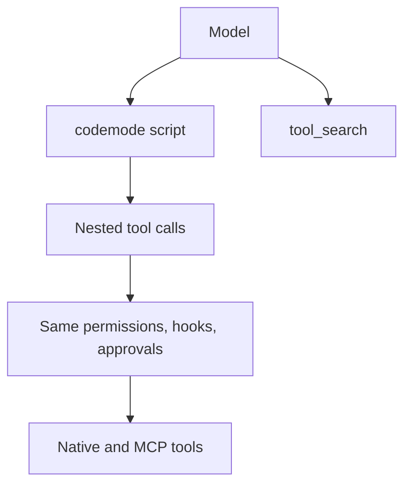

# Codemode

Parent: [Tools and workspace](/tools-workspace).

The `codemode` tool lets the model chain other tools in a short
[Starlark](https://github.com/bazelbuild/starlark) script instead of making one
tool call per model turn. Scripts can call native tools such as `read_file`,
`grep`, and `bash`, and tools from connected [MCP servers](/integrations). The
script reduces the results and returns only what the model needs, so large
intermediate output stays out of the context.

`codemode` and its companion `tool_search` are available in every session that
has tools enabled.



## Modes

`[codemode] mode` controls which tools the model sees directly. It does not change
what scripts can call.

| Tools | `on` (default) | `only` |
| --- | --- | --- |
| `codemode`, `tool_search` | declared | declared |
| Native tools | declared | script-only |
| MCP tools | script-only | script-only |

- `on`: the model can call native tools directly or through a script.
- `only`: the model reaches every other tool through `codemode`. If the model
  calls an undeclared tool directly, Rho returns an unavailable-tool error.

Rho never sends MCP tool schemas to the provider. To find a tool, the model
calls `tool_search`, which returns names, descriptions, and parameter and return
schemas. Scripts use `search_tools` or `list_tools` for compact name-and-description
summaries, then `describe_tool` for complete schemas. Finding a tool does not add
it to the direct list.

Set the mode in [configuration](/configuration#codemode) or with
`/codemode on|only` in the [interactive TUI](/interactive-tui). The command
applies to the next model request and saves the preference. Bare `/codemode`
shows the current mode.

## Permissions

Codemode is not a permission level. Each nested call goes through the same
[permission mode](/configuration/permissions), hooks, and approval session as a
direct call. A call that needs approval pauses the script until you allow or deny
it, and approvals you already gave apply to nested calls too. Questions from a
nested tool reach you through the parent `codemode` call. Cancelling the parent
call cancels the nested call that is running.

A script cannot call `codemode` or `tool_search`. Rho rejects either name as an
unknown tool.

## Script API

Scripts use standard Starlark: `def`, `for`, `if`, comprehensions, and f-strings.
There is no `while`, `try`, `import`, or exception handling.

| Function | Returns |
| --- | --- |
| `call_tool(name, args=None)` | One result envelope |
| `call_tools([(name, args), ...])` | Result envelopes in input order |
| `search_tools(query, limit=10)` | `[{name, description}]` rows |
| `list_tools(limit=50)` | `[{name, description}]` rows |
| `describe_tool(name)` | Full catalog entry, including the `parameters` and `returns` schemas |
| `print(...)` | Captures a line of output |

Each result envelope is `{is_error, content, data}`:

- `is_error`: `True` for a completed tool failure, such as a shell command that
  exited nonzero or an MCP `isError` response, and for invocation errors returned
  by `call_tools`, such as denial or invalid arguments.
- `content`: the text the model would have seen from a direct call.
- `data`: the tool's structured result, or `None` when the tool returns text only
  or the value exceeds the tool output limit. See
  [Structured output](/sdk/tools#structured-output) for built-in result shapes.

`call_tool` returns completed failures as values, so the script can branch on
`is_error`. Invocation errors, including denial, invalid arguments, and errors
that prevent a completed output, raise a script error instead.

`call_tools` runs independent calls concurrently, up to 4 at once. That is the
same limit Rho applies to a parallel tool batch from the model. A script must
make dependent calls in order itself. Invocation errors in a batch become
per-item `{is_error: True, content, data: None}` envelopes; sibling calls keep
going and results stay in input order. Parent cancellation and rejection of
the whole batch for exceeding the nested-call budget fail the script instead.
Check every returned envelope before using its data, including batch results.
A non-error envelope can still have `data: None` for text-only or oversized
results.

Assign `result = ...` to return a JSON value. On success, the model receives the
printed lines followed by `result`. A value that cannot be represented as JSON
fails the script instead of becoming `null`.

```python
hits = call_tool("grep", {"pattern": "TODO", "path": "src"})
files = [] if hits["is_error"] else [f["path"] for f in hits["data"]["files"]]
print(f"{len(files)} files with TODOs")
result = files[:20]
```

## Waiting for a process

Scripts do not receive process-exit notifications. To wait within a script,
check each `process` result envelope, then poll with `data.process_id` and
`cursor: data.next_cursor` while `data.state` is `"starting"` or `"running"`.
Use `wait_seconds` to wait for output or completion rather than busy-polling.
If you also need all output, continue polling while `data.output_pending` is
true, even after the state becomes terminal.

Oversized structured snapshots return a smaller page of `data.chunks` while
keeping their control fields. `data.next_cursor` points to the first deferred
chunk; the next poll retrieves it while it remains retained. An optional
`data.output_budget` notice reports `max_output_bytes`, the original
`received_bytes`, and counts of `deferred_chunks` and `omitted_chunks`. A chunk
that cannot fit by itself is omitted and its cursor consumed, matching the
process poll budget policy; model-facing text is unchanged by this JSON paging
step. Ordinary retention loss still appears as `data.truncated`. If even the
control fields exceed the limit, the existing truncation notice appears in
`content` and `data` is `None`; stop and report that result rather than polling
without a cursor.

## Limits

| Limit | Value |
| --- | --- |
| Nested tool calls per script | 64 |
| Interpreter steps | 100,000 |
| Heap | 8 MiB |
| Call stack depth | 64 frames |
| Output (prints plus `result`) | Native tool output limit |

A `call_tools` batch counts toward the 64-call limit before any call in it starts.
There is no separate wall-clock limit for scripts; each nested tool keeps its own
timeout. A script that fails retains its captured prints and call log. The
model-facing text shows prints first, then the failure diagnostic. If that
output exceeds the limit, prints are truncated with a notice so the failure
block survives. The structured codemode result includes an `error` string with
the full multi-line Starlark diagnostic on failure; that field is omitted on
success.

## In the TUI

The `codemode` card streams the literal script with syntax highlighting **while
the model generates the script argument**, before the argument JSON closes or
the script executes. This is decoded source, not escaped JSON or nested-call
execution progress. A collapsed generating card follows the newest source rows
within the tool-card display budget; expand it with Ctrl+O to inspect all source
received so far. Earlier rows remain available rather than being discarded.

The card keeps its source shape during execution and after it finishes, when
the header gains the nested-call count. Completed and resumed cards use the
normal collapsed view from the beginning of the script; resumed sessions omit
the count.

Scripts use Python-style highlighting. Source lines up to 4 KiB keep their colors
when wrapped across terminal rows. Longer lines remain readable as plain text,
with a notice showing the line size and highlighting budget. Splitting a long
batch across source lines avoids this limit; it does not affect whether the
script can run.
