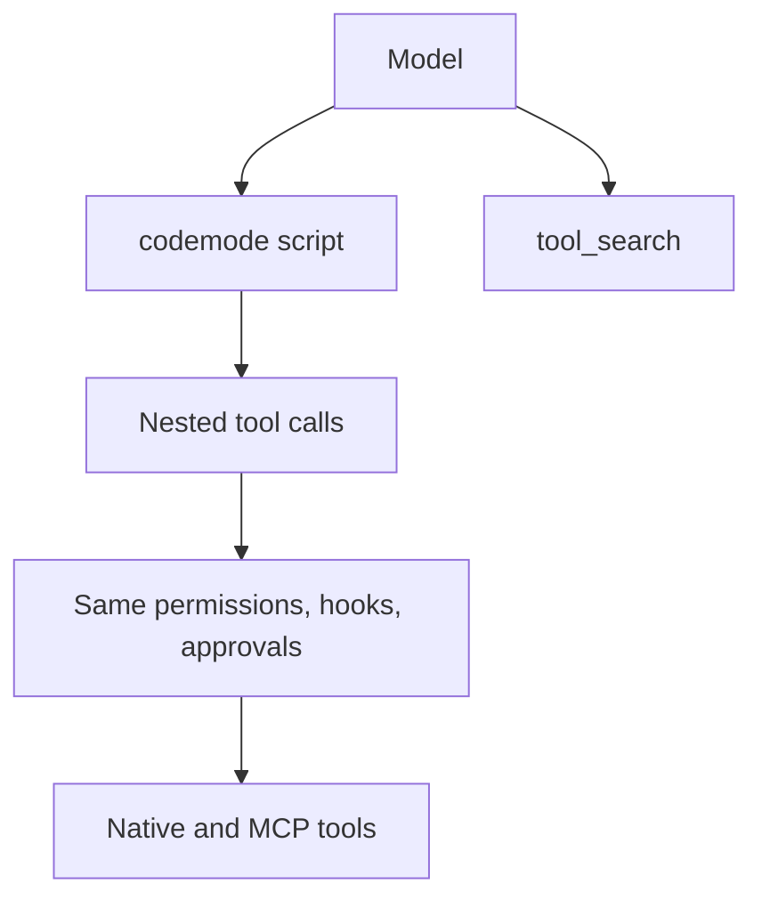

# Codemode

Parent: [Tools and workspace](/tools-workspace).

The `codemode` tool lets the model chain other tools in a short
[Starlark](https://github.com/bazelbuild/starlark) script instead of making one
tool call per model turn. Scripts can call native tools such as `read_file`,
`grep`, and `bash`, and tools from connected [MCP servers](/integrations). The
script reduces the results and returns only what the model needs, so large
intermediate output stays out of the context.

`codemode` and its companion `tool_search` are available in every session that
has tools enabled.



## Modes

`[codemode] mode` controls which tools the model sees directly. It does not change
what scripts can call.

| Tools | `on` (default) | `only` |
| --- | --- | --- |
| `codemode`, `tool_search` | declared | declared |
| Native tools | declared | script-only |
| MCP tools | script-only | script-only |

- `on`: the model can call native tools directly or through a script.
- `only`: the model reaches every other tool through `codemode`. If the model
  calls an undeclared tool directly, Rho returns an unavailable-tool error.

Rho never sends MCP tool schemas to the provider. To find a tool, the model
calls `tool_search`, or a script calls `search_tools`. Both return names,
descriptions, and result schemas. Finding a tool does not add it to the direct
list.

Set the mode in [configuration](/configuration#codemode) or with
`/codemode on|only` in the [interactive TUI](/interactive-tui). The command
applies to the next model request and saves the preference. Bare `/codemode`
shows the current mode.

## Permissions

Codemode is not a permission level. Each nested call goes through the same
[permission mode](/configuration/permissions), hooks, and approval session as a
direct call. A call that needs approval pauses the script until you allow or deny
it, and approvals you already gave apply to nested calls too. Questions from a
nested tool reach you through the parent `codemode` call. Cancelling the parent
call cancels the nested call that is running.

A script cannot call `codemode` or `tool_search`. Rho rejects either name as an
unknown tool.

## Script API

Scripts use standard Starlark: `def`, `for`, `if`, comprehensions, and f-strings.
There is no `while`, `try`, `import`, or exception handling.

| Function | Returns |
| --- | --- |
| `call_tool(name, args=None)` | One result envelope |
| `call_tools([(name, args), ...])` | Result envelopes in input order |
| `search_tools(query, limit=10)` | `[{name, description}]` rows |
| `list_tools(limit=50)` | `[{name, description}]` rows |
| `describe_tool(name)` | Full catalog entry, including the `returns` schema |
| `print(...)` | Captures a line of output |

Each result envelope is `{is_error, content, data}`:

- `is_error`: `True` when the tool ran but reported failure, such as a shell
  command that exited nonzero or an MCP `isError` response.
- `content`: the text the model would have seen from a direct call.
- `data`: the tool's structured result, or `None` when the tool returns text only
  or the value exceeds the tool output limit. See
  [Structured output](/sdk/tools#structured-output) for built-in result shapes.

A failed result is a value, so the script can branch on it. A denial, bad
arguments, or an error that stops a tool before it finishes raises a script
error.

`call_tools` runs independent calls concurrently, up to 4 at once. That is the
same limit Rho applies to a parallel tool batch from the model. A script must
make dependent calls in order itself. If one call in a batch cannot finish, its envelope reports an error
and the other calls still run.

Assign `result = ...` to return a JSON value. The model receives the printed
lines followed by `result`. A value that cannot be represented as JSON fails the
script instead of becoming `null`.

```python
hits = call_tool("grep", {"pattern": "TODO", "path": "src"})
files = [] if hits["is_error"] else [f["path"] for f in hits["data"]["files"]]
print(f"{len(files)} files with TODOs")
result = files[:20]
```

## Limits

| Limit | Value |
| --- | --- |
| Nested tool calls per script | 64 |
| Interpreter steps | 100,000 |
| Heap | 8 MiB |
| Call stack depth | 64 frames |
| Output (prints plus `result`) | Native tool output limit |

A `call_tools` batch counts toward the 64-call limit before any call in it starts.
There is no separate wall-clock limit for scripts; each nested tool keeps its own
timeout. A script that fails still returns its printed output and call log.

## In the TUI

The `codemode` card shows the script with syntax highlighting. While the script
runs, each nested call has a row with its status, main argument, duration, and
latest progress line. When the script finishes, the rows collapse into a call
count, so live and resumed sessions show the same card.
