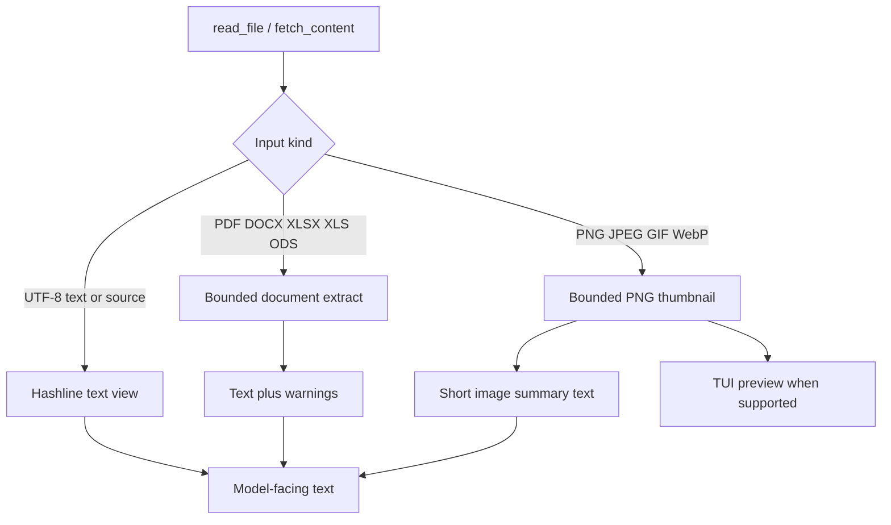

# Documents and images

Parent: [Tools and workspace](/tools-workspace).

Rho reads more than plain text. `read_file` and `fetch_content` share one
bounded document extractor for PDFs and Office files. `read_file` also builds a
safe image thumbnail for the interactive feed. The goal is the same in every
path: give the model useful content without loading unbounded bytes or graphics
into the session.

User paste and path drop use the same extractors. See
[attachments](/interactive-tui/attachments).

## Supported inputs

| Kind | Formats | Tools |
| --- | --- | --- |
| Text and source | UTF-8 files | `read_file`, paste as document attachment |
| Documents | PDF, DOCX, XLSX, XLS, ODS | `read_file`, `fetch_content`, paste as document attachment |
| Images | PNG, JPEG, GIF, WebP | `read_file` (thumbnail), paste as multimodal image |

`offset` and `limit` on `read_file` apply only to UTF-8 text and source files.
They do not page through a PDF or spreadsheet.

## How `read_file` chooses a path

1. Open the file and read a short header.
2. If the magic bytes match PNG, JPEG, GIF, or WebP, build an image preview.
3. Else if the path or bytes look like a supported rich document, run the shared
   extractor and return rendered text.
4. Else treat the body as UTF-8 text and return a
   [hashline](/tools-workspace/edit-format) view for default `edit` chaining.

Rich documents are not editable source files. Use their extracted text to reason
about them; write results back with `write` or the selected edit tool on real source files.

## Document extraction

`read_file` and `fetch_content` call the same facade. Local paths and remote
PDFs both use the pure-Rust path. There is no separate remote placeholder.

What comes back:

- **PDF** - structured Markdown through `pdf-inspector`. Headings, lists,
  tables, links, and reading order are kept when the file has a text layer.
- **DOCX** - extracted body text.
- **XLSX, XLS, ODS** - bounded Markdown tables per worksheet.

Extraction warnings and truncation notices appear in the tool text as
`[document warning: ...]` lines and in tool metadata. Truncation also appends a
short extraction notice.

### Limits

| Limit | Value |
| --- | --- |
| Source size | 25 MiB |
| Extracted text | 200,000 Unicode characters |
| Warnings kept per document | 20 |
| Spreadsheet rows per sheet | 200 |
| Spreadsheet columns per sheet | 40 |
| PDF Flate stream expansion budget | 64 MiB total |

PDF load preflights Flate stream expansion, including object and cross-reference
streams, against that 64 MiB budget. Chained or unbounded stream filters are
rejected. Image XObjects are not expanded on the text path.

### Not included

- OCR for scanned PDFs with no text layer (those files return a clear warning)
- PPTX
- Archive recursion or unpacking arbitrary zip trees as documents
- Native provider document parts as a substitute for local extraction

Office and PDF parsers sit behind optional `rho_tools` features
(`document-pdf`, `document-docx`, `document-spreadsheets`). The shipped Rho
binary enables them.

## Images

`read_file` detects images from magic bytes, not only from the file extension.
It decodes on a blocking worker under strict limits, then shrinks the result to
a bounded PNG thumbnail. That thumbnail is attached to the completed tool
result, so a later change on disk cannot alter the preview the feed already
showed.

| Limit | Value |
| --- | --- |
| Source image size for preview | 32 MiB |
| Decode width and height | 4,096 px each |
| Decode allocation | 80 MiB |
| Thumbnail box | 1,024 × 768 |

The model-facing tool text is a short summary such as
`image/png image (12345 bytes)`. The thumbnail is presentation for the TUI, not
a second multimodal upload from the tool path. User-pasted images still use the
provider multimodal path; see [attachments](/interactive-tui/attachments).

### Feed preview size

The interactive feed fits each image into the history content width and a height
budget from the terminal height (discrete bands so composer growth does not
reflow every transcript image):

| Input | Rule |
| --- | --- |
| Width | History content width (same side padding as text) |
| Height budget | 12 / 16 / 24 / 32 / 40 rows from terminal height bands |
| Compact floor | 12 rows (short terminals; stays paintable after chrome) |
| Ceiling | 40 rows |
| Aspect | Preserve; never stretch |

Placement stays inline in transcript order (tool card body or markdown image
row). Images paint only when their full reserved block is visible, so Kitty
placements are not cropped mid-scroll.

### Where thumbnails paint

| Environment | Behavior |
| --- | --- |
| Kitty, Ghostty | Graphics protocol preview in the feed |
| [Herdr](/integrations/herdr) with paintable Kitty client | Kitty placements through the host |
| [Herdr](/integrations/herdr) without host cell metrics | Halfblock preview so reserved rows are not blank |
| Persistent tmux | Text fallback (no graphics probe; env can describe a stale client) |
| Other terminals | Text tool result only; no graphics escape sequences |

Capability detection stays conservative and does not probe terminal input.
Image previews are presentation-only. Resuming a saved transcript does not
restore them.

If preview fails (oversized file, decode error, worker failure), `read_file`
still returns the text summary and records why the preview is missing. A file
that looked like an image but decodes as UTF-8 text falls back to the hashline
text view.

## Related

- [Edit format](/tools-workspace/edit-format) - hashline tags from text
  `read_file` results
- [Web access](/tools-workspace/web-access) - `fetch_content` targets and
  storage
- [Attachments](/interactive-tui/attachments) - paste and path drop in the TUI
- [Tool output limit](/configuration#tool-output-limit) - how many lines show
  inline before the card collapses
