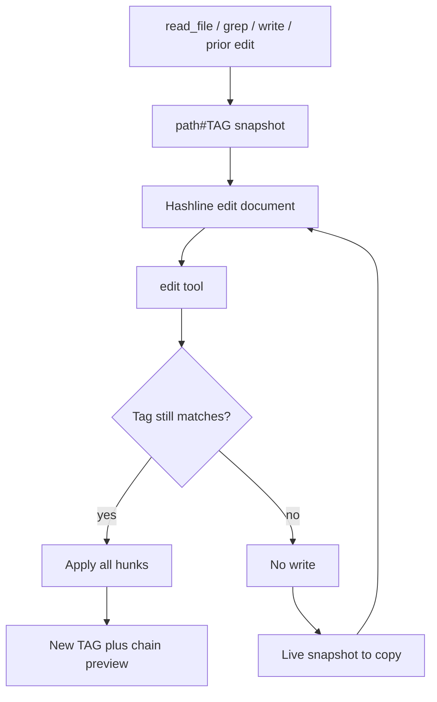

# Hash-line edit format

Parent: [Tools and workspace](/tools-workspace).

This page applies when the resolved edit format is `hashline` (the default for most providers under `edit_tool = "auto"`, or when you pin `edit_tool = "hashline"`).

`edit` changes existing UTF-8 files with line-anchored hunks. You pass one
hashline document in `input`. Each section names a path and a snapshot tag from
a prior read, then lists `PUT` and `CUT` ops against the original line numbers.

Use `edit` for targeted hunks when you already have a fresh `[path#TAG]`. Use
`write` to create a path or replace a whole file. Do not use shell or Python to
rewrite UTF-8 sources that `edit` can express.



## Hashline snapshots

UTF-8 text and source files read as numbered lines. When the selected edit tool
is `hashline`, the header is a snapshot tag:

```text
[src/app.py#A1B2]
1:import sys
2:print("hi")
3:
```

| Piece | Meaning |
| --- | --- |
| `path` | Display path for the file |
| `TAG` | 4 uppercase hex digits. Full-file fingerprint with trailing whitespace ignored so a whitespace-only drift does not bust the tag. Omitted when the selected edit tool is not `hashline` |
| `N:line` | 1-indexed original line body |

`read_file` still scans the whole file so the footer can report `of {total}`,
even if you pass `offset` / `limit`. Those args only choose which numbered rows
appear. Files larger than 256 KiB keep only that window in memory. There is no
persistent line index. Rich documents and images are not hashline-editable; see
[documents and images](/tools-workspace/documents-and-images).

### Where tags come from

Copy `TAG` and line numbers from the latest snapshot for that path:

- `read_file` hashline view
- `grep` content mode (`[path#TAG]` plus match line numbers)
- a successful non-structural `edit` preview
- a successful `write` chain snapshot
- a failed `edit` live snapshot

Never invent a tag. Grep match previews use `N | text` and may truncate. Copy
TAG and line numbers only; do not paste preview bodies into `PUT` rows. Use
`read_file` when you need exact line text.

## Document shape

```json
{
  "input": "[src/app.py#A1B2]\nPUT 2:\n+print(\"Hello, world!\")\n"
}
```

One or more sections, each starting with `[path#TAG]`, then ops:

```text
[path#TAG]
PUT N:
+replacement
PUT N.=M:
+range body
PUT <N:
+insert before N
PUT >N:
+insert after N
PUT >$:
+append at EOF
CUT N.=M
```

## Operations

| Op | Form | Effect |
| --- | --- | --- |
| Replace one line | `PUT N:` | Replace original line `N` with the `+` body |
| Replace a range | `PUT N.=M:` | Replace inclusive lines `N`–`M` (also `N-M` / `N..M`) |
| Insert before | `PUT <N:` | Insert body rows before line `N` |
| Insert after | `PUT >N:` | Insert body rows after line `N` |
| Append | `PUT >$:` | Insert body rows at end of file |
| Delete | `CUT N` or `CUT N.=M` | Delete inclusive original lines (no colon) |

Locator rules:

- Digits then colon for single-line PUT: `PUT 12:` — never `PUT 12.:`
- A trailing dot such as `PUT 12.=:` is invalid and fails with an explicit error
- Every body row under a `:` header starts with `+` (use `+` alone for a blank line)
- `PUT` always needs at least one `+` body row; use `CUT` to delete
- Body matches the ranged span only: never restate neighbor lines; widen the range instead
- Line numbers name the **original** snapshot. They do not shift mid-document
  after earlier ops in the same input

Not supported yet: block ops (`N*`), registers, `REM`, and `MV`.

## Rules

1. Put every hunk for one path in a **single** `edit` document. Do not issue two
   `edit` calls on the same path in one batch; wait for the result first.
   Different paths may edit in parallel.
2. One `[path#TAG]` section per path in that document.
3. Stale tags, overlapping destructive ranges, duplicate paths, out-of-range
   lines, mid-edit file changes, and inserts whose anchor sits inside another
   op's replace/delete range all **fail closed with no write**.
4. Failures return a bounded live snapshot. Copy that header and lines to retry.
5. Re-read only for lines outside the live snapshot or post-edit preview.
6. After a large or structural edit, re-read before further ops on anchors
   outside the returned preview.
7. Create or fully rewrite files with `write`. Do not use `edit` to create paths.

## Results and chaining

| Outcome | Model-facing content |
| --- | --- |
| Successful normal `edit` | One-line ops summary (for example `PUT 2.=5: (4 → 2 line(s))`) plus a post-edit `[path#NEW]` numbered preview around the change |
| Successful structural `edit` | New TAG and ops summary **without** numbered body lines. A structural edit is a single replace/delete span of 40 or more original lines. Re-read before the next op |
| Successful `write` | Bounded head/tail hashline snapshot with the new TAG (about 28 head + 8 tail lines on large files) |
| Failed `edit` | Error plus a bounded live snapshot focused on the op anchors |

Unified diffs are tool metadata for UI cards. They are not repeated in
model-facing content. In the interactive TUI, added and removed lines wash
toward the theme's green/red when RGB is available. Unhighlighted tokens sit
on that wash, or use the add/remove color if there is no wash. Signs stay
theme-colored, syntax roles keep their colors, and diff headers use the
accent color.

### Cards while the edit runs

- Streaming cards project the edit document alone (op summaries and PUT bodies).
- Approval and start cards dry-run against live files when readable so removals
  show as real `-` rows. Missing or stale targets fall back to the document
  projection.

## One numbered read format

`read_file` always returns numbered `N:line` rows for UTF-8 text. The `[path#TAG]`
header is only minted when the selected edit tool is `hashline`, because that is
the format that consumes the tag. `apply_patch` and `str_replace` keep the same
numbered lines without the fingerprint.

## Related

- [Documents and images](/tools-workspace/documents-and-images) - what
  `read_file` does for non-text inputs
- [Search tools](/tools-workspace/search) - `grep` content mode tags and
  previews
- [Tools and workspace](/tools-workspace) - when to prefer `edit` vs `write`
