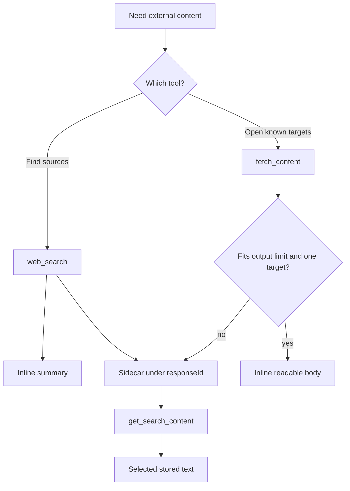

# Web access and related tools

Parent: [Tools and workspace](/tools-workspace).

Web tools let the agent search the public web and fetch pages, files, GitHub
targets, and PDFs without stuffing every full body into the prompt. Small
results stay inline. Larger or multi-target bodies land in a session sidecar
under a `responseId`, and `get_search_content` pulls them back by exact
selectors from the prior tool result.

Do not open web-access cache directories with `read_file`. Use
`get_search_content` with the returned `responseId`.

## Tools

| Tool | Role |
| --- | --- |
| `web_search` | Search the web. Returns a short summary and a `responseId`. |
| `fetch_content` | Fetch one or more URLs, local paths, GitHub targets, PDFs, or video targets. |
| `get_search_content` | Read stored snippets or bodies from a prior `web_search` or `fetch_content` call. |

### `web_search`

- Prefers [provider-hosted search](/configuration#web-search) when the active
  chat path supports it and hosted search is on.
- Otherwise uses the configured client backup (`auto`, `openai`, `exa`,
  `brave`, or `disabled`).
- Stores snippets by default under the returned `responseId`.
- Stores full source pages only when `includeContent` succeeds and the provider
  returned fetchable URLs.
- The summary stays inline. Call `get_search_content` for stored snippets or
  pages.

### `fetch_content`

Accepts `url` or `urls`, plus optional `prompt`, `timestamp`, `frames`, and
`forceClone`.

| Target | Behavior |
| --- | --- |
| `http` / `https` page | Fetch text under SSRF rules. PDFs use the shared [document extractor](/tools-workspace/documents-and-images). |
| Local path | Read through the workspace; documents extract the same way as `read_file`. |
| GitHub repo, tree, file, or commit | Uses the GitHub API by default. Set `forceClone` to clone a repo, tree, or file URL locally instead (not commit URLs). |
| YouTube or local video | Optional video path. `timestamp` is a point or range such as `23:41` or `23:41-25:00`. `frames` defaults to 6 and clamps to 1–12. |

A single successful target returns readable content inline when it fits the
[tool output limit](/configuration#tool-output-limit). Oversized bodies and
multi-target results keep a `responseId` and instruct the agent to call
`get_search_content`.

### `get_search_content`

Requires `responseId` (32 lowercase hex characters). Optional selectors must
match the prior result exactly:

| Selector | Meaning |
| --- | --- |
| *(none besides `responseId`)* | Default stored payload for that id |
| `url` / `urlIndex` | Exact URL or index from the prior result |
| `query` / `queryIndex` | Exact original `web_search` query or `fetch_content` prompt, or its index |

`query` is not a free-text keyword search over page bodies. Unknown selectors
fail with the available selectors listed.

## Storage

Full bodies live as sidecar blobs, not in the session transcript:

1. Active session `web/` directory when bound
2. Otherwise a process data-dir fallback
3. Older flat transcripts may still use a legacy `*.web/` companion beside the
   transcript file

Cache files are private to Rho. They are available only while the cache entry
exists. If a `responseId` is unknown, re-run `web_search` or `fetch_content` for
the original query or URL.

## Network safety

HTTP and HTTPS fetches resolve the host first and connect only to addresses that
passed the check. Private, loopback, link-local, and other non-global addresses
are refused by default. `localhost` and `*.localhost` are blocked by name.
Redirects are not followed blindly; each hop must pass the same checks.

Set `RHO_SSRF_ALLOW_RANGES` to a comma-separated list of CIDRs only when a TUN or
fake-IP proxy requires it, for example `198.18.0.0/15`. Do not open all private
space for ordinary use.

## Provider-hosted X Search

When the active model provider is xAI, Rho attaches xAI's hosted `x_search`
tool on every model turn. That tool searches X (x.com) posts, users, and threads
server-side. It is separate from client `web_search`:

- Not part of the agent tool allowlist
- Still present when client tools are restricted or empty, while the session
  uses xAI
- Added on the next turn after a switch to xAI, removed when the session leaves
  xAI
- Activity streams as typed `HostedToolActivity` events with `name: "x_search"`

Details: [xAI provider](/providers/xai).

## Related tools

These are not web-access tools, but older notes mixed them into this page:

| Tool | Where to read |
| --- | --- |
| `advisor` | [Advisor mode](/configuration/advisor-mode) |
| `rho` | Read-only harness diagnostics; action reference lives in the `rho-diagnostics` skill |
| `workflow_command` | Host-only workflow process tool; see [workflow runtime](/workflows/runtime) |

## Related

- [Documents and images](/tools-workspace/documents-and-images) - PDF and Office
  extraction used by `fetch_content`
- [Web search config](/configuration#web-search) - hosted vs backup backends
- [Tool output limit](/configuration#tool-output-limit) - inline size before
  collapse or `responseId` handoff
