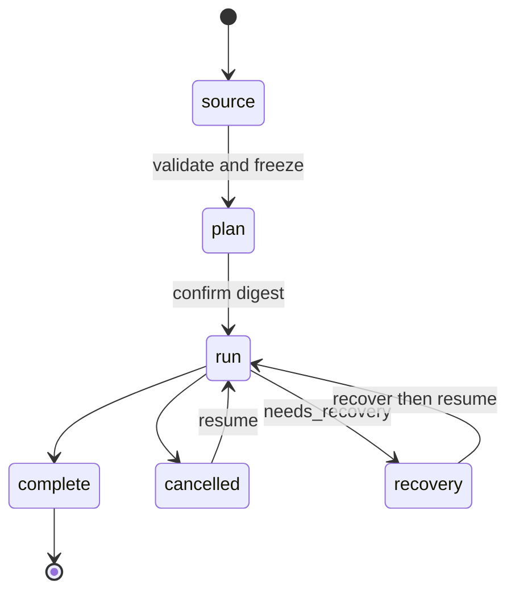
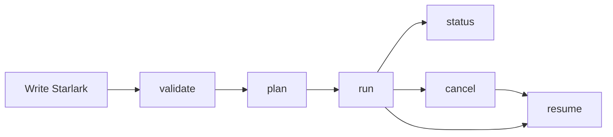
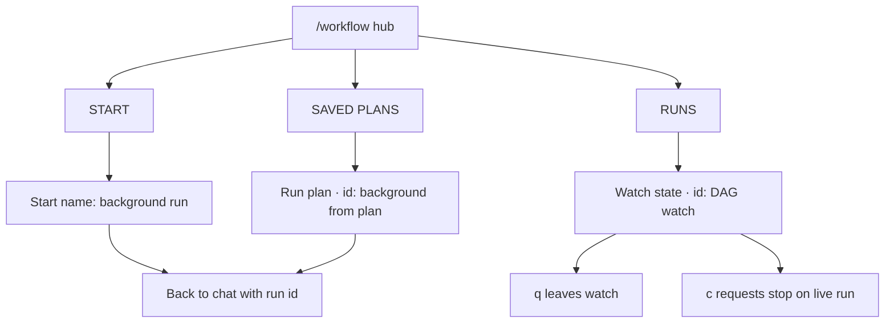

# Workflows

Rho workflows run a fixed directed acyclic graph of agent and command nodes.
You write the graph in Starlark. Rho evaluates the source and explicit inputs
only when you validate or plan. A plan stores a normalized frozen graph. Run and
resume use that graph and do not evaluate Starlark or reload agent definitions.

Use a workflow when a task needs fixed steps, parallel work, typed conditions,
durable status, or manual resume. Use `rho run` for one model task that does not
need a graph.

## Lifecycle

A workflow moves through a fixed path: source to plan, plan to run, then a
terminal outcome. Cancel and recovery only reopen the same frozen run.



### Main steps

1. Write one or more `.star` files under the workspace or project root. When a
   workflow owns helper scripts, local modules, or local agents, put the entry
   file and those companions in one folder such as `.rho/workflows/review/`
   instead of leaving scripts loose under `.rho/workflows/`. Local agents live
   in `<workflow_dir>/agents/*.md`.
2. Validate the source and inputs.
3. Create a frozen plan and inspect its graph digest and authority list.
4. Confirm that exact digest and start a run by plan ID.
5. Read status and artifact references by run ID.
6. Cancel or resume the same frozen run when needed.



## Interactive hub

In the chat TUI, run `/workflow` to open one list with three sections.



### Sections

1. **START** - `Start <name>` starts a new run in the background, appends the
   run id to chat context, and returns to chat without starting a model turn.
2. **RUNS** - `Watch <state> · <id>` opens the DAG watch screen (live or finished).
3. **SAVED PLANS** - `Run plan · <id>` starts from a frozen plan in the background.

### DAG watch screen

Keep chatting while a run continues. Reopen `/workflow` and press Enter on a
run to watch it without taking ownership of the driver. The left pane draws the
complete frozen dependency graph from top to bottom. An arrow runs from each
dependency to the node that needs it, and independent nodes share a rank.

| Key | Action |
| --- | --- |
| `j` or Down | Select the next frozen node |
| `k` or Up | Select the previous frozen node |
| `h` or Left | Select the node to the left on the same rank |
| `l` or Right | Select the node to the right on the same rank |
| `c` | Request stop on a live run |
| `q` | Leave the watch screen without stopping the run |

The graph viewport follows the selected node when the complete graph is larger
than its pane. Node labels use `·` for waiting, `○` for ready, `●` for running,
`✓` for success, `–` for skipped, and `✗` for other terminal outcomes. A
running node also shows its current activity when available.

The right pane shows details for the selected node. Finished agent answers
render as Markdown, while command streams render as text. Use `PgUp`/`PgDn`,
`Home`/`End`, the mouse wheel, or the scrollbar to scroll long output.

### Cleanup

Press `d` on a **RUNS** or **SAVED PLANS** row to delete it after confirmation.
Local `.star` source files are not deleted from disk.

### Model tool and context

The model `workflow` tool also starts `run` and `resume` in the background and
returns a run id immediately. Completions are delivered automatically to the
parent session at the next turn boundary (batched with other background
completions). Use `status` for a live check or after delivery, and `cancel` to
stop. Do not poll in a loop.

Starting a workflow from `/workflow` appends the run id to the chat context so
the agent can watch or cancel it, without starting a model turn. When the run
finishes, Rho kicks a completion message into the parent session the same way.

The right pane explains the highlighted row. Enter runs that action.

## CLI reference

Every stage uses a separate command. Prefer `list` and `status` for inspection;
use `validate` and `plan` before any run.

```text
rho workflow list [--plans|--runs] [--limit N] [--json]
rho workflow validate <FILE> [--input KEY=JSON]...
rho workflow plan <FILE> [--input KEY=JSON]... [--output text|json]
rho workflow run <PLAN_ID> [--yes] [--output text|jsonl]
rho workflow status <RUN_ID> [--output text|json]
rho workflow cancel <RUN_ID>
rho workflow resume <RUN_ID> [--yes] [--recover-uncertain] [--output text|jsonl]
```

CLI help is the source of truth for supported flags and recovery actions.

### List

`list` prints saved plans and runs for the current workspace. Use `--plans` or
`--runs` to show one section. `--limit` caps each section. `--json` prints one
JSON document.

```bash
rho workflow list
rho workflow list --runs --limit 10
rho workflow list --json
```

### Validate

`validate` collects the entry source and loaded modules, validates explicit
inputs, evaluates `build` once, and checks the full graph. It checks agent
references, schemas, conditions, access declarations, cycles, and planning
limits. It does not create a plan or run. It does not start a model provider or
load provider credentials. Rho evaluates Starlark in a separate worker with a
private framed channel, a wall-time limit, and OS process limits.

```bash
rho workflow validate .rho/workflows/review.star \
  --input 'target="src"' \
  --input 'full=true'
```

Each input after `--input` has the form `KEY=JSON`. The outer shell quotes
protect the argument. The inner quotes are JSON syntax, so
`--input 'target="src"'` produces the string value `src`.

### Plan

`plan` performs validation, resolves agents and command executables, normalizes
the graph, and stores an immutable plan. Its output includes the plan ID, full
authority list, source digests, inputs, scheduler limits, and graph digest.

```bash
rho workflow plan .rho/workflows/review.star \
  --input 'target="src"' --output json
```

Keep the returned plan ID. A run accepts a plan ID, not a source path.

### Run

`run` checks the stored plan, source digests, current workspace identity,
current trust, and current security policy. It does not evaluate Starlark. It
copies the frozen graph into the run store so later plan removal cannot break
resume.

```bash
rho workflow run 018f... --output text
rho workflow run 018f... --yes --output jsonl
```

Rho asks for confirmation when a terminal can answer. Non-interactive use must
pass `--yes`. Consent applies only to the exact graph digest and new run. It is
not capability approval.

### Status

`status` reads one durable snapshot. It does not take execution ownership.

```bash
rho workflow status 0190... --output json
```

You may use a full run UUID or a unique UUID prefix. Status reports typed node
states, current attempts, outcomes, and artifact references. It does not print
complete artifacts.

### Cancel

`cancel` records a cancellation request and notifies the active owner when it
can. The owner stops active agents and process trees before it marks them
cancelled.

```bash
rho workflow cancel 0190...
```

The command waits up to the measured cancellation acknowledgement limit for the
exact request ID. An `acknowledged` result means the owner stopped active work
before it wrote that request's acknowledgement. A `pending` result includes the
request ID and means the bound expired. It does not claim that active work has
stopped. Cancelling a completed run returns `already_completed` without reusing
an acknowledgement from an older request.

```json
{"run_id":"...","request_id":"...","cancellation_state":"pending","lifecycle":"running"}
```

If no process owns the run, the durable request stays pending. Rho changes only
states that have a safe transition when an owner next opens the run.

### Resume

`resume` accepts only a run ID. It uses the graph copied into the run store. It
does not accept a new source or new inputs, reload modules or agents, or rerun
successful nodes.

```bash
rho workflow resume 0190... --yes --output jsonl
rho workflow resume 0190... --recover-uncertain --yes --output jsonl
```

Rho can start a new attempt for a node that was cleanly cancelled. If an old
process ended without a clean ownership record, the run enters
`needs_recovery`. Inspect status, confirm that no prior process remains, and
pass `--recover-uncertain`. Rho does not guess whether uncertain work completed.

The top-level `rho --resume` flag is for chat sessions. It does not resume a
workflow.

## Model-facing tool

An agent with the `workflow` tool capability can use these typed operations:

```json
{"action":"validate","file":".rho/workflows/review.star","inputs":{"target":"src"}}
{"action":"plan","file":".rho/workflows/review.star","inputs":{"target":"src"}}
{"action":"run","plan_id":"..."}
{"action":"status","run_id":"..."}
{"action":"cancel","run_id":"..."}
{"action":"resume","run_id":"..."}
```

The tool uses the same application service and data store as the CLI. Validate
and plan authorize the exact config path, agent catalog roots and discovered
agent files, entry source and loaded modules, planner process facts, command
working directories, executable candidates and resolved paths, and script
interpreter paths. Paths found during source, catalog, or executable discovery
use normal dynamic authorization before Rho reads them. Run and resume ask the
host to confirm the exact graph digest and fail closed if host input is not
available. Node capabilities are authorized separately.

The tool cancel result has the same `request_id` and typed
`cancellation_state` as the CLI result.

Results use readable, line-oriented summaries like the `agent` and `agents`
tools, and remain subject to the configured output byte limit. They contain
bounded diagnostics, IDs, typed state summaries, and indented node and artifact
references. They do not return full source files or logs.

`workflow_command` is a separate host-only built-in tool. The workflow runtime
uses it to send one frozen command process request through normal policy and
hooks. Rho never sends `workflow_command` in a model tool list.

## Authoring reference

Starlark source format, node types, output schemas, templates, and conditions:

[Workflow authoring](/workflows/authoring)

## Runtime reference

State machine details, digests and resume, permissions, cancellation, artifacts, planning limits, and first-release limits:

[Workflow runtime](/workflows/runtime)
