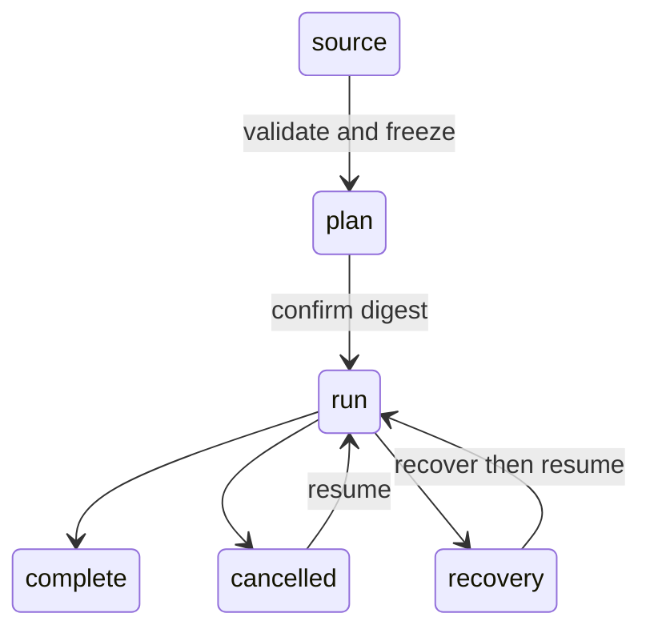

# Workflows

Rho workflows run a fixed directed acyclic graph of agent and command nodes.
You write the graph in Starlark. Rho evaluates the source and explicit inputs
only when you validate or plan. A plan stores a normalized frozen graph. Run and
resume use that graph and do not evaluate Starlark or reload agent definitions.

Use a workflow when a task needs fixed steps, parallel work, typed conditions,
durable status, or manual resume. Use `rho run` for one model task that does not
need a graph.

## Lifecycle



The main steps are:

1. Write one or more `.star` files under the workspace or project root. When a
   workflow owns helper scripts or local modules, put the entry file and those
   companions in one folder such as `.rho/workflows/review/` instead of leaving
   scripts loose under `.rho/workflows/`.
2. Validate the source and inputs.
3. Create a frozen plan and inspect its graph digest and authority list.
4. Confirm that exact digest and start a run by plan ID.
5. Read status and artifact references by run ID.
6. Cancel or resume the same frozen run when needed.

## Interactive hub

In the chat TUI, run `/workflow` to open a hub picker:

1. **Sources** lists entry files under `.rho/workflows` (folder `workflow.star` or a flat `.star` file).
2. **Plans** lists frozen plans for the current workspace.
3. **Runs** lists durable runs for the current workspace.

From a source you can validate or plan with default inputs only. Supply custom
inputs with the CLI `--input` flags. From a plan you can inspect the graph or
start a run (the full-screen workflow screen). From a run you can open status,
request cancel, or resume.

## CLI reference

```text
rho workflow validate <FILE> [--input KEY=JSON]...
rho workflow plan <FILE> [--input KEY=JSON]... [--output text|json]
rho workflow run <PLAN_ID> [--yes] [--output text|jsonl]
rho workflow status <RUN_ID> [--output text|json]
rho workflow cancel <RUN_ID>
rho workflow resume <RUN_ID> [--yes] [--recover-uncertain] [--output text|jsonl]
```

CLI help is the source of truth for supported flags and recovery actions.

### Validate

`validate` collects the entry source and loaded modules, validates explicit
inputs, evaluates `build` once, and checks the full graph. It checks agent
references, schemas, conditions, access declarations, cycles, and planning
limits. It does not create a plan or run. It does not start a model provider or
load provider credentials. Rho evaluates Starlark in a separate worker with a
private framed channel, a wall-time limit, and OS process limits.

```bash
rho workflow validate .rho/workflows/review.star \
  --input 'target="src"' \
  --input 'full=true'
```

Each input after `--input` has the form `KEY=JSON`. The outer shell quotes
protect the argument. The inner quotes are JSON syntax, so
`--input 'target="src"'` produces the string value `src`.

### Plan

`plan` performs validation, resolves agents and command executables, normalizes
the graph, and stores an immutable plan. Its output includes the plan ID, full
authority list, source digests, inputs, scheduler limits, and graph digest.

```bash
rho workflow plan .rho/workflows/review.star \
  --input 'target="src"' --output json
```

Keep the returned plan ID. A run accepts a plan ID, not a source path.

### Run

`run` checks the stored plan, source digests, current workspace identity,
current trust, and current security policy. It does not evaluate Starlark. It
copies the frozen graph into the run store so later plan removal cannot break
resume.

```bash
rho workflow run 018f... --output text
rho workflow run 018f... --yes --output jsonl
```

Rho asks for confirmation when a terminal can answer. Non-interactive use must
pass `--yes`. Consent applies only to the exact graph digest and new run. It is
not capability approval.

### Status

`status` reads one durable snapshot. It does not take execution ownership.

```bash
rho workflow status 0190... --output json
```

You may use a full run UUID or a unique UUID prefix. Status reports typed node
states, current attempts, outcomes, and artifact references. It does not print
complete artifacts.

### Cancel

`cancel` records a cancellation request and notifies the active owner when it
can. The owner stops active agents and process trees before it marks them
cancelled.

```bash
rho workflow cancel 0190...
```

The command waits up to the measured cancellation acknowledgement limit for the
exact request ID. An `acknowledged` result means the owner stopped active work
before it wrote that request's acknowledgement. A `pending` result includes the
request ID and means the bound expired. It does not claim that active work has
stopped. Cancelling a completed run returns `already_completed` without reusing
an acknowledgement from an older request.

```json
{"run_id":"...","request_id":"...","cancellation_state":"pending","lifecycle":"running"}
```

If no process owns the run, the durable request stays pending. Rho changes only
states that have a safe transition when an owner next opens the run.

### Resume

`resume` accepts only a run ID. It uses the graph copied into the run store. It
does not accept a new source or new inputs, reload modules or agents, or rerun
successful nodes.

```bash
rho workflow resume 0190... --yes --output jsonl
rho workflow resume 0190... --recover-uncertain --yes --output jsonl
```

Rho can start a new attempt for a node that was cleanly cancelled. If an old
process ended without a clean ownership record, the run enters
`needs_recovery`. Inspect status, confirm that no prior process remains, and
pass `--recover-uncertain`. Rho does not guess whether uncertain work completed.

The top-level `rho --resume` flag is for chat sessions. It does not resume a
workflow.

## Model-facing tool

An agent with the `workflow` tool capability can use these typed operations:

```json
{"action":"validate","file":".rho/workflows/review.star","inputs":{"target":"src"}}
{"action":"plan","file":".rho/workflows/review.star","inputs":{"target":"src"}}
{"action":"run","plan_id":"..."}
{"action":"status","run_id":"..."}
{"action":"cancel","run_id":"..."}
{"action":"resume","run_id":"..."}
```

The tool uses the same application service and data store as the CLI. Validate
and plan authorize the exact config path, agent catalog roots and discovered
agent files, entry source and loaded modules, planner process facts, command
working directories, executable candidates and resolved paths, and script
interpreter paths. Paths found during source, catalog, or executable discovery
use normal dynamic authorization before Rho reads them. Run and resume ask the
host to confirm the exact graph digest and fail closed if host input is not
available. Node capabilities are authorized separately.

The tool cancel result has the same `request_id` and typed
`cancellation_state` as the CLI result.

Results contain bounded diagnostics, IDs, typed state summaries, and artifact
references. They do not return full source files or logs.

`workflow_command` is a separate host-only built-in tool. The workflow runtime
uses it to send one frozen command process request through normal policy and
hooks. Rho never sends `workflow_command` in a model tool list.

## Source format

### Entry module

The entry module must export exactly one `WORKFLOW` definition:

```starlark
def build(inputs):
    return workflow(name = "example", nodes = [])

WORKFLOW = define(
    inputs = {},
    build = build,
)
```

Rho validates supplied inputs before it calls `build`. It calls `build` once.
Starlark loops may construct finite graph data during planning. Runtime loops
and graph cycles are not allowed. Rho converts all values to owned Rust data
before it stores a plan.

The restricted Starlark environment has no process, filesystem, network,
environment, clock, or random functions.

Accepted values are:

- `None`
- `bool`
- signed 64-bit integer
- string
- list
- dictionary with string keys

Floats and sets are not supported. Rho rejects an integer outside signed 64-bit
range.

### Inputs

Declare all values that can vary between plans:

```starlark
WORKFLOW = define(
    inputs = {
        "target": input.string(default = "."),
        "workers": input.integer(default = 2),
        "full": input.bool(default = False),
        "mode": input.enum(["fast", "full"], default = "fast"),
    },
    build = build,
)
```

An input without a default is required. Rho rejects missing and unknown inputs
before it calls `build`.

Inputs are stored in the plan and shown to users. They are not a secret store.
Use Rho credential stores and provider authentication for credentials.

### Module loading

The current workspace or project root is the module root. Use root labels:

```starlark
load("//.rho/workflows/common.star", "make_checks")
```

An entry and every loaded module must:

- use the `.star` extension
- stay under the module root
- use non-empty `/`-separated label parts
- not use an absolute path, `..`, another path separator, or platform prefix
- not pass through a symlink

Rho loads each module once, sorts the source manifest by label, rejects import
cycles, and includes every source digest in the plan.

## Node types

Every node has a unique portable name. Names start with `a-z`, contain at most
63 ASCII bytes, and then use only `a-z`, `0-9`, `_`, or `-`.

All node constructors accept these common fields:

| Field | Meaning |
| --- | --- |
| `name` | Stable node ID |
| `needs` | Nodes that must reach terminal state first |
| `when` | Optional typed condition |
| `allow_failure` | Let this failure avoid failing the whole workflow |
| `timeout_seconds` | Required positive frozen process or agent timeout |
| `max_output_bytes` | Required positive frozen retained-output limit |
| `output` | Optional typed output schema |

Planning places the explicit timeout and output bound in the graph digest. A
runtime value cannot choose either setting.

### Agent

```starlark
inspect = agent(
    name = "inspect",
    agent = "reviewer",
    prompt = template([
        "Inspect ",
        inputs["target"],
        " and return the required JSON value.",
    ]),
    access = "read_only",
    output = record({
        "decision": enum(["approve", "revise"]),
        "summary": string(),
    }),
    timeout_seconds = 1800,
    max_output_bytes = 12000,
)
```

`agent` names a Rho agent or `claude-cli` agent definition. Planning freezes
the full resolved agent setup. Run and resume do not reopen that definition.

An agent with no output schema may return prose, but no condition or template
can inspect it. An agent with a schema must return exactly one JSON value in its
final answer. Rho parses the complete answer without code-fence or substring
guessing and validates it against the frozen schema. It stores the raw answer
and validated value as separate artifacts.

### Direct argv command

```starlark
check = command(
    name = "check",
    argv = ["cargo", "check", "-p", "rho-coding-agent"],
    cwd = ".",
    needs = ["inspect"],
    timeout_seconds = 1800,
    max_output_bytes = 12000,
)
```

The first argv value selects the executable. Planning resolves it and freezes
its canonical path. Later argv values may contain typed output references. Rho
does not infer shell execution from a string.

Direct command nodes are always `mutating`. Rho has policy checks but no OS
sandbox, so a command cannot make an enforceable read-only claim.

### Explicit shell command

```starlark
check = shell(
    name = "check",
    executable = "bash",
    arguments = ["-lc"],
    command = "set -euo pipefail; cargo check",
    cwd = ".",
    timeout_seconds = 1800,
    max_output_bytes = 12000,
)
```

The executable, shell arguments, command text, and working directory stay
static. Runtime outputs cannot change shell source. Use `command` unless you
need shell syntax.

Command standard input is closed. Rho captures bounded stdout and stderr and
stops the supervised process tree on timeout or cancellation. A command exit
records an integer code, signal, timeout, cancellation, or abnormal end.

## Output schemas

Rho supports a small first-party schema language. It is not JSON Schema.

```starlark
null()
bool()
integer()
string()
enum(["approve", "revise"])
list(string())
optional(string())
record({
    "required_field": string(),
    "optional_field": optional(integer()),
})
```

Enum members must be scalar values: null, bool, integer, or string.

For a direct or shell command, wrap the schema with `stdout_json`:

```starlark
output = stdout_json(record({"passed": bool()}))
```

Rho parses the complete bounded stdout value after the process exits. Invalid
JSON or a schema mismatch is a typed node failure.

## Templates and conditions

An output reference names an ancestor node and a schema path:

```starlark
output("inspect", ["summary"])
```

Use references in agent prompt templates and direct-command arguments:

```starlark
template([
    "Inspection summary: ",
    output("inspect", ["summary"]),
])
```

Schema validation limits the shape of an interpolated value, not its meaning.
An earlier agent can still place hostile instructions in a string. Keep later
node capabilities narrow and treat interpolated text as untrusted data.

Conditions can read only typed node state, a command exit, or validated output:

```starlark
equals(output("inspect", ["decision"]), "approve")
is_one_of(status("check"), ["success", "failure"])
equals(exit_code("check"), 0)
all([condition_a, condition_b])
any([condition_a, condition_b])
not(condition_a)
```

Conditions cannot read assistant prose, stdout substrings, or regular
expressions. Every reference must point to an ancestor. A condition can be true,
false, or unavailable. If it is false, the node is `skipped`. If a needed value
can never become available, the node is `blocked`.

## State and outcome

Node states are:

- `pending`
- `ready`
- `running`
- `success`
- `failure`
- `denial`
- `cancellation`
- `skipped`
- `blocked`

`skipped` means a condition evaluated false. `blocked` means the node cannot
run because a required input or dependency result is unavailable. These states
are not interchangeable.

Workflow outcomes are `success`, `failure`, `denial`, `cancellation`, or
`blocked`. `allow_failure = True` affects workflow outcome only. It does not
turn a failed node into success, and status conditions still see `failure`.

## Deterministic scheduling

The scheduler uses only the frozen graph, durable state, and frozen capacity
settings. It does not use wall-clock timing to choose a ready node.

For each scheduling pass, Rho:

1. updates dependency and condition states in node ID order
2. builds the ready set in node ID order
3. launches the first node that fits total, agent, command, and checkout limits
4. repeats until no more node fits

Completion order can vary when nodes run in parallel. The next launch decision
for a given durable state does not.

## Workspace access

Rho uses one canonical checkout. It does not create or merge worktrees.

- A Rho agent may use `read_only` only when its frozen capability set excludes
  writes, process execution, nested agents, nested workflows, and other
  mutating tools.
- A `claude-cli` node is always mutating in the first release.
- Direct and shell command nodes are always mutating.
- Read-only nodes may run together.
- A mutating node needs exclusive checkout access.

An in-process fair lock prevents a stream of readers from starving a writer.
Separate Rho processes use a shared filesystem lock. Cross-process lock order
is safe but not fair, so a mutating node can wait behind readers from other Rho
processes.

## Plans, digests, and exact resume

A plan records:

- normalized graph and inputs
- source labels, sizes, and content digests
- resolved agent setup and capability sets
- resolved command, script-interpreter, and working-directory identities
- working directories and environment policy
- timeout and output limits
- schemas and scheduler settings
- planner format identity

Rho calculates the graph digest from a versioned canonical binary encoding,
not from pretty JSON. JSON remains available for inspection.

Resume checks the copied graph and schema version. It uses current trust and
security policy only to narrow authority. It cannot widen the frozen plan. If a
plan needs project trust that has since been removed, create a new plan after
you resolve trust. Resume does not read the plan or any workflow source file.

Before execution, Rho opens each frozen executable, script interpreter, and
working directory with no-follow checks and compares its content and file
identity with the confirmed graph. Linux and Android launch the executable,
script interpreter, and working directory through those verified handles, so a
path replacement after the check cannot select another object. Frozen workflow
command execution fails closed on other targets. Those targets do not use the
verified original path because their current process adapter cannot keep the
same handle-based guarantee. Workflows with only in-process Rho agent nodes
remain available there.

## Permissions, approval, and trust

Plan confirmation and capability approval are separate.

Plan confirmation:

- names the exact graph digest
- applies to one new run
- does not create a session-wide allow rule
- does not change permission mode
- does not trust project files
- does not bypass hooks
- does not authorize any child node capability

Every command node uses the host-only `workflow_command` tool with the frozen
process facts. The request follows this order:

```text
workspace policy
before_tool_use hook
host approval when policy requires it
execution
after_tool_use hook
```

Permission modes map a `workflow_command` process request as follows:

| Permission mode | Policy decision | Host prompt |
| --- | --- | --- |
| `auto` | allow | no |
| `plan` | deny | no |
| `supervised` | require approval | yes, when a responder is available |

The `before_tool_use` hook still runs when policy returns allow. A host prompt
runs only for `require approval`. A headless supervised run fails closed when no
approval responder is available.

Project workflow sources and project agent definitions follow project trust
rules. User hooks remain eligible. Project hooks stay inactive until the
workspace is trusted. See [Hooks](/hooks).

## Cancellation and process exit

Cancellation is durable intent. The active owner:

1. stops new launches
2. records cancellation intent
3. cancels active agents and command process trees
4. waits for bounded cleanup
5. stores attempt and node outcomes
6. releases checkout and run locks
7. writes a final durable state

Rho does not mark an active process cancelled before the owner has stopped it.
On a clean application exit, Rho uses the same path.

After an unclean exit, an attempt with uncertain process ownership becomes
`needs_recovery`. The first release does not infer success and does not start an
automatic retry. Inspect the process and artifacts, then use an explicit
recovery action.

## Artifacts and storage

Workflow data lives below the Rho data directory:

```text
~/.rho/workflows/
  plans/<PLAN_ID>/
    manifest.json
    graph.json
    sources/<SOURCE_DIGEST>.star
  runs/<RUN_ID>/
    manifest.json
    graph.json
    state.json
    events.jsonl
    mutation.lock
    nodes/<NODE_ID>/attempts/<ATTEMPT>/...
```

`RHO_HOME` replaces `~/.rho` when set. Rho uses private directories, rejects
symlink store entries, writes state atomically, and appends journal records with
monotonic sequence numbers.

Plans and runs remain until you remove the Rho data. The first release has no
automatic retention policy. Treat source snapshots, inputs, prompts, model
answers, and command output as sensitive local data.

## Planning limits

Planning checks named measured budgets for:

- total source bytes, module count, and module depth
- evaluator work, heap, call stack, and wall time
- string, list, and dictionary sizes
- input depth and bytes
- node and edge count
- condition and schema depth
- schema and serialized graph bytes
- rendered templates, expanded prompts and argv, node timeouts, and retained
  command output

A limit error names the budget, accepted limit, and requested or measured
value. Runtime values do not use hidden defaults for timeout or output limits.
Rho evaluates untrusted Starlark only in its supervised planning worker.

The checked-in receipt records each corpus measurement, its free margin, and
the accepted value. The planner reads its limits from that receipt. The corpus
is not one small example. A deterministic generator creates separate stress
cases for source modules, evaluator work and heap, values, a 750-node and
7,500-edge graph, schemas and conditions, serialized graph size, runtime output,
templates, prompts, argv, inputs, and planner process frames.

Build Rho and verify the receipt with:

```bash
cargo build -p rho-coding-agent -j 12
python3 scripts/measure_workflow_limits.py --rho target/debug/rho
```

The command runs each generated case in the product planner worker, reads the
worker's evaluator tick and peak-heap counters, derives all graph and runtime
values from the returned plan, and also runs the public `workflow validate`
path. It fails if a deterministic value differs from the receipt, if a process
frame differs, or if wall time or address space loses its stated safety margin.
Wall time and address space use checked baselines because OS load can change
them. The verifier allows at most twice the baseline and still requires the
separate minimum margin recorded in the receipt.

On Linux, the address-space value is the highest `/proc/<pid>/status` `VmSize`
seen after the supervised child starts the planner worker executable. This omits
the short period before the child applies its limit. The checked debug build
used 1,071,063,040 bytes of its 1,073,741,824-byte limit. The verifier requires
at least 2,097,152 free bytes. This margin is small because
the debug allocator reserves virtual address space near the enforced limit;
resident memory is much lower. If the worker needs more than the checked
amount, the check reports its measured value and the hard limit.

The receipt and corpus map are in
`crates/rho/src/workflow/fixtures/limit_receipt.json` and
`crates/rho/src/workflow/fixtures/limit_corpus.json`. The generator is
`scripts/workflow_limit_corpus.py`. The current measured stress values include
750,000 source bytes, 75 modules at depth 15, 750,019 evaluator ticks,
50,334,528 evaluator heap bytes, 750 nodes, 7,500 edges, a 756,418-byte schema,
a 7,515,347-byte graph, 6,291,456 bytes per retained stream, and 50,331,648
total retained bytes. Read the receipt for every value and margin.

### Cancellation receipt

Cancellation uses a separate cross-process measurement. It starts a real
workflow owner, waits on a Unix socket until a compiled command node is active,
and starts a second Rho process to run `workflow cancel`. Linux `pidfd_open`
checks that the command process has exited. Process completion, not a sleep,
ends each wait.

Run the five-sample receipt command after the build:

```bash
python3 scripts/measure_workflow_cancellation.py \
  --rho target/debug/rho --repeat 5
```

This command needs Linux with Unix sockets and `pidfd_open`, and `rustc` on
`PATH`. It uses a new temporary `RHO_HOME` for each sample. The checked run
measured 33 ms for acknowledgement, final command cleanup, and workflow owner
completion. The accepted limits are 2,000 ms, 2,000 ms, and 2,500 ms. The
cancellation command checks both the accepted limits and twice the checked
baseline.

## First-release limits

The first release does not support:

- runtime graph creation, graph cycles, or runtime loops
- automatic retry
- automatic worktree creation or merge
- detached daemon runs or remote workers
- conditions based on assistant prose or stdout text search
- arbitrary JSON Schema
- secret workflow inputs
- read-only command nodes
- runtime selection of executable, shell mode, working directory, environment,
  timeout, output bound, agent ID, or access mode
- automatic recovery of uncertain attempts
- hooks that schedule nodes, rewrite plans, grant authority, or provide workflow
  data

For a guided authoring reference, load the built-in
`rho-workflow-authoring` skill.
