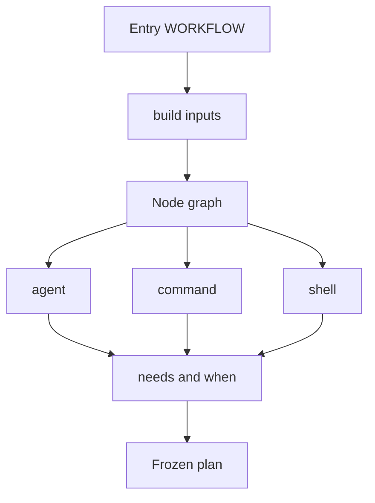
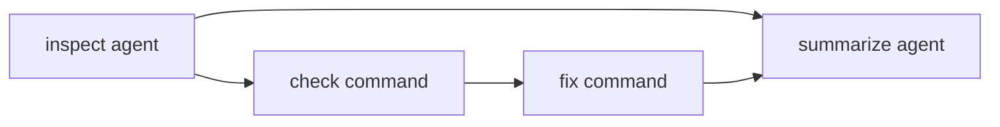

# Workflow authoring

Parent: [Workflows](/workflows).

Starlark source shape, node types, output schemas, and conditions.



## Source format

### Entry module

The entry module must export exactly one `WORKFLOW` definition:

```starlark
def build(inputs):
    return workflow(name = "example", nodes = [])

WORKFLOW = define(
    inputs = {},
    build = build,
)
```

Rho validates supplied inputs before it calls `build`. It calls `build` once.
Starlark loops may construct finite graph data during planning. Runtime loops
and graph cycles are not allowed. Rho converts all values to owned Rust data
before it stores a plan.

The restricted Starlark environment has no process, filesystem, network,
environment, clock, or random functions.

Accepted values are:

- `None`
- `bool`
- signed 64-bit integer
- string
- list
- dictionary with string keys

Floats and sets are not supported. Rho rejects an integer outside signed 64-bit
range.

### Inputs

Declare all values that can vary between plans:

```starlark
WORKFLOW = define(
    inputs = {
        "target": input.string(default = "."),
        "workers": input.integer(default = 2),
        "full": input.bool(default = False),
        "mode": input.enum(["fast", "full"], default = "fast"),
    },
    build = build,
)
```

An input without a default is required. Rho rejects missing and unknown inputs
before it calls `build`.

Inputs are stored in the plan and shown to users. They are not a secret store.
Use Rho credential stores and provider authentication for credentials.

### Module loading

The current workspace or project root is the module root. Use root labels:

```starlark
load("//.rho/workflows/common.star", "make_checks")
```

An entry and every loaded module must:

- use the `.star` extension
- stay under the module root
- use non-empty `/`-separated label parts
- not use an absolute path, `..`, another path separator, or platform prefix
- not pass through a symlink

Rho loads each module once, sorts the source manifest by label, rejects import
cycles, and includes every source digest in the plan.

## Node types

Every node has a unique portable name. Names start with `a-z`, contain at most
63 ASCII bytes, and then use only `a-z`, `0-9`, `_`, or `-`.



Edges come from `needs`. Optional `when` conditions can skip or block a node
without inventing cycles.

All node constructors accept these common fields:

| Field | Meaning |
| --- | --- |
| `name` | Stable node ID |
| `needs` | Nodes that must reach terminal state first |
| `when` | Optional typed condition |
| `allow_failure` | Let this failure avoid failing the whole workflow |
| `timeout_seconds` | Required positive frozen process or agent timeout |
| `max_output_bytes` | Required positive frozen retained-output limit |
| `output` | Optional typed output schema |

Planning places the explicit timeout and output bound in the graph digest. A
runtime value cannot choose either setting.

### Agent

```starlark
inspect = agent(
    name = "inspect",
    agent = "reviewer",
    prompt = template([
        "Inspect ",
        inputs["target"],
        " and return the required JSON value.",
    ]),
    access = "read_only",
    output = schema.record({
        "decision": schema.enum_(["approve", "revise"]),
        "summary": schema.string(),
    }),
    timeout_seconds = 1800,
    max_output_bytes = 12000,
)
```

`agent` names a Rho agent or `claude-cli` agent definition from the catalog.
Planning also loads agents from `<workflow_dir>/agents/*.md` next to the entry
file (highest precedence for that plan). Planning freezes the full resolved
agent setup. Run and resume do not reopen that definition.

An agent with no output schema may return prose, but no condition or template
can inspect it. An agent with a schema must return exactly one JSON value in its
final answer. Rho parses the complete answer without code-fence or substring
guessing and validates it against the frozen schema. It stores the raw answer
and validated value as separate artifacts.

### Direct argv command

```starlark
check = command(
    name = "check",
    argv = ["cargo", "check", "-p", "rho-coding-agent"],
    cwd = ".",
    needs = ["inspect"],
    timeout_seconds = 1800,
    max_output_bytes = 12000,
)
```

The first argv value selects the executable. Planning resolves it and freezes
its canonical path. Later argv values may contain typed output references. Rho
does not infer shell execution from a string.

Direct command nodes are always `mutating`. Rho has policy checks but no OS
sandbox, so a command cannot make an enforceable read-only claim.

### Explicit shell command

```starlark
check = shell(
    name = "check",
    executable = "bash",
    arguments = ["-lc"],
    command = "set -euo pipefail; cargo check",
    cwd = ".",
    timeout_seconds = 1800,
    max_output_bytes = 12000,
)
```

The executable, shell arguments, command text, and working directory stay
static. Runtime outputs cannot change shell source. Use `command` unless you
need shell syntax.

Command standard input is closed. Rho captures bounded stdout and stderr and
stops the supervised process tree on timeout or cancellation. A command exit
records an integer code, signal, timeout, cancellation, or abnormal end.

## Output schemas

Rho supports a small first-party schema language. It is not JSON Schema.

```starlark
schema.null()
schema.bool()
schema.integer()
schema.string()
schema.enum_(["approve", "revise"])
schema.list(schema.string())
schema.optional(schema.string())
schema.record({
    "required_field": schema.string(),
    "optional_field": schema.optional(schema.integer()),
})
```

Enum members must be scalar values: null, bool, integer, or string.

For a direct or shell command, wrap the schema with `schema.stdout_json`:

```starlark
output = schema.stdout_json(schema.record({"passed": schema.bool()}))
```

Rho parses the complete bounded stdout value after the process exits. Invalid
JSON or a schema mismatch is a typed node failure.

## Templates and conditions

An output reference names an ancestor node and a schema path:

```starlark
output("inspect", ["summary"])
```

Use references in agent prompt templates and direct-command arguments:

```starlark
template([
    "Inspection summary: ",
    output("inspect", ["summary"]),
])
```

Schema validation limits the shape of an interpolated value, not its meaning.
An earlier agent can still place hostile instructions in a string. Keep later
node capabilities narrow and treat interpolated text as untrusted data.

Conditions can read only typed node state, a command exit, or validated output:

```starlark
condition.equals(output("inspect", ["decision"]), "approve")
condition.is_one_of(status("check"), ["success", "failure"])
condition.equals(exit_code("check"), 0)
condition.all([condition_a, condition_b])
condition.any([condition_a, condition_b])
condition.not(condition_a)
```

Conditions cannot read assistant prose, stdout substrings, or regular
expressions. Every reference must point to an ancestor. A condition can be true,
false, or unavailable. If it is false, the node is `skipped`. If a needed value
can never become available, the node is `blocked`.
