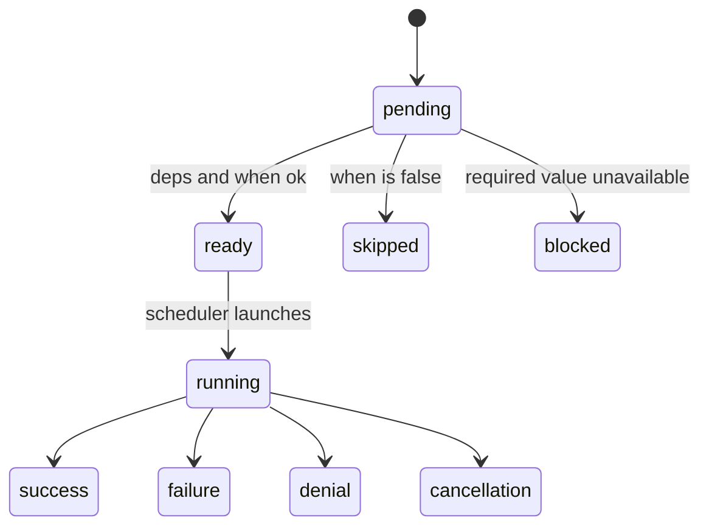
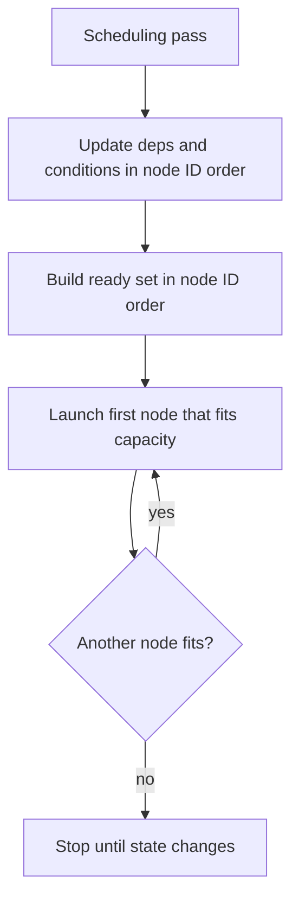
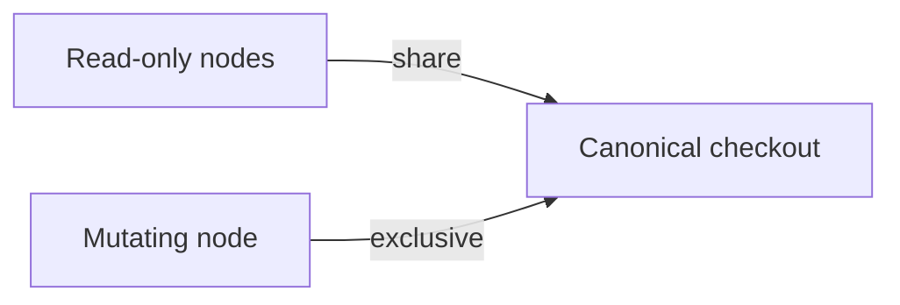
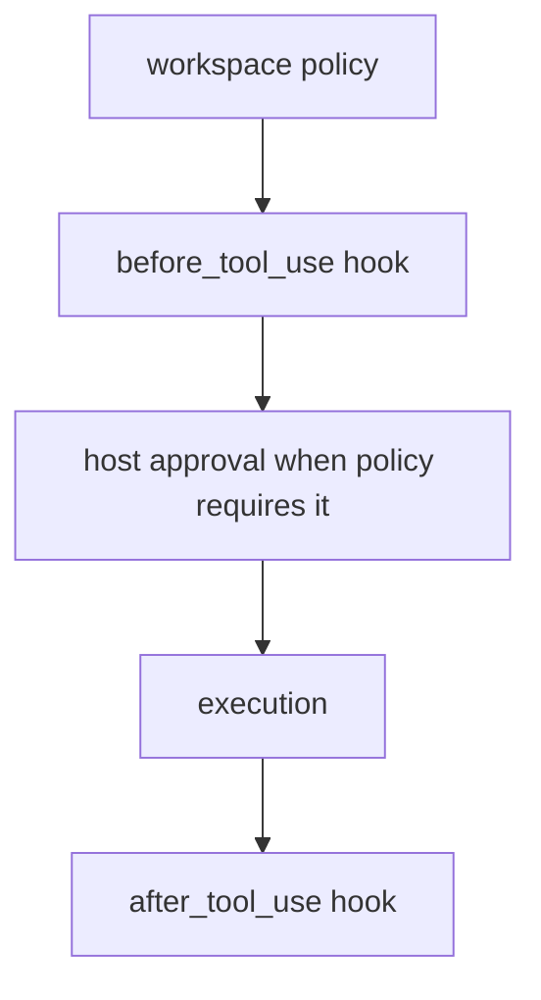
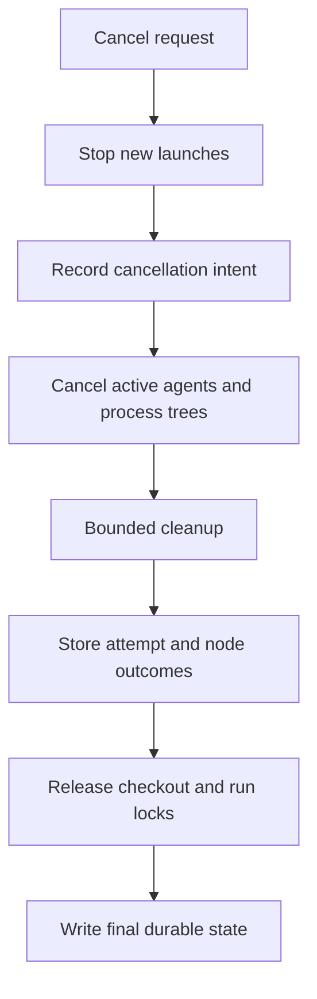

# Workflow runtime

Parent: [Workflows](/workflows).

Run state, scheduling, workspace access, digests, permissions, cancellation, artifacts, and limits.

## State and outcome

Nodes move through a small set of typed states. Terminal outcomes stay distinct
so conditions and resume logic never treat them as interchangeable.



### Node states

- `pending`
- `ready`
- `running`
- `success`
- `failure`
- `denial`
- `cancellation`
- `skipped`
- `blocked`

`skipped` means a condition evaluated false. `blocked` means the node cannot
run because a required input or dependency result is unavailable. These states
are not interchangeable.

### Workflow outcomes

Workflow outcomes are `success`, `failure`, `denial`, `cancellation`, or
`blocked`. `allow_failure = True` affects workflow outcome only. It does not
turn a failed node into success, and status conditions still see `failure`.

## Deterministic scheduling

The scheduler uses only the frozen program, durable state, and frozen capacity
settings. It does not use wall-clock timing to choose a ready node.



For each scheduling pass, Rho:

1. updates dependency and condition states in node ID order
2. builds the ready set in node ID order
3. launches the first node that fits total, agent, command, and checkout limits
4. repeats until no more node fits

Completion order can vary when nodes run in parallel. The next launch decision
for a given durable state does not.

## Workspace access

Rho uses one canonical checkout. It does not create or merge worktrees.



### Access rules

- A Rho agent may use `read_only` only when its frozen capability set excludes
  writes, process execution, nested agents, nested workflows, and other
  mutating tools.
- A `claude-cli` node is always mutating in the first release.
- Direct and shell command nodes are always mutating.
- Read-only nodes may run together.
- A mutating node needs exclusive checkout access.

An in-process fair lock prevents a stream of readers from starving a writer.
Separate Rho processes use a shared filesystem lock. Cross-process lock order
is safe but not fair, so a mutating node can wait behind readers from other Rho
processes.

## Plans, digests, and exact resume

A plan records:

- normalized program, root parameter schemas, and bound inputs
- source labels, sizes, and content digests
- resolved agent setup and capability sets
- resolved command, script-interpreter, and working-directory identities
- working directories and environment policy
- timeout and output limits
- schemas and scheduler settings
- planner format identity

Rho calculates `program_digest` from a versioned canonical binary encoding,
not from pretty JSON. The frozen program contains its name and one root scope
with parameter schemas, typed named exports, and static nodes. JSON remains available for inspection.
This release does not execute map or iterate controllers or create nodes at
runtime.

Resume checks the copied program and schema version. It uses current trust and
security policy only to narrow authority. It cannot widen the frozen plan. If a
plan needs project trust that has since been removed, create a new plan after
you resolve trust. Resume does not read the plan or any workflow source file.

Before execution, Rho opens each frozen executable, script interpreter, and
working directory with no-follow checks and compares its content and file
identity with the confirmed program. Linux and Android launch the executable,
script interpreter, and working directory through those verified handles, so a
path replacement after the check cannot select another object. Frozen workflow
command execution fails closed on other targets. Those targets do not use the
verified original path because their current process adapter cannot keep the
same handle-based guarantee. Workflows with only in-process Rho agent nodes
remain available there.

## Permissions, approval, and trust

Plan confirmation and capability approval are separate.

Plan confirmation:

- names the exact program digest
- applies to one new run
- does not create a session-wide allow rule
- does not change permission mode
- does not trust project files
- does not bypass hooks
- does not authorize any child node capability

Every command node uses the host-only `workflow_command` tool with the frozen
process facts. The request follows this order:



Permission modes map a `workflow_command` process request as follows:

| Permission mode | Policy decision | Host prompt |
| --- | --- | --- |
| `bypass` | allow | no |
| `auto` | allow tracked workspace edits; require approval (classifier) for other writes and process | classifier, then human after three consecutive or twenty total denials when a responder is available |
| `allow_edits` | allow tracked workspace edits; require approval for other writes and process | yes, when a responder is available |
| `plan` | deny | no |
| `supervised` | require approval | yes, when a responder is available |

The `before_tool_use` hook still runs when policy returns allow. A host prompt
runs only for `require approval`. Headless `supervised` and `allow_edits` runs
fail closed when no approval responder is available.

Project workflow sources and project agent definitions follow project trust
rules. User hooks remain eligible. Project hooks stay inactive until the
workspace is trusted. See [Hooks](/hooks).

## Cancellation and process exit

Cancellation is durable intent. The active owner walks a fixed cleanup path
before it stores terminal state.



The active owner:

1. stops new launches
2. records cancellation intent
3. cancels active agents and command process trees
4. waits for bounded cleanup
5. stores attempt and node outcomes
6. releases checkout and run locks
7. writes a final durable state

Rho does not mark an active process cancelled before the owner has stopped it.
On a clean application exit, Rho uses the same path.

After an unclean exit, an attempt with uncertain process ownership becomes
`needs_recovery`. The first release does not infer success and does not start an
automatic retry. Inspect the process and artifacts, then use an explicit
recovery action.

## Artifacts and storage

Workflow data lives below the Rho data directory:

```text
~/.rho/workflows/
  checkout-locks/<WORKSPACE_KEY>.lock
  plans/<PLAN_ID>/
    manifest.json
    graph.json
    sources/<SOURCE_DIGEST>.star
  runs/<RUN_ID>/
    manifest.json
    graph.json
    state.json
    events.jsonl
    mutation.lock
    nodes/<TASK_INSTANCE_ID>/attempts/<ATTEMPT>/...
```

`RHO_HOME` replaces `~/.rho` when set. Rho uses private directories, rejects
symlink store entries, writes state atomically, and appends journal records with
monotonic sequence numbers.

The `graph.json` filename is retained, but its frozen document now contains
`program` and `program_digest`. Plan and status JSON also still include
`graph_digest`, the flat `graph` view of the root scope, and the root scope's
flat `nodes`, `outputs`, `command_exits`, `completions`, and `outcome` in run
state. Prefer the program and scope fields in new consumers.

Plans and runs saved by earlier releases use version 1 manifests. They stay in
`plans/` and `runs/`, appear in `list` and the workflow hub, and print through
`status` in their original shape. They are read-only: run, resume, and cancel
fail and ask you to create a new plan from source. Delete still removes them,
including a run an older release left `running`, once no process holds that
run's writer lock. Rho does not migrate them.

Source node names are definition IDs. Runtime events, status rows, selection,
progress, and artifact paths use task instance IDs. A root-scope task instance
ID is its definition name, such as `review`, so CLI JSONL output keeps wire
version `1`. Attempts remain local to that task instance. State stores task
states, outputs, command exits, completions, and durable attempt records inside
their owning scope, not in global node maps.

Scope closure is journaled separately from task completion. A closed root stores
its outcome and resolved named exports in `scopes.s0.result`; a run completes
only after the root closes. Resume journals reopening before changing tasks in
a closed scope and clears its previous result. CLI JSON status includes this
state; text status prints scope results. Model status and completion notices
include exported values within their existing output budgets. Read artifact
references separately when a bounded summary omits detail.

Plans and runs remain until you remove the Rho data. The first release has no
automatic retention policy. Treat source snapshots, inputs, prompts, model
answers, and command output as sensitive local data.

## Model tool

An agent with the `workflow` capability uses the same service and store as the CLI:

```json
{"action":"validate","file":".rho/workflows/review.star","inputs":{"target":"src"}}
{"action":"plan","file":".rho/workflows/review.star","inputs":{"target":"src"}}
{"action":"run","plan_id":"..."}
{"action":"status","run_id":"..."}
{"action":"cancel","run_id":"..."}
{"action":"resume","run_id":"..."}
```

`run` and `resume` start in the background and return a run id. Completions arrive at the next turn boundary. Use `status` after delivery, and `cancel` to stop. Do not poll.

Validate and plan authorize the config path, agent catalog, source and loaded modules, planner process facts, command working directories, executable paths, and script interpreters. Paths found during discovery use normal dynamic authorization before Rho reads them. Run and resume ask the host to confirm the exact program digest and fail closed if host input is not available. Node capabilities are authorized separately. Plan and run tool summaries report `program_digest`.

Cancel returns the same `request_id` and `cancellation_state` as the CLI.

Results are line-oriented summaries under the configured output byte limit. They include diagnostics, IDs, state, and artifact references. They do not return full source or logs. Run, status, and resume return the same summary. A run lifecycle reads as `running`, `completed`, or `needs_recovery`. A node terminal state reads as `success` or `skipped`. An artifact line names the artifact, path, retained bytes, and digest, plus a shortfall note when the retained bytes are not the whole artifact.

A summary over the byte limit keeps whole lines that fit and ends with a notice of dropped lines and sizes. A single line too long to fit is clipped, not dropped.

`workflow_command` is a host-only built-in. The runtime uses it to send one frozen command through normal policy and hooks. Rho never puts `workflow_command` in a model tool list.

## Planning limits

Planning checks named measured budgets. A limit error names the budget, accepted
limit, and requested or measured value. Runtime values do not use hidden
defaults for timeout or output limits. Rho evaluates untrusted Starlark only in
its supervised planning worker.

### What planning checks

- total source bytes, module count, and module depth
- evaluator work, heap, call stack, and wall time
- string, list, and dictionary sizes
- input depth and bytes
- node and edge count
- condition and schema depth
- schema and serialized program bytes
- rendered templates, expanded prompts and argv, node timeouts, and retained
  command output

The checked-in receipt and how to re-verify it are in [Development](/development#workflow-limit-receipts).

## First-release limits

The first release does not support:

- runtime graph creation, graph cycles, or runtime loops
- automatic retry
- automatic worktree creation or merge
- detached daemon runs or remote workers
- conditions based on assistant prose or stdout text search
- arbitrary JSON Schema
- secret workflow inputs
- read-only command nodes
- runtime selection of executable, shell mode, working directory, environment,
  timeout, output bound, agent ID, or access mode
- automatic recovery of uncertain attempts
- hooks that schedule nodes, rewrite plans, grant authority, or provide workflow
  data

For a guided authoring reference, load the built-in
`rho-workflow-authoring` skill.
