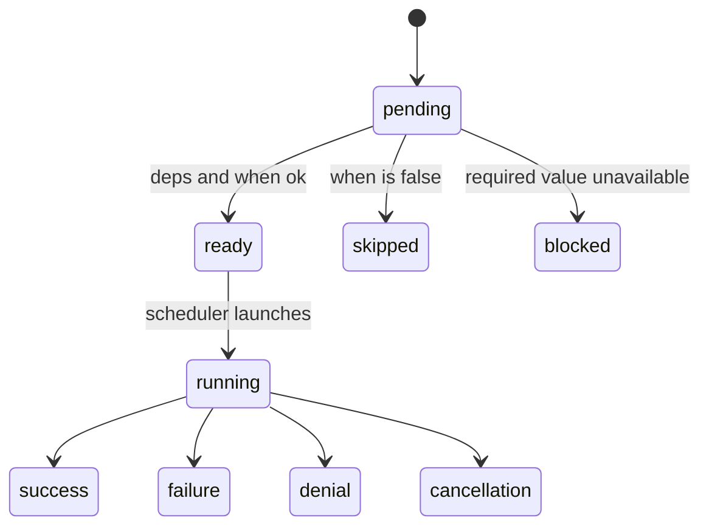
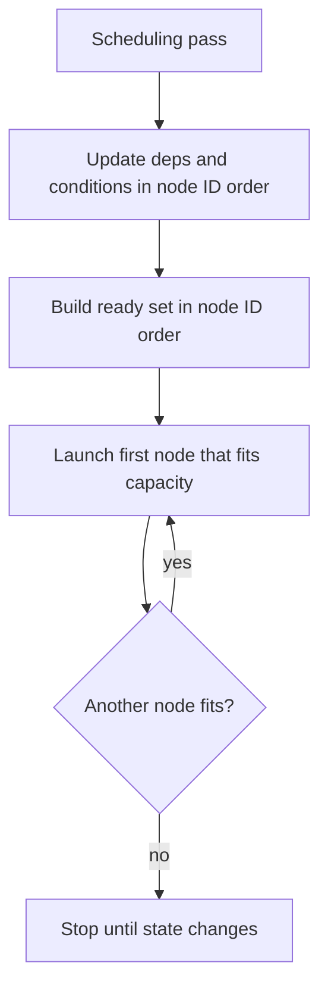
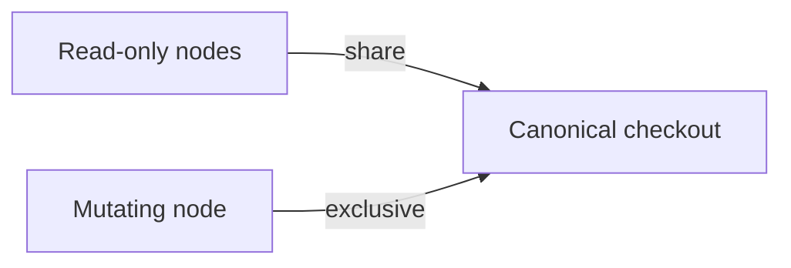
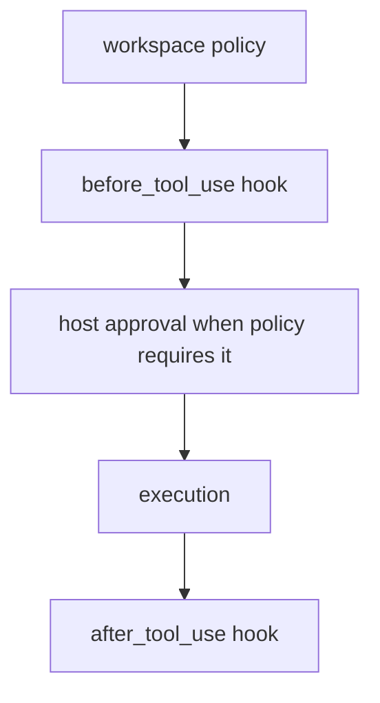
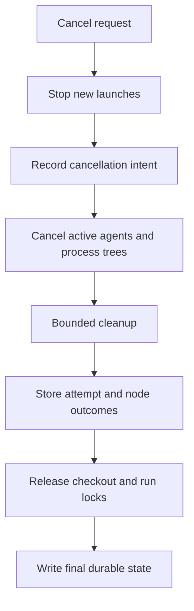

# Workflow runtime

Parent: [Workflows](/workflows).

Run state, scheduling, workspace access, digests, permissions, cancellation, artifacts, and limits.

## State and outcome

Nodes move through a small set of typed states. Terminal outcomes stay distinct
so conditions and resume logic never treat them as interchangeable.



### Node states

- `pending`
- `ready`
- `running`
- `success`
- `failure`
- `denial`
- `cancellation`
- `skipped`
- `blocked`

`skipped` means a condition evaluated false. `blocked` means the node cannot
run because a required input or dependency result is unavailable. These states
are not interchangeable.

### Workflow outcomes

Workflow outcomes are `success`, `failure`, `denial`, `cancellation`, or
`blocked`. `allow_failure = True` affects workflow outcome only. It does not
turn a failed node into success, and status conditions still see `failure`.

## Deterministic scheduling

The scheduler uses only the frozen graph, durable state, and frozen capacity
settings. It does not use wall-clock timing to choose a ready node.



For each scheduling pass, Rho:

1. updates dependency and condition states in node ID order
2. builds the ready set in node ID order
3. launches the first node that fits total, agent, command, and checkout limits
4. repeats until no more node fits

Completion order can vary when nodes run in parallel. The next launch decision
for a given durable state does not.

## Workspace access

Rho uses one canonical checkout. It does not create or merge worktrees.



### Access rules

- A Rho agent may use `read_only` only when its frozen capability set excludes
  writes, process execution, nested agents, nested workflows, and other
  mutating tools.
- A `claude-cli` node is always mutating in the first release.
- Direct and shell command nodes are always mutating.
- Read-only nodes may run together.
- A mutating node needs exclusive checkout access.

An in-process fair lock prevents a stream of readers from starving a writer.
Separate Rho processes use a shared filesystem lock. Cross-process lock order
is safe but not fair, so a mutating node can wait behind readers from other Rho
processes.

## Plans, digests, and exact resume

A plan records:

- normalized graph and inputs
- source labels, sizes, and content digests
- resolved agent setup and capability sets
- resolved command, script-interpreter, and working-directory identities
- working directories and environment policy
- timeout and output limits
- schemas and scheduler settings
- planner format identity

Rho calculates the graph digest from a versioned canonical binary encoding,
not from pretty JSON. JSON remains available for inspection.

Resume checks the copied graph and schema version. It uses current trust and
security policy only to narrow authority. It cannot widen the frozen plan. If a
plan needs project trust that has since been removed, create a new plan after
you resolve trust. Resume does not read the plan or any workflow source file.

Before execution, Rho opens each frozen executable, script interpreter, and
working directory with no-follow checks and compares its content and file
identity with the confirmed graph. Linux and Android launch the executable,
script interpreter, and working directory through those verified handles, so a
path replacement after the check cannot select another object. Frozen workflow
command execution fails closed on other targets. Those targets do not use the
verified original path because their current process adapter cannot keep the
same handle-based guarantee. Workflows with only in-process Rho agent nodes
remain available there.

## Permissions, approval, and trust

Plan confirmation and capability approval are separate.

Plan confirmation:

- names the exact graph digest
- applies to one new run
- does not create a session-wide allow rule
- does not change permission mode
- does not trust project files
- does not bypass hooks
- does not authorize any child node capability

Every command node uses the host-only `workflow_command` tool with the frozen
process facts. The request follows this order:



Permission modes map a `workflow_command` process request as follows:

| Permission mode | Policy decision | Host prompt |
| --- | --- | --- |
| `auto` | allow | no |
| `plan` | deny | no |
| `supervised` | require approval | yes, when a responder is available |

The `before_tool_use` hook still runs when policy returns allow. A host prompt
runs only for `require approval`. A headless supervised run fails closed when no
approval responder is available.

Project workflow sources and project agent definitions follow project trust
rules. User hooks remain eligible. Project hooks stay inactive until the
workspace is trusted. See [Hooks](/hooks).

## Cancellation and process exit

Cancellation is durable intent. The active owner walks a fixed cleanup path
before it stores terminal state.



The active owner:

1. stops new launches
2. records cancellation intent
3. cancels active agents and command process trees
4. waits for bounded cleanup
5. stores attempt and node outcomes
6. releases checkout and run locks
7. writes a final durable state

Rho does not mark an active process cancelled before the owner has stopped it.
On a clean application exit, Rho uses the same path.

After an unclean exit, an attempt with uncertain process ownership becomes
`needs_recovery`. The first release does not infer success and does not start an
automatic retry. Inspect the process and artifacts, then use an explicit
recovery action.

## Artifacts and storage

Workflow data lives below the Rho data directory:

```text
~/.rho/workflows/
  checkout-locks/<WORKSPACE_KEY>.lock
  plans/<PLAN_ID>/
    manifest.json
    graph.json
    sources/<SOURCE_DIGEST>.star
  runs/<RUN_ID>/
    manifest.json
    graph.json
    state.json
    events.jsonl
    mutation.lock
    nodes/<NODE_ID>/attempts/<ATTEMPT>/...
```

`RHO_HOME` replaces `~/.rho` when set. Rho uses private directories, rejects
symlink store entries, writes state atomically, and appends journal records with
monotonic sequence numbers.

Plans and runs remain until you remove the Rho data. The first release has no
automatic retention policy. Treat source snapshots, inputs, prompts, model
answers, and command output as sensitive local data.

## Planning limits

Planning checks named measured budgets. A limit error names the budget, accepted
limit, and requested or measured value. Runtime values do not use hidden
defaults for timeout or output limits. Rho evaluates untrusted Starlark only in
its supervised planning worker.

### What planning checks

- total source bytes, module count, and module depth
- evaluator work, heap, call stack, and wall time
- string, list, and dictionary sizes
- input depth and bytes
- node and edge count
- condition and schema depth
- schema and serialized graph bytes
- rendered templates, expanded prompts and argv, node timeouts, and retained
  command output

### Receipt and corpus

The checked-in receipt records each corpus measurement, its free margin, and
the accepted value. The planner reads its limits from that receipt. The corpus
is not one small example. A deterministic generator creates separate stress
cases for source modules, evaluator work and heap, values, a 750-node and
7,500-edge graph, schemas and conditions, serialized graph size, runtime output,
templates, prompts, argv, inputs, and planner process frames.

### Verify the receipt

Build Rho and verify the receipt with:

```bash
cargo build -p rho-coding-agent -j 12
python3 scripts/measure_workflow_limits.py --rho target/debug/rho
```

The command runs each generated case in the product planner worker, reads the
worker's evaluator tick and peak-heap counters, derives all graph and runtime
values from the returned plan, and also runs the public `workflow validate`
path. It fails if a deterministic value differs from the receipt, if a process
frame differs, or if wall time or address space loses its stated safety margin.
Wall time and address space use checked baselines because OS load can change
them. The verifier allows at most twice the baseline and still requires the
separate minimum margin recorded in the receipt.

### Address space and environment sentinel

On Linux, the address-space value is the highest `/proc/<pid>/status` `VmSize`
seen after the supervised child starts the planner worker executable. This omits
the short period before the child applies its limit. The checked debug build
used 1,170,087,936 bytes under a 4,294,967,296-byte (4 GiB) OS ceiling. That
ceiling is a coarse process backstop (`RLIMIT_AS` on Linux; the same accepted
value is a Job Object process-memory commit limit on Windows), not a tight
product tripwire. Product memory policy lives in the receipt-backed planning
budgets. Virtual size is much larger than resident memory because allocators
reserve address space without committing it. The verifier rejects measurements
above twice the checked baseline (the live regression gate) and still requires
the separate minimum free margin recorded in the receipt under the ceiling. If
the worker needs more than the checked amount, the check reports its measured
value and the hard limit.

The `environment_expansion_bytes` zero baseline in the receipt is a schema
sentinel, not a corpus measurement. Workflow schema v1 forbids
source-controlled environment entries and keeps a one-byte accepted floor.

### Fixture paths and current stress values

The receipt and corpus map are in
`crates/rho/src/workflow/fixtures/limit_receipt.json` and
`crates/rho/src/workflow/fixtures/limit_corpus.json`. The generator is
`scripts/workflow_limit_corpus.py`. The current measured stress values include
750,000 source bytes, 75 modules at depth 15, 750,019 evaluator ticks,
50,334,528 evaluator heap bytes, 750 nodes, 7,500 edges, a 756,418-byte schema,
a 7,515,347-byte graph, 6,291,456 bytes per retained stream, and 50,331,648
total retained bytes. Read the receipt for every value and margin.

### Cancellation receipt

Cancellation uses a separate cross-process measurement. It starts a real
workflow owner, waits on a Unix socket until a compiled command node is active,
and starts a second Rho process to run `workflow cancel`. Linux `pidfd_open`
checks that the command process has exited. Process completion, not a sleep,
ends each wait.

Run the five-sample receipt command after the build:

```bash
python3 scripts/measure_workflow_cancellation.py \
  --rho target/debug/rho --repeat 5
```

This command needs Linux with Unix sockets and `pidfd_open`, and `rustc` on
`PATH`. It uses a new temporary `RHO_HOME` for each sample. The checked run
measured 33 ms for acknowledgement, final command cleanup, and workflow owner
completion. The accepted limits are 2,000 ms, 2,000 ms, and 2,500 ms. The
cancellation command checks both the accepted limits and twice the checked
baseline.

## First-release limits

The first release does not support:

- runtime graph creation, graph cycles, or runtime loops
- automatic retry
- automatic worktree creation or merge
- detached daemon runs or remote workers
- conditions based on assistant prose or stdout text search
- arbitrary JSON Schema
- secret workflow inputs
- read-only command nodes
- runtime selection of executable, shell mode, working directory, environment,
  timeout, output bound, agent ID, or access mode
- automatic recovery of uncertain attempts
- hooks that schedule nodes, rewrite plans, grant authority, or provide workflow
  data

For a guided authoring reference, load the built-in
`rho-workflow-authoring` skill.
